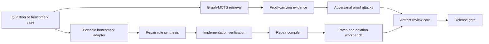

# Repo Agent GitHub Showcase

This page is the short-form project pitch for reviewers, interviewers, and GitHub visitors.

## One-Line Pitch

Repo Agent is an evidence-first codebase agent that turns repository questions into replayable proof, adversarial counterexamples, benchmark-driven repairs, and tamper-evident release artifacts before any AI edits code.

## What Makes It Different

Most coding agents optimize for editing. Repo Agent optimizes the step before editing:

- find the right route, handler, symbol, and execution path
- prove why the selected answer beats hard-negative decoys
- replay the proof after the repository changes
- red-team the proof with generated adversarial repository mutations
- turn benchmark failures into repair rules, implementation checks, compiled interventions, and ablation experiments
- package all claims into a release manifest that can be verified by hash

## Core Research Loop



## Quick Reproduction

Run the focused showcase:

```powershell
powershell -NoProfile -ExecutionPolicy Bypass -File .\scripts\demo_showcase.ps1
```

Run the full release gate:

```powershell
powershell -NoProfile -ExecutionPolicy Bypass -File .\scripts\release_gate.ps1
```

The showcase writes the fastest high-signal artifacts to `reports/showcase/`.
The full release gate regenerates and verifies the release pack under `reports/release-pack/`.
For a reviewer reading order, see [docs/artifact-map.md](artifact-map.md).

## Best Artifacts To Open First

- `reports/showcase/benchmark-repair-workbench.md`
  Shows repair rules compiled into reviewable ablation diffs and experiments.
- `reports/release-pack/agent-artifact-review.md`
  Shows the reviewer-facing claim ledger with metrics, artifacts, commands, falsifiers, and limitations.
- `reports/release-pack/artifact-provenance.md`
  Shows the claim-to-artifact graph connecting claims to metrics, artifact hashes, validation commands, and falsifier conditions.
- `reports/release-pack/proof-attack-certificate.md`
  Shows the minimax proof-attack loop from baseline attacks to adaptive repair.
- `reports/release-pack/agent-frontier-stability.md`
  Shows bootstrap stability for the multi-objective reliability frontier.
- `reports/release-pack/manifest.json`
  Contains hashes and sizes for every generated artifact.

## Current Verified Numbers

Latest verified release snapshot:

- `178` tests passed in the latest release gate
- `80/80` release-pack artifacts verified
- `9/9` artifact-review claims supported
- artifact provenance graph: `9/9` complete claims
- portable benchmark Top-1: `100%`
- intent-guard subset: `6/6` Top-1, `0%` distractor@1
- 32-case challenge suite: `93.75%` Top-1, `100%` Top-3, `0%` distractor@1
- repair synthesis: `3` validated rules, `0` proposed rules
- repair implementation: `3/3` validated rules implemented
- repair compiler: `3` regression locks, `5` ablation toggles
- repair workbench: `5` patch candidates, `5` review-applicable ablation patches, `5` experiments

## Interview Framing

The strongest way to describe the project:

> I built a codebase-agent reliability system, not just a code-search demo. It localizes answers with graph search, attaches replayable proof, red-teams the proof with generated counterexamples, converts benchmark traces into repair rules, verifies those rules against real source anchors, compiles them into intervention IR, and generates ablation patches so each repair reason can be falsified.

For the deepest reviewer path, open the artifact provenance graph after the artifact review card. It turns the project from a narrative claim set into a small evidence graph: each major claim has metric edges, artifact-hash edges, validation-command edges, and falsifier edges.

The newest benchmark repair layer adds an intent-guard challenge suite for cases that older code-search systems often confuse: middleware authorization, sync JSON versus streaming handlers, clear-state helpers versus reset routes, package config files, verification policy files, and run-history apply actions.

## Honest Limitations

- The bundled portable benchmark is intentionally inspectable but still small.
- The repair workbench generates reviewable candidates and ablation diffs; it does not silently patch production code.
- External multi-repository calibration would strengthen the benchmark story.
- The deterministic role agents in the evidence court are auditable; independent model-based judges would test arbitration robustness.

## Suggested GitHub Topics

`agent`, `code-search`, `bug-localization`, `code-intelligence`, `repository-analysis`, `developer-tools`, `rag`, `llm`, `proof`, `benchmarking`
