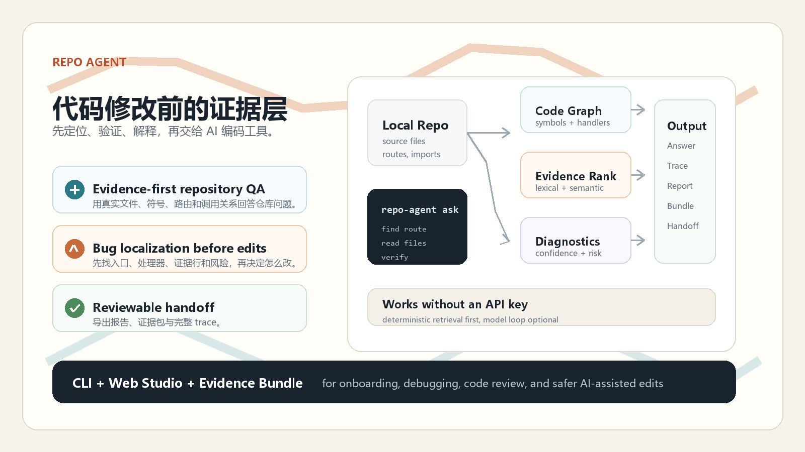
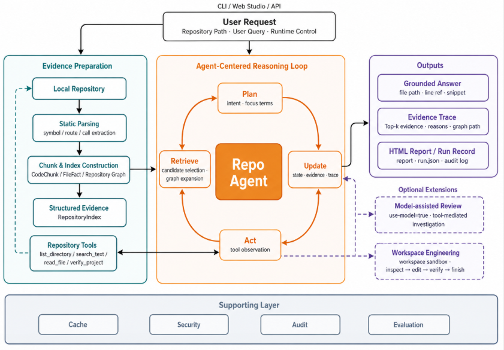
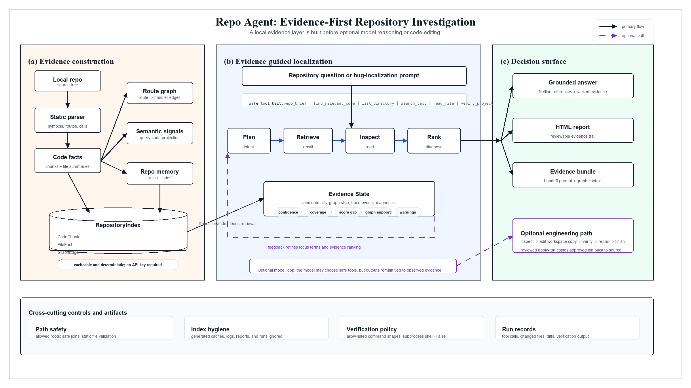

# 零基础可视化教学与开源案例册

> 这部分专门解决“概念听懂了，但一看纯文字就走神”的问题。建议先看流程图和小例子，再回到主文档的数学公式。每个章节都包含：直觉、项目映射、开源项目例子、面试追问和一个小练习。

## 7.1 先建立一张总地图

```text
自然语言问题
  │
  ▼
“我想找聊天接口最终写出流式 token 的函数”
  │
  ├── Query Planning：这是 API / handler / writer 问题
  ├── Lexical Retrieval：找 chat / stream / write 相关代码
  ├── Structure Retrieval：找 route / handler / call / import
  ├── Graph Diffusion：沿 /api/chat 的执行路径往下走
  ├── Contrastive Rerank：排除 admin / legacy / mock
  └── Proof：保存“为什么是它”的证据链
  │
  ▼
答案：server.js:writeChatDelta
证据：/api/chat → handlePublicChat → streamPublicChatTurn → writeChatDelta
```

把系统记成一句生活化的话：

> Repo Agent 像一个既会查目录、又会看组织架构、还能把查找过程录音的代码图书管理员。



## 7.2 先看图：项目架构图



读图方法：

1. 左边是 Evidence Preparation：把源代码加工成可搜索的事实；
2. 中间是 Agent-Centered Reasoning Loop：问题规划、检索、观察和更新；
3. 右边是 Outputs：答案、证据轨迹、报告和 run record；
4. 底部是横切能力：缓存、安全、审计和评测。

面试中不要从“这个框里有多少功能”开始讲，而要从左到右说：

```text
源代码 → 结构事实 → 候选证据 → 路径验证 → 可审查输出
```



这张图适合在教授说“你画一下系统”时使用。画图的顺序是：

```text
(a) Evidence construction
    ↓
(b) Evidence-guided localization
    ↓
(c) Decision surface
```

## 7.3 零基础概念一：什么是代码仓库定位

### 生活类比

你去图书馆问：“《百年孤独》里下雨持续了很多年的情节在哪一章？”

- grep：只找“雨”“多年”等字符串；
- 普通 RAG：找语义相似的段落；
- Repo Agent：先判断这是小说正文，不是书评；再沿章节、人物和情节关系找证据；最后告诉你为什么不是其他相似段落。

### 代码中的对应关系

| 图书馆 | 代码仓库 |
|---|---|
| 书 | 文件 |
| 章节 | 函数/类/代码块 |
| 目录 | 路径和文件角色 |
| 人物关系 | 调用关系 |
| 情节顺序 | 执行路径 |
| 查找记录 | trace/proof bundle |

### 项目案例

```javascript
app.post('/api/chat', postApiChat);

function postApiChat(req, res) {
 return handlePublicChat(req, res);
}

function handlePublicChat(req, res) {
 return streamPublicChatTurn(req.body, res);
}

function streamPublicChatTurn(input, res) {
 return writeChatDelta(res, input.delta);
}
```

教授问“聊天流式接口最终在哪里写 token”，答案不是第一个 route，也不一定是第一个 handler，而是路径末端的 `writeChatDelta`。

### 面试追问

**问：** 为什么不能只返回 `postApiChat`？

**答：** 如果问题问的是接口入口，`postApiChat` 是合理答案；如果问最终写出 token 的函数，就必须继续沿调用路径找 writer。定位答案必须和问题意图匹配。

### 小练习

看下面代码，分别回答“入口”“处理器”“最终写出位置”：

```python
@app.post('/api/upload')
def upload_entry(file):
  return handle_upload(file)

def handle_upload(file):
  chunks = split_document(file)
  return save_chunks(chunks)
```

答案：入口是 `upload_entry`，处理器是 `handle_upload`，最终持久化位置是 `save_chunks`。

## 7.4 零基础概念二：AST、Symbol 与 CodeChunk

### AST 是什么

AST 可以理解为“把代码从一串字符变成一棵语法树”。

```text
def add(a, b):
  return a + b

FunctionDef(add)
├── arguments(a, b)
└── Return
  └── BinOp(a + b)
```

字符串搜索只看到 `def add(a, b)`；AST 能知道这是一个函数节点，并且知道它的起止行。

### Symbol 是什么

Symbol 是系统从 AST 或 Tree-sitter 中抽取的“可定位结构单元”：

```text
Symbol(
 name = "handle_upload",
 kind = "function",
 start_line = 4,
 end_line = 6,
 calls = ["split_document", "save_chunks"]
)
```

### CodeChunk 是什么

CodeChunk 是真正参与排序的证据单元。它会把 Symbol、文件路径、语言、调用和路由元数据合在一起。

```text
CodeChunk
├── text: 函数体
├── relpath: app.py
├── symbol_name: handle_upload
├── symbol_kind: function
├── calls: split_document, save_chunks
└── route_path: /api/upload（若存在）
```

### 为什么不直接按固定行数切块

固定行数可能把函数切成两半，导致函数名和实现分离；Symbol-level chunk 能保持更接近语义完整的证据边界。

### 面试追问

**问：** 如果 AST 解析失败怎么办？

**答：** Python 解析失败时返回可记录的空 symbol，而不是让整个索引崩溃；JS/TS 大文件采用 regex fallback。这样牺牲部分结构召回，换取索引过程稳定。

## 7.5 零基础概念三：BM25 到底在算什么

### 一句话直觉

一个词在当前文档出现得越多越重要，但重复到一定程度后边际收益变小；一个词在整个仓库越少见，区分度越高；特别长的文件要做长度惩罚。

### 玩具例子

查询：`stream writer`

| 文档 | stream | writer | 长度 | 直觉 |
|---|---:|---:|---:|---|
| A：writeChatDelta | 1 | 1 | 短 | 两个词都出现，精确 |
| B：server overview | 12 | 0 | 很长 | 只重复 stream，不一定相关 |
| C：admin writer | 1 | 1 | 短 | 词面相同，但可能是错误 route |

BM25 可能让 A、C 排在前面；它本身不能知道 A 是 public、C 是 admin，这就是后续 route graph 和 contrastive rerank 的价值。

### 公式的每一部分

```text
TF：这个词在当前文档出现多少次
IDF：这个词在整个仓库有多稀有
Length normalization：文档太长时适当惩罚
Saturation：同一个词重复100次，不应该比出现2次强50倍
```

### 开源项目类比：Zoekt

[Zoekt](https://github.com/sourcegraph/zoekt) 是一个面向源代码的快速搜索引擎，使用 trigram index，支持正则和布尔查询，并利用 symbol 等代码信号参与排序。它适合回答“这个字符串出现在哪”，而 Repo Agent 更关注“哪个节点是目标行为的证据，以及路径是否成立”。

### 面试追问

**问：** 为什么 BM25 不是越高越好？

**答：** BM25 只是某个视图中的相关性分数。不同视图分数尺度可能不同，所以项目先把各视图变成排名，再用 RRF 融合；最终还要加入结构和意图证据。

## 7.6 零基础概念四：RRF 为什么有用

### 玩具排名

```text
content view:  A, C, B
identifier view: C, A, B
structure view: A, B, C
```

如果三个视图权重相同，A 和 C 会因为多次进入前列而获得较高融合排名。RRF 不强迫我们比较“BM25 0.73”和“结构分 0.42”谁更大，而只比较它们各自排第几。

### 项目中的权重

```text
content  1.00
identifier 1.80
path    1.10
structure 1.25
rank_constant K = 30
```

identifier 权重高，意味着精确 symbol 名通常比代码正文里的普通词更值得信任。

### 面试追问

**问：** RRF 的缺点是什么？

**答：** 它只利用排名，不理解各视图为什么出错；如果某个视图系统性偏向错误候选，RRF 可能把错误稳定地融合进来。因此需要 held-out ablation、视图权重敏感性和失败案例分析。

## 7.7 零基础概念五：代码图与 PPR

### 先理解图

```text
route:/api/chat
    │ calls
    ▼
post_api_chat
    │ calls
    ▼
handlePublicChat
    │ calls
    ▼
writeChatDelta
```

节点是代码块，边是 route、call、import 或 handler 关系。

### PPR 的直觉

把初始检索结果看成“水源”，沿图边向邻居扩散；有边权的节点获得更多水；每轮又有一部分水回到初始种子，避免完全漂移到高连接度但无关的节点。

```text
初始种子：post_api_chat、handlePublicChat
         │
         ▼
    streamPublicChatTurn
         │
         ▼
     writeChatDelta
```

### 为什么需要“有界”

无限扩散会让大型仓库延迟不可控，也会把共享工具函数传播到很多无关路径。项目限制深度、邻居数量和迭代次数，使延迟可预测。

### 面试追问

**问：** PPR 和 BFS 的区别？

**答：** BFS 主要按层数扩展；PPR 同时考虑种子相关性、边权和概率质量。它不是永远更准确，但更适合在高连接度代码图上进行有界的相关性扩散。

## 7.8 零基础概念六：普通 RAG 与 Code RAG

### 普通文档 RAG

```text
文档 → chunk → embedding → vector search → LLM answer
```

### Repo Agent

```text
代码 → symbol/route/call/import → 多视图索引
   → lexical + structure + graph
   → evidence / proof / replay
```

普通 RAG 的核心问题是“找语义相似内容”；代码定位还要回答“它是否位于目标执行路径上”。

### 开源项目类比：Aider

[Aider](https://github.com/Aider-AI/aider) 的 repo map 会使用 Tree-sitter 和 tags 抽取仓库符号，并根据相关性压缩成适合模型上下文窗口的仓库地图。它说明了一个重要工程原则：不能把整个仓库原样塞给模型，必须先做结构化摘要。

Repo Agent 与 Aider 的区别是：Aider 的 repo map 主要服务代码编辑上下文；Repo Agent 进一步把定位结果组织成 evidence trace、proof bundle 和 replay artifact。

## 7.9 零基础概念七：Proof 与可复现性

### 一个证据 bundle 的生命周期

```text
第1天：查询 /api/chat
 ↓
保存 Top Hit 和 supporting path
 ↓
第10天：handler 被重命名
 ↓
Replay 发现：top-hit drift / execution-path drift
 ↓
提示：需要重新定位，而不是继续使用旧答案
```

### 为什么普通解释不够

“模型说它是 writeChatDelta”只是一个解释；proof bundle 还要保存：

- 当前仓库的节点指纹；
- route 到 writer 的路径；
- 图边来源；
- 被排除的 decoy；
- replay 检查结果。

### 面试追问

**问：** replay 失败是不是说明原答案一定错？

**答：** 不一定。它说明旧证据与当前仓库状态不再一致，可能是代码移动、重命名、路由变化或 decoy 状态变化。正确动作是重新调查，而不是把旧答案当作可靠事实。

## 7.10 零基础概念八：评测为什么要 repository-disjoint

### 错误划分

```text
同一个仓库的 issue-1 在 train
同一个仓库的 issue-2 在 test
```

模型可能记住仓库特定的命名风格，导致测试结果虚高。

### 更严格划分

```text
train：仓库 A/B/C
dev： 仓库 D/E
test： 仓库 F/G
```

测试仓库从未出现在训练或调参阶段，才能更接近跨仓库泛化。

### 项目中的实际口径

CORE 衍生实验使用 22 个仓库，repository-disjoint 划分为 13/4/5 个仓库，测试集被冻结并使用 hash 校验。

### 面试追问

**问：** 你是否使用 test case 调过规则？

**答：** 正确的协议是不使用。规则调试应发生在 bundled/dev 或训练仓库上，test 只在协议冻结后运行；如果确实看过 test 失败来改规则，就必须重新生成 test 并承认原结果不能作为无泄漏结果。

## 7.11 热门开源项目案例对照表

| 项目 | 官方链接 | 面试中学什么 | 与 Repo Agent 的关系 |
|---|---|---|---|
| SWE-bench | [SWE-bench](https://github.com/SWE-bench/SWE-bench) | 真实 issue、Docker、patch evaluation、资源成本 | Repo Agent 的外部 downstream 评测目标 |
| Agentless | [Agentless](https://github.com/OpenAutoCoder/Agentless) | localization → repair → validation 的简化流程 | 支持 evidence layer 先定位再修改 |
| LocAgent | [LocAgent](https://github.com/gersteinlab/LocAgent) | 异构代码图、多跳定位、LLM 导航 | 最接近的图引导定位相关工作 |
| Aider | [Aider](https://github.com/Aider-AI/aider) | Tree-sitter、repo map、上下文预算 | 说明代码结构摘要的工程价值 |
| Zoekt | [Zoekt](https://github.com/sourcegraph/zoekt) | trigram index、布尔查询、symbol ranking | 适合对照传统高性能代码搜索 |
| OpenHands | [OpenHands](https://github.com/OpenHands/OpenHands) | Agent server、工具、沙箱和工作区 | Repo Agent 可作为其前置证据层 |
| CodeSearchNet | [CodeSearchNet](https://github.com/github/CodeSearchNet) | 多语言代码搜索 benchmark | 代码语义检索的经典数据基础 |

## 7.12 开源项目案例一：Aider Repo Map

### 看到什么

Aider 的 repo map 不会把整个仓库塞进 prompt，而是抽取符号、引用和相关文件，按 token budget 生成紧凑地图。

### 学到什么

1. 上下文窗口是有限资源；
2. 结构化摘要比全文更适合 Agent；
3. Tree-sitter 和 tags 是编辑 Agent 的基础设施。

### 教授追问

**问：** Repo Map 和你的 CodeChunk 有什么不同？

**答：** Repo Map 更偏向给模型提供压缩后的全局上下文；CodeChunk 是可打分、可追踪的证据单元，附带 route、calls、imports 和 proof 信息。两者都做结构化表示，但下游目标不同。

## 7.13 开源项目案例二：Zoekt

### 看到什么

Zoekt 采用 trigram index，支持 substring、regexp 和布尔查询，并能跨仓库搜索。它还利用 symbol 信息提升排序。

### 学到什么

如果用户只是问“某个常量在哪”，高性能全文/三元组索引可能比复杂 Agent 更合适。系统设计不能只追求功能多，要根据问题选择最小足够方法。

### 教授追问

**问：** 你的系统是否应该直接复用 Zoekt？

**答：** 可以把 Zoekt 作为高性能 lexical backend，但 Repo Agent 还需要结构图、route prior、evidence trace 和 replay。复用搜索基础设施与保留证据层并不冲突。

## 7.14 开源项目案例三：SWE-bench

### 看到什么

SWE-bench 官方仓库强调真实 issue、Docker 可复现评测和资源需求。完整评测可能需要大量磁盘、内存、CPU 和并行 worker。

### 学到什么

外部 benchmark 不是“下载数据跑一个脚本”那么简单，还涉及：

- 数据版本；
- 环境和容器；
- patch 预测格式；
- 测试执行；
- 超时和资源；
- 公开/隐藏 test；
- 结果重评分。

### 教授追问

**问：** 你为什么没有把 SWE-bench 完整跑完？

**答：** 因为它是资源密集型评测，当前先完成了数据抽取、文件标签和 repository-disjoint 协议。完整结果必须在资源和环境可控时再报告，我不会用未完成运行推断最终成绩。

## 7.15 开源项目案例四：Agentless

### 看到什么

Agentless 把软件工程任务拆成 localization、repair、validation，而不是让 Agent 自由决定所有动作。

### 学到什么

这是一个很适合面试的科研思想：

> 复杂度不是越高越好，关键是每个阶段是否可解释、可评测、可验证。

Repo Agent 借鉴的是阶段化思想，但把重点放在修改之前的定位证据。

## 7.16 开源项目案例五：LocAgent

### 看到什么

LocAgent 用文件、类、函数和依赖边构建异构图，再让 LLM 进行多跳搜索。

### 学到什么

代码图可以弥补纯文本相似度的不足，但图导航仍需考虑成本、错误传播和证据验证。Repo Agent 的差异是保留确定性基础路径，且把路径和 decoy 记录成可 replay artifact。

## 7.17 开源项目案例六：OpenHands

### 看到什么

OpenHands 把 Agent server、工具调用、工作区和沙箱作为可组合的工程系统。

### 学到什么

一个 Coding Agent 不是只有模型，还包括：

```text
模型
 + 工具协议
 + 文件系统
 + 执行环境
 + 安全边界
 + 观察反馈
 + 评测和审计
```

Repo Agent 可以作为这些 Agent 的 evidence-first 前置层：先输出候选路径和风险，再交给编辑 Agent。

## 7.18 面试高频模式：不要背题，要背回答结构

热门保研面经里，科研项目深挖通常围绕以下六类问题。这里是“问题模式归纳”，不是对某一篇帖子逐字复述：

```text
事实：你到底做了什么？
机制：这个模块如何实现？
动机：为什么这样设计？
对照：为什么不是另一个方法？
证据：结果是否可信、是否过拟合？
边界：失败怎么办、下一步怎么做？
```

任何问题都可以用五句结构回答：

1. 先给结论；
2. 给项目里的具体实现；
3. 解释设计原因；
4. 给实验或代码证据；
5. 主动说边界。

## 7.19 零基础技术卡：信息检索

### 必会词

```text
token：切分后的词项
term frequency：词在文档中出现次数
document frequency：包含该词的文档数
BM25：长度归一化的词法相关性
ranking：候选排序
recall：正确候选有没有被找回来
rerank：在候选集内重新排序
```

### 口语解释

召回阶段像“把可能的书都搬到桌上”；重排阶段像“在桌上按问题要求把最该看的那本放第一”。召回没找到，重排再聪明也无济于事。

### 自测题

如果正确函数完全没有进入 seed hits，但它通过 call graph 与 seed 相连，当前 Repo Agent 能否找到？

答案：有可能。PPR 和 route anchor 可以沿图扩展到它，但前提是正确节点和边已经进入索引，且在有界邻域内。

## 7.20 零基础技术卡：程序分析

### 必会词

```text
AST：抽象语法树
symbol：函数、类、变量、路由等结构实体
call graph：调用关系图
static analysis：不运行程序，仅从代码推断结构
dynamic analysis：运行程序，通过 trace 观察行为
```

### 口语解释

静态分析像读建筑图纸，动态分析像打开摄像机看真实人流。Repo Agent 当前主要读“图纸”，未来要融合“摄像机记录”。

### 自测题

为什么 call graph 可能不完整？

答案：动态 dispatch、反射、字符串拼接、插件注册和生成代码都可能让静态 parser 看不到真实调用。

## 7.21 零基础技术卡：RAG

### 必会词

```text
retriever：找相关上下文
generator：根据上下文生成答案
chunk：检索单元
embedding：把文本映射为向量
grounding：让答案落到可检查证据
```

### 自测题

为什么代码 RAG 不应只用 embedding？

答案：代码有大量精确符号、路径和结构信号；向量能找语义相似，但不自动知道 route family 和调用关系。

## 7.22 零基础技术卡：评测指标

```text
Hit@1：第一名对不对
Hit@3：前三有没有正确答案
MRR：正确答案平均排多前
Recall@100：大候选集合有没有覆盖正确项
nDCG：多个相关项的排序质量
Distractor@1：第一名是否是已知干扰项
```

一个好记的例子：

```text
系统 A：正确答案排1，MRR=1
系统 B：正确答案排5，MRR=0.2
系统 C：正确答案排101，Top100 miss，Recall=0
```

## 7.23 零基础技术卡：统计显著性

### 直觉

一次实验提升可能只是样本波动。要问：如果重新抽取一批相似查询，这个提升是否仍可能为0甚至变成负数？

### 项目口径

当前200条外部查询的 bootstrap 区间跨0，所以只能说趋势和效应量，不能说显著。

### 面试回答

“我报告了 paired bootstrap，但当前置信区间跨0，因此不会把12个百分点直接称为显著提升。下一步会扩大 repository-disjoint 测试集，并做 paired permutation 或合适的分层检验。”

## 7.24 零基础技术卡：安全边界

### 为什么 Agent 不能随便执行命令

如果 Agent 可以自由访问任意路径、执行任意 shell 命令、直接覆盖源仓库，错误定位会变成真实破坏。

### Repo Agent 的安全设计

```text
allowed roots
 + safe path resolution
 + ignored generated paths
 + command allowlist
 + workspace copy
 + explicit apply
 + verification/review
```

### 教授追问

**问：** allowlist 等于安全了吗？

**答：** 不等于。它只是减少命令面，仍需要路径校验、权限边界、子进程隔离、资源限制和人工确认。

## 7.25 十四天零基础学习路线

| 天数 | 学习目标 | 输出 |
|---|---|---|
| Day 1 | 讲清项目价值 | 30秒介绍 |
| Day 2 | 理解 parser、symbol、chunk | 画 AST 与 CodeChunk |
| Day 3 | 学 BM25 | 手算一个 toy ranking |
| Day 4 | 学 RRF | 手算三视图融合 |
| Day 5 | 学 call graph | 画 route-handler-writer |
| Day 6 | 学 PPR | 解释水流类比 |
| Day 7 | 学 RAG 与代码检索 | 对比普通 RAG |
| Day 8 | 学评测指标 | 解释 Hit/MRR/Recall |
| Day 9 | 读 retrieval.py | 现场讲函数 |
| Day 10 | 读 indexer.py | 现场讲 pipeline |
| Day 11 | 读 proof.py | 讲 replay 和 mutation |
| Day 12 | 复盘失败案例 | 准备两个 failure case |
| Day 13 | 练30道追问 | 每题限时90秒 |
| Day 14 | 模拟完整面试 | 3分钟+10分钟追问 |

## 7.26 一页白板速记

```text
问题：找哪段代码？

1. Parser：代码有什么结构？
2. Index：哪些证据可能相关？
3. Query plan：问题真正想问入口、处理器还是 writer？
4. RRF：不同视图共同支持谁？
5. Graph/PPR：谁位于执行路径上？
6. Rerank：谁是 admin/legacy/mock decoy？
7. Proof：为什么答案成立？以后还能 replay 吗？
```

## 7.27 面试前最后自测

不看资料，连续回答：

1. 项目输入输出是什么？
2. 为什么不是 grep？
3. 四视图是什么？
4. BM25 解决什么？
5. RRF 为什么不直接加分？
6. 当前图算法是 MCTS 还是 PPR？
7. route anchor 如何避免 admin decoy？
8. proof 能证明到什么程度？
9. 内置100%为什么不能说明泛化？
10. 外部结果为什么还没有显著性？
11. 最大失败案例是什么？
12. 如果重做会先改什么？

如果第9、10题答不清楚，说明你还没有真正掌握实验边界；如果第2、4、6题答不清楚，说明方法论还停留在名词层面。
