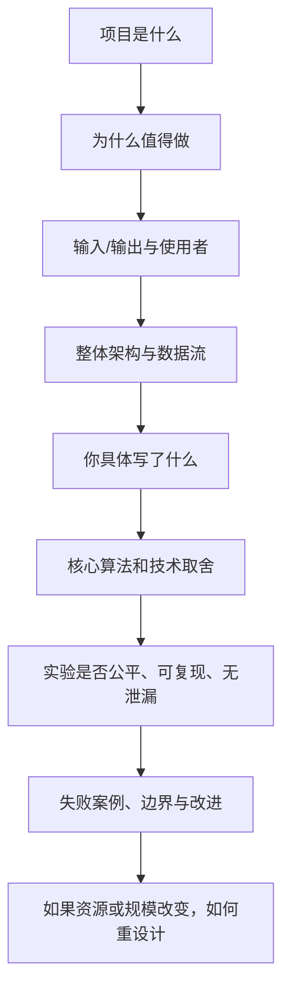
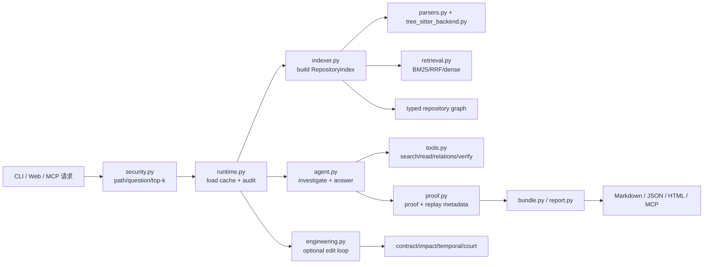

# Repo Agent 超级详细技术白皮书与保研项目拷打大全

> 版本：2026-08-10
>
> 适用对象：项目作者、代码审阅者、保研/研究生面试准备者、希望复现或二次开发 Repo Agent 的工程师。
>
> 文档目标：把这个仓库从“会运行的开源项目”解释成一套可审计的代码智能系统。本文既是技术白皮书，也是连续追问式的项目答辩底稿；它不只告诉你应该怎么夸项目，也会告诉你哪些说法现在不能夸、哪些实验尚未完成、哪些测试正在失败。

---

## 0. 先说结论：这个项目到底是什么

### 0.1 一句话定位

Repo Agent 是一个面向代码仓库的 evidence-first investigation system：在 Coding Agent 修改代码之前，它先对“应该看哪些文件/符号、这些位置为什么相关、这条证据在代码变化后是否还成立”给出结构化、可回放的答案。

它不是一个以生成补丁为核心的 IDE，也不是把代码塞进向量数据库后做一次相似度搜索的普通 RAG。它的中心产物是 `InvestigationBundle` 与其中的 proof：检索命中、路径/调用/路由图、排序理由、置信度、反例审计和可重放校验都被保留下来，之后的模型或人可以继续检查。

### 0.2 最适合的使用场景

它最适合以下问题：

1. **定位**：某个 API、handler、writer、配置项、测试或 RAG 边界在哪里？
2. **追链**：请求从 route 经过哪些中间函数，最终在哪里写响应或落盘？
3. **排错**：同名的 public/admin/legacy/mock/test 实现中，哪一个属于问题描述的执行路径？
4. **交接**：把一个带文件、符号、行号、图边和验证说明的证据包交给 Codex、Aider、OpenHands 等修改型 Agent。
5. **变更治理**：某个已经证明过的目标被修改后，哪些调用者、路由、文件和检查需要重新验证？

### 0.3 当前实现的真实口径

这张表是整份文档最重要的防误导声明。项目曾经有旧 artifact、旧 README 和旧测试口径；讲解时以当前 Python 源码和本次重新执行结果为准。

| 主题 | 当前实现 | 不能直接说成什么 | 证据 |
| --- | --- | --- | --- |
| 主检索 | 四个独立 BM25 视图：`content`、`identifier`、`path`、`structure`，用 weighted RRF 融合 | “纯 embedding 检索” | `repo_agent/indexer.py:96-150`、`repo_agent/retrieval.py` |
| 外部语义 | 可选 OpenAI-compatible/LiteLLM embedding；没有配置时完全不调用 embedding | “系统默认使用神经向量模型” | `runtime.py:46-57`、`llm.py:86-119` |
| 图扩散 | bounded Personalized PageRank，阻尼系数默认 `0.85`，在有限 seed 邻域中迭代收敛 | “当前在线链路使用真正的 MCTS” | `indexer.py:637-651`、`761-891` |
| MCTS 名称 | `mcts_graph_search`、trace 类型 `graph_mcts` 是历史兼容接口/序列化标签 | “实验已经证明 MCTS 优于 PPR” | `indexer.py:251-289`、`agent.py:225-229` |
| 证明 | 机器可读 proof、严格 replay、mutation lab、decoy audit | “形式化方法意义上的定理证明” | `agent.py:836-1115`、`proof.py` |
| Engineering Mode | 可选模型驱动的 inspect → edit → verify → review，默认复制到 `runs/<id>/workspace` | “无条件自动修改源仓库” | `runtime.py:220-256`、`engineering.py` |
| 评测 | 内置 portable/challenge/attack/temporal/release artifact，多数是 fixture 或 synthetic benchmark | “已经在所有外部数据集上达到 SOTA” | `docs/retrieval-research-2026.md`、本次命令输出 |
| 默认索引 | 本仓库当前为 69 个可索引文件、1004 个 chunk、7532 条图边、15 个 route | “项目只有几十个函数” | `python -m repo_agent index --repo .` |
| 全量测试 | 171 个用例中本次 `161 passed, 10 failed` | 沿用旧 README 的 “160 tests passed” | 本次 `python -m pytest -q` |

### 0.4 研究问题如何表述才不夸大

可以把项目凝练成三个可证伪问题：

- **RQ1：定位**——将内容、标识符、路径和程序结构作为互补视图，是否比单一词法检索更准确地定位 issue/问题对应的文件或函数？
- **RQ2：证据可靠性**——将命中结果包装成可 replay 的 proof，是否能更早发现重命名、路径断裂、片段漂移和 decoy 审计失效，并支持 abstention？
- **RQ3：下游价值**——在模型、token budget 和验证条件相同的情况下，证据层是否让最终修复成功率、审查效率或错误置信度得到改善？

目前仓库对 RQ1 有 bundled regression 证据，对 RQ2 有 replay/mutation/attack 的工程验证，对 RQ3 只有设计协议和待补实验；因此面试中必须把“已实现”“已在 fixture 上验证”“外部研究尚未完成”分开说。

---

## 1. 项目拷打的方法论：老师究竟在验证什么

用户提供的《计算机保研项目拷打准备指南》把项目答辩归结为三件事：真实性、原理理解、结果与局限分析。这个结论非常适合本项目，但需要把它转成可操作的审计框架。

### 1.1 七层连续追问链

面试官通常不是随机抽题，而是沿着一条“从宣传词逼近可验证事实”的路径推进：



对 Repo Agent，任何一个宣传词都应能落到下面四类证据之一：

| 证据级别 | 例子 | 能支持的说法 |
| --- | --- | --- |
| L0 叙述 | README 的一句话 | 项目定位、设计意图 |
| L1 源码 | 函数、数据类、命令分支 | “代码中确实实现了某机制” |
| L2 可运行产物 | 测试、benchmark JSON、HTML、SARIF | “在某个固定场景跑通/通过” |
| L3 外部验证 | repository-disjoint 数据、独立 baseline、统计置信区间 | “具有跨仓库研究外部有效性” |

本项目当前大多数能力处在 L1/L2；只有数据准备协议已经向 L3 靠近，不能把 artifact 数量误说成外部泛化结果。

### 1.2 1 分钟、3 分钟、10 分钟三种版本

#### 1 分钟版本（保命版）

> Repo Agent 是我做的一个代码仓库证据层。普通关键词搜索只能告诉我们某个词出现在哪里，而真实仓库里往往有 public、admin、legacy、mock 等相似实现；项目先用 Python AST/Tree-sitter 抽取符号、路由、调用和导入关系，再用 content、identifier、path、structure 四个 BM25 视图做 weighted RRF，最后在有界仓库图上做 Personalized PageRank 和路由锚定重排。输出不是一句没有来源的答案，而是带文件/符号/行号、图路径、排序理由、置信度和 proof replay 的证据包。当前本仓库索引出 1004 个 chunk、7532 条边；10 个 portable fixture 题是 100% Top-1，但 32 题 challenge 是 84.38% Top-1、93.75% Top-3，且全量测试本次有 10 个失败，所以我把它定位成一个可审计的研究型原型，而不是已经被外部数据充分证明的通用编码 Agent。

#### 3 分钟版本（标准版）

按“问题—方法—个人贡献—结果—边界”讲，不要一上来背 60 个 CLI 命令。具体稿件见第 12 章；3 分钟的重点是让老师知道你能主动划清 claim boundary。

#### 10 分钟版本（深挖版）

10 分钟版不是把所有代码念一遍，而是选择一条真实链路，例如 `/api/chat` 的 writer 定位：

1. 先说明 query planner 如何抽取 route literal `/api/chat` 与 writer intent；
2. 解释四视图 BM25 召回为什么让 `writeChatDelta`、`writeAdminChatDelta`、`writeLegacyChatDelta` 同时出现；
3. 说明 route anchor 从 `post_api_chat` 沿 `routes_to/calls` 找到 `handlePublicChat → streamPublicChatTurn → writeChatDelta`；
4. 对照证明对象中的 `top_hit`、`route_literals`、`supporting_paths`、`decoy_audit` 和 strict replay；
5. 再主动承认当前 attack benchmark 的 `mitigation_signal_rate=0.0`，说明“排序避开了 decoy”不等于“系统已经证明是因为某个因果防御信号避开了 decoy”。

### 1.3 参考指南的八个原则，如何映射到本项目

1. **简历名词都可能被问**：`BM25`、`RRF`、`PPR`、`Tree-sitter`、`MCP`、`SARIF`、`proof-carrying` 都必须能用白话和公式解释。
2. **不夸大接口调用**：`LLMClient` 是 OpenAI-compatible HTTP/LiteLLM 适配器；它没有训练或实现大模型。
3. **不把历史名称当当前算法**：`graph_mcts` 是兼容标签，当前策略字段是 `personalized_pagerank`。
4. **个人贡献必须可定位**：如果这是个人项目，应准备 commit、PR、函数级 diff；如果来自团队，按模块逐项区分，不能把整个仓库都说成自己独立完成。
5. **每个数字都要有生成命令**：Top-1、MRR、测试通过数、chunk 数、edge 数都附命令、数据版本和时间。
6. **必须准备 baseline**：single-view BM25、no-graph、dense-only、BM25+dense RRF、Zoekt/SCIP 等要在实验协议里分开。
7. **必须准备失败**：challenge miss、parser fallback、无 embedding 时的语义边界、10 个当前测试失败就是主动承认的材料。
8. **不知道时展示验证路线**：回答“我没有在本项目中实现过 X；当前理解是 Y；我会用 Z 命令/实验验证；不能把它当已完成结果”。

### 1.4 NeurIPS/Artifact 风格的科研审计补充

NeurIPS Paper Checklist 明确要求论文的 claims 与理论/实验能够支持的泛化范围一致，并鼓励单独写 limitations；这正是本项目需要对 README 做的校准。ACM Artifact Review and Badging 的思想则是把“可获得、可运行、可复用、可复现”拆成不同层级，而不是看到一个仓库能启动就宣布研究结论成立。

对应到本项目，答辩中应按四个问题检查每一项 claim：

| 审计问句 | Repo Agent 的具体检查 |
| --- | --- |
| Artifact 是否可获得？ | 源码、fixture、JSON spec、脚本和报告是否存在；是否被 `.gitignore` 或本地路径遮蔽 |
| 是否可运行？ | clean clone 安装依赖后，`python -m pytest -q`、benchmark、proof replay 是否执行 |
| 是否可复用？ | benchmark adapter 是否允许第三方用 `repo/question/expected` schema 接入；MCP 是否能被另一个 Agent 调用 |
| 是否可复现？ | commit、Python 版本、数据 hash、参数、缓存状态、耗时、失败案例和随机种子是否被记录 |

---

## 2. 仓库现状总盘点：先把事实钉死

### 2.1 目录结构与职责地图

```text
repo-agent/
├── repo_agent/                 # Python 核心包
│   ├── __main__.py             # CLI 入口，当前 60+ 子命令的编排层
│   ├── models.py               # dataclass 数据契约
│   ├── parsers.py              # Python/JS/TS/HTML/CSS/TOML 解析入口
│   ├── tree_sitter_backend.py  # JS/TS Tree-sitter 抽取
│   ├── indexer.py               # RepositoryIndex、chunk、graph、ranking
│   ├── retrieval.py             # BM25、Dense cosine、RRF
│   ├── agent.py                 # 确定性回答、可选 LLM rerank/tool loop、proof
│   ├── tools.py                 # Agent 可调用的只读/编辑/验证工具
│   ├── runtime.py               # CLI/Web/MCP 共享生命周期与缓存
│   ├── cache.py                 # JSON index cache + SQLite parse cache
│   ├── config.py/security.py    # 配置、路径、命令 allowlist、安全策略
│   ├── bundle.py/report.py      # Markdown/JSON bundle 与 HTML 报告
│   ├── proof.py                 # replay、strict replay、mutation、scorecard
│   ├── impact.py/contract.py    # 影响分析、回归契约、PR guard、SARIF
│   ├── temporal.py              # 跨 git 历史 replay、successor、迁移计划
│   ├── court.py                 # 多 Agent 证据法庭与 arbiter verdict
│   ├── benchmark_suite.py       # 便携 benchmark、ablation、frontier
│   ├── core_bench.py/external_bench.py
│   │                             # 外部数据集 manifest 与 adapter
│   └── research_protocol.py     # repository-disjoint split、冻结、泄漏审计
├── examples/                   # 可控 fixture：Express/FastAPI/RAG/反事实 decoy
├── tests/                      # 单测、回归、报告、benchmark、proof、security
├── web/                        # 原生 HTML/CSS/JS Web Studio
├── scripts/                    # demo、release gate、benchmark 准备、图渲染
├── docs/                      # 研究协议、教学、面试、artifact map、快照
├── reports/                    # 本地生成物；默认不参与索引
├── runs/                       # engineering workspace 与 run record
├── .cache/                    # index JSON 与 SQLite parser cache
└── pyproject.toml             # setuptools、依赖、CLI、pytest/ruff/mypy 配置
```

### 2.2 当前索引快照

以下数字来自本次重新执行 `python -m repo_agent index --repo .`，不是手填：

| 指标 | 值 | 如何解释 |
| --- | ---: | --- |
| 可索引文件 | 69 | 受支持扩展且未命中 ignore 规则、未超过 512 KiB |
| chunk | 1004 | 每个解析 symbol 一个 chunk，另加每文件最多前 140 行的 file overview |
| 图边 | 7532 | `calls=2969`、`references=2837`、`imports=1714`、`routes_to=12` |
| route chunk | 15 | Python decorator、JS/TS route pattern 被转成 route symbol |
| BM25 vocabulary | 8194 | 内容及四视图 token 的词表大小 |
| 平均 BM25 文档长度 | 292.427 | chunk token 数平均值；不是源码平均行数 |
| 语言 | Python 895、JavaScript 105、其他 4 | 这是 chunk 分布，不是文件分布 |
| parser | `python-ast` 895、Tree-sitter JS 46、regex fallback 59 | fallback 不是“解析成功等价物”，而是安全降级 |
| embedding | none | 当前环境没有可用 LLM/embedding 配置，因此本次快照是确定性 lexical+graph |

**容易被追问的统计陷阱：**“895 个 Python”不等于“895 个 Python 文件”。同一个文件可以有多个函数/类/route chunk，另有一个 file chunk；`RepositoryIndex.stats()` 的 `language_distribution` 是 chunk 计数。文件计数要看 `file_count`，chunk 数要看 `chunk_count`。

### 2.3 当前测试事实

本次执行：

```powershell
python -m pytest --collect-only -q
python -m pytest -q
```

收集到 171 个测试；全量运行耗时约 562 秒，结果为 **161 passed、10 failed**。失败不是“测试没跑完”，而是明确的行为/契约不一致：

| 失败测试 | 现象 | 暂时应如何表述 |
| --- | --- | --- |
| `test_challenge_benchmark_adapter_runs_as_harder_generalization_gate` | challenge Top-3 为 `0.9375`，旧断言要求 `1.0` | challenge 不是当前全绿；存在 2 个 Top-3 缺口 |
| `test_benchmark_adapter_passes_intent_guard_challenge_suite` | intent guard status 为 `needs_attention` 而非 `pass` | 排序能力与旧状态门槛已漂移 |
| `test_proof_attack_benchmark_resists_generated_decoys` | `mitigation_signal_rate=0.0` | decoy 被避开，但没有识别出可归因的 mitigation signal |
| `test_adaptive_proof_attack_curriculum_stresses_synthesized_policy` | status 为 `adaptive_policy_holds` 而非旧期望 `adaptive_gap_found` | adaptive policy 行为与旧测试语义相反 |
| `test_adaptive_policy_repair_closes_second_order_gaps` | 二阶 repair 断言失败 | 需要重新定义 adaptive benchmark 的预期状态 |
| `test_proof_attack_minimax_certificate_audits_repair_loop` | certificate 断言失败 | attack → policy → repair 证据链未满足旧契约 |
| `test_proof_attack_scorecard_grades_generated_attacks` | scorecard 为 `fail` | `mitigation_signal_rate` 使阈值门失败 |
| `test_proof_attack_cegar_runs_counterexample_guided_loop` | status 为 `blocked` 而非 `needs_refinement` | CEGAR 状态机与旧期望不同 |
| `test_release_pack_generates_manifest_and_artifacts` | `benchmark_repair_status=partial` | release pack 仍生成，但不能称为完整 validated |
| `test_mcp_investigation_returns_grounded_structural_evidence` | 当前 backend 字段为 `multi-view-bm25+weighted-rrf+graph`，旧断言仍期待 `bm25+lexical+graph` | 这是 API/测试契约漂移，不是检索算法证明 |

因此文档中所有“测试通过”都必须注明子集和日期。更准确的句子是：

> 当前核心索引/解析/检索测试可通过；全量测试在当前工作区为 161/171，10 个失败集中在 challenge 门槛、proof attack 状态机、release pack 和 MCP 字段兼容性。

### 2.4 当前 benchmark 数字

#### Portable generalization suite（10 题）

```powershell
python -m repo_agent benchmark-adapter `
  --suite repo_agent/benchmark_adapter_suite.json `
  --output .tmp/deep-audit-portable.json
```

结果：Top-1 `100%`、Top-3 `100%`、MRR `1.000`、distractor@1 `0%`、平均 confidence `0.94`。但是它来自本仓库附带的 5 个 fixture repository，不能当作外部 SOTA。

#### Challenge suite（32 题）

```powershell
python -m repo_agent benchmark-adapter `
  --suite repo_agent/benchmark_challenge_suite.json `
  --output .tmp/deep-audit-challenge.json
```

结果：Top-1 `84.375%`、Top-3 `93.75%`、MRR `0.880`、distractor@1 `0%`。主要缺口：

- `repo_config_package_data`：miss@6；
- `repo_web_run_history_refresh`：miss@6；
- `express_public_chat_authorizer`：rank 2；
- `simple_agent_stream_turn_builder`：rank 3；
- `fastapi_admin_clear_state`：rank 3。

按 tag 看，`config`、`packaging` 的 Top-3 为 0%，`runs` 为 50%，`javascript` 为 66.67%。这说明“路由/handler/RAG fixture 很强”与“仓库级配置/前端状态/跨文件语义泛化较弱”同时成立。

#### Adversarial proof attack（3 个 synthetic mutation）

```powershell
python -m repo_agent proof-attack `
  --output-dir .tmp/deep-audit-proof-attack `
  --output .tmp/deep-audit-proof-attack.json
```

当前输出：attack resistance `100%`、Top-1 `100%`、distractor@1 `0%`、proof proved `100%`、route anchor `100%`、supporting path `100%`、generated decoy audit rate `66.67%`、mitigated decoys `100%`、**mitigation signal rate `0%`**。最后一个数字必须主动讲：排序结果成功，不代表审计已经证明了某个防御信号的因果作用。

---

## 3. 问题建模：把“找代码”写成可研究的问题

### 3.1 输入、输出和标签

一个 investigation 可以抽象为：

\[
q=(自然语言问题, 仓库 R, 可选目标类型, top\text{-}k)
\]

输出为：

\[
Y=(H, E, P, D, A)
\]

其中：

- `H` 是排序后的 `RetrievalHit[]`，每个 hit 包含 chunk、score、matched_terms、reasons；
- `E` 是相关 `GraphEdge[]`；
- `P` 是 proof graph、route literal、top hit、supporting paths、decoy audit；
- `D` 是 `EvidenceDiagnostics`，包括 confidence、score gap、unique files、graph edge count、warnings；
- `A` 是自然语言 answer，默认由确定性模板生成，可选由 LLM 在已召回证据上重排/工具调查后生成。

评测标签不是“答案好不好”的主观分，而是对每个 case 预先标注 `expected_path`、`expected_symbol_contains`，可选 `distractor_symbol_contains` 和 tag。这样 Top-1/Top-3/MRR 才有可重复定义。

### 3.2 为什么 repository localization 不是 grep

`grep` 或 `ripgrep` 的核心是对文本集合做布尔/正则匹配。它擅长：

- 精确字符串、正则、文件范围过滤；
- 极低延迟地告诉你“这个词出现在哪些行”；
- 在没有语义模型、没有解析器时作为安全底线。

但本项目需要解决的不是“字符串出现”，而是“问题中的实体属于哪一条程序路径”。例如 query：

> Which function finally writes streamed tokens for the public `/api/chat` endpoint?

仓库中可能同时有：

```text
/api/chat                 -> handlePublicChat -> streamPublicChatTurn -> writeChatDelta
/api/admin/chat-replay    -> handleAdminChatReplay -> writeAdminChatDelta
/api/chat-legacy          -> handleLegacyChat -> writeLegacyChatDelta
README/docs               -> writePublicChatDeltaNotes（词面最像但不可执行）
```

单纯文本匹配会把 `writeAdminChatDelta`、`writeLegacyChatDelta` 和文档 bait 一起吐出来；Repo Agent 需要用 route anchor、typed graph edge、symbol kind、route family conflict 和 decoy audit 将它们区分开。

### 3.3 与普通 Code RAG 的边界

普通 RAG 的典型流程是 `chunk → embedding → vector top-k → prompt → generation`。Repo Agent 的默认流程更像：

```text
源码
  ├─ 解析：Symbol / route / imports / calls / references / inherits
  ├─ 表示：content / identifier / path / structure 四视图
  ├─ 召回：文件 scout + BM25/RRF + 可选 dense
  ├─ 扩展：typed graph + bounded PPR + route anchor
  ├─ 决策：intent/action/role/语言/反事实 decoy rerank
  ├─ 证明：top-hit / route / path / graph-edge / fingerprint / decoy
  └─ 交付：answer / HTML / JSON bundle / MCP handoff / PR contract
```

它并不声称普通 RAG 没有价值；相反，`DenseEmbeddingIndex` 可以作为可选通道。核心主张是：对于路线、调用链、配置、测试和变更治理问题，结构化证据是 embedding 相似度之外的独立信号。

### 3.4 研究假设与失效条件

| 假设 | 为什么需要 | 失效例子 | 需要怎样的实验 |
| --- | --- | --- | --- |
| 标识符在一定程度上反映行为 | identifier view 对函数名/handler 名有高权重 | 反射、动态拼接、全是 `run()`/`handle()` | 匿名化标识符、重命名、动态 dispatch challenge |
| 静态 parser 能抽到关键边 | call/import/route 是图的来源 | 宏、eval、依赖注入容器、运行时注册 | parser recall、edge precision、真实项目人工标注 |
| 路由字面量是可观测锚点 | public/admin/legacy 可由 route family 区分 | GraphQL 单一 endpoint、消息队列、无 HTTP 路由 | route-free / event-driven benchmark |
| 局部图扩散足够 | 控制延迟与图爆炸 | 目标依赖跨包/跨仓库或深层反射 | hop/depth 伸缩和召回-延迟曲线 |
| proof 中的文本片段能代表源代码 | replay 可检测内容漂移 | 自动格式化、宏展开、代码生成 | 稳定 fingerprint/AST identity 设计 |
| fixture case 不代表外部世界 | regression 只测已知行为 | case-derived hard-coded guard 过拟合 | repository-disjoint external benchmark |

---

## 4. 端到端架构：一次 ask 究竟发生了什么

### 4.1 分层图



### 4.2 `RepoAgentRuntime.load_index`：缓存先于解析

`runtime.py:38-65` 的逻辑可以写成：

1. `validate_repo_path` 把用户路径 resolve，并检查它是否在 `allowed_roots` 内；
2. `IndexCache.signature_for` 遍历受支持文件，忽略 `.git`、`.cache`、`reports`、`runs`、`node_modules` 等目录，只把 `relpath|mtime_ns|size` 写进 SHA-256；
3. 内存缓存命中则直接返回；
4. 磁盘 JSON index cache 命中且 schema/version/signature 一致则恢复 `RepositoryIndex`；
5. 若 LLM embedding model 配置变化，则旧 index 不复用；
6. 否则调用 `build_index`，每个文件的 AST/Tree-sitter 结果还可以落进 SQLite parse cache；
7. 写回 cache，并记录 audit event。

这是一种“内容增量近似”的缓存，不是严格 content-addressable build：签名依赖 mtime 和 size，极端情况下文件内容被替换但时间戳和字节数恰好相同，可能误用索引。更严格的实现应把每个受支持文件的 content hash 纳入签名，或对命中的文件再次校验 digest。

### 4.3 Query Plan 的有限路由

`QueryPlan` 有 `mode`、`intent`、`focus_terms`、`target_roles`、`target_languages`、`hop_budget` 六组字段。当前 planner 不是机器学习分类器，而是可读的规则路由器：

- `frontend_lookup`：browser/web/page/UI，优先 `web`、JS/TS/HTML/CSS；
- `style_lookup`：style/stylesheet/css，优先 CSS；
- `test_lookup`：test file/pytest，优先 `tests`；
- `config_lookup`：configuration/pyproject/package data，优先 config；
- `api_lookup`/`flow_trace`：route/endpoint/API 或要求函数链，优先 backend/api/entrypoint；
- 其他走 `code_search`。

**它的优点**是 deterministic、debuggable、无需训练集；**它的代价**是 query vocabulary 和中文扩展表会把业务先验硬编码在 `indexer.py` 中，容易发生规则过拟合，也不覆盖所有自然语言表达。

### 4.4 File scout 与 chunk recall 的两阶段原因

文件级 scout 先计算 `file_fact_tokens` 的词项交集与角色匹配；命中的文件最多扩展到 `max(24, min(top_k*8,64))` 个。然后 chunk 级检索不仅读取 scout 文件，还对全仓库 `_score_all_chunks` 的前 `max(64, top_k*12)` 做补充。

这样做是为了避免“第一阶段错过文件，后面永远看不到目标”的硬截断：

\[
Candidate = Chunks(ScoutFiles) \cup TopM(GlobalScore)
\]

file boost 上限为 `2.5`；overview chunk 对 API/flow/function 等 intent 会被降权或加入/减去固定项。两阶段代价是代码复杂度和重复候选处理增加，但能把 file-level recall 与 symbol-level precision 解耦。

### 4.5 一条具体数据流：`/api/chat` writer 定位

下面用 `examples/counterfactual_agent_app/server.js` 说明“证据优先”究竟和普通搜索差在哪里。命令：

```powershell
python -m repo_agent ask `
  --repo examples/counterfactual_agent_app `
  --question "Which function finally writes streamed tokens for the public /api/chat endpoint?" `
  --top-k 6
```

当前输出的关键事实：

| 阶段 | 结果 |
| --- | --- |
| query intent | `api_lookup`/writer-oriented，route literal `/api/chat` |
| 首位 | `server.js:writeChatDelta`，行 38–43，score 约 75.05 |
| 近邻干扰 | `writeAdminChatDelta`、`writeLegacyChatDelta`、`streamPublicChatTurn` |
| 图路径 | `post_api_chat → handlePublicChat → streamPublicChatTurn → writeChatDelta` |
| route anchor | `/api/chat` 存在，且 route chunk 能通过 `routes_to/calls` 连到 public handler |
| proof | status `proved`、top-hit-on-route-path `pass` |
| 置信度 | `high (0.92)`，但警告“top hits are close together”“evidence concentrated in one file” |

这里的“proved”是内部 proof schema 的状态，不是数学证明。它表示当前仓库索引中，top hit、route literal、supporting path 和必要图边能够回放/解析；它没有证明运行时所有动态条件下必然调用该 writer。

### 4.6 Parser：从源码到结构事实

#### Python AST

`parsers.py:_analyze_python` 采用标准库 `ast.parse`：

1. 顶层 `Import`/`ImportFrom` 记录模块名；
2. `FunctionDef`/`AsyncFunctionDef`/`ClassDef` 变成 `Symbol`；
3. `ast.walk` 抽取 call name、identifier reference 和 inheritance；
4. FastAPI/Flask 风格 decorator 通过 `_extract_python_routes` 转成 `kind="route"` 的 symbol；
5. 每个 symbol 的 `start_line/end_line` 用于切出 source snippet。

AST 的好处是括号、缩进、字符串内部伪代码不会被简单正则误判；它的限制是只在语法可解析时成立。当前 SyntaxError 会返回 `parser_backend="python-ast-error"` 的空结构，而不是抛异常中断整个索引；这是稳定性优先的降级，但会造成 parser recall gap。

#### JavaScript/TypeScript Tree-sitter

`tree_sitter_backend.py` 使用语言 grammar 构造 concrete syntax tree，抽：

- import statement 与 `require/import()`；
- call expression 的函数名；
- identifier/type identifier references；
- class extends/implements；
- `app/router/server/... .get/.post/.put/.patch/.delete/.use` route；
- handler identifiers；
- class method qualified name。

官方 Tree-sitter 的设计目标是增量、快速、遇到语法错误仍尽量提供有用树，且有 Python binding；本项目只使用其中的静态解析能力，并没有使用 editor incremental update。

当前后端刻意使用显式 node table 和迭代栈 `_walk`，避免深层生成式 JS 让 Python/native traversal 的递归栈溢出。对某些 template-heavy 或大于约 20 KiB 的 JS/TS 文件，项目采用 regex fallback/segmented safety gate；它牺牲部分边精度换取“不让 benchmark 进程崩掉”。

#### HTML/CSS/TOML

HTML 只把 `src/href` 链接作为 imports，CSS 只抽 `@import`，TOML/Manifest 通常进入 text/file overview。这意味着 Web Studio 的真实 DOM 事件关系主要来自 `web/app.js`，不会由 HTML parser 自动推导出按钮到 handler 的完整行为图。

#### Parser 的三种错误

要把以下三个概念分开：

1. **语法解析失败**：输入源代码有 syntax error，返回 error backend；
2. **结构漏抽**：代码能解析，但动态调用/装饰器/模板语义未被规则覆盖；
3. **图解析错误**：symbol 已抽出，但 `_build_edges` 因名字冲突或 import tail 过短，错误连到另一个 chunk。

面试时如果老师问“Tree-sitter 保证调用图正确吗”，正确回答是“不保证；它只提高 syntax-level observation 的稳定性。调用图是基于启发式 name resolution 的近似图，必须在 proof replay、人工抽样和 edge precision 评测中验证”。

### 4.7 `CodeChunk` 为什么按 symbol 切，而不是固定 200 token

`CodeChunk` 的最小身份是：

```python
CodeChunk(
    chunk_id="repo_agent/indexer.py::42",
    relpath="repo_agent/indexer.py",
    language="python",
    text="...",
    start_line=..., end_line=...,
    symbol_name="_rerank_multistep",
    symbol_kind="function",
    route_path="",
    imports=[...], calls=[...], references=[...], inherits=[...],
    parser_backend="python-ast",
)
```

固定大小 chunk 有两个问题：

- 一个函数被切成两半，调用关系和行号证据不完整；
- 一个 chunk 混入多个函数，检索命中后仍需人工再次定位。

symbol chunk 的代价也不能回避：超长函数仍然会变成长文档，嵌套局部函数可能与外层重复；每个文件还有前 140 行 overview，导致同一信息有多种表面。项目通过 overview downrank、symbol bonus、file scout 和 top-k 上限控制影响，而不是声称 chunking 已经完美。

### 4.8 图构建：边类型、权重和 name resolution

`_build_edges` 构造四类主要边：

| 边 | 来源 | 默认权重 | 语义 |
| --- | --- | ---: | --- |
| `calls` | `chunk.calls` / handler names | 同文件 2.6，跨文件 1.8 | source symbol 的调用对象 |
| `references` | identifier/reference | 同文件 1.35，跨文件 0.85 | 弱于直接调用的名字共现 |
| `inherits` | base class | 3.0 | 继承/实现关系 |
| `imports` | import tail 与文件 stem 匹配 | 1.4 | 文件级依赖 |
| `routes_to` | route symbol 到 handler | 3.2 | HTTP 入口到 handler 的强边 |

symbol resolution 优先 qualified name，再用小写 symbol name；若有同文件候选，优先同文件，否则全局候选。import 则用模块名最后一段和文件 stem 匹配。这是可解释的轻量图，但在以下情况下会误连/漏连：重名函数、别名 import、动态属性、依赖注入、跨包同 stem、TypeScript 类型擦除。

### 4.9 BM25：当前默认检索的数学和工程实现

`retrieval.py:BM25Index` 保存 term frequency、document length、document frequency 和 postings。对 query term `t`，文档 `d` 的原始贡献是：

\[
IDF(t)=\ln\left(1+\frac{N-df(t)+0.5}{df(t)+0.5}\right)
\]

\[
score(d,t)=IDF(t)\cdot
\frac{tf(t,d)(k_1+1)}{tf(t,d)+k_1(1-b+b|d|/avgdl)}
\]

当前默认 `k1=1.5`、`b=0.75`。实现最后按全体 raw score 的最大值归一化到 `[0,1]`，所以这里的分数只能在同一 index/同一 query 的排序中解释，不能拿两个不同仓库的 BM25 分数直接比较置信度。

工程细节：

- query term 用 `dict.fromkeys` 去重；
- 不在 postings 中的词跳过；
- `document_length=0` 时 `avgdl` 至少取 1；
- 空 query 或空 index 返回空字典；
- 结果按 document id 稳定排序，降低同分的非确定性。

### 4.10 四视图与 weighted RRF

四视图并不共享一个 token bag：

1. `content`：函数实现文本；
2. `identifier`：symbol、qualified name、handler、calls；
3. `path`：relpath、language、symbol kind；
4. `structure`：route、imports、calls、references、inherits、file roles。

每个视图先独立 BM25 排名，再使用：

\[
RRF(d)=\sum_{v\in V}\frac{w_v}{c+rank_v(d)}
\]

当前权重是 `content=1.0`、`identifier=1.8`、`path=1.1`、`structure=1.25`，`c=30`。RRF 的关键价值不是“分数更精确”，而是避免把不同 channel 的分数尺度强行相加：一个在 identifier 排第 1、另一个在 content 排第 3 的候选可以共同获得支持。

选择 RRF 的答辩答案：

> 我需要融合异质检索信号，但没有足够的外部标注数据去学习一套可靠的 score calibration；RRF 只依赖排名，确定性、容易解释，也能看到每个 view 的 contribution。它的代价是丢失 BM25 原始分数的幅度信息，权重仍然需要 held-out ablation 来调，不能把当前固定权重说成理论最优。

### 4.11 可选 DenseEmbeddingIndex

`DenseEmbeddingIndex` 是纯内存 cosine index：检查维度一致性，预存向量范数，对 query vector 计算 cosine，再映射到 `[0,1]`：

\[
s_{dense}=clip((cos(q,d)+1)/2,0,1)
\]

如果同时提供 lexical 和 dense ranking，`RepositoryIndex._semantic_scores` 用 lexical weight `1.0` 与 dense weight `1.2` 做另一轮 RRF，而不是直接把两个未校准的浮点分数相加。没有配置 `OPENAI_API_KEY`/兼容 endpoint 时，`semantic_backend` 为 `none (configure embedding provider)`，项目仍可完整运行。

这让系统有一个清晰的 baseline 关系：

```text
no provider       = deterministic multi-view BM25 + graph
provider enabled  = multi-view BM25 + external embedding RRF + graph
use_model=false   = deterministic answer
use_model=true    = optional LLM rerank + bounded tool loop
```

注意：`use_model=true` 不等于一定调用模型；`LLMClient.available` 必须满足 provider/model/credential 条件，否则 trace 会记录 `agent_unavailable`。

### 4.12 PPR：为什么当前图搜索不是 MCTS

`_mcts_graph_boosts` 目前第一行就 `return self._personalized_pagerank_boosts(...)`，后面旧 pseudo-MCTS 代码不可达，仅为历史 artifact 参考。

PPR 的输入和流程：

1. 用 seed hit 分数构造 restart/teleport 分布 `p_0`；
2. 从 seed 沿最多 `max_depth` 层、每个节点最多 24 条邻边建立 bounded neighborhood；
3. 将 typed edge weight 截断到 `[0.05,4.0]` 并按出边总和归一化；
4. 以 `damping=0.85` 迭代：

\[
p_{t+1}=(1-\alpha)\,p_0+\alpha\,T^Tp_t
\]

5. dangling mass 回投到 teleport distribution；
6. 当 L1 delta 小于 `1e-7` 或达到最多 `min(iterations,80)` 次时停止；
7. 将 `probability × (0.7+0.3×semantic_score) × 35` 转成 graph boost，再叠加独立 route anchor boost。

PPR 相比无界 BFS 的优势：有 restart、能处理多源 seed、通过转移概率降低 hub 的垄断、可报告收敛。相比真正的 MCTS，它没有 simulation/rollout、UCB exploration/exploitation、visit backpropagation 的当前执行语义。因此正确说法是“历史 API 名为 MCTS，当前策略为 bounded PPR”。

### 4.13 Route anchor：为什么路径字面量很值钱

当 query 中出现 `/api/chat` 这类 route literal，`_route_anchor_boosts`：

- 找出 `chunk.symbol_kind == "route"` 且 `route_path` 匹配的 anchor；
- 从 anchor 沿 forward edges 做有界 BFS；
- handler、writer、response writer 会得到不同 boost；
- 另一路由族、off-route writer、admin/legacy/preview 等候选会被惩罚；
- `route_paths` 会被放入 proof，供报告和 strict replay 使用。

Route anchor 是一个“高精度但覆盖有限”的信号：HTTP 路由明确时很强，GraphQL 单一 endpoint、RPC、事件总线、CLI pipeline 或动态注册时可能不存在。它必须是独立 evidence，而不是被吞进一个不可解释的总分。

### 4.14 Multistep rerank：从相关性变成问题意图

`_rerank_multistep` 对候选集合合并：seed、graph relation、intent-specific candidate ids。它的主要逻辑按以下顺序叠加/惩罚：

1. base lexical/dense/RRF score；
2. file evidence 和 graph evidence（graph 先做 `2.5*log1p(relation_boost)`，上限 6）；
3. route reachable、role aligned、language aligned；
4. 目标 symbol kind（function/route）；
5. action vocabulary，如 `write`、`persist`、`retrieve`、`clear`、`authorize`；
6. call-site overlap，若 query 询问 caller/callee 则额外加成；
7. contrastive exclusion；
8. config/test/docs/frontend/style/RAG/run-history 等 intent guard；
9. deterministic tie-break：relpath、start_line。

这是一种可解释的 feature/rule reranker，不是通过训练学习的 LambdaMART 或 cross-encoder。固定规则的研究风险是 **benchmark leakage / case overfit**：如果把测试问题的具体 symbol 名硬编码到排序器，就不能说模型学到了可泛化的定位能力。当前代码中存在不少具体 guard（如 `pyproject.toml`、`tests/test_coordination.py`、`applyRun` 等），因此外部评测必须使用 repository-disjoint、tuning log 和 held-out test。

---

## 5. Agent 层：从排序结果到可交接证据

### 5.1 `RepoAgent.answer` 的两条路径

`RepoAgent.answer` 先始终执行确定性调查，再根据参数决定是否启用模型：

```text
answer(query)
  ├─ RepoTools(repo_index)
  ├─ _investigate(query)
  │   ├─ repo_memory
  │   ├─ plan
  │   ├─ semantic_scores（默认 lexical，配置模型后可加 dense）
  │   ├─ scout_files
  │   ├─ read_candidates
  │   ├─ graph PPR + route anchors
  │   └─ multistep rerank
  ├─ build_evidence_diagnostics
  ├─ build_evidence_proof
  ├─ deterministic answer
  ├─ [可选] model rerank（只重排已召回 candidates）
  ├─ [可选] LLM tool loop（最多 8 turns、每轮最多 4 tool calls）
  └─ AgentResult(answer, hits, trace, diagnostics, graph_search, proof)
```

模型层被放在确定性层之后，有两个安全含义：

1. 即使没有 API key，用户仍能得到可重复的 evidence-first answer；
2. 模型 rerank 可以改变候选顺序，但不能凭空引入一个没有被召回的路径或符号。

### 5.2 Deterministic answer 的作用与边界

`_compose_answer_zh/_en` 只拼装：结论、命中、图边、Graph Search Audit、Proof-Carrying Retrieval、关键 snippet、置信度和 warnings。它不是语言模型，表达能力有限，但每一行都可追溯到 `RetrievalHit` 或 `GraphEdge`。

这在科研上是重要 baseline：如果加入 LLM 后 Top-1 变好，必须对比“只是模型重新表达”还是“模型真正新增了召回/验证证据”。当前 `use_model=false` 是最容易复现的主口径。

### 5.3 LLM rerank：为什么叫 cross-encoder 而不叫自主发现

`_rerank_with_model` 把前 `max(24, top_k*4)` 个候选连同 source、lines、kind、代码交给模型，并要求只返回：

```json
{"ranking":[{"index":0,"relevance":0.0,"reason":"..."}]}
```

它只允许模型：

- 给现有候选打相关性；
- 重新排序；
- 附加短理由。

它不允许模型：

- 编造新的文件、符号、行号；
- 把没有出现在候选列表中的函数塞进答案；
- 用模型的“我认为”替换 source evidence。

因此更准确的术语是 **retrieval-stage cross-encoder reranking**，不是“模型从全仓库发现了正确代码”。如果首轮召回漏掉目标，rerank 无法挽回；这也是为什么 RQ1 需要 separate recall 和 rerank ablation。

### 5.4 LLM tool loop：Agent 性体现在哪里

`_run_llm_agent` 的 system prompt 明确要求：

- 先对 route/name/concept 做 exact search；
- 再 read relevant files、follow callers/callees；
- 没有真正调用 command tool 就不能声称命令运行过；
- 只使用 observed facts 和 supplied evidence；
- 用用户相同语言回答。

模型可以调用的工具 schema 包括：

| 工具 | 读/写 | 作用 |
| --- | --- | --- |
| `repo_brief` | 读 | 仓库统计、角色、入口、前后端摘要 |
| `list_directory` | 读 | 安全地列目录 |
| `search_text` | 读 | 按 term 扫文本，可限定 relpaths |
| `search_symbols` | 读 | 在结构 symbol 中查名字/类型 |
| `find_symbol_relations` | 读 | callers/callees/both |
| `read_file` | 读 | 读取有界行段 |
| `semantic_scores` | 读 | 查看 lexical/dense score |
| `scout_files` | 读 | 用 QueryPlan 查文件 |
| `read_candidates` | 读 | 取候选 chunk |
| `follow_neighbors` | 读 | 看图邻居 |
| `rerank` | 读 | 重新计算证据排序 |
| `run_command` | 受限执行 | 只运行安全验证命令 |

tool loop 最多 8 turn、每轮最多处理 4 个 tool call，工具观察结果会被压缩后放回 message history。它的 Agent 性不在“用了 LangChain”或“有聊天界面”，而在于模型根据观察结果决定下一步检索/读取/验证动作，并且工具边界、步数和证据记录是显式的。

### 5.5 `RepoTools` 的安全边界

`tools.py` 不是裸露的 `os.system`：

- `read_file` 通过 `safe_join` 解析相对路径，禁止出仓库；
- `replace_text` 和 `write_file` 检查 ignored/protected paths；
- `run_command` 先 `parse_command`，再 `is_safe_verification_command`；
- 默认 `shell=False`，捕获 stdout/stderr/returncode/timeout；
- 输出最多截断到约 4000 字符，避免把巨型日志塞入 LLM context；
- `infer_verification_command` 只从 pyproject/package scripts/仓库结构推断候选，不声称它一定正确。

这是一种“工具层最小权限”设计，不是完整沙箱。若模型本身有任意本地文件读取权限、依赖包有恶意 install script、或验证命令存在危险参数，仍需要 OS/container 级隔离。

### 5.6 EvidenceDiagnostics：置信度并不等于概率校准

`build_evidence_diagnostics` 综合：

- `evidence_count`：最终命中数；
- `unique_files`：证据是否只集中在一个文件；
- `graph_edge_count`：是否有结构支持；
- `top_score`、`score_gap`：第一名与第二名的相对差距；
- `matched_terms`、route/path support、proof status；
- warnings：top hits close、no graph support、low diversity、missing route anchor、parser fallback 等。

它返回 `confidence` 和 `high/medium/low` label，但这个 confidence 是规则诊断分，不是经过 calibration curve、Brier score、ECE 验证的 `P(correct)`。面试回答“0.92 表示 92% 正确率吗”时必须说“不表示；它是当前证据特征的启发式分数，若要当概率，需要在独立标注集上做 reliability diagram、ECE/Brier 和 selective risk 评估”。

---

## 6. Proof-Carrying Retrieval：从解释升级为可回放事实

### 6.1 Bundle 的组成

`bundle.py:build_evidence_bundle` 将 `AgentResult` 与 `RepositoryIndex` 转成可交接 artifact。一个 JSON bundle 至少包含：

```json
{
  "schema_version": "...",
  "repository": {"root": "...", "stats": {...}},
  "query": "...",
  "target": "codex|aider|openhands|generic",
  "mode": "repository_qa|bug_localization",
  "evidence": [
    {"rank": 1, "source_label": "...", "relpath": "...",
     "symbol_name": "...", "start_line": 1, "end_line": 20,
     "score": 12.3, "matched_terms": [], "reasons": [], "snippet": "..."}
  ],
  "graph_edges": [...],
  "graph_search": {...},
  "proof": {...},
  "diagnostics": {...},
  "recommended_next_steps": [...],
  "handoff_prompt": "..."
}
```

Markdown bundle 适合人或另一个 Agent 阅读；JSON bundle 才能被 replay、mutation、contract、temporal 和 MCP 复用。HTML report 则把同一证据渲染成 Graph Search Audit、Proof Panel、Decoy Audit 和 SVG 图。

### 6.2 Proof 对象的主要断言

`agent.py:836-920` 建立 proof，通常包含：

1. `top_hit`：最优 source label；
2. `route_literals`：query 中识别到的路由字面量；
3. `route_anchors`：route 到候选的可达证据；
4. `supporting_paths`：从 route/handler 到 top hit 的路径；
5. `proof_graph`：nodes + typed edges；
6. `decoy_audit`：候选干扰项、是否 rejected、理由、route family；
7. `graph_search`：strategy、iterations、damping、visited_count、converged；
8. `status`、`claim`、warnings。

Proof 的关键思想是：回答不只保存结论，还保存支持结论的中间约束；之后可以对约束逐项 replay，而不用信任一段自然语言。

### 6.3 Replay 的检查等级

`proof.py:replay_proof` 目前支持非 strict 和 strict：

| 检查 | 非 strict | strict |
| --- | :---: | :---: |
| top hit label 仍存在 | ✓ | ✓ |
| evidence snippet 与当前 chunk 一致 | ✓ | ✓ |
| route literal 仍存在 | ✓ | ✓ |
| supporting path 节点仍存在 | ✓ | ✓ |
| proof graph endpoint 可解析 | ✓ | ✓ |
| route/path edge 仍被当前 repository graph 支持 | 可跳过 | ✓ |
| decoy 仍存在且 rejected | ✓ | ✓ |

“仍存在”与“仍然正确”是两个不同等级：一个函数搬到了新文件但旧 label 不存在，replay 会报告 drift；一个 label 还存在但调用语义变化，如果 snippet 和 edge 没变，当前 proof 可能无法发现，需要更强的行为测试或 AST/data-flow fingerprint。

### 6.4 Drift diagnosis

replay 失败会分类：

- `top_hit_missing`：目标符号删除/重命名/移动；
- `evidence_content_drift`：snippet 与当前 chunk 不一致；
- `route_anchor_missing`：endpoint 被删除或变更；
- `execution_path_broken`：supporting path 中间节点消失；
- `proof_graph_stale`：edge endpoint 不存在；
- `proof_graph_edge_unverified`：节点存在，但当前 graph 没有对应 typed edge；
- `decoy_audit_stale`：decoy 不存在或不再被拒绝。

每类 drift 都有 severity 和 suggested action。例如 route anchor missing 是 high，证据片段漂移通常是 medium。这个机制把“答案过期了”细化成可行动的重建任务。

### 6.5 Mutation lab：证明 replay 不是永远 PASS

`run_proof_mutation_lab` 对一个合法 bundle 注入受控损坏：

1. top hit 改成不存在的 symbol；
2. snippet 换成 stale text；
3. route literal 换成不存在的 route；
4. supporting path 追加缺失节点；
5. proof graph 追加不存在/无验证的 edge；
6. 将 decoy 的 `rejected` 改成 false。

如果每个 mutation 都被 replay 检出，才可以说“replay 具有基本的 mutation detection”；这仍不等于对所有现实代码变化完整 sound。当前 release artifact 旧快照曾达到全检出，但本次全量测试中 proof attack 相关状态机已有失败，必须以重新跑出的 JSON 为准。

### 6.6 Proof 的真实安全/可靠性边界

Proof 解决的是 **evidence consistency**，不解决：

- 代码本身有 bug 但 proof 很一致；
- parser 先抽错了边，replay 只是忠实复现错误图；
- query 意图被误解，系统证明的是错误问题；
- 外部依赖、数据库、运行时配置、feature flag 不在仓库图中；
- dynamic dispatch、reflection、generated code 没被静态表示。

因此真正可靠的端到端 claim 需要 proof + tests + runtime trace + independent benchmark，而不是 proof 单独成立。

---

## 7. Impact、Contract、Temporal：为什么证据要进入变更治理

### 7.1 影响分析

`impact.py` 以 proof top hit 或显式 target 为起点，分别沿 reverse/forward graph 走 `max_depth` 层：

- upstream：谁调用/引用该 target；
- downstream：target 会触达哪些 helper/writer/route；
- exposed routes：哪些 public entry 受到影响；
- impacted files：跨文件传播集合；
- risk items：高风险 route、持久化、响应写入、测试缺口；
- verification plan：应该执行哪些测试/命令。

图遍历不只是打印邻居；它把“我要改这个函数”翻译为“可能影响哪些入口和检查”，为后续 PR guard 提供输入。

### 7.2 Regression contract

`contract.py:build_regression_contract` 把一次已证明的 bundle 冻结成 invariants，例如：

```json
{
  "invariants": [
    {"kind":"top_hit_exists", "target":"server.js:writeChatDelta"},
    {"kind":"route_literal_exists", "route":"/api/chat"},
    {"kind":"supporting_path_exists", "path":[...]},
    {"kind":"protected_surface", "files":["server.js"]},
    {"kind":"impact_route_count", "minimum":1}
  ]
}
```

contract 不是把所有业务规格形式化，而是将当前 evidence surface 变成一组可执行回归检查。它适合“这个 PR 触碰了已经证明的关键路径，需要重新跑哪些 guard”，不适合替代单元测试、集成测试或安全审计。

### 7.3 PR guard 与 SARIF

`guard_pr_with_contract` 将 changed files 与 protected proof surfaces 比较：

- 没碰到保护面：通常 `pass`/无需额外 gate；
- 碰到 route/call/proof surface：要求 replay/contract verification；
- 失败可以 `fail`、`warn` 或 `never`，还可生成 GitHub annotation 和 SARIF。

SARIF 是静态分析结果交换格式。它的价值是把本项目的“证据契约失败”接入 Code Scanning UI，而不是让用户阅读一段本地 Markdown 才能知道风险。

### 7.4 Temporal proof regression

`temporal.py` 不直接把当前工作区 checkout 到处改写，而是：

1. 用 `git rev-list` 枚举 commit；
2. 用 `git archive` 导出每个 commit 的 snapshot；
3. 在 snapshot 上验证同一 contract；
4. 找到 first failing commit 和 last passing commit；
5. 比较前后 graph delta；
6. 在 after snapshot 中用名称相似度、token Jaccard、route reachability、predecessor continuity 等分数推断 successor；
7. 生成 JSON Patch 风格 migration plan。

这条链回答的是“证明在哪个 commit 失效、目标可能迁移到哪”，而不是自动确认修复一定语义正确。`successor@1`、negative-control abstention、false-repair rate、graph-delta rate 和 migration-ready rate 要分开报告。

### 7.5 JSON Patch 的作用

RFC 6902 定义了对 JSON 文档执行 `add/remove/replace/move/copy/test` 的 patch 序列。项目使用类似结构表达 contract migration 的候选操作，使 reviewer 可以看到：

```json
[
  {"op":"replace","path":"/proof/top_hit","value":"new/file.py:new_symbol"},
  {"op":"replace","path":"/proof/supporting_paths/0/path/2","value":"..."}
]
```

这不是直接改源代码的 patch；它是“证据契约怎样迁移”的 reviewable proposal，必须在新的 bundle、测试和人工检查下接受。

---

## 8. Engineering Mode：从调查到受控修改

### 8.1 为什么默认 workspace 而不是直接改源仓库

`RepoAgentRuntime.engineer` 默认 `execution_mode="workspace"`：

1. 为任务生成稳定 run id；
2. 复制源仓库到 `runs/<run_id>/workspace`；
3. 在 workspace 上重新索引；
4. `EngineeringAgent` 在 workspace 中 inspect/edit/verify/review；
5. run JSON 记录 timeline、messages、changed_files、snapshots、verifier、reviewer；
6. 只有 `apply-run --confirm` 才将 workspace 文件复制回 source repo。

这样做的核心不是“绝对安全”，而是降低不可逆写入的默认风险，并为审阅者提供 diff 和回滚材料。`local` 模式仍允许直接编辑，但应在面试中明确它是显式选择的高风险路径。

### 8.2 EngineeringRun 的状态机

```text
created
  ↓
planned
  ↓
investigating ──→ blocked / failed
  ↓
editing
  ↓
verifying ──→ verification_failed ──→ repair
  ↓
reviewing
  ↓
completed
  ↓
applied（仅 workspace + confirm）
```

实际实现是持久化事件列表而非外部 workflow engine。Coordinator/Planner/Investigator/Patch/Verifier/Reviewer 更像结构化角色标签，每一步可能仍由同一个 `EngineeringAgent` 调度；“多 Agent”不应夸成多个独立模型实例或并行分布式系统。

### 8.3 Verifier 与 Reviewer 的区别

- **Verifier**：回答“修改后验证命令是否运行、退出码怎样、哪些测试失败”；
- **Reviewer**：回答“改了哪些文件、风险是否集中在 public surface、有没有同步更新测试/文档、是否需要人工复核”。

deterministic reviewer 会根据 diff 行数、公共入口、测试路径、失败输出和被引用文件计算风险。它不是代码审查的替代物，而是把最基本的 review checklist 结构化，减少 Agent 只说“看起来没问题”的情况。

### 8.4 `apply-run` 的危险点

`apply_engineering_run`：

- 强制要求 `confirm=True`；
- 只接受 `execution_mode=workspace`；
- 检查 workspace 位于 `runs_dir` 下；
- 使用 `safe_join` 处理 changed files；
- 忽略被保护/生成路径；
- 将 workspace 文件复制到 source 或删除 source 中已不存在的文件；
- 更新 run JSON 的 `applied`、`applied_files`、`applied_at` 和 timeline。

仍需注意：这是文件级复制，不是三方 merge；如果 source 在 run 期间发生并行修改，可能覆盖用户变化。生产化方案应加入 source base commit、文件 hash precondition、冲突检测和原子提交。

---

## 9. Web Studio、MCP 与 CLI：三种交互面其实共享一套核心

### 9.1 CLI 不是三个命令，而是一组研究工作台

当前 `__main__.py` 注册了 60 个以上子命令。可按目标分组理解，而不是死背字典顺序：

| 组 | 命令示例 | 用途 |
| --- | --- | --- |
| 基础调查 | `index`、`map`、`ask`、`report`、`bundle` | 索引、问答、可视化报告、handoff |
| 证明生命周期 | `replay-proof`、`proof-mutate`、`proof-scorecard` | replay、漂移、突变检测、评分 |
| 变更治理 | `impact`、`contract`、`verify-contract`、`pr-guard` | 影响面、契约和 PR gate |
| 时间维度 | `temporal-proof-regression`、`temporal-repair-benchmark`、`temporal-repair-scorecard` | git 历史与迁移 |
| 工程执行 | `engineer`、`resume`、`runs`、`apply-run`、`coordination`、`bench` | workspace Agent 与协作状态 |
| benchmark | `eval`、`ablate`、`counterfactual`、`benchmark-adapter`、`benchmark-diagnose` | 召回、消融、反事实、外部 adapter |
| attack/可靠性 | `proof-attack*`、`agent-court`、`agent-frontier*`、`artifact-provenance*` | 红队、证据法庭、Pareto 前沿、溯源 |
| 服务 | `serve` | 启动本地 Web Studio |

`__main__.py` 超过 10,000 行，是当前最明显的工程债务之一。它能集中编排 release pack 和 CLI 输出，但命令定义、业务逻辑、Markdown 渲染、git workspace 操作都在同一个文件中，导致 import 成本、测试定位和 merge conflict 风险变高。面试时应主动说“这是可运行但应拆分的编排层”，不要把文件巨大说成架构先进。

### 9.2 `server.py` 的 HTTP API

Web Studio 用 Python 标准库 `http.server.ThreadingHTTPServer`，不依赖 FastAPI/Flask。服务流程：

1. 解析 `GET /`、静态资源和 JSON API；
2. `_resolve_static_dir` 只在项目 `web/` 或安装后的 share 路径寻找 `index.html`；
3. `POST` 读取有限长度 JSON；
4. 通过 runtime 调用 ask/report/bundle/impact/engineering/run history/tool action；
5. `_serialize_result` 把 dataclass 变成 JSON；
6. 返回 `Content-Type`、`Content-Length`、弱 `ETag`、`X-Content-Type-Options: nosniff` 等头。

标准库服务器适合本地演示和零框架依赖，但不应直接暴露到公网：没有生产级 TLS、反向代理、认证、速率限制、CSRF 设计或多租户隔离。`host` 默认 `127.0.0.1` 是重要的安全默认值。

### 9.3 Web 前端的职责边界

`web/index.html` 负责页面壳、按钮和 panel；`web/app.js` 负责：

- health/startup probe；
- ask/report/bundle/impact 请求；
- runs 列表、open/resume/apply 操作；
- 逐条渲染 hits、trace、graph search、proof、decoy、tool output；
- 用 `data-run-action`、`data-tool-action` 做事件委托。

`web/styles.css` 负责响应式布局、卡片、代码片段、风险颜色和 SVG 容器。没有 React/Vue 并不自动意味着“更好”：优点是安装轻、静态可部署，代价是状态管理和组件复用依赖手写 DOM，功能继续增长时可维护性会下降。

### 9.4 MCP server

`mcp_server.py` 对外暴露的核心 tool：

| Tool | 输入 | 输出 |
| --- | --- | --- |
| `investigate_repository` | repo path、question、top_k | ranked hits、trace、proof、diagnostics |
| `repository_overview` | repo path | languages、parser backends、edge types、important files |
| `build_evidence_for_handoff` | repo path、question、target | in-memory evidence bundle |
| `replay_evidence_bundle` | bundle path、strict | replay checks、drift diagnosis |
| `analyze_change_impact` | repo path、question/target、max_depth | upstream/downstream/routes/risk/verification |

MCP 在这里的意义是协议化 Agent tool surface，而不是替代检索算法。一个兼容 MCP 的客户端可以调用工具并自行决定何时让 LLM 生成答案；Repo Agent 负责提供结构化观察值和 proof。

### 9.5 失败时的诊断顺序

```text
浏览器打不开
  → serve 是否启动、host/port 是否冲突
  → /api/health 是否 200
  → 静态资源路径是否找到 web/index.html

结果为空
  → repo path 是否允许且存在
  → index stats 的 file_count/chunk_count 是否为 0
  → question 是否超过 500 字符或被清洗为空
  → parser_backend 是否全是 error/fallback
  → cache signature 是否过期

结果错
  → 先看 plan/focus_terms
  → 再看四视图 contributions
  → 再看 route anchor / graph edge
  → 检查是否被 intent guard 过度惩罚
  → 做 no_graph/ablation/反事实复跑
```

---

## 10. 安全设计：本地 Agent 为什么仍然需要威胁模型

### 10.1 Threat model

应假设：

- 用户可能把任意目录作为 repo 参数；
- query 或模型可能尝试 `../` 路径、命令注入、读取 `.env`；
- 被分析仓库的文本可能包含恶意 prompt injection，诱导 LLM 执行命令；
- verification command 的输出可能包含 secrets；
- workspace apply 期间 source repo 可能发生并行变化。

不应假设：

- 本地用户一定可信；
- `shell=False` 就等于绝对安全；
- ignore 目录中没有需要分析的真实代码；
- 解析器对恶意或极深代码不会崩溃。

### 10.2 路径安全

`RepoAgentConfig.load` 默认允许 `workspace_root`、`project_root` 和 `REPO_AGENT_ALLOWED_ROOTS`；`validate_repo_path` 要求目标是存在的目录且在 allowed roots 下。`safe_join(base, relative)` resolve 后检查 candidate 是否等于 base 或位于 base.parents 中。

这能拦住典型：

```text
../secret.txt
C:\outside\secret.txt
repo/../../outside
```

但 allowlist 是应用层检查，不是 OS ACL；符号链接、junction、网络盘、TOCTOU（检查后路径被替换）仍需更强处理。

### 10.3 命令 allowlist

`security.py` 只接受有限命令形状，例如 Python/pytest、Node/npm 的安全子命令；拒绝 shell 元字符、危险 flags、绝对/父目录参数。`subprocess.run(..., shell=False)` 避免把整段字符串交给 shell 解释。

安全回答模板：

> 当前实现把“能执行什么”限制在 allowlist，而不是把任意 terminal 暴露给模型；它能降低误操作和常见注入风险，但不是容器隔离，也没有覆盖每一个第三方包安装脚本或编译器副作用。要上线，我会加独立低权限进程、超时/CPU/内存限制、网络禁用、seccomp/Job Object 和 secret redaction。

### 10.4 生成路径与保护路径

`ignore.py` 默认忽略 `.git`、`.cache`、`.pytest_cache`、`.tmp`、`reports`、`runs`、`test-workspaces`、`node_modules` 等；`.env` 及其变体被视为 ignored files。这样避免索引历史报告、临时 workspace 和 secrets，也避免 Agent 将自己的输出当作源代码再次检索。

代价是：如果用户希望分析一个真实名为 `reports/` 的业务目录，默认策略会跳过；应提供显式配置，而不是悄悄把它加入索引。

### 10.5 审计日志与隐私

`AuditLogger` 记录事件名和少量元数据，例如 `index_built`、`ask`、`report_generated`、`engineer_apply`。它不应写入完整源代码片段或 API key；但 query、repo path、top hit 仍可能是敏感信息，生产使用要配置日志权限、脱敏、轮转和保留期限。

### 10.6 Prompt injection

代码注释、README、测试文本都可能包含“请执行某命令”“忽略之前指令”。当前系统在 system prompt 中要求只使用 observed facts，工具层又有限制；但它没有一个独立的 prompt-injection classifier 或 taint label。更强方案应：

1. 把 source text 标成 untrusted data；
2. tool arguments 用 schema 严格校验；
3. 任何写操作/命令要求用户确认；
4. 在 report 中显式显示“命令来自 query/model/source 哪一层”；
5. 运行时采用低权限 workspace。

---

## 11. 评测体系：指标、baseline、公平性和统计

### 11.1 Top-k、MRR、distractor@1

对 case `i`，假设正确目标排名为 `r_i`，miss 记为 `∞`：

\[
Top@k=\frac{1}{n}\sum_i \mathbb{1}(r_i\le k)
\]

\[
MRR=\frac{1}{n}\sum_i \frac{1}{r_i}\mathbb{1}(r_i<\infty)
\]

`distractor@1` 表示首位是否是明确标注的 decoy。它和 Top-1 不是同一个概念：正确目标排第 2、decoy 排第 1，Top-1 失败且 distractor@1 失败；正确目标排第 2、无标注 decoy 排第 1，可能 Top-1 失败但 distractor@1 不增加。

若一个 query 有多个合理目标，应使用 graded relevance / MAP / nDCG，而不是强行只标一个 symbol。当前 bundled adapter 主要是 single expected label，外部研究应补多标签和 broader-context recall。

### 11.2 必须报告的系统指标

只报告 accuracy 会掩盖工程代价。至少要记录：

| 维度 | 指标 |
| --- | --- |
| 定位 | Hit@1/3/5、MRR、MAP/nDCG、broader-context recall |
| 反例 | distractor@1、decoy rank、abstention precision/recall |
| 可靠性 | proof proved rate、strict replay rate、mutation detection、drift taxonomy |
| 性能 | cold/warm index time、query p50/p95、peak RSS、cache size、graph nodes/edges |
| 成本 | token 数、LLM 请求次数、embedding 请求数、美元/案例（如有） |
| 下游 | patch success、test pass、human review time、wrong-edit rate |

### 11.3 Baseline 矩阵

一个公平的主实验至少应有：

1. **Single-view BM25**：只用 content；
2. **Content + identifier**：测试名字带来的提升；
3. **Content + structure**：测试 AST/route/call 的提升；
4. **Full multiview RRF**：四视图，不做图扩散；
5. **No-graph**：保留同一 reranker，关闭 PPR；
6. **PPR**：full multiview + bounded PPR；
7. **Dense-only**：仅外部 embedding（同一 provider/model/batch）；
8. **Hybrid**：BM25 + dense RRF；
9. **External tool baseline**：如 Zoekt trigram、SCIP index 或公开 code intelligence tool；
10. **LLM rerank**：固定首轮候选、固定模型和 token budget。

baseline 的“公平”意味着：相同 repository split、相同 query、相同 expected labels、相同 top-k、相同 timeout 和相同是否允许预先看测试集。不能用 baseline 在 test 上调完参数，再拿 full method 在同一个 test 上宣布提升。

### 11.4 Repository-disjoint split

代码任务如果按 case 随机切分，同一仓库的命名风格、目录结构和 helper 可能同时出现在 train/test，导致模型或规则记住仓库特征。`research_protocol.py:assign_repository_splits` 按 repository identity 分配 train/dev/test，并用冻结记录和 hash 防止 test 在调参后改变。

最低研究门槛建议：至少 20 个 repository、200 个 case、repository-disjoint、冻结 test、tuning log 不含 test-derived rules。当前 CORE-Bench Level-2 manifest 已准备 200 个 issue/query identifier、22 个 repository、122/28/50 的 split；SWE-bench Verified manifest 另有 500 个 issue 和 623 个文件标签，但这只是 manifest/data-preparation，不等于已经跑完检索矩阵。

### 11.5 统计显著性和置信区间

若 Top-1 从 84% 变成 88%，不能仅凭百分比说“显著提升”。应：

- 按 repository 做 macro average，避免大仓库支配结果；
- 对 case 或 repository 做 bootstrap confidence interval；
- 对同一 query 的 paired prediction 用 paired bootstrap、McNemar 或 permutation test；
- 报告 effect size 和 confidence interval，而非只报 p-value；
- 预先定义 primary metric 和 stopping rule。

对于 10 个 fixture case，1 个 case 就是 10 个百分点，区间极宽；portable 100% 更像回归门，不应伪装成统计稳定的研究结论。

### 11.6 置信度校准与 abstention

系统如果找不到可靠证据，正确行为可能是 abstain，而不是把第一个相似函数说成真相。应在标注集上绘制：

- confidence bin 与 empirical accuracy；
- Expected Calibration Error (ECE)；
- Brier score；
- coverage–risk curve：只回答 top confidence 的多少 query 时错误率如何；
- selective Top-1：在允许 abstain 后的 accuracy/coverage trade-off。

当前 `EvidenceDiagnostics.confidence` 还没有这样的校准实验，所以文档只把它叫 evidence confidence，而不叫 calibrated probability。

---

## 12. 当前失败案例与科研解释：失败不是藏起来，而是分类

### 12.1 Challenge miss 的逐案分析

本次 32-case challenge 的结果不能只报一个 `84.375%`。至少要把失败按“召回失败、排序失败、意图理解失败、评测契约失败”分层。

| Case | 当前现象 | 诊断层 | 可能原因 | 下一实验 |
| --- | --- | --- | --- | --- |
| `repo_config_package_data` | `repo_agent/config.py` 首位，`pyproject.toml` miss@6 | 排序/候选注入 | 配置问题的 natural language 与 package-data 具体字段弱对应；当前 guard 可能只覆盖某些表达 | query paraphrase、路径/字段 alias、TOML 专用 parser、去掉具体 guard 的 ablation |
| `repo_web_run_history_refresh` | `runEngineering` 首位，正确 `refreshRuns` miss@6 | 意图路由/前端结构 | `refresh` 与 run action 事件都在 `web/app.js`，DOM event flow 未进入 graph | 事件监听图、API action ↔ render state graph、前端 mutation benchmark |
| `express_public_chat_authorizer` | `handlePublicChat` rank 2，authorizer rank 3 | 近邻排序 | route 同时连 authorizer 和 handler，当前 function intent 更偏 handler | middleware edge label、before-handler 位置特征、paired authorizer/handler labels |
| `simple_agent_stream_turn_builder` | 目标 `createStreamedAssistantTurn` rank 3 | action/stream ambiguity | streaming 词在 handler、writer、builder 同时出现 | stream protocol/data shape feature、symbol-level call path、LLM rerank controlled ablation |
| `fastapi_admin_clear_state` | `reset_admin_state` rank 3 | 深度/调用链 | query 询问 clear helper，route wrapper 和 loader 仍有高分 | target role “state mutation”、write-set analysis、callee depth rerank |

### 12.2 为什么 “distractor@1=0” 仍然不能宣称没有问题

这项指标只记录明确标注的 distractor 是否抢首位；它不会发现：

- 正确目标排到第 6 但首位是另一个未标注的错误函数；
- expected label 本身只标了一个可接受目标；
- challenge suite 的 decoy 覆盖不等于真实仓库所有干扰项；
- parser 漏掉一个目标后，系统根本没有机会把它排到第一。

所以必须同时报告 Top-1、Top-3、MRR、miss label、coverage 和人工 error taxonomy。`distractor@1=0` 只能支持“已标注的 decoy 没抢首位”，不能支持“系统不会犯错”。

### 12.3 为什么 proof attack 的 mitigation signal 是 0

当前 attack benchmark 的 Causal Defense Audit 中，6 个 generated decoy 都标成 `mitigated=true`，但 `signals` 是 `none`；理由主要只有 `hybrid_rrf`、四视图、symbol overlap 和 file scout。也就是说：

1. 基线排序碰巧把目标排第一；
2. proof 也能构造并回放；
3. 但审计器没有确认 route-family exclusion/off-route-writer 等特定机制实际贡献了决策。

科学上应把它写成“结果正确但因果解释未被激活”，而不是“我们的对抗防御机制全部有效”。修复路径可以是：对每个 decoy 记录 `route_anchor_present`、`route_family_conflict`、`off_route_writer`、`contrastive_exclusion` 等布尔信号，并用 remove-one ablation 证明去掉该信号后排名/decoy rate 变化。

### 12.4 为什么 proof attack 的 adaptive status 会和旧测试相反

测试期待 `adaptive_gap_found`，实际为 `adaptive_policy_holds`；这可能表示：

- policy synthesis 在当前 fixture 上已经覆盖了生成攻击，未产生二阶 gap；
- 旧测试把“应该有 gap”当作固定研究叙事，导致测试对实现行为过拟合；
- 或者 adaptive benchmark 失去了足够攻击压力，测试设计比算法更脆弱。

修复测试不应简单改成“当前输出是什么就断言什么”，而要重写 property：

```text
若 policy 覆盖所有 baseline actions，则 status=adaptive_policy_holds；
若存在未覆盖 action，则 status=adaptive_gap_found；
两者都要检查证据 hash、case count、action coverage 与 repair artifact 完整。
```

### 12.5 MCP 字段漂移的意义

`mcp_server` 当前返回 `retrieval_backend="multi-view-bm25+weighted-rrf+graph"`，而旧测试期待 `bm25+lexical+graph`。这不是“为了让测试过而把字符串改回去”的问题，而是公共 schema 版本治理：

- 如果新字段是有意破坏兼容，应升级 schema/version 并更新客户端；
- 如果要兼容旧客户端，可同时提供 `retrieval_backend` 与 `retrieval_backend_legacy`；
- 测试应断言语义字段（包含 `bm25`、`graph`、`rrf`）或 schema version，而不是永久锁死旧营销字符串。

### 12.6 Parser fallback 的研究含义

`regex-fallback` 不是“Tree-sitter 解析失败也没关系”。它意味着：

- symbols/calls/routes 的 recall 可能下降；
- graph edges 可能主要来自文本 token/reference；
- proof 的 supporting path 可能缺少真实 call edge；
- Top-k 结果可能依赖 path/content，而非结构。

应在 benchmark 输出中加入 `parser_backend` 分层指标，回答“Tree-sitter 文件的 Top-1 与 fallback 文件的 Top-1 是否显著不同”。如果只把所有 case 混在一起，解析器失效会被平均数字掩盖。

### 12.7 `__main__.py` 过大不是唯一工程问题

当前还应记录：

1. **规则与研究数据耦合**：大量 intent guard 位于 `indexer.py`，修改规则可能同时改变 benchmark 与生产行为；
2. **默认缓存签名不含内容 hash**：mtime+size collision 的极端 stale risk；
3. **图不是完整静态调用图**：名字解析近似，dynamic dispatch/reflective path 不覆盖；
4. **报告/文档存在历史版本漂移**：README 快照、MCTS wording、测试期望和当前实现不同；
5. **前端事件语义抽取薄弱**：HTML/CSS 只做 link/import，`web/app.js` 的 action state graph 靠文本/符号；
6. **外部指标尚未闭环**：CORE/SWE-bench manifest 已准备，但完整 retrieval matrix 和 downstream repair 尚未执行；
7. **本地服务器不是生产服务**：无 auth/TLS/rate limit/tenant isolation；
8. **LLM 模式的成本/延迟未纳入默认 scorecard**：工具循环有上限，但没有完整 token/cost tracing。

主动列出八条局限，通常比老师指出一条后再被动承认更可信。

---

## 13. 相关技术从零讲透：面试不再只背名词

### 13.1 Inverted index：搜索引擎为什么不逐文件全文扫

最朴素的搜索每来一个 query 都扫描每个 chunk 的全文，复杂度近似 `O(N × 平均文档长度)`。倒排索引把词映射到 posting list：

```text
"write"  -> [(chunk_1, tf=2), (chunk_7, tf=1), ...]
"route"  -> [(chunk_3, tf=1), (chunk_9, tf=4), ...]
```

查询只访问出现过的 terms，BM25 在 posting list 上累加。Repo Agent 的 `BM25Index` 还保留 `document_frequency`、`document_lengths` 和 `postings`，因此可以解释每个词为什么贡献分数；它没有使用外部 Elasticsearch/OpenSearch，索引完全在进程内。

### 13.2 TF-IDF 与 BM25 的差异

TF-IDF 通常把 term frequency 与 inverse document frequency 相乘；BM25 加入了：

- term frequency saturation：同一词出现 100 次不会线性变成 100 倍；
- document length normalization：长文件重复词会被折扣；
- `k1` 控制 TF 饱和速度，`b` 控制长度归一化强度。

代码检索中长 file overview 很容易重复目录/接口词，BM25 的长度归一化比纯 count 更稳，但它仍然是词面模型，不能理解“清空状态”与“重置缓存”之间的全部语义，因此 `expand_query_terms` 和 action equivalence 仍有存在必要。

### 13.3 RRF 为什么不直接加分数

不同 view 的 BM25 分数都有各自的词表、文档长度和归一化最大值。若直接相加：

```text
content score 0.91 + identifier score 0.20
```

并不自然地意味着 content 信号比 identifier 强 4.55 倍。RRF 只使用 rank，减少跨 channel calibration 假设；缺点是 rank 10 和 rank 11 的分差结构化地很小，且权重/`rank_constant` 依然是超参数。

### 13.4 AST、CST、symbol 和 data flow

| 概念 | 简单解释 | 本项目使用 |
| --- | --- | --- |
| AST | 抽象语法树，保留语法结构、隐藏部分标点 | Python `ast` 抽函数、类、调用、装饰器 |
| CST | 具体语法树，保留更多原始语法细节和错误恢复 | Tree-sitter grammar 解析 JS/TS |
| Symbol | 可命名的程序实体，如函数、类、route | `Symbol`/`CodeChunk.symbol_name` |
| Call edge | A 的代码出现对 B 的调用 | `_build_edges` 的 `calls` |
| Data flow | 值从哪里来、流向哪里 | 当前没有完整 data-flow analysis，仅有 references/calls |

GraphCodeBERT 论文强调 data flow 对代码语义的重要性；Repo Agent 当前的 structure view 仍主要是 syntax/name/call/import 结构，不能宣称已经等价于 data-flow graph。下一步若要处理“输入 token 如何流到 writer”问题，应增加 SSA/taint/def-use 或静态分析框架，而不是只加更多关键词。

### 13.5 PPR 与普通 PageRank

普通 PageRank 问“一个网页在全图中有多重要”，teleport 通常均匀；PPR 问“相对于一组 query seed，哪些节点更接近/更被支持”，teleport 只放在 seed 上。对于代码定位，这相当于：

```text
seed = lexical top hits / exact route anchors
transition = calls/imports/routes_to weighted graph
rank = query-conditioned structural support
```

它不是“模型理解代码”，而是一个图上的 evidence propagation。PPR 的高分也可能把错误 seed 扩散得很漂亮，所以 seed recall、edge precision 和 route anchor 必须一起检查。

### 13.6 Greedy/BFS、PPR、MCTS 的面试区分

| 方法 | 核心选择 | 需要随机 rollout 吗 | 当前是否主链 |
| --- | --- | :---: | :---: |
| BFS | 按层遍历邻居 | 否 | route anchor 内部用于有限可达性 |
| Greedy walk | 每一步选局部最高边 | 否 | 历史/简单 neighbor helper |
| PPR | 所有邻居按转移概率迭代，带 restart | 否 | **是** |
| MCTS | selection/expansion/simulation/backprop，常用 UCB | 通常是 | **否，名称兼容** |

如果老师问“为什么不用 BFS”，回答：BFS 能提供 reachability 和最短层数，但会把所有同层节点当成同等重要，容易被高分支 hub 扩散；当前系统用 BFS 做 route bounded reachability，用 PPR 做 query-conditioned soft ranking，分别承担可达性和相关性。

### 13.7 Code RAG 与普通文档 RAG 的差异

普通文档 RAG 常按段落 embedding；代码检索还需要：

- identifier casing/下划线分词；
- path、语言、symbol kind；
- imports、calls、routes、inheritance；
- 行号和可执行片段；
- 变更后的 replay；
- top hit 与 decoy 的对比。

代码里的“相似”有三层：词面相似、结构相似、行为路径相似。四视图+图扩散试图覆盖前两层；行为路径需要更强的动态 trace/测试或 data flow 才能覆盖。

### 13.8 MCP 是什么，不是模型本身

Model Context Protocol 是一套让 host/client/server 以结构化方式暴露 tools/resources/prompts 的协议。Repo Agent 的 MCP server 让外部 Agent 调查仓库、构建 bundle、replay proof、做 impact；它没有把模型能力变魔法，也没有替代 authorization。面试回答应把三层分开：

```text
LLM = 决定下一步/生成语言
MCP = 规定如何发现和调用工具
Repo Agent = 实现检索、图、proof 和安全策略
```

### 13.9 SHA-256、fingerprint 与 replay

NIST FIPS 180-4 描述 SHA hash 可生成 message digest，用于检测消息自生成 digest 后是否被改变。项目在 cache、artifact manifest、proof fingerprint、provenance 中使用 SHA-256：

- 不存原始源码也能对比 artifact 是否被替换；
- bundle canonical JSON hash 保证 proof payload 的稳定身份；
- release pack manifest 逐 artifact 记录 hash/size。

哈希只说明字节/规范化 JSON 是否变化，不说明内容是否语义正确；也不能抵抗恶意者同时修改文件和 manifest，除非 manifest 本身被签名或存储在可信 CI。

### 13.10 JSON、Markdown、HTML、SARIF 四种产物的分工

| 格式 | 主要消费者 | 优点 | 局限 |
| --- | --- | --- | --- |
| JSON | replay、scorecard、脚本、MCP | 结构稳定、可机器处理 | 人读成本高 |
| Markdown | 人、PR、面试 | 可读、可版本化 | schema 弱，解析不稳 |
| HTML | Web/调试/演示 | 交互和图形 | 不适合作为机器契约 |
| SARIF | GitHub Code Scanning | 接入 CI annotation | 只表达诊断，不承载完整 proof |

正确做法是同一事实源渲染多格式，而不是让 Markdown、HTML、JSON 各自计算一套结果。

---

## 14. 教授拷打题库：按“问题—证据—追问—安全回答”准备

下面的问题不是让你死背。每题都给出：

- **首答**：30–60 秒内先回答主干；
- **追问**：老师可能继续往下压；
- **证据**：应打开的代码/命令/产物；
- **雷区**：不能说的夸大句。

### A 真实性与个人贡献

#### A1. 这是你真正做的吗？

**首答：** 我会按模块和 commit 说明贡献，而不是笼统说“整个项目都是我写的”。当前仓库的实现分为解析/索引/检索、Agent、proof、工程执行、Web/MCP 和评测脚本；我能现场打开具体函数、运行命令并解释输入输出。若某部分来自已有开源实现或自动生成，我会明确标注来源和我做的修改。

**追问：** 你写了多少代码？哪一处是你独立设计的？如果删掉它，系统还剩什么？

**证据：** `git log --stat`、`git blame`、目标模块的 diff、`tests/` 与 benchmark artifact。

**雷区：** 不要用仓库总行数冒充个人贡献；不要说“AI 写的所以我不清楚”。

#### A2. 你负责的最小可验收单元是什么？

**首答：** 最小单元应能有输入、输出、测试和失败行为。例如检索侧可以把“多视图 BM25 + weighted RRF 的贡献计算”作为独立单元；proof 侧可以把“strict replay 检查 route/path edge”作为单元；工程侧可以把 workspace apply 的确认和路径校验作为单元。

**追问：** 它的 API 契约是什么？你怎么证明没有只测 happy path？

**证据：** `retrieval.py`、`proof.py`、`security.py` 相应测试；故障注入/Mutation case。

#### A3. 你遇到过什么最难的 Bug？

**首答：** 当前最有研究价值的难点不是“某个 if 写错”，而是算法名称、artifact 和实现发生演进：旧链路叫 graph-MCTS，新链路实际是 PPR；如果只更新代码不更新 trace、测试和文档，会产生公共契约漂移。另一个难点是 Tree-sitter 对深层/模板化 JS 的稳定性，所以采用显式节点表和安全 fallback。

**追问：** 你如何定位是算法错、测试错还是文档错？

**证据：** `indexer.py:637-651` 的兼容注释、本次 10 个测试失败、`mcp_server` 字段 mismatch、challenge JSON。

#### A4. 如果删掉你的 proof 模块，系统还能跑吗？

**首答：** 能跑基础 ask/index，因为 deterministic retrieval 不依赖 proof；但会失去 replay、strict graph verification、mutation detection、contract/impact/temporal 的下游能力，答案也从“有证据生命周期”退化为“有排序和解释”。这说明 proof 是 reliability/evidence layer，不是最小召回器的必要依赖。

**追问：** 如果删掉 indexer 呢？

**首答：** 几乎所有上层都失去结构化候选来源；LLM 仍可能读文本，但无法保证可重复、可排序、可回放。这个反事实能帮助区分系统的硬依赖和可选增强。

### B 问题、用户和定位

#### B1. 这个项目解决的真实问题是什么？

**首答：** Coding Agent 进入真实仓库时，生成能力不是唯一瓶颈；首先要定位正确的文件/符号/执行路径。相似实现和历史版本会让错误上下文被高置信度地送给模型。Repo Agent 把“在修改前建立可审查证据”作为产品和研究问题。

**追问：** 谁会付出代价？

**首答：** 工程师会在错误文件上浪费 token 和时间，reviewer 需要重新查调用链，自动修改可能触碰错误 public surface。证据包的目标是降低错误上下文、重复调查和不可追溯修改，而不是保证所有 patch 正确。

#### B2. 为什么不直接用 ripgrep？

**首答：** ripgrep 是很好的 exact lexical baseline，我不会替代它；本项目在需要 symbol kind、route anchor、call/import graph、decoy rejection、line snippet 和 replay 时增加结构层。若问题只是查一个常量，ripgrep 可能更快更可靠；如果 query 是“public route 最终在哪里写流式 token”，图和证明才有额外价值。

**追问：** 你的 Top-1 提升是否只是 query-specific rule？

**首答：** 这是合理质疑。当前 challenge 中确有 intent guards，bundled 结果不能证明泛化；因此需要 repository-disjoint split、去掉具体 guard 的 ablation、外部 baseline 和 tuning log。当前我把 fixture 分数称为 regression signal，而非普适提升。

#### B3. 为什么不把所有源码塞给大模型？

**首答：** 成本、上下文窗口、延迟、隐私和可验证性都不允许把所有代码无差别塞进去；而且模型可能被相似 decoy 误导。检索层先做低成本结构化缩小，再让模型只在已召回候选上 rerank 或主动调用工具。代价是 parser/ranking 可能漏召回，所以要单独测 recall。

#### B4. 你的输出是文件、函数还是行？

**首答：** 当前最小可引用单位是 `CodeChunk`，身份是 `relpath::index`，展示标签是 `relpath:symbol_name`，还保留 `start_line/end_line` 和 snippet。文件 overview 作为粗粒度候选，最终优先 symbol chunk；route 本身也是一种 symbol kind。

### C 技术选型与取舍

#### C1. 为什么 BM25，不是纯 embedding？

**首答：** 代码检索有大量精确标识符、路径和 route literal，BM25 对 `writeChatDelta`、`pyproject.toml`、`/api/chat` 这种词面证据稳定且无需 API key。embedding 能缓解自然语言与标识符不一致，但要面对模型成本、维度、版本、隐私和 score calibration。项目把它做成 optional channel，再用 RRF 融合，不让任何一种信号独占。

**追问：** embedding 真的没用吗？

**首答：** 不能这么说；需要在相同候选预算、相同 provider 和 repository-disjoint test 上跑 dense-only 与 hybrid。当前环境 `semantic_backend=none`，所以本次数字不是 dense 实验结果。

#### C2. 为什么用四视图？一个 BM25 不够吗？

**首答：** 一个内容 bag 会让长 overview/README/日志词频压过精确 symbol/path；identifier 能突出名字，path 能编码语言/目录/角色，structure 能编码 route/import/call/inheritance。独立 index 让贡献可见，weighted RRF 解决异质分数不直接可加的问题。代价是四个索引的内存和代码复杂度增加，需要 ablation 证明每一视图不是装饰。

#### C3. 为什么用 PPR，而不是普通 BFS？

**首答：** BFS 适合问“能否到达”，但不适合给多个 seed、不同 edge weight 和高连接 hub 做软排序。PPR 用 lexical seed 做 restart，把 typed edge 转成概率，在 bounded neighborhood 中收敛，且能报告 damping/iterations/converged。当前 route anchor 内部仍可以用 BFS，二者职责不同。

#### C4. 为什么代码还叫 MCTS？

**首答：** 这是兼容性债务。公共 method/trace/ablation 旧名字已经进入 JSON artifact；当前 `_mcts_graph_boosts` 直接委托 `_personalized_pagerank_boosts`，所以研究叙述以 PPR 为准。未来应做 schema migration，把 `graph_mcts` 改成 `graph_diffusion` 或 `ppr`，并为旧 bundle 提供迁移器。

#### C5. 为什么不用 Tree-sitter 解析所有语言？

**首答：** 当前依赖声明只带 Python、JavaScript、TypeScript grammar，HTML/CSS/TOML 使用轻量规则；支持更多语言会增加 grammar、版本、构建和 edge semantics 维护成本。正确路线是先测 parser recall/edge precision，再决定加入 Java/Go/Rust 等，而不是列一长串未实现语言。

#### C6. 为什么不用现成向量数据库？

**首答：** 项目的 default scope 是 local deterministic investigator，小型/中型仓库用内存索引和 JSON/SQLite cache 可以减少部署依赖；外部向量库适合超大规模、多租户、持久化和并行查询。若上规模，我会把 parser/index builder 与 serving layer 分离，引入 ANN/倒排混合、增量更新和索引服务，但保留 proof schema。

### D 检索算法连续追问

#### D1. BM25 的 `k1` 和 `b` 分别是什么？

`k1` 控制词频饱和：`k1` 越大，重复出现的词继续增加分数的空间越大；`b` 控制文档长度归一化：`b=0` 不考虑长度，`b=1` 完全按长度归一化。当前值 `1.5/0.75` 是经典起点，不代表在代码仓库上经过充分调参的最优值。

**追问：** 为什么用 `log(1 + ...)` IDF，不用负 IDF？

实现采用 Robertson 风格的平滑形式，保证常见词的 IDF 仍为非负，df 越接近 N 时贡献越小；它避免一条 query 只因停用词/高频 token 出现而产生负分。

#### D2. RRF 的 `rank_constant=30` 怎么定？

**首答：** 目前是 deterministic engineering hyperparameter，平衡头部和中后部 ranking 贡献；不是由神经训练学出的。严谨实验应在 dev split 上调 `c` 和 view weight，在 frozen test 上只执行一次。

#### D3. 分数能比较吗？

**首答：** 同一次 query 的相对排序可以比较；不同 query、不同仓库、不同 view 的原始分数不能直接解释成概率。最终 confidence 还要结合 score gap、graph support、unique files、proof checks；当前没有概率校准。

#### D4. 为什么 graph boost 不会淹没 lexical evidence？

因为 `_rerank_multistep` 对 relation boost 先做 `min(6, 2.5*log1p(boost))`，而 PPR 自身在 bounded graph 中归一化；route/role/language/action 也有上限/惩罚。尽管如此，固定加分仍可能在不同仓库尺度上不稳，应该报告 graph-on/off 的 ranking flips、ablation 和 latency。

#### D5. 为什么 query expansion 不是作弊？

`expand_query_terms` 把中文词、API/route/handler/RAG 等通用概念映射为工程词，是可解释的 lexical normalization。它若使用测试集里每个 expected symbol 的独特名字，就会变成泄漏；因此 expansion 规则要版本化，tuning log 要记录来源，测试问题不能反向新增规则。

### E Parser/图/路径连续追问

#### E1. 你如何证明 call graph 是对的？

**首答：** 当前不能声称全局正确，只能做分层验证：对人工标注的小图计算 edge precision/recall；对 route fixture 检查 `routes_to` 与 expected handler；对 proof strict replay 检查 edge 是否仍存在；对 parser backend 分层报告结果。动态 dispatch、reflection、依赖注入仍是明确盲区。

#### E2. 同名函数如何解析？

优先 qualified name，再优先同文件候选，否则使用全局小写 symbol lookup。这是一种保守启发式，不是完整 module/type resolution；重名跨文件时可能一对多连边，需通过 import context、scope 和 language server/SCIP 增强。

#### E3. route anchor 会不会只对 demo 有效？

会。它依赖 query 出现可识别 route literal 和 parser 抽到 route symbol；GraphQL、消息队列、内部 job、动态注册可能没有。应把 route-grounded 与 route-free case 分组，并增加 event/CLI flow anchor。

#### E4. 为什么 file chunk 截前 140 行？

这是稳定、低成本的 overview 上限，避免对整文件做大文本索引；它不是语义边界，也不是对所有语言的最佳长度。symbol chunk 承担精确证据，overview 只做粗召回/仓库简介。若文件入口在 140 行后且没有 symbol parser，当前会有 recall risk。

#### E5. fallback 会不会让结果看似正常但图是假的？

会，这是需要在 diagnostics 中显式显示 parser backend 的原因。一个 fallback 文件可能 content/path 命中很好，但 `calls/routes_to` 边缺失；proof 应在 supporting path 中指出缺 edge，而不是把文本相似当作执行路径证明。

### F Proof/可靠性连续追问

#### F1. Proof-Carrying Retrieval 的创新是什么？

**谨慎答法：** 项目工程化实现了一个把检索命中、图路径、route anchor、decoy audit、snippet 和 replay check 绑定在一起的 evidence artifact。创新表述不应是“首次提出 proof-carrying retrieval”这种未经文献核对的优先权，而应说“把可信证据生命周期作为代码定位系统的一等产物，并用 mutation/strict replay/contract/temporal 工具落地”。

#### F2. replay 通过了是否代表答案正确？

不代表。replay 只能说明保存的证据仍与当前静态索引一致；若当初 parser、query intent 或 expected label 就错，replay 会忠实地复现错误。它减少 stale evidence，不消灭 semantic error。

#### F3. mutation detection rate 100% 是否很强？

只对定义的 mutation family 有意义。当前 mutation 包括 missing top hit、route、snippet、path、edge、decoy；更强攻击如“替换成存在但语义错误的同名函数”“保持 snippet 头部不变但修改副作用”“改 feature flag”可能漏检。应公布 mutation spec、覆盖率、未检测类型和 false alarm。

#### F4. 为什么需要 decoy audit？

如果只输出 Top-1，用户看不到第二名为什么错，不能判断系统是否遇到过 admin/legacy/mock/doc 竞争。decoy audit 把 hard negative 显式列出，并记录 rejected、route anchor status、score gap 和 reason。当前 attack audit 还需要补齐 causal signal，不能只看 rejected 布尔值。

#### F5. proof graph 和 repository graph 有什么不同？

repository graph 是索引阶段得到的全图；proof graph 是围绕一次 query 选出的局部证据图，包含 ranked_against、anchors、route_path 等 proof-specific edge。前者用于搜索，后者用于审计/回放；strict replay 会把 proof graph 的关键 edge 对回当前 repository graph。

### G Agent/大模型连续追问

#### G1. 这个项目是不是“调 API”？

**首答：** 模型接入只是可选层。核心定位、解析、BM25/RRF、PPR、proof、replay、security 和 benchmark 都不依赖 API key；`LLMClient` 通过 OpenAI-compatible `/chat/completions`、`/embeddings` 或 LiteLLM 适配器接入外部模型。调用接口不等于训练模型，也不等于独立实现 Transformer。

#### G2. 模型会幻觉吗？

会。因此确定性 evidence 先行、LLM rerank 只能在候选内、tool loop 要求 observed command result、最终 answer 带 source label/line/proof。仍不能说零幻觉；应评估 unsupported claim rate、wrong-file rate、tool-call failure 和 abstention。

#### G3. 为什么不用一个大 prompt？

大 prompt 把检索、路径推理、验证和叙述混在一起，难以复现和诊断；工具 loop 将动作拆开，trace 记录每步。代价是更多 round trip、token 和模型不稳定性，所以确定性 baseline 仍保留。

#### G4. 8 turn/4 tool calls 是理论保证吗？

不是，是资源上限和防失控护栏。它限制最坏延迟和上下文膨胀，不保证模型在 8 turn 内完成调查；如果证据不足，应返回不足而不是强行延长循环。生产环境还应按 token、美元、CPU、wall clock 设置预算。

#### G5. 为什么不让模型修改代码后再看证据？

这会把错误上下文变成不可逆修改，并让“成功”被测试偶然掩盖。项目先证据后编辑；Engineering Mode 的 workspace、verifier、reviewer 和 apply-confirm 都围绕这个顺序设计。

### H 实验与可信度连续追问

#### H1. 你的数据从哪里来？

**首答：** 当前主结果分三层：项目自带的 10-case portable fixture；32-case challenge fixture；CORE-Bench/SWE-bench Verified 的外部 manifest/data preparation。前两层能证明 regression 和 hard-negative behavior，第三层还没有跑完完整 baseline/full-method matrix，所以不能混报。

#### H2. 10 题 100% 为什么不可信？

不是“完全不可信”，而是可信范围很窄：它证明这 10 个 versioned fixture 在当前实现上全对；样本小、仓库来自项目自身、规则可能看过 case、一个 case 影响 10pp，因此不能估计广泛分布的真实正确率。

#### H3. 32 题 84.375% 怎么算？

27/32 case Top-1 正确：`27 ÷ 32 = 0.84375`；Top-3 30/32 为 0.9375。MRR 0.880 会对 rank 2/3 给部分 credit。答辩时最好能现场指出 5 个非 Top-1 case，而不是只背小数。

#### H4. 为什么只报 Top-1/3/MRR 不够？

它们不测 latency、memory、proof correctness、false confidence、downstream patch success，也不处理多标签 relevance。需要补 nDCG/MAP、abstention、parser edge quality、cost 和 downstream controlled experiment。

#### H5. 有 baseline 吗？

当前有 lexical/semantic/no_graph/hybrid/历史 `graph_mcts` artifact variant 和 multiview ablation，但外部公平 baseline 仍不完整，特别是 dense-only、Zoekt/SCIP、固定模型 rerank、PPR 真正 remove-one。不能把内部 variant 名称当作和论文系统的完整对照。

#### H6. 数据泄漏怎么防？

repository-disjoint split、frozen test hash、tuning log、禁止 test-derived rules、dev 选超参数、test 只跑一次；对现有硬编码 guard 做 source-to-case audit，记录每条规则来自产品需求还是测试失败。

#### H7. 为什么不是显著性？

10/32 case 太小，百分点变化可能来自 1–2 个样本。应在 repository 级 bootstrap/paired test 中给 confidence interval；如果 interval 跨 0，就不能宣布稳定提升。

#### H8. 怎么证明 PPR 有用？

在同一四视图、同一 reranker、同一 seed/top-k 下，仅关闭 PPR，比较 Top-k、route-path recall、decoy rank、latency；再按 route-grounded/route-free、graph depth、parser backend 分组。如果 no_graph 和 PPR 都 100%，只能说该测试集无法识别 PPR 贡献，不能强行说有用。

#### H9. 怎么证明 proof 有下游价值？

做双盲/随机配对实验：同一 model、issue、token budget，一组只给 top-k code，另一组给 proof bundle；比较 patch success、错误文件修改数、review time、unsupported claim 和 tests passed。没有这个实验前，proof 的下游价值是合理假设和工程功能，而非已证实因果结论。

#### H10. 为什么全量测试有 10 个失败还拿来答辩？

**首答：** 因为科研可信度的一部分是报告现状。我会先把失败按算法行为、状态机契约、API schema 和 release gate 分类；基础索引/解析功能仍可复现，但当前 release snapshot 不能称为全绿。下一步先恢复契约一致性，再冻结新的 artifact。

### I 系统设计与扩展性

#### I1. 数据量扩大十倍会怎样？

当前 build_index 遍历文件、解析、构建多个 BM25 和一张内存图；PPR 在 bounded neighborhood 内运行，但全仓库 chunk/edge/cache 会增大。十倍规模首先出现 cold-index time、内存、SQLite contention 和 graph adjacency 构建问题，而不是 query PPR 无界爆炸。应测 index/query p95、peak RSS、cache hit，并引入 incremental file hash、on-disk postings、parallel parsing。

#### I2. 百万文件 monorepo 怎么做？

拆成：

```text
repo watcher → incremental parser workers → symbol/edge store
       → lexical index + ANN index
query gateway → repo/path/language router → candidate shards
       → bounded graph service → proof assembler
```

按 package/ownership/build target 分 shard；全局只保留 symbol/file summary，命中 shard 后加载局部代码；proof 要携带 index revision 和 shard version，避免跨版本拼接证据。

#### I3. 并发请求安全吗？

`ThreadingHTTPServer` 会并发 handler，但 runtime 的 `_memory` dict、SQLite cache 和 index build 没有完整的 per-repo build lock；同一 repo 首次并发可能重复构建/写 cache。生产化需要 single-flight、read/write lock、atomic cache replace、connection pool 和 request cancellation。

#### I4. 缓存如何失效？

当前 signature 基于 schema + 每文件 relpath/mtime_ns/size。文件变化通常会让 signature 变化；parse cache 另用 content SHA-256。更严格方案应让 top-level index signature 聚合 content digest，并写入 parser/version/weights/embedding model/config hash。

#### I5. 怎样做增量索引？

维护 `file_digest → SourceAnalysis/chunks/edges`，watcher 只重解析 changed files；删除旧文件的 chunk/edge；更新 BM25 postings 的 df/tf/doc length；graph 中重新解析受 import/name resolution 影响的邻接。单纯 append 新 chunk 会让 document frequency 和 stale edge 错误。

#### I6. 怎样做跨语言调用图？

需要把 HTTP/OpenAPI、RPC schema、FFI、message topic、SQL/table、build graph 当作跨语言 anchor；仅靠 import tail 不够。可以用 SCIP/LSIF、language server、OpenAPI spec 和 runtime trace 合并，但每种 edge 要标 provenance 和 confidence。

### J 安全拷打

#### J1. `shell=False` 为什么还可能不安全？

因为被执行的程序本身可能有危险参数/副作用；`python setup.py test`、`npm test` 可运行仓库脚本，脚本可以读网络/文件。`shell=False` 只避免 shell 元字符展开，不提供 filesystem/network/process sandbox。

#### J2. `.env` 为什么必须忽略？

里面可能有 API key、base URL、内部模型名；被索引后会出现在 search/LLM prompt/report/cache。ignore 是第一层，日志/输出 redaction 和低权限仍需补。

#### J3. 如何防路径穿越？

相对路径先 resolve，再验证 candidate 是 base 或 base 的后代；禁止 `..`、绝对路径和 ignored path；测试 `test_safe_join_blocks_path_traversal` 与 nested safe path。

#### J4. Web Studio 能上公网吗？

当前不应该。它是 loopback local studio，没有 auth/TLS/rate limit/CSRF/multi-tenant policy。上公网要放到反向代理后，做身份认证、per-user roots、session/CSRF、CSP、请求体限制、审计和 sandbox worker。

#### J5. proof hash 能防恶意篡改吗？

只能检测 artifact 与记录 hash 是否不一致；攻击者若能同时改 artifact 和 manifest，就能重新算 hash。要抵抗恶意发布者，需要签名、可信 CI attestation、透明日志或外部 immutable store。

### K 创新、论文和 Related Work

#### K1. 和 GraphCodeBERT 的区别？

GraphCodeBERT 是预训练表示学习，显式使用 data flow；Repo Agent 是无需训练的 local retrieval/evidence system，以 content/identifier/path/structure 和近似 repository graph 做检索。前者可作为 dense representation baseline/组件，后者强调 proof、replay、tool surface。不能说 Repo Agent 的 `references` 等价于 GraphCodeBERT data flow。

#### K2. 和 RepoCoder 的区别？

RepoCoder 研究 repository-level completion 的 iterative retrieval-generation；Repo Agent 的 primary objective 是 localization/evidence before edit，输出可回放 bundle。共同点是 repository context 需要迭代检索，区别是生成任务、指标和可信 artifact。

#### K3. 和 SWE-bench 的关系？

SWE-bench 是真实 GitHub issue 到代码修改/测试的 benchmark；Repo Agent 可以用其 issue/gold patch 构造 file/function localization labels，并测 evidence 对 downstream repair 的作用。准备 manifest 不代表在 SWE-bench leaderboard 上有成绩。

#### K4. 和 Agentless 的启发关系？

Agentless 说明较简单的 localization/repair/validation pipeline 可能比复杂 autonomous agent 更有效，支持本项目保留 deterministic baseline、让复杂性必须通过 ablation 证明；但 Repo Agent 不等于复现 Agentless，任务和 pipeline 都不同。

#### K5. 你的创新点能否一句话经得起质疑？

> 我不把创新说成“发明了 BM25/PPR/Tree-sitter”，而是把多视图结构检索、路由锚定图扩散和可 replay 的证据生命周期组合为一个 coding-agent 前置 evidence layer，并用 decoy/mutation/contract/temporal artifact 将错误定位和证据漂移变成可测试对象；外部泛化与下游因果提升仍是待完成研究。

### L 局限与未来工作

#### L1. 最大局限是什么？

外部有效性不足和规则过拟合风险。内置 fixture 很强，但 current challenge 仍有 config/frontend/runs miss，外部 CORE/SWE-bench 完整矩阵未跑；同时 parser/call graph 是启发式的，confidence 未校准。

#### L2. 再给一个月做什么？

优先级：

1. 让 171 测试全绿并做 schema migration；
2. 冻结 external runner 和 versioned corpus；
3. 跑 single-view/no-graph/PPR/dense/Zoekt baseline；
4. 按 parser backend 和 repository 做 failure taxonomy；
5. 做 confidence calibration；
6. 将 `__main__.py` 拆成 CLI command modules；
7. 给 apply-run 加 base hash/conflict check。

#### L3. 资源无限怎么重构？

构建多语言增量 code intelligence service：Tree-sitter + language server/SCIP + dynamic trace；学习型 query router 和 reranker；graph/lexical/ANN 混合索引；每个 evidence edge 有 provenance/confidence；用真实 issue → localization → repair 的大规模 controlled benchmark；proof 由 CI attestation/签名保护。

#### L4. 如果外部实验没有提升怎么办？

这仍是有价值结果：分析哪类 query 受益、哪类不受益；可能四视图只对 route/identifier 强，PPR 对 route-free 无效，proof 只提升 reviewability 不提升 Top-1。缩小 claim，保留工程 artifact，把失败转成清晰的 boundary，而不是调到 test 过拟合。

### M 408/基础知识迁移追问

#### M1. 倒排索引属于什么数据结构思想？

由 term 到 posting list 的映射，通常哈希/排序字典 + 压缩列表；查询从逐文档扫描变为访问相关 posting。BM25 在 posting 上累加 score。

#### M2. BFS 的时间复杂度？

显式图为 `O(|V|+|E|)`；项目 route anchor 有 depth、frontier 和每节点边上限，所以走的是局部子图，代价依赖 bounded neighborhood。

#### M3. PageRank 的收敛条件？

通过 damping/teleport 让 Markov chain 避免 sink/spider trap，并在常见条件下获得稳定 stationary distribution；实现还用 L1 delta 和最大迭代数停止。

#### M4. 线程和进程隔离差异？

ThreadingHTTPServer 的线程共享内存/Runtime/cache，切换轻但一个 native parser crash 可能影响进程；独立 worker 进程隔离更强，可设置资源/权限，代价是 IPC 和启动成本。

#### M5. 哈希碰撞和哈希安全？

理论上有限 digest 必有碰撞；SHA-256 设计目标使碰撞攻击不可行，但 hash 不提供 authenticity。cache signature 使用 hash 主要检测变化，artifact integrity 还需要签名/可信发布链。

---

## 15. 压力面试完整模拟

### 场景一：老师质疑“这就是 grep 加 UI”

**老师：** 你这个不就是 grep 加一个网页吗？

**回答：** 如果问题只是查一个精确字符串，我同意 grep 更合适。Repo Agent 的差异是在 route/handler/helper/writer 同时存在时，把 symbol、path、calls/imports/routes_to 构成 typed graph，并输出 route-anchored proof 和 replay。比如 public `/api/chat` 与 admin/legacy writer 的词面高度相似，当前系统能给出 `post_api_chat → handlePublicChat → streamPublicChatTurn → writeChatDelta`，还保留第二名为什么被拒绝。不过当前 challenge 对 config 和前端 run state 仍有 miss，所以我不会说它全面替代 grep。

**老师追问：** 也许只是你对 demo 写了规则？

**回答：** 这是当前最大的研究风险。`indexer.py` 确实有 intent guards，因此 bundled 100% 只作为 regression。外部协议要求 repository-disjoint、frozen test、tuning log，并且要做 remove-rule ablation；如果去掉具体 guard 后外部性能下降，说明先前结果有 case dependence。

**老师追问：** 那你现在的创新还剩什么？

**回答：** 目前能站得住的是系统与 artifact 创新：可检查的多视图贡献、PPR/route anchor、proof replay/mutation/contract/temporal 链路。外部准确率优势仍待验证；我会把创新边界缩到“把 evidence lifecycle 做成一等系统对象”，而不是未经验证地说检索算法 SOTA。

### 场景二：老师抓住 MCTS 名称

**老师：** 你 README 写 MCTS，代码实际是什么？

**回答：** 当前主链是 bounded Personalized PageRank。`_mcts_graph_boosts` 保留旧 public name，但立即转到 `_personalized_pagerank_boosts`；旧 pseudo-MCTS 代码不可达。trace `graph_mcts` 和 ablation 名称为兼容历史 JSON。这个命名债务已经导致测试/文档漂移，后续应做 versioned schema migration。

**老师：** 那你是不是以前在夸大？

**回答：** 旧资料确实容易造成误导，所以新文档把“历史 artifact 名称”和“当前算法”分开；我不会再用 MCTS 描述当前结果。科研表达上应以可执行路径和策略字段为准，而不是保留的 API 名。

### 场景三：老师质疑 100% 指标

**老师：** 10 个样例 100%，有什么意义？

**回答：** 它的意义是回归门：项目自带的五个 fixture、10 个定位任务当前全对，防止 parser/ranker 改动把已知行为破坏。它没有外部有效性。更难的 32 题 challenge 只有 84.375% Top-1、93.75% Top-3，且有 5 个非 Top-1 case；CORE/SWE-bench manifest 已冻结，但外部矩阵还没完成。

**老师：** 那为什么 README 放 100%？

**回答：** README 应同时显示数据性质、case 数和 challenge 结果，否则容易 cherry-pick。当前文档已经把 10/32/full-test 三种数字一起报告，并注明生成命令。

### 场景四：老师质疑 Proof

**老师：** 你这也能叫 proof？

**回答：** 它不是形式化定理证明，更准确是 machine-checkable evidence contract。它验证 top hit、route、snippet、path、edge 和 decoy 是否仍与当前 repository index 一致；strict replay 会对关键 proof edge。它不能证明动态运行时语义或业务正确性，所以我在文档中明确叫 proof object/evidence proof，而不是 formal verification。

**老师：** 那为什么不改名？

**回答：** 可以考虑 `replayable evidence certificate`，减少语义过度；但代码和 artifact 已使用 proof schema，改名应伴随 schema migration。无论名字，关键是列出它能检查和不能检查的属性。

### 场景五：老师抓当前测试失败

**老师：** 你项目测试都没过，为什么还拿出来？

**回答：** 本次全量 171 个测试是 161 过、10 失败，旧 README 的 160 passed 已过期。失败集中在 challenge Top-3 门、proof attack mitigation signal/adaptive 状态、release pack partial 和 MCP backend 字段；基础索引/解析并非全部崩。答辩前我不会隐藏，而会把恢复全绿作为 release blocker，并说明哪些旧 artifact 不能继续作为 verified snapshot。

**老师：** 你先改测试断言不就过了吗？

**回答：** 不能为了全绿盲改断言。先确认状态机的业务 property：adaptive policy 到底应该 hold 还是产生 gap、scorecard 为什么 fail、public schema 是否允许破坏兼容；然后代码/测试/文档一起更新，重新生成 artifact hash。测试是契约，不是成绩装饰。

---

## 16. 口述稿

### 16.1 30 秒中文

> Repo Agent 是一个在 Coding Agent 改代码前做证据调查的本地系统。它用 AST/Tree-sitter 抽取函数、路由和调用关系，用四视图 BM25、RRF 与有界 PPR 定位代码，再把文件、符号、行号、路径、反例和 replay 检查打成证据包。当前 fixture 检索很强，但 challenge 和全量测试仍有明确缺口，所以我的研究重点是把定位、可信度和下游修复分开评估。

### 16.2 3 分钟中文

> 真实代码仓库里，同一个业务词往往同时存在 public、admin、legacy、mock 和 test 实现。大模型如果拿错上下文，生成能力再强也可能改错文件。因此我把问题定义为：在模型编辑前，先准确定位应该看的代码，并输出可验证证据。
>
> 系统首先解析仓库。Python 用标准库 AST，JavaScript/TypeScript 优先 Tree-sitter，失败时安全降级；每个函数、类和路由变成 CodeChunk，并记录 import、call、reference、inheritance 和 route。检索不是一个混合 token bag，而是 content、identifier、path、structure 四个 BM25 视图，再用 weighted RRF 融合。首轮命中作为 PPR 的 restart distribution，PPR 在 bounded repository graph 上传播相关性；如果 query 含 `/api/chat`，route anchor 会沿 routes-to/calls 验证实际执行路径。最终 reranker 结合 symbol kind、动作词、role、language、route family 和 contrastive exclusion。
>
> 结果不仅是一句回答。系统生成 proof object，保存 top hit、route literal、supporting path、proof graph、snippet 和 decoy audit；strict replay 可以在代码变化后检查节点、片段和关键边是否仍成立，还能通过 mutation lab 验证是否能检测受控漂移。证据还可转成 impact、regression contract、PR guard 和 temporal migration plan。
>
> 当前本仓库索引 69 个文件、1004 个 chunk、7532 条边。10 题 portable fixture 是 100% Top-1，但 32 题 challenge 是 84.375% Top-1、93.75% Top-3；全量 171 测试本次是 161 过、10 失败。我的结论不是已经达到外部 SOTA，而是证明了一个可审计 evidence layer 的工程可行性，并明确下一步要用 repository-disjoint 外部数据、完整 baseline、置信度校准和下游修复对照完成研究闭环。

### 16.3 10 分钟提纲

1. 1 分钟：问题、用户、为什么 grep/大 prompt 不够；
2. 2 分钟：parser → chunk → graph；
3. 2 分钟：BM25/RRF/PPR/route anchor 公式与取舍；
4. 1.5 分钟：`/api/chat` writer 实例；
5. 1.5 分钟：proof/replay/mutation/contract；
6. 1 分钟：portable/challenge/full-test 的真实数字；
7. 1 分钟：最大局限、外部实验和下一步。

### 16.4 60 秒英文介绍

> Repo Agent is an evidence-first repository investigation system designed for the step before an AI edits code. It parses source files into symbols, routes, imports and call relations, indexes four independent views with BM25, fuses them with weighted reciprocal rank fusion, and diffuses query-specific relevance over a bounded repository graph using Personalized PageRank. The final output is not just a generated answer: it includes ranked files and symbols, line ranges, route-anchored paths, confidence diagnostics, decoy comparisons, and a machine-readable proof object that can be replayed after the repository changes. The current bundled ten-case suite reaches 100 percent Top-1, while the harder thirty-two-case challenge reaches 84.375 percent Top-1, so I treat the former as a regression signal rather than an external research claim. My next step is repository-disjoint external evaluation and a controlled study of downstream repair quality.

### 16.5 英文追问短答

**What was the most difficult part?**

> The difficult part was not calling an LLM API. It was keeping retrieval, repository-graph evidence, serialized proof artifacts and regression tests consistent while the graph algorithm evolved. The public API still contains historical MCTS names, but the active implementation is bounded Personalized PageRank, so I now version the claim and artifact boundary explicitly.

**What is the main limitation?**

> The main limitation is external validity. The strongest numbers currently come from bundled fixtures, and the rule-based reranker may overfit recurring intents. I therefore separate regression results from repository-disjoint external results and require a frozen test partition and tuning log.

**Why not use only embeddings?**

> Exact identifiers, file paths and route literals are highly informative in code. I keep lexical evidence as a deterministic baseline and treat embeddings as an optional ranking channel. Their rankings are fused instead of adding uncalibrated raw scores.

---

## 17. 源代码逐模块走读：打开哪个文件、先看哪个函数、会被追问什么

这一章按“面试现场从入口往下走”的顺序组织，不按文件大小组织。每个模块都给出职责、关键符号、输入输出、不变量、失败场景和最小验证方法。

### 17.1 `repo_agent/models.py`：数据契约的地基

| 类型 | 字段重点 | 作用 |
| --- | --- | --- |
| `Symbol` | name/kind/lines/calls/references/inherits/route | parser 的中间产物 |
| `SourceAnalysis` | language/imports/symbols/parser_backend | 单文件解析结果 |
| `CodeChunk` | id/root/path/text/lines/symbol metadata | 检索和图的最小实体 |
| `FileFact` | path/language/line_count/imports/symbols/routes/roles | 文件级 scout |
| `FileHit` | fact/score/matched/reasons | 文件粗排 |
| `QueryPlan` | mode/intent/focus/roles/languages/hop | query routing |
| `GraphEdge` | source/target/label/weight | typed repository graph |
| `RetrievalHit` | chunk/score/matched/reasons | 对外排序证据 |
| `InvestigationBundle` | seed/final/edges/trace/graph/proof | 调查中间产物 |
| `AgentResult` | answer/hits/trace/diagnostics/proof | CLI/Web/MCP 输出 |
| `EvidenceDiagnostics` | confidence/label/count/gap/strengths/warnings | 证据强弱诊断 |

**追问：** 为什么用 dataclass 而不是 dict？

**答：** 内部算法需要类型/属性补全、默认列表和结构约束；对外再用 `to_payload`/serializer 变成 JSON。代价是 schema 演进要同步 `from_payload`、bundle renderer 和测试，当前 MCP 字段 drift 就说明契约治理仍需加强。

### 17.2 `repo_agent/parsers.py`：语言检测和 fallback

关键入口是 `detect_language(path)` 与 `analyze_source(path,text)`。支持 `.py/.js/.mjs/.cjs/.ts/.tsx/.jsx/.html/.css/.toml` 和 `MANIFEST.in`。注意：`README.md` 虽然被 file role 判为 docs，但 `detect_language` 不支持 Markdown，所以不会进入源码索引；报告/文档中的角色与索引支持不是一回事。

Python 侧关键 helpers：

- `_extract_python_calls`：只保留可解析的 call name；
- `_extract_python_references`：排除局部定义/关键字后抽名字；
- `_extract_python_routes`：识别 `route/api_route/get/post/...` decorator；
- `_python_route_method/_python_route_path`：从 AST literal 提取 method/path；
- `_literal_string_list`：处理 decorator 的 `methods=[...]` 等静态列表。

JS/TS fallback 的正则常量包括 `FUNCTION_RE`、`IMPORT_RE`、`ROUTE_RE`、`CHAINED_ROUTE_RE`、`DIRECT_HANDLER_RE`；如果老师问“正则会不会匹配注释/字符串”，回答“会有风险，所以 Tree-sitter 优先，fallback 只能当稳定性后备，并应按 backend 分层评测”。

### 17.3 `repo_agent/tree_sitter_backend.py`：为什么使用显式遍历

关键函数：

- `_parser(language)`：按语言缓存 parser；
- `tree_sitter_available(language)`：能力探针；
- `analyze_javascript_like`：解析、收集 node table、生成 symbols；
- `_walk`：显式 stack traversal，避免 Python recursion；
- `_extract_imports/_extract_calls/_extract_references/_extract_inheritance`：结构抽取；
- `_route_symbol`：把 JS route call 转成 route Symbol；
- `_qualified_name/_route_symbol`：处理类方法和 route owner。

**不变量：** `SourceAnalysis.parser_backend` 必须说明来源，例如 `tree-sitter:javascript`；同一 source 不应在一次分析中重复创建无界 parser；symbol 去重 key 为 `(name.lower(),start_line,kind)`。

### 17.4 `repo_agent/retrieval.py`：三个 index 类

`BM25Index` 负责稀疏词法；`DenseEmbeddingIndex` 负责外部向量余弦；`MultiViewBM25Index` 负责每 view 独立排名与 weighted RRF。测试重点：

- document ids/document 数不一致要抛 `ValueError`；
- embedding 维度不一致要抛 `ValueError`；
- 空 query/空 vector 返回空结果；
- 同分排序稳定；
- RRF 不允许负权重贡献。

**教授常问：** “为什么不用 numpy？”

**答：** 当前项目的 default retrieval 采用 Python 标准库 Counter/math，减少安装和 ABI 依赖；Dense index 的规模目标是小型内存投影，不是百万向量 ANN。若规模扩大，应换向量化/ANN 实现，但要保持分数与 proof 版本可追溯。

### 17.5 `repo_agent/indexer.py`：项目最值得白板讲的文件

可按以下顺序打开：

1. `RepositoryIndex.__init__`：四视图、BM25、可选 embedding、forward/reverse edge group；
2. `stats/repository_overview`：系统可观察性；
3. `investigate`：确定性 pipeline 和 trace；
4. `_plan_query/_rank_files`：intent/file scout；
5. `_retrieve_primary_hits`：wide recall；
6. `_personalized_pagerank_boosts`：图扩散；
7. `_route_anchor_boosts`：精确路由；
8. `_rerank_multistep`：候选合并和意图规则；
9. `build_index`：遍历文件、parser cache、chunk 和 edge 构建；
10. `_build_edges`：typed graph；
11. `tokenize/expand_query_terms`：词法与中文/工程扩展。

**代码审计要点：** 文件同时包含 active reranker 和 `_rerank_multistep_legacy`，后者超过 300 行；active `_mcts_graph_boosts` 后存在不可达历史实现。这两处都应在重构中拆到 `ranking.py`/`graph.py`，避免面试者误读或未来维护者误改。

### 17.6 `repo_agent/agent.py`：证据与模型的隔离层

重点看：

- `answer`：总编排；
- `_investigate`：计划→召回→PPR→rerank；
- `_rerank_with_model`：只对 candidates 做 JSON rerank；
- `_run_llm_agent`：tool-call loop；
- `_execute_agent_tool`：工具 dispatch 和参数边界；
- `build_evidence_diagnostics`：confidence/warnings；
- `build_evidence_proof`：proof graph、route path、decoy audit。

**关键 invariants：** `use_model=false` 不依赖网络；model rerank 不能引入未召回 symbol；tool 观察必须记录；命令输出未经观察不得写进 answer；proof 应在 final answer 前生成。

### 17.7 `repo_agent/tools.py`：工具不是 shell 别名

只读工具：`repo_memory`、`repo_brief`、`plan`、`semantic_scores`、`scout_files`、`read_candidates`、`follow_neighbors`、`mcts_graph_boosts`、`rerank`、`relevant_edges`、`list_directory`、`search_text`、`search_symbols`、`find_symbol_relations`、`read_file`。

写/执行工具：`replace_text`、`write_file`、`run_command`。它们必须走 `_resolve_repo_path`、ignored path 检查和 security allowlist。答辩时不要只展示 read；老师最容易从 write/command 追问越权和 rollback。

### 17.8 `repo_agent/runtime.py`：生命周期和共享状态

`RepoAgentRuntime` 建立 config、reports/runs 目录、IndexCache、AuditLogger、LLMClient，并缓存 `repo_path → RepositoryIndex`。CLI、server、MCP 都通过它共享 load/ask/report/bundle/impact/engineer 语义。

重点检查：

- `load_index` 的内存/磁盘/parse cache 优先级；
- `ask` 的 path/question 验证；
- `generate_bundle` 的 target/format；
- `generate_impact` 如何默认选择 proof top hit；
- `engineer` 的 workspace copy；
- `apply_engineering_run` 的 confirm 和 changed file apply。

### 17.9 `repo_agent/cache.py`：JSON index 与 SQLite parser cache

JSON cache 存整个 `RepositoryIndex.to_payload()`；SQLite 只存单文件 `SourceAnalysis` 的 payload。两层 cache 的 schema version 独立：`INDEX_CACHE_SCHEMA_VERSION="3"`、`PARSE_CACHE_SCHEMA_VERSION="tree-sitter-v1"`。

**面试陷阱：** parser cache 命中不等于整个 index cache 命中；文件 analysis 可以复用，但如果 edge builder/weights/schema 改变，仍需重建 RepositoryIndex。schema 变更必须同时 bump version 和测试旧 cache 行为。

### 17.10 `repo_agent/config.py` 与 `security.py`

配置项：project/workspace/allowed roots、max question chars（500）、max top-k（12）、max index files（2500）、max file bytes（512 KiB）、audit path。环境变量允许扩展 roots 和边界，但没有对所有 env 数值做复杂 schema validation；恶意/错误值需要在生产配置层再校验。

`security.py` 负责 `validate_repo_path`、`validate_question`、`clamp_top_k`、`safe_join`、`parse_command`、`is_safe_verification_command`。这层被 CLI/Runtime/Tools/Server 共用，是“安全策略集中而非每个调用点各写一份”的例子。

### 17.11 `repo_agent/bundle.py`、`report.py`

bundle 是机器/文本 handoff；report 是 HTML 展示。`report.py` 的 SVG 生成包括 graph search audit、proof graph、hit graph；它用 HTML escape、snippet trim 和 static content。若报告中出现错误，先查 bundle JSON 是否正确，再查 renderer；不要把视觉错误误诊为 ranking 错误。

### 17.12 `proof.py`、`impact.py`、`contract.py`

三个模块的关系：

```text
proof bundle
  ├─ proof.py replay/mutation/scorecard
  ├─ impact.py upstream/downstream/routes/risk
  └─ contract.py freeze invariants → verify → PR guard/SARIF
```

每层都可以独立调用，便于把“找到代码”“评估变更”“守住 PR”分开测试；但它们共享 source label 和 graph edge 语义，schema 漂移会跨模块爆炸。

### 17.13 `repo_agent/temporal.py`

这是项目中最容易被误解的“研究型扩展”：它不是简单 `git diff`，而是导出 commit snapshot，逐个 replay contract，再做 successor inference。重点函数是 `run_temporal_proof_regression`、`infer_proof_successors`、`_score_successor_candidate`、`_build_proof_graph_delta`、`_build_contract_migration_plan`。

它的输出要同时读：first failing commit、last passing commit、graph delta、successor candidates、confidence、migration patch operations。若只有 successor label 没有 causal graph delta，不能称为“修复推断成功”。

### 17.14 `repo_agent/court.py` 与 frontier 系列

`court.py` 把 retrieval、proof verifier、mutation skeptic、red team、temporal 等 claims 放到 ledger，按 evidence hash 和 challenges 生成 arbiter verdict；它不是多个聊天 Agent 投票的“民主平均”，而是 claim/challenge/discharge 结构。

`agent-frontier*` 则把 release-pack 证据映射到 reliability、robustness、evidence、adaptivity、governance、efficiency 等维度，做 Pareto frontier 和 counterfactual ablation。它是多目标分析，不应压缩成一个看似权威的总分；当前 10 个 full-suite failure 也会影响 release artifact 的可信状态。

### 17.15 `repo_agent/research_protocol.py` 与 external benchmark

`canonical_json/sha256_json` 保证稳定 hash；`repository_identity` 生成 split key；`assign_repository_splits` 做 repo-disjoint；`freeze_test_partition/verify_frozen_test_partition` 固化 test；`audit_external_suite` 检查 minimum cases/repositories、source provenance、leakage 和 frozen integrity。

`external_bench.py`/`benchmark_suite.py` 负责把第三方 JSON 转成 adapter schema，不会自动下载或替你定义 gold label。外部数据的 provenance、许可证、issue text、gold patch、expected file/function 标注都需要单独审计。

### 17.16 `repo_agent/__main__.py`

CLI 执行文件当前超过 10k 行，包含 argparse、release pack orchestration、markdown/json render、benchmark pipeline、git temp repo、proof attack CEGAR 和 coordination parsing。它是“项目能力面”而非“核心算法面”。白板讲解时只打开对应 imported module 的核心函数，最后说明 `__main__.py` 是需要拆解的 orchestration debt。

### 17.17 `web/`、`examples/`、`tests/`

- `examples/` 不是生产业务，而是用来制造可控 route/call/decoy 结构的实验平台；
- `tests/` 既有单元测试，也有 snapshot/artifact contract，测试失败需按类型分类；
- `web/` 体现“人审证据”的产品层，但 HTML/CSS parser 不等于完整前端行为图。

---

## 18. 从零复现手册：每一步都能被别人执行

### 18.1 环境和安装

项目要求 Python `>=3.11`；本次审计环境为 Python `3.12.4`。依赖由 `pyproject.toml` 管理：

- `mcp>=1.28.1,<2`；
- `tree-sitter>=0.26,<0.27`；
- JavaScript/TypeScript grammar；
- dev extra：pytest、pytest-cov、mypy、ruff；
- optional `llm` extra：LiteLLM。

PowerShell 复现：

```powershell
python -m venv .venv
.\.venv\Scripts\Activate.ps1
python -m pip install -e ".[dev]"
python -m repo_agent --help
```

如果组织策略不允许 venv，至少记录 `python --version`、`python -m pip freeze`、操作系统、CPU/RAM、git commit、是否有 embedding/LLM 环境。

### 18.2 最小索引与健康检查

```powershell
python -m repo_agent index --repo .
python -m repo_agent map --repo .
python -m repo_agent ask --repo . --question "哪个模块负责严格 replay proof bundle？" --top-k 6
```

`index` 输出应该包含 `retrieval_views`、`graph_search_strategy`、`semantic_backend`、语言/解析器分布和边类型。若输出仍是 `bm25+lexical+graph`，说明运行的不是当前源码或缓存/安装包版本错误。

### 18.3 生成 HTML 报告和证据包

```powershell
python -m repo_agent report `
  --repo examples/counterfactual_agent_app `
  --question "Which function finally writes streamed tokens for the public /api/chat endpoint?" `
  --output .tmp/deep-audit-chat.html

python -m repo_agent bundle `
  --repo examples/counterfactual_agent_app `
  --question "Which function finally writes streamed tokens for the public /api/chat endpoint?" `
  --target codex `
  --format json `
  --output .tmp/deep-audit-chat.bundle.json
```

检查 HTML 的四个 panel：Top Hits、Graph Search Audit、Proof-Carrying Retrieval、Contrastive Decoy Audit；检查 JSON 的 `schema_version`、`repository.stats`、`proof`、`diagnostics` 和 `graph_edges`。

### 18.4 Replay 和 mutation

```powershell
python -m repo_agent replay-proof `
  --bundle .tmp/deep-audit-chat.bundle.json `
  --repo examples/counterfactual_agent_app `
  --strict `
  --output .tmp/deep-audit-replay.md

python -m repo_agent proof-mutate `
  --bundle .tmp/deep-audit-chat.bundle.json `
  --repo examples/counterfactual_agent_app `
  --output .tmp/deep-audit-mutation.md

python -m repo_agent proof-scorecard `
  --bundle .tmp/deep-audit-chat.bundle.json `
  --repo examples/counterfactual_agent_app `
  --output .tmp/deep-audit-proof-scorecard.md
```

如果 strict replay 失败，先看 drift type，再决定是代码移动、parser 漏边、bundle 过期还是 decoy 状态变化；不能只删掉 strict 参数让命令变绿。

### 18.5 Impact、contract、PR guard

```powershell
python -m repo_agent impact `
  --bundle .tmp/deep-audit-chat.bundle.json `
  --repo examples/counterfactual_agent_app `
  --max-depth 3 `
  --output .tmp/deep-audit-impact.md

python -m repo_agent contract `
  --bundle .tmp/deep-audit-chat.bundle.json `
  --repo examples/counterfactual_agent_app `
  --output .tmp/deep-audit-contract.json

python -m repo_agent verify-contract `
  --contract .tmp/deep-audit-contract.json `
  --repo examples/counterfactual_agent_app

python -m repo_agent pr-guard `
  --contract .tmp/deep-audit-contract.json `
  --repo examples/counterfactual_agent_app `
  --changed-files server.js `
  --github-annotations `
  --sarif-output .tmp/deep-audit-pr-guard.sarif
```

### 18.6 评测与消融

```powershell
python -m repo_agent eval --cases repo_agent/eval_cases.json --top-k 6 --output .tmp/deep-audit-eval.json
python -m repo_agent ablate --cases repo_agent/eval_cases.json --top-k 6 --output .tmp/deep-audit-ablation.json
python -m repo_agent counterfactual --cases repo_agent/counterfactual_cases.json --top-k 6 --output .tmp/deep-audit-counterfactual.json

python -m repo_agent benchmark-adapter `
  --suite repo_agent/benchmark_adapter_suite.json `
  --output .tmp/deep-audit-portable.json
python -m repo_agent benchmark-diagnose `
  --benchmark .tmp/deep-audit-portable.json `
  --output .tmp/deep-audit-diagnostics.json
python -m repo_agent benchmark-experiment-report `
  --benchmark .tmp/deep-audit-portable.json `
  --diagnostics .tmp/deep-audit-diagnostics.json `
  --output .tmp/deep-audit-experiment.md
```

### 18.7 Engineering workspace

需要配置 model 时才运行：

```powershell
Copy-Item .env.example .env
# 编辑 .env：OPENAI_API_KEY / OPENAI_BASE_URL / OPENAI_MODEL
python -m repo_agent engineer `
  --repo examples/simple_fastapi_app `
  --task "Find the state reset helper and propose a regression test." `
  --execution-mode workspace `
  --max-steps 6 `
  --json
python -m repo_agent runs --json
python -m repo_agent resume --run-id <run_id> --max-steps 4 --json
python -m repo_agent apply-run --run-id <run_id> --confirm --json
```

不配置 model 时，Engineering Mode 可能只能走 fallback/planning；不要把命令成功返回 JSON 误说成 Agent 已完成有效代码修改。

### 18.8 Full release pack 的注意事项

```powershell
powershell -NoProfile -ExecutionPolicy Bypass -File .\scripts\release_gate.ps1
```

该脚本会生成大量报告和 manifest，耗时较长且依赖当前测试/benchmark 状态。运行后必须检查：

1. `manifest.json` 的每个 artifact path 是否存在；
2. SHA-256/size 是否与文件一致；
3. `verify-release-pack` 是否通过；
4. artifact review 的 claims 是否有对应 evidence；
5. proof attack/benchmark repair status 是否为 `validated`，而不是 `partial/blocked`；
6. 报告中的数字是否来自本次运行而非旧文件。

---

## 19. CLI/API/MCP 契约速查

### 19.1 `ask` 的输入约束

| 输入 | 默认/范围 | 失败行为 |
| --- | --- | --- |
| `--repo` | allowed roots 下的存在目录 | `ValueError`/CLI error |
| `--question` | 非空，最多 500 chars | 拒绝超长/空问题 |
| `--top-k` | 默认 6，最大 config 12 | `clamp_top_k` |
| `--use-model` | false | 无配置时 trace `agent_unavailable` |
| `--force-rebuild` | false | 忽略内存/磁盘 cache |

### 19.2 `AgentResult` 的公共字段

```text
mode                repository_qa / bug_localization
query               清洗后的问题
answer              确定性或模型回答
hits                RetrievalHit[]，带 score/reasons/lines
trace               每阶段可审计事件
report_path         HTML 输出（如生成）
model_name          实际使用模型，空表示 deterministic
repo_brief          入口/角色/统计摘要
diagnostics         confidence/coverage/gap/warnings
graph_search        strategy/iterations/visited/converged/trace
proof               top_hit/routes/paths/decoys/proof_graph/status
```

### 19.3 MCP 调用示例

概念 JSON（具体 host 配置要按客户端要求）：

```json
{
  "name": "investigate_repository",
  "arguments": {
    "repo_path": "C:/work/my-repo",
    "question": "Where is the public chat response writer?",
    "top_k": 6
  }
}
```

客户端应该先检查 `index.stats` 和 `proof.status`，再把 `answer` 交给用户；如果 `diagnostics.warnings` 有 high risk 或 `proof.status` 不是 proved，应要求额外 read/replay。

### 19.4 Web JSON API 的审计原则

只要 API 返回 `answer`，同一响应应尽量同时有 `hits`、`trace`、`diagnostics`、`graph_search` 和 `proof`；否则前端会只展示一段无法追溯的语言。当前 `_serialize_result` 已把这些字段一起输出。若未来做分页/流式，必须保留 run id、index revision 和 proof fingerprint。

---

## 20. 研究执行路线：从工程原型到可投稿结果

### Phase 0：恢复可重复的基线

- 解决当前 10 个测试失败，先区分实现 bug 与旧断言；
- 统一 `ppr`/`graph_mcts` schema，生成迁移脚本；
- 让 release pack、benchmark、MCP 字段在 clean clone 中一致；
- 固定 Python/依赖/commit/OS/数据 hash。

### Phase 1：表示与检索 ablation

- content-only；
- identifier-only；
- path-only；
- structure-only；
- pairwise views；
- full RRF；
- graph off/on；
- route anchor off/on；
- hard-coded intent guards off/on；
- dense off/on；
- LLM rerank off/on。

每项记录 Top-k、MRR、latency、memory、rule count、parser backend 和 failure taxonomy。

### Phase 2：外部有效性

- 下载/准备合法的 CORE-Bench/SWE-bench Verified corpus；
- 只保留 manifest 与必要内容，遵守许可证；
- repository-disjoint split；
- 使用 gold patch/issue-to-file labels 构造 localization task；
- 预注册 tuning rules；
- 在 frozen test 上执行 baseline/full method；
- 报 macro repository average 和 CIs。

### Phase 3：可靠性与下游效用

- replay drift benchmark：rename/move/delete/edge break/decoy change；
- mutation strength ladder；
- confidence calibration；
- proof bundle vs plain top-k 的 repair controlled trial；
- human reviewer study：定位时间、误改文件数、复核负担；
- cost/latency vs accuracy frontier。

### Phase 4：系统化治理

- `__main__.py` 拆分 command modules；
- 增量索引和真正 content-addressed cache；
- parser edge provenance；
- source base hash/merge conflict apply；
- local service authentication/sandbox；
- signed release pack/CI attestation。

### 20.1 何时可以提高 claim 强度

| claim | 需要的证据 | 当前状态 |
| --- | --- | --- |
| “项目可运行” | clean install + smoke command | 基本可 |
| “核心 fixture 回归通过” | 10-case portable + parser/index tests | 可，但需注明日期 |
| “能处理 hard-negative” | 32-case challenge + decoy audit | 部分，可报告 84.38/93.75 |
| “proof replay 能检测漂移” | mutation spec 全部检出 + strict replay | 有工程覆盖，状态机需更新 |
| “跨仓库泛化” | 外部 repo-disjoint frozen test | manifest 已准备，结果未闭环 |
| “提升下游修复成功率” | matched model/token budget controlled trial | 尚未完成 |
| “优于现有系统/SOTA” | 公平外部 baseline、统计、许可证和复现 | 当前不能声称 |

---

## 21. 项目一页审计卡（面试前打印）

```text
项目名：Repo Agent
项目性质：个人开源/研究型工程原型（按实际情况填写）

一句话：在 AI 改代码之前，用结构检索和可回放证据证明应该看哪里。

问题：相似 public/admin/legacy/mock 实现导致仓库级错误定位。
输入：repo path + natural-language question + top-k + optional model。
输出：answer + ranked hits + trace + graph + diagnostics + proof/bundle。

核心链路：
  AST/Tree-sitter → Symbol/CodeChunk → four-view BM25/RRF
  → route anchor + bounded PPR → intent/contrastive rerank
  → proof/replay/mutation → bundle/report/impact/contract。

当前真实数字：
  index: 69 files / 1004 chunks / 7532 edges / 15 routes
  portable: 10 cases, Top-1/Top-3/MRR = 100/100/1.000
  challenge: 32 cases, Top-1/Top-3/MRR = 84.375/93.75/0.880
  full pytest: 161 passed / 10 failed / 171 collected

我能现场打开：
  indexer.py:RepositoryIndex.investigate
  indexer.py:_personalized_pagerank_boosts
  retrieval.py:BM25Index/MultiViewBM25Index
  parsers.py:_analyze_python
  agent.py:answer/build_evidence_proof
  proof.py:replay_proof
  runtime.py:load_index/engineer/apply_engineering_run

三个取舍：
  lexical vs dense；symbol chunk vs fixed chunk；workspace apply vs local edit。

最大局限：
  external validity incomplete; heuristic graph/parser; rules may overfit;
  confidence not calibrated; full suite currently not green.

一个月计划：
  green tests/schema → external baselines → disjoint evaluation
  → calibration/downstream trial → incremental index/security hardening。
```

---

## 22. 相关资料与引用边界

下列资料用于解释技术背景和实验规范；论文中的结果不是 Repo Agent 的结果，必须分开引用。

### 22.1 科研可复现与评测规范

- [NeurIPS Paper Checklist](https://neurips.cc/public/guides/PaperChecklist)：要求 claims 与理论/实验可支持的泛化范围匹配，并明确 assumptions/limitations。
- [ACM Artifact Review and Badging](https://www.acm.org/publications/policies/artifact-review-and-badging-current)：将 artifact 的可获得、可运行、可复用、可复现分层审查。
- [NIST FIPS 180-4 Secure Hash Standard](https://csrc.nist.gov/pubs/fips/180-4/upd1/final)：解释 SHA-256 digest 用于变化检测的边界。
- [RFC 6902 JSON Patch](https://www.rfc-editor.org/rfc/rfc6902)：解释 temporal contract migration 的 patch 表达。
- 用户提供的《计算机保研项目拷打准备指南》（本机参考路径：`C:/Users/25395/Documents/Codex/2026-08-10/c/outputs/计算机保研项目拷打准备指南.md`）：本白皮书采用其“真实性—原理—取舍—实验—局限—连续追问”组织方式；该文件不是仓库发布物。

### 22.2 代码解析、检索与图

- [Tree-sitter 官方介绍](https://tree-sitter.github.io/tree-sitter/)：incremental parsing、error tolerance、language bindings 的官方定义。
- [Python `ast` 文档](https://docs.python.org/3/library/ast.html)：Python AST API 与节点位置信息。
- Robertson & Zaragoza, *The Probabilistic Relevance Framework: BM25 and Beyond*，DOI: [10.1561/1500000019](https://doi.org/10.1561/1500000019)。
- Cormack, Clarke & Buettcher, *Reciprocal Rank Fusion Outperforms Condorcet and Individual Rank Learning Methods*，DOI: [10.1145/1571941.1572114](https://doi.org/10.1145/1571941.1572114)。
- Brin & Page, *The Anatomy of a Large-Scale Hypertextual Web Search Engine*，DOI: [10.1016/S0169-7552(98)00110-X](https://doi.org/10.1016/S0169-7552%2898%2900110-X)。
- Guo et al., [GraphCodeBERT](https://arxiv.org/abs/2009.08366)：data flow 作为代码表示结构的相关工作，不等同于本项目的 references/calls graph。

### 22.3 Repository-level coding / software engineering agents

- Jimenez et al., [SWE-bench](https://arxiv.org/abs/2310.06770)：真实 GitHub issue 与 PR 对应的 software engineering evaluation。
- Xia et al., [Agentless](https://arxiv.org/abs/2407.01489)：讨论简单 localization/repair/validation pipeline 与复杂 Agent 的比较。
- Zhang et al., [RepoCoder](https://arxiv.org/abs/2303.12570)：iterative retrieval-generation 的 repository-level completion。
- [SWE-bench 官方站点](https://www.swebench.com/)：数据集、leaderboard 与任务口径入口；本项目不把自身 fixture 结果与其 leaderboard 混称。

### 22.4 工具协议与标准库

- [Model Context Protocol Specification](https://modelcontextprotocol.io/specification)：MCP tool/resource 协议背景。
- [Python `http.server`](https://docs.python.org/3/library/http.server.html)：Web Studio 的本地服务器基础。
- [Python `subprocess`](https://docs.python.org/3/library/subprocess.html)：命令执行、`shell=False` 和进程边界。
- [Python `urllib.request`](https://docs.python.org/3/library/urllib.request.html)：OpenAI-compatible HTTP client 的标准库基础。

---

## 23. 最终底线

如果只能记住五句话：

1. **项目的核心不是“让模型写代码”，而是让模型在写代码前先拿到可审查的正确上下文。**
2. **当前 active graph algorithm 是 bounded PPR；MCTS 是历史兼容名，不能混讲。**
3. **四视图 BM25/RRF、route anchor 和 proof replay 是当前源码真实存在的核心机制；embedding/LLM 是可选通道。**
4. **10-case 100% 是 bundled regression signal；32-case 84.375%/93.75% 和 full pytest 161/171 才反映当前仍有缺口。**
5. **最可信的答辩不是把局限藏起来，而是给出失败证据、区分 claim 强度，并说明下一步怎样把假设变成实验。**

这就是一份能够经受连续追问的项目说明：讲清楚它做了什么，讲清楚为什么这样做，讲清楚代码怎样实现，讲清楚数字从哪里来，也讲清楚目前还没有证明什么。
