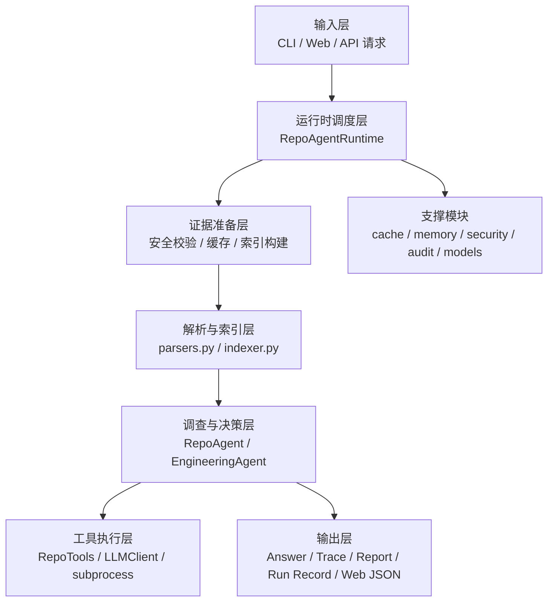
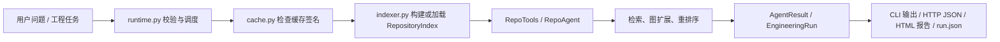
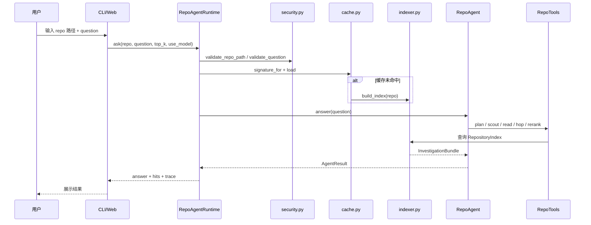

# Repo Agent 教学讲义

## 1. 项目总览

### 1.1 Repo Agent 是什么

Repo Agent 是一个面向**本地代码仓库**的 Repository Investigation Agent，也就是“仓库调查 Agent”。  
它的核心目标不是一上来就改代码，而是先回答一个更基础、更重要的问题：

> 这个问题到底应该先看哪里？证据是什么？哪些文件、函数、路由、调用链最值得优先检查？

从代码实现上看，Repo Agent 会先对仓库做静态分析，构建符号、代码块、文件事实和图关系，然后进行多阶段检索与排序，最后给出带证据、带行号、带 trace 的调查结果。如果配置了 OpenAI 兼容模型，它还可以进入工具调用式 Agent 调查；如果再进一步开启实验性的 engineering mode，它还能在受控工作区里尝试小范围修改和验证。

一句话概括：

> Repo Agent 是“写代码之前的证据层”，负责先定位、先证明、再决定后续是否编辑。

---

### 1.2 它解决了什么问题

很多人接手陌生仓库时，第一痛点不是“不会改”，而是：

- 不知道入口在哪
- 不知道相关代码分散在什么文件里
- 不知道某个接口最终落到哪个处理函数
- 不知道报错背后的调用路径
- 不知道某个页面、按钮、上传流程从哪里开始查
- 不知道应该先读后端、前端、配置还是测试

传统做法往往是：

- 用 `grep` 或 IDE 全局搜索乱搜
- 打开很多文件来回跳
- 问模型，但模型可能凭空猜
- 直接让 coding agent 改代码，但上下文并不可靠

Repo Agent 的价值就在这里：  
它把“定位问题”和“产生证据”单独做成了一层系统，让调查结果更可解释、更便宜、更可复核。

---

### 1.3 它和普通问答系统、普通代码搜索工具、普通 coding agent 的区别

| 对比对象 | 核心目标 | 典型行为 | 局限 | Repo Agent 的不同点 |
| --- | --- | --- | --- | --- |
| 普通问答系统 | 直接回答问题 | 单轮生成文本 | 容易凭空编造仓库细节 | Repo Agent 先检索真实代码证据，再回答 |
| 普通代码搜索工具 | 返回匹配文本 | 关键词搜索、grep | 不理解路由、handler、调用关系 | Repo Agent 会做符号抽取、图扩展、重排序 |
| 普通 RAG 系统 | 召回相似文本块 | 向量检索或 BM25 | 对代码结构理解有限 | Repo Agent 显式建模 route/import/call 关系 |
| 普通 coding agent | 直接编辑代码 | 看上下文、改文件、跑命令 | 可能在证据不足时就动手 | Repo Agent 默认把“先定位”放在“编辑前” |

因此，Repo Agent 的定位不是“替代 IDE”或“替代 coding agent”，而是：

> 在编辑之前，先构建一层可靠的仓库证据面。

---

### 1.4 为什么它的定位是 evidence layer，而不是直接改代码的 AI

Repo Agent 的 README、运行逻辑和模块划分都在强调同一件事：

> Evidence-first，先证据，后动作。

这背后有三层原因。

#### 第一层：工程效率

很多任务不需要改代码，只需要回答：

- 聊天接口在哪
- 页面样式在哪
- RAG 上传入口在哪
- 某个 reset 流程由谁处理

这时如果直接启用一个重型 coding agent，其实成本更高。

#### 第二层：可信度

如果系统没有先把“证据候选集”找准，就让模型直接生成修改方案，风险很大：

- 看错文件
- 修改了错误入口
- 忽略真实 handler
- 把次要文件当成主入口

Repo Agent 通过排名、图扩展、trace、报告，把“为什么是这里”展示出来。

#### 第三层：团队协作

真实团队里，很多时候需要的是：

- 给同事一个排查起点
- 给 reviewer 一个证据链
- 给答辩或 demo 一个可视化分析页面
- 给后续 coding agent 一个干净、可交接的上下文包

这就是 `report.py`、`bundle.py` 和 Web Studio 存在的意义。

---

## 2. 面向初学者的核心概念补课

这一部分非常重要。下面我们先把概念讲透，再回来看 Repo Agent 的实现，就会轻松很多。

### 2.1 什么是 Agent

#### 定义

Agent 可以理解为：

> 围绕一个目标，能够调用工具、做多步决策、根据中间结果更新下一步动作的系统。

它和“普通问答”最大的不同是，普通问答通常是：

- 输入一个问题
- 模型生成一个答案
- 结束

而 Agent 更像一个会“办事”的过程：

1. 先理解目标
2. 决定下一步做什么
3. 调用某个工具
4. 得到结果
5. 根据结果调整计划
6. 继续下一步
7. 最后再输出结论

#### 为什么需要 Agent

因为很多现实任务不是一句话能答完的，尤其是代码仓库调查：

- 先看仓库结构
- 再查入口文件
- 再读局部代码
- 再沿调用关系跳转
- 再判断证据是否充分

这本质上就是多步决策问题。

#### 在 Repo Agent 里的体现

Repo Agent 有两种“Agent 性”：

1. **无模型的确定性 Agent 化调查流程**
   - plan
   - file scout
   - code read
   - graph hop
   - rerank
   - answer

2. **有模型的 tool-calling Agent 循环**
   - 模型决定是否调用工具
   - 调用 `read_file`、`search_text`、`find_relevant_code` 等
   - 根据结果继续决策
   - 最后给出结论

所以，Agent 不一定非要靠 LangChain，也不一定非要“会改代码”。  
只要它是“围绕目标进行多步工具化决策”，它就是 Agent。

---

### 2.2 什么是 Tool Calling

#### 定义

Tool Calling 指的是：

> 模型不是直接输出最终答案，而是先输出“我要调用哪个工具、传什么参数”，系统执行后再把结果返回给模型。

例如模型说：

```json
{
  "name": "read_file",
  "arguments": {
    "path": "server.js",
    "start_line": 1,
    "end_line": 80
  }
}
```

系统执行读取文件，把文件片段返回给模型，模型再继续推理。

#### 为什么需要它

因为模型本身并不能直接访问本地仓库、也不能直接知道命令输出。  
如果不给它工具，它只能“猜”。

#### 在 Repo Agent 里的作用

在 `repo_agent/agent.py` 里，`RepoAgent._run_llm_agent()` 会：

1. 准备 `messages`
2. 准备 `tools` schema
3. 调 `LLMClient.chat(...)`
4. 检查返回里有没有 `tool_calls`
5. 如果有，就执行对应工具
6. 把工具结果作为 `tool` 消息回灌给模型
7. 继续下一轮

这就是一个非常标准、非常原生的 tool-calling agent loop。

---

### 2.3 什么是静态分析

#### 定义

静态分析是指：

> 不运行程序，只看源码本身，就去提取结构信息、依赖信息、符号信息和潜在关系。

例如：

- 这个文件定义了哪些函数
- 哪个函数调用了哪个函数
- 哪个装饰器声明了路由
- 哪些模块被 import 了

#### 为什么需要它

如果只是全文字符串搜索，你只能找到“字面上出现了什么”。  
但调查代码仓库时，我们更关心“结构”和“关系”：

- 这个接口是 route 还是普通函数？
- 这个 route 实际 handler 是谁？
- 这个文件是不是 entrypoint？
- 这个函数调用了谁？

#### 在 Repo Agent 里的作用

Repo Agent 的静态分析主要集中在 `repo_agent/parsers.py`：

- Python 用 `ast` 解析
- JavaScript/TypeScript 用正则抓取函数、class、route、handler、call
- HTML/CSS 抽取静态资源引用

它不会做编译器级别的完整语义分析，但足以支撑“仓库调查”这个目标。

---

### 2.4 什么是代码索引

#### 定义

代码索引就是：

> 把原始仓库中的源码加工成便于后续检索和排序的数据结构。

类似你给一本厚书做目录、标签、关键词和交叉引用。

#### 为什么需要它

如果每次提问都直接从零遍历仓库、重新解析、重新打分，会很慢。  
而且不同问题会反复用到同一批结构信息。

#### 在 Repo Agent 里的作用

Repo Agent 的索引由 `repo_agent/indexer.py` 构建，主要包括：

- `CodeChunk`
- `FileFact`
- `GraphEdge`
- 词项统计
- 语义特征矩阵

构建好以后会被 `cache.py` 缓存下来，后续问题可复用。

---

### 2.5 什么是代码块（chunk）

#### 定义

Chunk 就是：

> 被系统当作“检索单元”的一段代码。

在文档检索里，chunk 常常是几百字一段；在代码检索里，chunk 通常更适合作为：

- 一个函数
- 一个类
- 一个 route 定义
- 一个文件级摘要块

#### 为什么需要它

如果检索粒度太粗，例如整个文件作为单位，会导致：

- 命中范围太大
- 定位不精确
- 排序难做

如果粒度太细，例如每一行作为单位，也会丢失上下文。

#### 在 Repo Agent 里的作用

在 `build_index()` 中：

- 每个抽取出的 `Symbol` 都会变成一个 `CodeChunk`
- 每个文件还会额外生成一个 `::file` 级别的 overview chunk

这非常关键，因为它让系统既能定位到“函数级证据”，也能保留“文件级入口摘要”。

---

### 2.6 什么是符号抽取（symbol extraction）

#### 定义

符号抽取指的是：

> 从源代码中识别出具有结构意义的实体，比如函数、类、路由、handler。

#### 为什么需要它

因为开发者问的问题，往往不是“某个字符串在哪”，而是：

- 哪个函数处理了这个接口？
- 这个 route 的 handler 是谁？
- 哪个类负责这个流程？

#### 在 Repo Agent 里的作用

`parsers.py` 会把源代码抽成 `Symbol`：

- Python 函数、类
- FastAPI / Flask 风格 route
- JavaScript / Express 风格 route
- handler 名称
- 调用名列表

例如 `app.post('/api/chat', handleChat)` 会被抽成一个 route symbol：

- `name = "post_api_chat"`
- `kind = "route"`
- `handler_names = ["handleChat"]`

这就把“字符串接口”变成了“结构化证据”。

---

### 2.7 什么是路由、handler、调用关系

#### 路由是什么

路由（route）就是接口入口，例如：

```python
@app.post("/api/chat")
async def chat_endpoint(payload: dict):
    ...
```

或者：

```js
app.post('/api/chat', handleAgentStreamRequest);
```

#### handler 是什么

handler 是实际处理请求的函数，也就是“路由背后真正干活的人”。

#### 调用关系是什么

调用关系是：

> A 函数内部调用了 B 函数。

例如：

```js
async function handleAgentStreamRequest(req, res) {
  const result = await createStreamedAssistantTurn(req.body || {});
  ...
}
```

这里 `handleAgentStreamRequest -> createStreamedAssistantTurn` 就是一条调用关系。

#### 在 Repo Agent 里的作用

这些关系会进入图结构中，形成 `GraphEdge`：

- `calls`
- `imports`
- `routes_to`

这样系统就能做“图跳转”，而不只是字符串匹配。

---

### 2.8 什么是图结构 / repository graph

#### 定义

图结构由节点和边组成：

- 节点：代码块、符号、文件
- 边：调用、导入、路由指向等关系

#### 为什么需要图

因为真实仓库不是平面的文本集合，而是一个关系网络：

- route 指向 handler
- handler 调用 service
- service import 另一个模块

如果没有图，很多“主流程”“调用链”“入口到处理”的问题很难答好。

#### 在 Repo Agent 里的作用

`indexer.py` 中的 `_build_edges()` 会建立边：

- `calls`
- `imports`
- `routes_to`

后续在 `_explore_neighbors()` 里，系统会从种子命中出发，沿图关系做 hop expansion，这一步就是“graph hop”。

---

### 2.9 什么是检索（retrieval）

#### 定义

检索就是：

> 根据用户问题，从仓库中召回最相关的文件、代码块或符号。

#### 为什么需要它

仓库可能有几十、几百、几千个文件，不可能每次都全文读完。

#### 在 Repo Agent 里的作用

Repo Agent 的检索不是一步完成，而是多阶段：

1. query planning
2. 文件级粗筛
3. chunk 级精筛
4. graph expansion
5. rerank

这比“直接全量排序所有 chunk”更贴近真实调查过程。

---

### 2.10 什么是重排序（rerank）

#### 定义

重排序是：

> 在已经召回的一批候选中，再综合更多信号重新排序。

#### 为什么需要它

因为初次召回往往偏“广”，而最终答案需要“准”。

#### 在 Repo Agent 里的作用

`RepositoryIndex._rerank_multistep()` 会综合：

- 初始 chunk 分数
- 文件级 boost
- 图关系 boost
- 角色匹配
- 语言匹配
- route / function / frontend 等意图偏置

这样最后的 Top hits 更适合作为“起始阅读位置”。

---

### 2.11 什么是语义匹配 / semantic projection

#### 定义

语义匹配指：

> 用户问题和代码文本即使没有完全相同的字面词，也可能表达相近语义。

例如：

- “聊天接口” 与 `chat endpoint`
- “上传文档” 与 `ingestDocument`
- “主流程” 与 `runAgent`

#### 为什么需要它

单纯 lexical matching 很容易漏掉“说法不同但意思相近”的代码。

#### 在 Repo Agent 里的作用

Repo Agent 没有直接接入外部 embedding 服务，而是在 `indexer.py` 里自己实现了一套轻量语义投影：

1. 构造 chunk 词项矩阵
2. 做 TF-IDF 加权
3. 归一化
4. 用 `numpy.linalg.svd` 做低维 latent 表示
5. 用 query 在 latent space 中计算相似度

这就是它“默认无模型也能有一定语义能力”的关键。

---

### 2.12 什么是工作区沙箱（workspace sandbox）

#### 定义

工作区沙箱就是：

> 不直接改源仓库，而是先复制一份隔离工作区，在副本中进行修改和验证。

#### 为什么需要它

因为自动工程执行存在风险：

- 改坏代码
- 改错文件
- 覆盖用户本地状态

#### 在 Repo Agent 里的作用

在 `runtime.py` 和 `engineering.py` 中，workspace 模式会把仓库复制到：

```text
runs/<run_id>/workspace
```

然后所有自动编辑都发生在这个副本里。  
审核通过后，再通过 `apply-run` 回写到源仓库。

这就是“先隔离，再应用”的工程安全策略。

---

### 2.13 什么是运行记录（run record）

#### 定义

运行记录指：

> 一次 Agent 执行过程中产生的完整持久化状态。

#### 为什么需要它

因为工程任务往往不是一次就结束，可能要：

- 中断后继续
- 复查做过什么
- 审计哪些命令跑过
- 比较修改前后差异

#### 在 Repo Agent 里的作用

每次 engineering run 都会写入：

```text
runs/<run_id>/run.json
```

其中包含：

- `run_id`
- `task`
- `status`
- `messages`
- `trace`
- `changed_files`
- `verification`
- `diff`
- `review`

这让整个 autonomous engineering 过程可恢复、可追踪。

---

### 2.14 什么是审计日志（audit log）

#### 定义

审计日志是：

> 对关键操作做结构化记录，方便事后追踪。

#### 为什么需要它

本地 Agent 也需要回答这些问题：

- 什么时候构建了索引？
- 问了什么问题？
- 报告何时生成？
- 哪次请求失败了？

#### 在 Repo Agent 里的作用

`audit.py` 中的 `AuditLogger` 会把事件写入：

```text
logs/audit.jsonl
```

每一行是一个 JSON 事件，比如：

- `index_built`
- `ask`
- `report_generated`
- `workspace_tool`
- `engineer_apply`

这是一种典型的工程化可观测性设计。

---

## 3. 项目的整体架构

Repo Agent 可以从两个角度理解：

1. **系统分层**
2. **执行工作流**

先看系统分层。

### 3.1 系统分层视角



---

### 3.2 各层职责

#### 1. 输入层

对应模块：

- `repo_agent/__main__.py`
- `repo_agent/server.py`
- `web/index.html`
- `web/app.js`

职责：

- 接收用户输入的 repo 路径、问题、任务
- 提供 CLI 命令和 Web 操作入口
- 组织 API 请求参数

#### 2. 运行时调度层

对应模块：

- `repo_agent/runtime.py`

职责：

- 做统一入口编排
- 先校验输入
- 再加载或构建索引
- 再选择 ask / report / engineer / tool 等具体流程
- 记录审计日志

#### 3. 证据准备层

对应模块：

- `repo_agent/security.py`
- `repo_agent/cache.py`
- `repo_agent/ignore.py`
- `repo_agent/memory.py`

职责：

- 路径校验
- 问题长度限制
- top-k 限制
- 忽略生成目录
- 计算缓存签名
- 生成仓库简述

#### 4. 解析与索引层

对应模块：

- `repo_agent/parsers.py`
- `repo_agent/indexer.py`
- `repo_agent/models.py`

职责：

- 识别语言
- 解析源码
- 抽取符号
- 构建 chunk、file fact、edge
- 建立检索与排序能力

#### 5. Agent 决策层

对应模块：

- `repo_agent/agent.py`
- `repo_agent/engineering.py`
- `repo_agent/llm.py`

职责：

- 决定如何调查仓库
- 是否进入模型工具循环
- 如何多步收集证据
- 如何在工程模式下 inspect -> edit -> verify -> finish

#### 6. 输出层

对应模块：

- `repo_agent/report.py`
- `repo_agent/bundle.py`
- `repo_agent/server.py`

职责：

- 输出答案
- 输出 top hits
- 输出 trace
- 输出 HTML 报告
- 输出 evidence bundle
- 输出 run record

---

### 3.3 数据如何流动



这个数据流有一个很重要的特点：

> 所有高层行为，最终都建立在 `RepositoryIndex` 这层证据基础设施之上。

也就是说，Repo Agent 不是先有“会聊天的模型”，而是先有“可检索、可解释的仓库结构底座”。

---

### 3.4 主流程与可选扩展

#### 主流程

无模型模式下的主流程是：

1. 输入问题
2. 校验路径与参数
3. 加载或构建索引
4. 调查与排序
5. 组合答案
6. 输出 trace 与证据

#### 可选扩展

在此基础上，有三种扩展能力：

1. **LLM tool-calling 调查**
   - 在已有证据上再做工具调用式补充调查

2. **HTML 报告**
   - 把结果转成演示友好的页面

3. **Engineering mode**
   - 从“调查”扩展到“受控修改与验证”

这也是为什么我们说这个项目的产品形态是分层的，而不是“一坨 AI 代码生成器”。

---

## 4. 项目的主工作流

这一节按顺序讲“用户提一个问题后，系统到底做了什么”。

### 4.1 典型 ask 流程总图



---

### 4.2 第一步：用户输入仓库路径和问题

输入来源可以是：

- CLI：`python -m repo_agent ask ...`
- Web：`/api/ask`

在 `__main__.py` 中，`ask` 命令接收：

- `--repo`
- `--question`
- `--top-k`
- `--use-model`
- `--force-rebuild`

Web 里则由 `web/app.js` 组装 JSON 请求，发送到 `server.py`。

输入：

- 仓库路径
- 自然语言问题

输出：

- 进入运行时调度函数 `RepoAgentRuntime.ask(...)`

---

### 4.3 第二步：系统如何校验输入

在 `runtime.py` 中，`ask()` 先调用：

- `validate_repo_path()`
- `validate_question()`

#### 仓库路径校验

`security.py` 里的 `validate_repo_path()` 会检查：

1. 路径是否存在
2. 是否为目录
3. 是否在允许的根目录 `allowed_roots` 之内

这样做是为了防止系统被用来扫描任意路径。

#### 问题校验

`validate_question()` 会检查：

1. 问题不能为空
2. 长度不能超过 `max_question_chars`

默认在 `config.py` 中由环境变量控制，避免超长输入拖垮系统。

输入：

- 原始 repo path
- 原始 question

输出：

- 安全、规范化后的 repo_root 与 question

---

### 4.4 第三步：系统如何加载或构建索引

在 `RepoAgentRuntime.load_index()` 中，流程是：

1. 根据 `repo_root` 计算缓存签名
2. 先查内存缓存
3. 再查磁盘缓存
4. 如果没有命中，就调用 `build_index()`

#### 缓存签名是怎么做的

`cache.py` 里的 `IndexCache.signature_for()` 会遍历仓库文件，组合：

- 相对路径
- 修改时间
- 文件大小

再做 SHA-256 哈希。

但它会忽略：

- `.cache`
- `runs`
- `reports`
- `logs`
- `node_modules`
- 其他生成目录

这样做的意义是：

> 索引只关心“真实源码变化”，不被运行产物污染。

---

### 4.5 第四步：系统如何解析源码

如果需要构建索引，就会进入 `indexer.py` 的 `build_index()`。

它会遍历仓库文件，对每个文件做：

1. 判断是否忽略
2. 判断是否支持的语言
3. 判断是否超出文件数上限
4. 判断是否超出单文件大小上限
5. 读取文本
6. 调用 `analyze_source()`

而 `analyze_source()` 在 `parsers.py` 中会根据扩展名分流：

- `.py` -> `_analyze_python`
- `.js/.ts/...` -> `_analyze_javascript`
- `.html` -> `_analyze_html`
- `.css` -> `_analyze_css`

输出的是一个 `SourceAnalysis`：

- `language`
- `imports`
- `symbols`

---

### 4.6 第五步：系统如何构建 CodeChunk、FileFact、GraphEdge

这是索引构建的核心。

#### 1. 构建 `FileFact`

每个文件生成一个 `FileFact`，包含：

- 路径
- 语言
- 行数
- imports
- 符号名列表
- routes
- roles

这相当于“文件画像”。

#### 2. 构建 `CodeChunk`

每个 `Symbol` 生成一个 chunk，内容包括：

- chunk id
- 所属文件
- 起止行
- 代码文本
- symbol name / kind
- imports / calls / route_path / handler_names

除此之外，每个文件还会生成一个 `::file` chunk，保留文件前 140 行左右作为 overview。

#### 3. 构建 `GraphEdge`

`_build_edges()` 会根据 chunk 关系构图：

- `calls`
- `imports`
- `routes_to`

输入：

- 所有 chunk

输出：

- 图边列表

---

### 4.7 第六步：系统如何进行 query planning

当索引准备好后，Repo Agent 不会马上对所有 chunk 盲搜，而是先做 query planning。

在 `indexer.py` 中：

- `_classify_mode(query)` 先区分
  - `repository_qa`
  - `bug_localization`

- `_plan_query(query, mode)` 再生成 `QueryPlan`

`QueryPlan` 会包含：

- `mode`
- `intent`
- `focus_terms`
- `target_roles`
- `target_languages`
- `hop_budget`

例如：

- 问“网页代码在哪”
  - intent 倾向 `frontend_lookup`
  - target role 倾向 `frontend`

- 问“上传流程在哪”
  - intent 偏 flow / backend
  - hop budget 可能更高

这一步本质是在做：

> 先理解用户到底是在找页面、接口、主流程、配置、测试，还是在做 bug 定位。

---

### 4.8 第七步：如何 file scout

file scout 就是文件级粗筛。

在 `_rank_files(plan)` 中，系统会给每个 `FileFact` 打分，信号包括：

- query term 与文件 token 的匹配
- role 是否匹配
- language 是否匹配
- 是否是 entry surface
- 是否包含 routes
- 是否是前端目录

这一步的作用不是最终定位，而是先回答：

> 这次问题，最值得优先看的几份文件有哪些？

输出：

- `FileHit` 列表

---

### 4.9 第八步：如何 code read

在 `_retrieve_primary_hits(...)` 中，系统会从 file scout 选出的重点文件里进一步查看 chunk。

这里做了两件事：

1. 针对 scout 出来的文件内所有 chunk 评分
2. 同时对全局 chunk 再跑一次较广的召回，避免漏掉跨文件关键代码

chunk 评分 `_score_chunk()` 会综合：

- 词项匹配
- symbol match
- path match
- route overlap
- semantic score
- route/function/web/style/interaction 等专项 boost

输出：

- `seed_hits`
- `file_boosts`

这一步相当于：

> 从“可疑文件”进入“可疑代码片段”。

---

### 4.10 第九步：如何 graph hop

graph hop 对应 `_explore_neighbors(seed_hits, plan)`。

系统会从前几个 seed hit 出发，沿图关系往外跳：

- 正向边
- 反向边
- 限制 hop budget

每次 hop 会为邻居 chunk 增加 relation boost。

例如：

- 如果一个 route 命中了
- 它可以跳到 handler
- handler 再跳到被调用函数

这让系统可以回答：

- 最终处理函数在哪
- 上传入口之后去了哪里
- 主流程如何往下展开

---

### 4.11 第十步：如何 rerank

`_rerank_multistep()` 是最终排序阶段。

它会把这些信号合并：

- seed hit 原始分数
- file scout boost
- relation boost
- role aligned
- plan intent 偏置
- chunk 类型偏置

举例：

- 对于 API / flow 问题，function 会比无符号 overview chunk 更重要
- 对于页面样式问题，`web/styles.css` 会被特殊提升
- 对于前端交互问题，`web/app.js` 会有入口加成

输出：

- 最终 `final_hits`

---

### 4.12 第十一步：如何组成最终回答

在 `agent.py` 中，`RepoAgent.answer()` 会先得到 `InvestigationBundle`，再调用 `_compose_answer()`：

- 有中文就走 `_compose_answer_zh()`
- 否则走英文版本

回答一般包含：

- 结论
- Top evidence
- 图关系扩展
- 关键片段

如果启用模型且模型可用，还会进入 `_run_llm_agent()` 补充调查，并用模型最终组织语言。

---

### 4.13 第十二步：如何生成 trace 和 report

Trace 在 Repo Agent 中是非常重要的可解释性设计。

在 `_investigate()` 中，trace 通常包含：

1. repo memory
2. plan
3. file scout
4. code read
5. graph hop
6. final ranking
7. answer

而 `report.py` 的 `write_html_report()` 会把这些内容生成 HTML 报告，方便：

- 演示
- 调试
- onboarding
- 答辩展示

---

## 5. 为什么这个项目算 Agent

这一节非常关键。因为很多人会把“能搜代码”误认为“只是搜索工具”，把“没用 LangChain”误认为“不是 Agent”。这是不准确的。

### 5.1 Agent 的核心特征是什么

可以把 Agent 的核心特征概括为一句话：

> Agent = 围绕目标，借助工具，多步决策，并根据中间状态不断更新后续行动。

拆开看有四点：

1. **有目标**
   - 不是闲聊，而是要完成某个任务

2. **会用工具**
   - 不是只输出文本，而是调用外部能力

3. **多步决策**
   - 不是一次性给答案，而是逐步推进

4. **状态更新**
   - 前一步结果会影响下一步

Repo Agent 四点全部满足。

---

### 5.2 为什么它不只是搜索工具

普通搜索工具通常做的是：

- 输入关键词
- 返回匹配结果

Repo Agent 做的不止这些，它还会：

- 判断查询意图
- 识别目标角色和语言
- 先文件级 scout，再 chunk 级检索
- 沿图关系做 hop 扩展
- 按多种信号重排序
- 记录 trace
- 在模型模式下调用额外工具调查

所以它不只是 “search”，而是：

> search + planning + graph reasoning + evidence synthesis

---

### 5.3 它的 Agent 性体现在哪里

可以分成两层。

#### 第一层：确定性 Agent

即使不用模型，Repo Agent 也不是“死板搜索器”。  
它仍然在做一个显式调查流程：

```text
plan -> scout -> read -> hop -> rerank -> answer
```

这是一种规则驱动的 Agent 流。

#### 第二层：模型驱动 Agent

如果开启 `--use-model`，它会：

```text
观察已有证据 -> 决定是否要看目录 / 搜文本 / 读文件 / 再检索 / 验证 -> 根据结果继续 -> 最终回答
```

这已经是非常典型的 tool-calling agent。

---

### 5.4 `RepoAgent` 的核心循环是怎么工作的

在 `repo_agent/agent.py` 中，核心逻辑分两段。

#### 第一段：确定性调查

`_investigate()` 会做：

1. `repo_brief`
2. `plan`
3. `semantic_scores`
4. `scout_files`
5. `read_candidates`
6. `follow_neighbors`
7. `rerank`

这形成 `InvestigationBundle`。

#### 第二段：可选的 LLM 工具循环

`_run_llm_agent()` 会：

1. 构造 system/user messages
2. 注入种子证据和 baseline answer
3. 调用 `LLMClient.chat(..., tools=..., tool_choice="auto")`
4. 检查是否有 `tool_calls`
5. 执行工具
6. 把 observation 塞回消息历史
7. 继续迭代
8. 直到模型直接给 final answer

这就是 Agent loop。

---

### 5.5 `EngineeringAgent` 又是什么，它和普通问答有什么不同

`EngineeringAgent` 在 `repo_agent/engineering.py` 中。

它不是回答“在哪”，而是执行“做什么”。

与普通问答的不同点：

| 普通 ask 模式 | engineering mode |
| --- | --- |
| 目标是定位和解释 | 目标是调查后做受控修改 |
| 工具以阅读和搜索为主 | 工具包含读、搜、改、写、跑命令、回滚 |
| 输出是 `AgentResult` | 输出是 `EngineeringRun` |
| 不涉及文件变化 | 涉及 diff、verification、run record |

所以 EngineeringAgent 更接近“受控 coding agent”，但它仍然强调先 inspect 再 edit。

---

### 5.6 为什么不用 LangChain 也仍然是 Agent

这是一个很常见误解：

> Agent 不是某个框架的专利，Agent 是一种系统行为模式。

Repo Agent 在 `llm.py` 中直接调用 OpenAI 兼容接口，在 `agent.py` / `engineering.py` 中自己维护：

- messages
- tools
- tool_choice
- tool execution
- observation feedback
- loop control

这说明它是**原生实现的 Agent 系统**，而不是依赖 LangChain 的黑盒封装。

这恰恰是它的一个教学亮点：

> 你可以直接看到一个 Agent loop 是如何从零写出来的。

---

## 6. 技术栈详解

### 6.1 Python

#### 它是什么

Python 是一门解释型、高生产力的通用语言，特别适合：

- 快速构建工具系统
- 做文本处理
- 做静态分析
- 做本地自动化

#### 为什么适合这个项目

Repo Agent 既需要：

- 命令行
- 文件系统操作
- AST 分析
- HTTP 服务
- 子进程调用
- 数据结构组织

又不需要超高吞吐量的线上服务，因此 Python 非常适合。

#### 在项目中的角色

整个后端核心都由 Python 构成：

- CLI
- runtime
- indexer
- parsers
- agent
- server
- engineering

---

### 6.2 `ast`

#### 它是什么

`ast` 是 Python 标准库，用来把 Python 源码解析成抽象语法树。

#### 为什么适合这个项目

对于 Python 仓库调查，单纯正则不够稳定。  
`ast` 可以较可靠地识别：

- 函数
- 类
- decorator
- import
- 调用

#### 在项目中的角色

`parsers.py` 的 `_analyze_python()` 使用 `ast.parse()`，进一步提取：

- Python `Symbol`
- route decorator
- handler 对应关系
- call list

---

### 6.3 `numpy`

#### 它是什么

`numpy` 是 Python 最基础的数值计算库。

#### 为什么适合这个项目

Repo Agent 想在**不依赖外部 embedding API** 的前提下，获得一点语义匹配能力。  
这需要做：

- 向量矩阵
- 归一化
- SVD 分解

`numpy` 正适合做这些轻量数学运算。

#### 在项目中的角色

`indexer.py` 用 `numpy` 构造：

- TF-IDF matrix
- latent semantic projection
- query semantic score

这是无模型语义检索的关键基础。

---

### 6.4 `urllib.request`

#### 它是什么

`urllib.request` 是 Python 标准库，用来发 HTTP 请求。

#### 为什么适合这个项目

Repo Agent 对模型接口的需求很简单：

- POST JSON
- 读 JSON 响应

没有必要为此引入更重的第三方依赖。

#### 在项目中的角色

`llm.py` 中的 `LLMClient._post_json()` 使用 `urllib.request` 调 OpenAI 兼容接口。

这也体现了项目的一个设计倾向：

> 尽量用标准库和少量依赖，把系统保持得轻。

---

### 6.5 `http.server`

#### 它是什么

`http.server` 是 Python 标准库提供的轻量 HTTP 服务能力。

#### 为什么适合这个项目

Repo Agent 的 Web Studio 目标是：

- 本地运行
- 调试演示
- 提供几个 API

它不是高并发线上服务，因此不需要引入 Flask / FastAPI。

#### 在项目中的角色

`server.py` 用：

- `BaseHTTPRequestHandler`
- `ThreadingHTTPServer`

来提供：

- 静态文件服务
- `/api/ask`
- `/api/report`
- `/api/tools`
- `/api/engineer`
- `/api/runs`

---

### 6.6 `subprocess`

#### 它是什么

`subprocess` 用来启动外部进程、执行命令。

#### 为什么适合这个项目

Repo Agent 需要做受控验证，例如：

- `python -m pytest`
- `npm test`
- `python -m compileall .`

#### 在项目中的角色

`tools.py` 的 `run_command()` 用 `subprocess.run(...)` 执行命令，并且：

- `shell=False`
- 限制可执行命令白名单
- 限时执行

这是一种相对稳健的本地执行策略。

---

### 6.7 `pytest`

#### 它是什么

`pytest` 是 Python 中非常常用的测试框架。

#### 为什么适合这个项目

Repo Agent 是一个强调“证据可靠性”的项目，因此解析、索引、安全、静态资源解析等都值得测试。

#### 在项目中的角色

`tests/` 中用 `pytest` 验证：

- parser 是否能抽到 route / handler
- 索引是否忽略 runs / reports
- cache 签名是否忽略生成目录
- `safe_join` 是否防路径穿越
- Web 静态资源是否可解析

---

### 6.8 原生 HTML / CSS / JS

#### 它们是什么

这是最基础的前端三件套。

#### 为什么适合这个项目

Repo Agent 的 Web Studio 目标是本地演示、调试和展示，不需要复杂前端工程体系。  
直接用原生前端：

- 部署简单
- 依赖少
- 教学成本低
- 易于阅读

#### 在项目中的角色

- `web/index.html`：界面骨架
- `web/styles.css`：视觉与布局
- `web/app.js`：交互逻辑、API 调用、结果渲染

---

### 6.9 OpenAI 兼容接口

#### 它是什么

所谓 OpenAI 兼容接口，是指：

> 提供与 OpenAI Chat Completions 类似的请求格式和工具调用格式的模型服务。

#### 为什么适合这个项目

这样 Repo Agent 可以：

- 不锁死在某一个具体模型服务上
- 只要兼容 `chat/completions` 和 tools 协议就可接入

#### 在项目中的角色

`llm.py` 中：

- 读 `OPENAI_API_KEY`
- 读 `OPENAI_BASE_URL`
- 读 `OPENAI_MODEL`
- 直接 POST 到 `/chat/completions`

这也是为什么项目强调：

> 它不是 LangChain 项目，而是自己直连 OpenAI 兼容接口的 Agent 系统。

---

## 7. 关键模块详解

这一节按文件逐个解释。

### 7.1 `repo_agent/__main__.py`

#### 文件职责

CLI 入口，负责暴露用户命令。

#### 核心函数

- `main()`
- `run_eval(...)`
- `_print_engineering_result(...)`

#### 输入输出

输入：

- 命令行参数

输出：

- 终端文本
- 或 JSON 结果

#### 与其他模块的关系

它几乎不做业务逻辑，主要负责把参数转给 `RepoAgentRuntime`。

#### 为什么必要

因为一个“本地仓库调查工具”最自然的第一入口就是 CLI。

---

### 7.2 `repo_agent/runtime.py`

这是整个项目最值得先读的模块之一。

#### 文件职责

它是**统一运行时调度器**，负责把所有能力编排起来。

#### 核心类

- `RepoAgentRuntime`

#### 关键方法

- `load_index()`
- `ask()`
- `generate_report()`
- `engineer()`
- `resume_engineering_run()`
- `apply_engineering_run()`
- `workspace_tool()`
- `startup_hints()`
- `repo_memory()`
- `health()`

#### 输入输出

输入：

- repo path
- question 或 task
- top_k
- use_model
- execution_mode

输出：

- `RepositoryIndex`
- `AgentResult`
- report 路径
- engineering run 数据

#### 和其他模块的关系

它向下调用：

- `security.py`
- `cache.py`
- `indexer.py`
- `agent.py`
- `engineering.py`
- `report.py`
- `tools.py`
- `audit.py`

#### 为什么这个模块必要

因为如果没有运行时层，CLI、Web、report、engineering 各自都要重复写一遍：

- 路径校验
- 索引加载
- 缓存策略
- 审计日志

`runtime.py` 的价值就在于“统一编排、统一安全、统一状态管理”。

你可以把它看作整个系统的**应用服务层**。

---

### 7.3 `repo_agent/indexer.py`

这是第二个最核心模块。

#### 文件职责

负责：

- 构建仓库索引
- 维护检索能力
- 做查询规划
- 做语义投影
- 做图扩展
- 做多阶段排序

#### 核心类

- `RepositoryIndex`

#### 关键函数

- `build_index(...)`
- `tokenize(...)`
- `expand_query_terms(...)`
- `detect_file_roles(...)`
- `_build_edges(...)`
- `_plan_query(...)`
- `_rank_files(...)`
- `_retrieve_primary_hits(...)`
- `_explore_neighbors(...)`
- `_rerank_multistep(...)`
- `_semantic_scores(...)`

#### 输入输出

输入：

- 仓库路径
- 文件内容
- 用户 query

输出：

- `RepositoryIndex`
- `InvestigationBundle`
- 各类中间检索结果

#### 与其他模块的关系

- 上游依赖 `parsers.py` 产出 `SourceAnalysis`
- 下游被 `tools.py` 和 `agent.py` 调用

#### 为什么必要

这个模块是 Repo Agent 的“算法核心”。  
如果没有它，项目就退化成：

- 只读文件
- 只做字符串搜索
- 没有图结构
- 没有 rerank

也就失去了“evidence-first investigation system”的灵魂。

---

### 7.4 `repo_agent/parsers.py`

#### 文件职责

做多语言源码解析与符号抽取。

#### 核心函数

- `detect_language(...)`
- `analyze_source(...)`
- `_analyze_python(...)`
- `_analyze_javascript(...)`
- `_analyze_html(...)`
- `_analyze_css(...)`

#### 输入输出

输入：

- 文件路径
- 文件文本

输出：

- `SourceAnalysis`
  - language
  - imports
  - symbols

#### 与其他模块的关系

它是 `indexer.py` 的上游。

#### 为什么必要

如果没有 parser 层，索引器就只能看原始文本，无法知道：

- 哪是函数
- 哪是 class
- 哪是 route
- route 连到哪个 handler

因此它是“从源码文本进入结构世界”的桥梁。

---

### 7.5 `repo_agent/agent.py`

#### 文件职责

负责“调查型 Agent”的主流程与可选模型循环。

#### 核心类

- `RepoAgent`

#### 关键方法

- `answer(...)`
- `_investigate(...)`
- `_run_llm_agent(...)`
- `_execute_agent_tool(...)`
- `_compose_answer(...)`
- `_tool_schemas(...)`

#### 输入输出

输入：

- 用户 query
- top_k
- use_model

输出：

- `AgentResult`

#### 与其他模块的关系

- 使用 `RepoTools` 执行调查动作
- 使用 `LLMClient` 连接模型
- 基于 `RepositoryIndex` 的检索能力

#### 为什么必要

因为“索引器”只会检索，“工具”只会执行动作，真正把这些拼成“调查任务”的，是 `RepoAgent`。

这个模块特别适合教学，因为它展示了：

- 如何先做 deterministic baseline
- 如何再叠加 LLM tool-calling
- 如何保留 trace 和 evidence

---

### 7.6 `repo_agent/tools.py`

#### 文件职责

把仓库能力封装成一组可调用工具。

#### 核心类

- `RepoTools`

#### 关键方法

- `repo_brief()`
- `scout_files()`
- `read_candidates()`
- `follow_neighbors()`
- `rerank()`
- `list_directory()`
- `search_text()`
- `read_file()`
- `replace_text()`
- `write_file()`
- `run_command()`
- `startup_hints()`
- `infer_verification_command()`

#### 输入输出

输入：

- 仓库相对路径
- 搜索词
- 命令
- query

输出：

- 目录列表
- 文件片段
- 匹配行
- 命令结果
- 检索结果

#### 与其他模块的关系

它一头连接 `RepositoryIndex`，一头被 `RepoAgent` 和 `EngineeringAgent` 调用。

#### 为什么必要

工具层的作用是把“能力”与“决策”分离：

- Agent 决定“做什么”
- Tools 负责“怎么做”

这是 Agent 系统设计里的一个基本原则。

---

### 7.7 `repo_agent/llm.py`

#### 文件职责

负责直连 OpenAI 兼容模型接口。

#### 核心类

- `LLMResponse`
- `LLMClient`

#### 关键方法

- `LLMClient.from_env(...)`
- `chat(...)`
- `synthesize(...)`
- `_post_json(...)`

#### 输入输出

输入：

- messages
- tools
- tool_choice

输出：

- 模型 message
- 原始响应 JSON

#### 与其他模块的关系

- 被 `RepoAgent` 用于调查回答
- 被 `EngineeringAgent` 用于工程执行

#### 为什么必要

因为项目明确支持“无模型 baseline”和“有模型增强”两种形态。  
`llm.py` 就是这个边界层。

它也很有教学意义，因为你能直接看到一个最小但完整的 OpenAI-compatible adapter 是怎么写的。

---

### 7.8 `repo_agent/engineering.py`

这是第三个必须重点读的模块。

#### 文件职责

实现实验性的 autonomous engineering loop。

#### 核心类

- `EngineeringRun`
- `EngineeringAgent`

#### 关键方法

- `EngineeringAgent.run(...)`
- `_execute_tool(...)`
- `_initial_messages(...)`
- `_find_relevant_code(...)`
- `_snapshot_file(...)`
- `_revert_file(...)`
- `_review_run(...)`
- `_plan_run(...)`
- `create_workspace_copy(...)`
- `new_run_id(...)`

#### 输入输出

输入：

- task
- max_steps
- execution_mode

输出：

- `EngineeringRun`

#### 与其他模块的关系

- 依赖 `RepoTools` 做读写和命令执行
- 依赖 `LLMClient` 做 planner / actor / reviewer
- 由 `runtime.py` 管理 run 的创建、恢复、应用

#### 为什么必要

因为项目不仅想证明“能定位”，还想实验性地探索：

> 在 evidence-first 的前提下，能不能做受控、小范围、可追踪的自动工程执行？

它不是项目主定位，但它是一个很好的扩展层。

---

### 7.9 `repo_agent/server.py`

#### 文件职责

提供本地 Web Studio 的 HTTP 服务。

#### 核心函数

- `serve(...)`
- `_serialize_result(...)`
- `_resolve_static_dir(...)`

#### 输入输出

输入：

- HTTP GET / POST 请求

输出：

- JSON API 响应
- 静态文件
- HTML 报告文件

#### 与其他模块的关系

- 内部持有 `RepoAgentRuntime`
- 调用 runtime 暴露统一能力
- 给前端 `web/app.js` 提供 API

#### 为什么必要

CLI 对开发者很方便，但教学、演示、答辩、调试时，网页界面更直观。  
这就是 Web Studio 的价值。

---

### 7.10 `repo_agent/report.py`

#### 文件职责

把调查结果转成独立的 HTML 报告。

#### 关键函数

- `write_html_report(...)`
- `_render_hit_card(...)`
- `_build_graph_svg(...)`

#### 作用

将：

- answer
- repo stats
- top hits
- trace
- graph slice

汇总成一个可分享页面。

#### 为什么必要

因为调查结果不仅要“对”，还要“能展示、能复核、能交接”。

---

### 7.11 `repo_agent/cache.py`

#### 文件职责

索引缓存与签名校验。

#### 核心类

- `IndexCache`

#### 为什么必要

静态分析与索引构建虽然不算很重，但每次都重建仍然浪费时间。  
缓存使系统更适合作为日常本地工具。

---

### 7.12 `repo_agent/security.py`

#### 文件职责

做最核心的输入安全与路径安全控制。

#### 关键函数

- `validate_repo_path(...)`
- `validate_question(...)`
- `clamp_top_k(...)`
- `safe_join(...)`

#### 为什么必要

任何能读文件、跑命令、写报告、做工程执行的本地 Agent，都必须先解决边界问题。

---

### 7.13 `repo_agent/memory.py`

#### 文件职责

把仓库压缩成一个简明的“repo memory”。

#### 关键函数

- `build_repo_memory(...)`
- `render_repo_brief(...)`

#### 为什么必要

因为不管是 deterministic flow 还是 LLM mode，都需要一个低成本的“仓库摘要”，帮助系统快速形成上下文。

---

### 7.14 `repo_agent/models.py`

#### 文件职责

定义核心数据结构。

#### 为什么必要

清晰的数据模型决定了：

- 索引怎么表示
- 检索怎么流动
- 结果怎么组合
- trace 怎么记录

这相当于整个项目的数据合同层。

---

### 7.15 `web/index.html`、`web/app.js`、`web/styles.css`

#### `index.html`

定义页面骨架：

- repo 输入框
- 问题框
- 调查按钮
- engineering 按钮
- tab 视图
- inspector

#### `app.js`

定义交互逻辑：

- 调用 `/api/ask`
- 调用 `/api/report`
- 调用 `/api/tools`
- 调用 `/api/engineer`
- 渲染 evidence、trace、runs

#### `styles.css`

定义视觉风格与布局，使演示更像“可答辩的产品”，而不是裸页面。

---

### 7.16 `tests/` 与 `examples/`

#### `tests/`

用来验证解析、索引、安全与服务器资源行为。

#### `examples/`

提供简单可复现的 demo 仓库：

- `simple_agent_app`
- `simple_fastapi_app`
- `simple_rag_app`

它们既是演示数据，也是评测数据来源。

---

## 8. 数据结构讲解

这一节非常重要，因为 Repo Agent 的思路很大程度上体现在数据结构设计上。

### 8.1 `Symbol`

定义位置：`models.py`

字段：

| 字段 | 含义 |
| --- | --- |
| `name` | 符号名 |
| `kind` | 符号类型，如 `function` / `class` / `route` |
| `start_line` | 起始行 |
| `end_line` | 结束行 |
| `calls` | 调用到的名称列表 |
| `route_path` | 路由路径 |
| `handler_names` | route 对应的 handler 名称 |

为什么这样设计：

- route 和 function 用统一结构表示
- 方便后续直接转成 chunk
- 同时携带结构信息和关系线索

生命周期：

源码解析时产生，随后被 `build_index()` 消化为 `CodeChunk`。

---

### 8.2 `CodeChunk`

字段：

| 字段 | 含义 |
| --- | --- |
| `chunk_id` | 唯一 ID，例如 `server.js::3` |
| `repo_root` | 仓库根路径 |
| `relpath` | 相对路径 |
| `language` | 语言 |
| `text` | 代码文本 |
| `start_line` / `end_line` | 行号范围 |
| `symbol_name` | 对应符号名 |
| `symbol_kind` | 符号类型 |
| `metadata_tokens` | 路径/符号/route 的额外 token |
| `imports` | import 列表 |
| `calls` | 调用列表 |
| `route_path` | 路由路径 |
| `handler_names` | handler 列表 |

为什么这样设计：

- 它既是检索单元，也是证据单元
- 一个 chunk 就足以回答“看哪里”
- 同时保留文本、结构、关系三类信息

生命周期：

索引构建时生成，后续参与打分、图扩展、报告展示、Agent 输出。

---

### 8.3 `FileFact`

字段：

- `relpath`
- `language`
- `line_count`
- `imports`
- `symbol_names`
- `routes`
- `roles`

为什么这样设计：

- 文件级粗筛需要“文件画像”
- 没必要把整个文件全文纳入粗筛

生命周期：

索引时生成，用于 file scout 与 repo overview。

---

### 8.4 `GraphEdge`

字段：

- `source`
- `target`
- `label`
- `weight`

含义：

- source chunk 到 target chunk 的一条关系

为什么这样设计：

- label 区分关系种类
- weight 区分关系强弱

例如：

- `routes_to` 会比普通 `imports` 更强

生命周期：

由 `_build_edges()` 生成，用于 graph hop 与报告图谱展示。

---

### 8.5 `RetrievalHit`

字段：

- `chunk`
- `score`
- `matched_terms`
- `reasons`

为什么这样设计：

- 不只返回命中了什么
- 还要返回“为什么命中”

这就是 evidence-first 的关键：  
证据不仅是结果，还包括理由。

生命周期：

检索阶段不断被创建、替换、重排序，最终进入 answer/report。

---

### 8.6 `InvestigationBundle`

字段：

- `mode`
- `focus_terms`
- `seed_hits`
- `final_hits`
- `graph_edges`
- `trace`

为什么这样设计：

- 它把“一次调查”的中间状态打包起来
- 方便 answer 组合
- 方便报告输出
- 方便 handing off 给模型

生命周期：

由 `_investigate()` 生成，随后被 `RepoAgent.answer()` 消费。

---

### 8.7 `AgentResult`

字段：

- `mode`
- `query`
- `answer`
- `hits`
- `trace`
- `report_path`
- `model_name`
- `repo_brief`

为什么这样设计：

- 把“最终对外输出”集中在一个对象里
- CLI、Web、report 都能统一消费

生命周期：

由 ask 流程最终生成，对外输出。

---

### 8.8 `EngineeringRun`

字段较多，核心有：

- `run_id`
- `repo_root`
- `task`
- `status`
- `model`
- `run_path`
- `source_repo_root`
- `workspace_root`
- `execution_mode`
- `plan`
- `answer`
- `review`
- `changed_files`
- `verification`
- `trace`
- `messages`
- `diff`

为什么这样设计：

工程执行不是一次性问答，它需要持久状态：

- 可以恢复
- 可以审计
- 可以查看 diff
- 可以确认是否已 apply

生命周期：

run 创建时初始化，执行过程中不断持久化，结束后保存在 `runs/<id>/run.json`。

---

## 9. 检索与排序逻辑详解

这一节要重点理解：  
Repo Agent 绝对不是简单 grep。

### 9.1 从简单到复杂理解检索

先想象最简单版本：

```text
用户问题 -> 拆词 -> 在所有文件全文搜索 -> 返回包含关键词的行
```

这就是 grep 思路。

Repo Agent 在这个基础上逐级增强成：

1. query planning
2. file scout
3. chunk retrieval
4. semantic projection
5. graph expansion
6. rerank

---

### 9.2 如何先进行 query planning

`_plan_query()` 的作用不是“回答问题”，而是先决定：

- 我在找什么类型的问题
- 重点应该看哪些角色文件
- 是否要偏向某种语言
- 允许跳几层关系

这一步像医生先分诊，而不是直接开药。

---

### 9.3 如何做文件级粗筛

文件级粗筛的意义是：

> 先缩小阅读范围。

File scout 看的是 `FileFact`，不是具体函数。  
它适合回答：

- 哪些文件像前端入口？
- 哪些文件像 API 层？
- 哪些文件带 route？
- 哪些文件像 entrypoint？

这样做可以显著减少后续 chunk 排序的噪声。

---

### 9.4 如何做 chunk 级检索

进入重点文件后，系统对 chunk 进行更细的打分。

信号包括：

- lexical overlap
- symbol overlap
- path overlap
- route overlap
- semantic score
- intent-specific boosts

例如问“聊天接口在哪”：

- `post_api_chat` 这样的 route symbol 会得到很高加权

例如问“页面样式在哪”：

- `web/styles.css` 会得到 CSS 相关 boost

---

### 9.5 如何引入 graph expansion

graph expansion 的直觉是：

> 有时候最相关答案并不直接命中 query 词，但它与已命中的代码关系很近。

例如：

- 你搜到 route
- 但真正逻辑在 handler 里

又例如：

- 你搜到上传入口
- 但真正核心逻辑在 `rag-store.js` 的 `retrieve` 或 `ingestDocument`

graph hop 就是为了从入口跳到核心执行点。

---

### 9.6 如何做 lexical + semantic + relation 的综合排序

最终排序不是由单一分数决定，而是混合多路信号：

```text
总分 ≈ 词项匹配 + 语义匹配 + 文件级 boost + 图关系 boost + 角色/语言/意图偏置
```

这样设计有三个好处：

1. **保证召回**
   - lexical 命中强

2. **弥补表达差异**
   - semantic 能抓同义表达

3. **保证结构正确**
   - graph relation 能从入口跳到真实实现

这也是 Repo Agent 定位能力比简单文本搜索强的根本原因。

---

### 9.7 为什么这样设计可以提高定位能力

因为开发者的问题有三类信息：

1. **字面信息**
   - chat、upload、reset、style

2. **结构信息**
   - route、handler、entry、flow

3. **仓库角色信息**
   - frontend、backend、config、tests

Repo Agent 的检索设计，恰好把这三类信息都显式建模了。

这就是它“先定位，再决定是否改代码”的技术基础。

---

## 10. 工具调用与模型接入机制

### 10.1 `llm.py` 是如何直接调用 OpenAI 兼容接口的

`LLMClient` 的设计很直白：

1. `from_env()` 读取 `.env` 和环境变量
2. 检查：
   - `OPENAI_API_KEY`
   - `OPENAI_BASE_URL`
   - `OPENAI_MODEL`
3. 组织 `payload`
4. POST 到 `/chat/completions`

关键点在 `chat()`：

- `messages`
- `tools`
- `tool_choice`
- `temperature`

这些都直接进请求体，没有任何框架中转。

---

### 10.2 为什么它不是 LangChain

因为这里没有：

- LangChain AgentExecutor
- LangGraph
- Chain abstractions
- PromptTemplate runtime machinery

而是自己写：

- 消息历史
- 工具 schema
- 工具执行分发
- 观察回灌
- 循环上限控制

这让系统更透明，也更适合教学。

---

### 10.3 `messages / tools / tool_choice` 是怎么组织的

在 `RepoAgent._run_llm_agent()` 中：

- `messages` 是消息历史
- `tools` 来自 `_tool_schemas()`
- `tool_choice="auto"` 表示让模型自主决定是否调用工具

消息历史通常包括：

1. system：告诉模型它是 Repo Agent
2. user：给出 repo root、问题、repo brief、种子证据、baseline answer
3. assistant：模型中间思考或工具调用请求
4. tool：工具执行结果

这就是标准的工具调用对话结构。

---

### 10.4 `RepoAgent` 的工具调用循环是怎么做的

简化后可以写成：

```python
for turn in range(8):
    response = llm.chat(messages, tools=tools, tool_choice="auto")
    if no_tool_calls:
        return final_answer
    for tool_call in tool_calls:
        observation = execute_tool(...)
        messages.append(tool_observation)
```

这里有几个工程细节值得注意：

- 限制最大轮数，防止无限循环
- 每轮最多处理少量工具调用
- observation 会被压缩成 JSON 文本
- 如果最后还在反复调工具，会强制让模型停止并输出答案

这说明作者在做的是“可控 Agent loop”，而不是无限自治黑盒。

---

### 10.5 模型能调用哪些工具

在 `agent.py` 中，模型可调用：

- `repo_brief`
- `find_relevant_code`
- `list_directory`
- `search_text`
- `read_file`
- `startup_hints`
- `verify_project`

这些工具覆盖了三类能力：

1. 仓库概览
2. 代码调查
3. 受限验证

这套工具设计非常贴合“investigation agent”定位。

---

### 10.6 工具结果如何反馈回模型

执行工具后，系统会构造一条 `role = "tool"` 的消息，内容是 observation JSON。

例如：

```json
{
  "path": "server.js",
  "start_line": 1,
  "end_line": 40,
  "content": "app.post('/api/chat', ...)"
}
```

模型收到这个结果后，就能继续决定：

- 是否再读附近代码
- 是否再查 handler
- 是否足够回答

这就是“状态更新”的体现。

---

### 10.7 为什么这种方式比单轮问答更像 Agent

因为单轮问答只有：

```text
question -> answer
```

而这里是：

```text
question -> 初始证据 -> 模型决定工具 -> 工具反馈 -> 再决策 -> 最终回答
```

这个中间过程才是 Agent 的灵魂。

---

## 11. Engineering Mode 详解

### 11.1 它和普通 ask 模式有什么区别

普通 ask 模式的产物是：

- 结论
- 证据
- trace

Engineering mode 的产物则是：

- 调查
- 修改
- 验证
- diff
- run record
- reviewer feedback

前者是“看哪里”，后者是“做点什么”。

---

### 11.2 什么是 workspace 模式

workspace 模式就是：

> 不直接改源仓库，而是在 `runs/<run_id>/workspace` 的副本里动手。

这在 `runtime.py` 中通过：

- 生成 `run_id`
- `create_workspace_copy(...)`

来完成。

---

### 11.3 为什么要做 `runs/<run_id>/workspace`

因为自动修改要避免两个问题：

1. 直接污染用户仓库
2. 很难回溯一次 run 到底改了什么

把工作区放在 run 目录下有三个好处：

- run 与 workspace 一一对应
- diff / trace / run.json 都集中保存
- 应用到源仓库前可以人工审查

---

### 11.4 它如何 inspect -> edit -> verify -> finish

`EngineeringAgent` 的工具集合天然对应这个流程：

#### inspect

- `repo_brief`
- `find_relevant_code`
- `list_directory`
- `search_text`
- `read_file`

#### edit

- `replace_text`
- `write_file`

#### verify

- `run_command`
- `git_status`
- `diff_summary`

#### repair / rollback

- `revert_file`

#### finish

- `finish`

这其实就是一个很清晰的工程执行状态机。

---

### 11.5 为什么这部分是“受控工程执行”

因为它并不是放任模型随便做任何操作，而是受控在多个层面：

- 工具白名单
- 命令白名单
- `shell=False`
- 文件快照
- 支持 revert
- 有 max step
- 有 workspace 模式
- 有 run.json 持久化
- `apply-run` 需要显式确认

所以它不是开放式自治，而是**带护栏的自动化工程执行**。

---

### 11.6 `apply-run` 是做什么的

`apply-run` 用于：

> 把 workspace 副本中确认过的改动同步回源仓库。

`runtime.py` 中的 `apply_engineering_run()` 会：

1. 检查 `confirm=True`
2. 检查 run 必须是 workspace 模式
3. 检查 workspace 路径必须在 `runs_dir` 下
4. 按 changed_files 逐个复制或删除源文件
5. 更新 `run.json`
6. 追加 trace

这是一种典型的“两阶段提交”思路：

- 第一阶段：在沙箱里改
- 第二阶段：确认后应用

---

### 11.7 它如何保证安全性和可追踪性

工程模式的安全性主要来自：

- safe path
- workspace copy
- command allow-list
- shell=False
- snapshot/revert
- diff tracking
- audit log
- run record

可追踪性主要来自：

- `trace`
- `verification`
- `changed_files`
- `diff`
- `messages`
- `review`

这说明作者并没有把 engineering mode 当成“炫技功能”，而是认真考虑过工程责任边界。

---

## 12. Web Studio 详解

### 12.1 为什么这个项目除了 CLI 还需要网页界面

CLI 适合开发者，但网页界面对以下场景更友好：

- 演示
- onboarding
- 课堂讲解
- 答辩展示
- 调试 trace
- 对比 evidence cards

很多时候，“能不能一眼看懂调查过程”比“能不能在命令行跑起来”更重要。

---

### 12.2 `server.py` 提供了哪些接口

主要接口包括：

- `GET /api/health`
- `GET /api/map`
- `GET /api/startup`
- `GET /api/runs`
- `GET /api/runs/<run_id>`
- `POST /api/index`
- `POST /api/ask`
- `POST /api/report`
- `POST /api/engineer`
- `POST /api/engineer/resume`
- `POST /api/runs/apply`
- `POST /api/tools`

此外还提供：

- `/static/*` 静态资源
- `/reports/*` 报告文件

---

### 12.3 `web/app.js` 负责什么

`app.js` 是前端控制中心，负责：

- 页面启动时拉健康状态和 runs
- 发送 ask 请求
- 发送 report 请求
- 发送 engineering 请求
- 发送工具操作请求
- 渲染答案
- 渲染证据列表
- 渲染 trace
- 渲染 repo map
- 渲染 runs 列表

可以把它理解为一个非常轻量的前端应用状态管理器。

---

### 12.4 用户在网页里可以做哪些事情

根据 `index.html` 和 `app.js`，用户可以：

- 输入仓库路径
- 输入调查问题
- 切换是否启用 AI 增强
- 发起分析
- 发起 engineering task
- 选择 local / workspace 模式
- 查看结论页
- 查看证据页
- 查看仓库 map
- 使用工具面板列目录、读文件、搜文本、跑受限命令
- 查看 runs
- 打开或应用某次 workspace run
- 生成并预览 HTML 报告

---

### 12.5 为什么这个界面有助于演示、调试和答辩展示

因为它把抽象的调查过程变成了可视化对象：

- 结论
- 证据卡片
- trace 卡片
- map 概览
- report iframe
- run 面板

尤其对于教学和答辩，Web Studio 比 CLI 更容易体现：

- 这个项目不是单轮聊天
- 它有完整流程
- 它有证据排序
- 它有 trace
- 它有工程模式

---

## 13. 安全设计与工程化

这一节非常重要。很多人以为“本地工具就不用管安全”，这是错误的。

### 13.1 路径校验

`validate_repo_path()` 会保证：

- 路径存在
- 是目录
- 位于允许根目录之内

解决的问题：

- 防止任意访问用户机器上的其他目录

---

### 13.2 `safe_join`

`safe_join(base_dir, relative_path)` 会把相对路径拼接后再检查：

- 最终 resolved 路径是否仍然在 base_dir 内

解决的问题：

- 路径穿越，例如 `../outside.py`

这是本地文件工具最基本但最关键的安全措施之一。

---

### 13.3 `allowed_roots`

在 `config.py` 中，系统维护允许访问的根目录：

- workspace root
- project root
- 可选额外 roots

解决的问题：

- 缩小 Agent 可访问的本地范围

---

### 13.4 受限命令执行

`tools.py` 中定义了 `SAFE_COMMANDS`，只允许诸如：

- `python`
- `py`
- `pytest`
- `node`
- `npm`
- `uv`
- `cargo`
- `go`

解决的问题：

- 防止模型随便执行任意系统命令

---

### 13.5 `shell=False`

`subprocess.run(..., shell=False)` 意味着：

> 命令不会通过 shell 展开执行。

这样可以减少：

- shell 注入风险
- 不可控重定向/拼接行为

---

### 13.6 忽略 generated/cache/runs/reports 目录

`ignore.py` 明确忽略：

- `.cache`
- `runs`
- `reports`
- `logs`
- `node_modules`
- 其他生成目录

解决的问题：

- 索引被生成产物污染
- cache 签名误判
- 调查结果命中“自己生成的东西”

这对 evidence-first 非常重要，因为证据必须来自真实源码，而不是运行垃圾。

---

### 13.7 question 长度限制

通过 `max_question_chars` 限制问题长度。

解决的问题：

- 防止输入过大
- 限制前端/后端处理压力
- 避免异常 prompt 污染系统

---

### 13.8 top-k 限制

`clamp_top_k()` 会限制 top-k 范围。

解决的问题：

- 防止一次性取太多结果
- 控制响应大小和排序成本

---

### 13.9 cache 签名机制

`IndexCache.signature_for()` 用源码文件路径、mtime、size 计算签名。

解决的问题：

- 判断何时需要重建索引
- 避免过期缓存

同时忽略生成目录，保证签名只反映真实代码变更。

---

### 13.10 audit log

`AuditLogger` 把关键事件写入 JSONL。

解决的问题：

- 追溯系统做过什么
- 分析失败请求
- 记录调查与工程动作

---

### 13.11 run record

工程模式把完整执行状态写入 `run.json`。

解决的问题：

- 可恢复
- 可审计
- 可 review
- 可 apply

---

### 13.12 测试和评测

测试保证基础功能不坏，评测保证定位效果不退化。  
对一个“调查工具”来说，这比花哨的 demo 更重要。

---

### 13.13 为什么一个本地 Agent 工具也需要这些设计

因为它依然具备高权限能力：

- 读文件
- 跑命令
- 写文件
- 复制工作区
- 暴露 HTTP 接口

只要具备这些能力，就必须考虑：

- 边界
- 可追踪
- 可回滚
- 可验证

这正是一个“工程化 Agent”与“玩具脚本”之间的区别。

---

## 14. 测试与评测

### 14.1 `tests/` 里大致覆盖哪些方面

从当前仓库看，测试覆盖了这些点：

- `test_parsers.py`
  - JS route + handler 抽取
  - Python FastAPI route 抽取

- `test_indexing.py`
  - 索引忽略 `runs/` 与 `reports/`
  - cache 签名忽略生成目录

- `test_security.py`
  - `safe_join` 阻止路径穿越
  - `safe_join` 允许仓库内部路径

- `test_server_assets.py`
  - Web 静态资源目录解析

这些测试虽然不算大而全，但覆盖了这个项目最核心的几个稳定性点。

---

### 14.2 `eval_cases.json` 的作用

`repo_agent/eval_cases.json` 是内置评测集。

它描述了一批问题，以及期望命中的：

- `expected_path`
- 可选的 `expected_symbol_contains`

例如：

- 聊天接口定位
- RAG 上传入口定位
- FastAPI route 定位
- Web 页面、交互、样式文件定位

这使得系统能对“定位质量”做可重复评估。

---

### 14.3 Top-1 / Top-3 / MRR 是什么意思

#### Top-1 Accuracy

Top-1 表示：

> 正确答案是否排在第 1 位。

#### Top-3 Accuracy

Top-3 表示：

> 正确答案是否出现在前 3 个结果里。

#### MRR

MRR = Mean Reciprocal Rank，平均倒数排名。

如果正确答案排第：

- 1 名 -> 得分 1
- 2 名 -> 得分 1/2
- 3 名 -> 得分 1/3
- 没命中 -> 0

最后对所有 case 求平均。

MRR 越高，说明正确结果平均排得越靠前。

---

### 14.4 为什么评测对这个项目重要

因为 Repo Agent 的核心承诺不是“能写出多漂亮的答案”，而是：

> 能否把正确的证据排到前面。

没有评测，就无法回答这些问题：

- 检索是不是退化了
- 新规则有没有误伤
- 图扩展是否提高了定位
- Web 相关问题是否能稳定位到 `web/` 目录

---

### 14.5 这个项目的“好”应该如何衡量

衡量维度应该包括：

1. **定位质量**
   - Top-1 / Top-3 / MRR

2. **证据可解释性**
   - 是否给出 matched terms / reasons / trace

3. **调查成本**
   - 无模型是否可用
   - 索引是否可缓存

4. **工程可控性**
   - workspace 模式
   - run record
   - apply-run

5. **安全边界**
   - 路径校验
   - 命令限制
   - shell=False

这与传统 coding agent 的评价指标非常不同。

---

## 15. 从零搭建这个项目的思路

这一节非常关键，因为它帮助你理解：  
这个项目不是“突然长出来”的，而是可以按很合理的工程顺序逐步搭建。

### 15.1 第一步：先确定产品定位

最先要想清楚的不是“接哪个模型”，而是：

> 我要解决什么问题？

Repo Agent 的定位非常清楚：

- 不先追求改代码
- 先做仓库调查与定位
- 强调 evidence-first

这一步决定了后面整个技术路线。

---

### 15.2 第二步：先做 parser，而不是先接模型

为什么？

因为如果你连：

- 函数
- 类
- route
- handler
- import
- call

都抽不出来，后面所有“智能定位”都会很虚。

所以合理顺序一定是：

1. 先把源码结构读懂
2. 再想怎么检索

这就是为什么 `parsers.py` 是底层基础。

---

### 15.3 第三步：再做 indexer

有了 parser 后，下一步就是把结构组织成检索友好的索引：

- `FileFact`
- `CodeChunk`
- `GraphEdge`

为什么先做 indexer 再做 Agent？

因为没有索引，Agent 没有“可操作的知识底座”。

Agent 不该直接面对原始仓库全文，而应该面对已经整理好的仓库表示层。

---

### 15.4 第四步：先做 deterministic baseline

这一步非常体现架构眼光。

为什么要先有无模型 baseline？

因为这样你可以先验证：

- parser 是否有效
- 索引是否有价值
- 检索规则是否合理
- 图扩展是否能提升定位

如果一开始就接大模型，很多效果好坏会被模型能力掩盖，很难知道问题到底出在哪层。

Repo Agent 先把 deterministic investigation 流跑通，是非常正确的工程顺序。

---

### 15.5 第五步：补上缓存、忽略规则和安全边界

当 baseline 能工作后，就要让它真正“可日用”：

- cache
- ignore generated dirs
- safe path
- top-k 限制
- question 长度限制

这一步让项目从“实验脚本”变成“本地工具”。

---

### 15.6 第六步：再接 OpenAI 兼容模型

此时再加模型才合理，因为：

- 仓库结构底座已经有了
- 无模型结果可当 baseline
- tool set 已经存在

所以模型不是基础，而是增强层。  
这也是 Repo Agent 架构很成熟的地方。

---

### 15.7 第七步：再做工具调用 Agent 循环

接模型不等于做完 Agent。  
下一步要做的是：

- 定义工具 schema
- 模型选择工具
- 系统执行工具
- observation 回灌
- 控制循环终止

这一步把“模型增强”升级成了真正的 Agent。

---

### 15.8 第八步：增加报告与 Web 展示

为什么 Web 和 report 要放后面？

因为它们依赖前面所有核心能力都稳定：

- answer
- hits
- trace
- repo overview

只有核心结果稳定后，展示层才有意义。

---

### 15.9 第九步：最后再做 engineering mode

这是一个非常值得注意的顺序。

为什么最后才做 engineering mode？

因为“自动修改代码”是风险最高的层。  
如果前面的：

- parser
- index
- retrieval
- evidence
- tools
- verification

都没有打稳，直接做改代码会非常危险。

因此最合理的顺序一定是：

> 先能看清，再尝试动手。

Repo Agent 正是按这个顺序长出来的。

---

## 16. 项目亮点、难点与局限

### 16.1 项目亮点

#### 亮点 1：定位清晰

它没有试图一口吃成胖子，而是专注于“调查层 / 证据层”。

#### 亮点 2：deterministic baseline 很扎实

即使没有 API key，也能：

- 建索引
- 做多阶段检索
- 做图扩展
- 输出可解释结果

#### 亮点 3：自己实现 Agent loop

没有依赖 LangChain，而是亲手把：

- tools
- messages
- tool loop
- observation

完整做出来了，教学价值很高。

#### 亮点 4：工程模式有护栏

不是无脑让模型改仓库，而是：

- workspace copy
- apply-run
- run.json
- verification
- review

#### 亮点 5：适合演示与教学

Web Studio、HTML report、examples、eval cases 让这个项目非常适合拿来讲解 Agent 系统。

---

### 16.2 技术难点

#### 难点 1：多语言结构抽取

Python 与 JavaScript 的 route / handler 识别模式不同，抽取规则需要兼顾通用性和可维护性。

#### 难点 2：检索排序信号设计

怎么平衡：

- lexical
- semantic
- graph
- role
- intent

这是整个项目效果的核心难点。

#### 难点 3：工程模式的安全边界

既要能编辑、验证，又不能失控，这是本地 Agent 非常敏感的地方。

#### 难点 4：可解释性与易用性平衡

trace 太少，用户不信；trace 太多，又会淹没用户。  
Repo Agent 在这点上做了比较克制的平衡。

---

### 16.3 为什么这个方案有价值

因为现实开发流程里，很多失败不是因为“不会写代码”，而是因为“先看错地方”。

Repo Agent 把“看哪里”系统化了。  
这在以下场景尤其有价值：

- 新人 onboarding
- 陌生仓库 triage
- bug localization
- coding agent 上下文准备
- 代码答辩与演示

---

### 16.4 当前有哪些不足

#### 不足 1：语言支持还有限

当前重点支持：

- Python
- JavaScript / TypeScript
- HTML
- CSS

更复杂语言生态还没有深入支持。

#### 不足 2：JS/TS 分析相对轻量

JavaScript 侧主要靠正则与启发式，不是完整 AST 级语义分析。

#### 不足 3：图关系种类仍偏少

目前主要是：

- calls
- imports
- routes_to

如果后续增加 class inheritance、export/import binding、组件依赖，会更强。

#### 不足 4：语义能力较轻量

当前 semantic projection 是本地 SVD 方案，优点是无模型、低依赖，缺点是表达能力有限。

#### 不足 5：engineering mode 仍是实验性

虽然有护栏，但还不能把它当成熟的软件工程自治系统。

---

### 16.5 如果继续做可以怎么优化

可以考虑这些方向：

1. 更强的语言解析器
   - 如 Tree-sitter 或更完整 AST 支持

2. 更丰富的图结构
   - class、component、module export/import 等

3. 更细粒度 rerank 学习
   - 结合标注数据调优权重

4. 更强评测集
   - 增加更多真实 bug localization case

5. 更丰富的 evidence bundle
   - 更方便交给 Aider、Codex、OpenHands 等后续 coding agent

6. 更好的工程安全策略
   - 更细粒度命令策略
   - 更严格 patch 结构化编辑

---

## 17. 给初学者的学习路径

### 17.1 如果现在基础弱，应该先看什么

先补这四个基础：

1. Python 基础
2. 什么是 AST
3. 什么是代码检索 / RAG
4. 什么是 Tool Calling Agent

如果这四块都不熟，直接读工程代码会比较吃力。

---

### 17.2 先读哪些文件

推荐阅读顺序：

1. `README.md`
2. `repo_agent/models.py`
3. `repo_agent/parsers.py`
4. `repo_agent/indexer.py`
5. `repo_agent/tools.py`
6. `repo_agent/agent.py`
7. `repo_agent/runtime.py`
8. `repo_agent/llm.py`
9. `repo_agent/engineering.py`
10. `repo_agent/server.py`
11. `web/app.js`
12. `tests/`

为什么这样排？

- 先看数据结构
- 再看解析
- 再看索引
- 再看工具
- 再看 Agent
- 再看运行时
- 最后看展示层和实验层

---

### 17.3 哪些知识点必须先学

建议优先掌握：

- Python dataclass
- `ast` 基础
- TF-IDF 基础
- 图结构基础
- HTTP / JSON 基础
- subprocess 基础
- Tool Calling 基础

这些知识一旦打通，Repo Agent 大部分代码都会变得顺理成章。

---

### 17.4 如何一步步读懂这个项目

你可以按下面的方式学习：

#### 第一步：先跑起来

先运行：

```bash
python -m repo_agent eval
python -m repo_agent ask --repo ".\examples\simple_agent_app" --question "Where is the chat endpoint implemented?"
python -m repo_agent serve
```

先看到效果，再看代码。

#### 第二步：看一个最简单例子怎么被解析

读：

- `examples/simple_agent_app/server.js`
- `tests/test_parsers.py`

理解 route 是怎么被抽成 `Symbol` 的。

#### 第三步：看索引如何从 symbol 变成 chunk 和 edge

重点读：

- `build_index()`
- `_build_edges()`

#### 第四步：看检索如何一步步推进

重点读：

- `_plan_query()`
- `_rank_files()`
- `_retrieve_primary_hits()`
- `_explore_neighbors()`
- `_rerank_multistep()`

#### 第五步：看 Agent 如何把这些能力串起来

重点读：

- `RepoAgent.answer()`
- `RepoAgent._investigate()`
- `RepoAgent._run_llm_agent()`

#### 第六步：最后再看 engineering mode

因为它是建立在前面所有层都理解之后的扩展层。

---

## 18. 总结：如何向别人讲清楚 Repo Agent

如果你看完这份讲义，要向别人介绍 Repo Agent，可以这样说：

> Repo Agent 是一个面向本地代码仓库的 evidence-first investigation agent。  
> 它先通过静态分析把仓库构造成符号、代码块、文件事实和图关系，再通过 query planning、文件级粗筛、chunk 级检索、图扩展和重排序，定位“应该先看哪里、证据是什么”。  
> 它默认不依赖模型也能工作；如果配置了 OpenAI 兼容模型，还能进入原生实现的工具调用 Agent 循环；进一步还有实验性的 engineering mode，在隔离 workspace 中做 inspect、edit、verify、finish 的受控工程执行。  
> 它不是 LangChain 项目，也不是以改代码为核心目标的 coding agent，而是写代码之前的证据层，强调“先定位，再决定是否修改代码”。  

如果你能把上面这段话讲顺，说明你已经真正理解了这个项目。

---

## 19. 附：关键文件速查表

| 文件 | 一句话理解 |
| --- | --- |
| `repo_agent/__main__.py` | CLI 入口 |
| `repo_agent/runtime.py` | 统一调度中枢 |
| `repo_agent/indexer.py` | 索引、检索、图扩展、排序核心 |
| `repo_agent/parsers.py` | 多语言源码解析与符号抽取 |
| `repo_agent/agent.py` | 调查型 Agent 主流程 |
| `repo_agent/tools.py` | 工具层与受限命令执行 |
| `repo_agent/llm.py` | OpenAI 兼容模型适配 |
| `repo_agent/engineering.py` | 实验性工程执行 Agent |
| `repo_agent/server.py` | 本地 Web Studio 服务端 |
| `repo_agent/report.py` | HTML 报告生成 |
| `repo_agent/cache.py` | 索引缓存 |
| `repo_agent/security.py` | 路径和输入安全 |
| `repo_agent/memory.py` | 仓库摘要与角色记忆 |
| `repo_agent/models.py` | 核心数据结构定义 |
| `web/index.html` | Web Studio 骨架 |
| `web/app.js` | Web 交互与 API 调用 |
| `web/styles.css` | Web 展示层样式 |
| `tests/` | 解析、索引、安全、静态资源测试 |
| `examples/` | 演示与评测样例仓库 |

---

## 20. 最后的学习建议

如果你准备把 Repo Agent 当成一个“学习 Agent 工程”的样板项目，我建议你把学习目标分成三层：

### 第一层：看懂

- 看懂数据结构
- 看懂索引构建
- 看懂检索主流程

### 第二层：复述

- 能向别人解释为什么它是 Agent
- 能解释为什么它不是普通 grep
- 能解释 evidence-first 的意义

### 第三层：动手改

- 给 parser 加一种新规则
- 给 role detection 加一种新角色
- 给 eval 加一个新 case
- 给 Web Studio 加一个新面板

当你能做到第三层时，你就不只是“看懂 Repo Agent”，而是在真正掌握一种构建本地调查型 Agent 的方法了。

