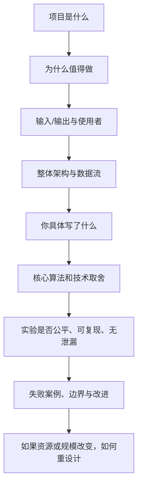
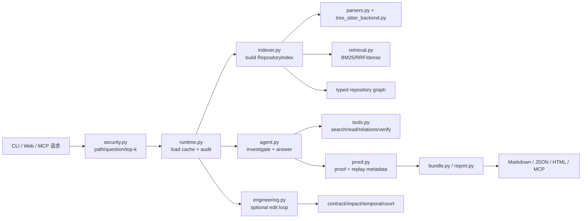
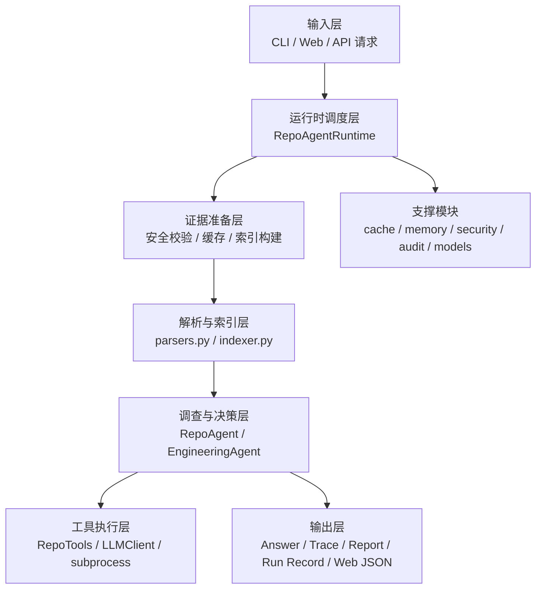
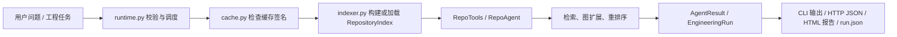
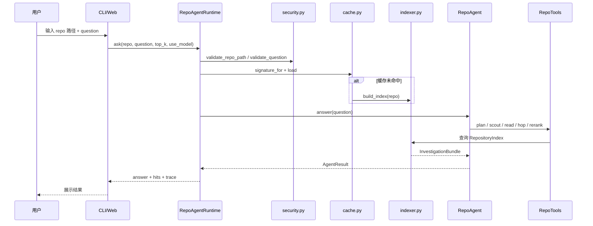

# Repo Agent 保研面试科研答辩主文档

> 版本：2026-08-10
>
> 项目性质：个人独立完成的开源项目；面试包装方向：代码智能、软件工程智能体、信息检索与可信 AI 系统。
>
> 事实边界：本文只使用仓库中已有代码、报告和评测产物。CORE-Bench 部分是由 Level-2 数据整理出的 repository-streaming 衍生子集，不等同于官方完整榜单；SWE-bench Verified 已完成数据准备和划分，但完整检索矩阵尚未结束。

## 使用说明

这份文档按照“先讲清主线，再经得起深挖”的顺序编排。面试中不需要一次性把所有功能都讲出来。最优策略是先用 3 分钟讲研究故事，再根据教授的问题进入方法、实验或个人贡献。

如果你看纯文字容易走神，请先打开同目录的 `interview-visual-teaching.zh-CN.md`。其中用三张项目图、玩具代码、生活类比和 Aider、Zoekt、SWE-bench、Agentless、LocAgent、OpenHands 等开源案例解释核心技术；该图解册也被放在总文档长篇附录的第一位。

当前代码的图扩散实现是 bounded Personalized PageRank（PPR）。旧报告中出现的 `graph_mcts` 是历史序列化标签，用于兼容旧 artifact。讲解时必须以 PPR 为当前算法口径。

# 第一部分：科研故事线

## 1.1 一句话项目定位

Repo Agent 是一个面向代码智能的证据优先代码仓库定位系统。它在 Coding Agent 修改代码之前，先回答三个问题：应该看哪里、为什么看那里、这条证据在仓库变化后是否仍然成立。

## 1.2 研究背景与动机

大模型写代码的瓶颈并不总是生成能力，而是仓库级上下文定位。真实仓库通常具有以下特点：

- 同一个业务词可能出现在 public、admin、legacy、mock 和 test 多个版本中；
- 目标行为可能由 route、handler、helper、writer 多级调用共同完成；
- 函数名称和自然语言问题不一定共享词面；
- 仓库不断变化，昨天生成的定位结论可能在今天失效。

关键词搜索能够告诉我们某个字符串出现在哪里，却不能说明哪个节点真正处于目标执行路径。普通代码 RAG 可以召回相似片段，但通常缺少 route、call、import 等结构信息，也不会为答案保留可验证的证据链。

因此，本项目的动机不是再做一个聊天机器人，而是建立一个 Coding Agent 的 evidence layer：在修改代码之前，把仓库中的结构事实、检索排序和验证结果组织成可审查的中间产物。

## 1.3 核心科学问题

> 如何融合代码内容、标识符、路径和程序结构，在存在相似干扰项的代码仓库中准确定位目标代码，并输出可解释、可回放的证据链？

## 1.4 现有方法的不足

### 表示不足

将代码块拼成一个长文本后做 BM25 或 embedding 检索，会让长文件因为重复出现查询词而获得不合理优势，精确的函数名和路径信号也容易被淹没。

### 结构不足

文本相似不等于执行相关。一个名为 `writeAdminChatDelta` 的函数可能比 `writeChatDelta` 包含更多相同关键词，但它并不属于 public `/api/chat` 路径。

### 可靠性不足

许多系统只返回一个答案或 Top-k 片段。用户无法知道它为什么被选中，也无法在仓库更新后快速验证旧答案是否仍然有效。

## 1.5 方法概述

本项目将代码定位拆成四层：

1. **结构化表示**：抽取文件、symbol、route、handler、call、import；
2. **多视图检索**：分别建立 content、identifier、path、structure 四个 BM25 视图，并用 weighted RRF 融合；
3. **图扩散与重排**：以初始候选为种子，在仓库图上进行有界 PPR，结合 route anchor、动作词和 contrastive exclusion；
4. **证据验证**：生成 Proof-Carrying Retrieval、supporting path、proof graph、decoy audit，并支持 replay、strict replay 和 mutation lab。

## 1.6 主要贡献

### 贡献一：多视图结构化代码检索

将代码正文、函数/类标识符、文件路径和结构关系独立建模，再通过加权倒数排名融合，避免单一文本视图无法区分不同类型证据。

### 贡献二：路由锚定的执行路径定位

对查询中的 `/api/chat` 等精确路径进行 route anchoring，再沿 route、handler、call 和 import 边扩散，使没有直接词面匹配的深层函数也能获得执行路径证据。

### 贡献三：可回放的证据对象

系统不只返回 Top-k，还保存支持路径、检索原因、干扰项、图边和指纹。后续可以把 JSON bundle 放回仓库 replay，检查证据是否漂移。

## 1.7 实验结论

### 内置 portable suite

10 个案例上，升级前后结果为：

| 方法 | Top-1 | Top-3 | MRR |
|---|---:|---:|---:|
| 升级前 | 40.0% | 50.0% | 0.492 |
| 升级后 | 100.0% | 100.0% | 1.000 |
| 绝对变化 | +60.0 pp | +50.0 pp | +0.508 |

### Challenge suite

32 个案例上：Top-1 为 84.375%，Top-3 为 93.750%，MRR 为 0.880，Distractor@1 为 0%。仍有 5 个 Top-1 gap，没有隐藏失败案例。

### CORE-Bench 衍生冻结测试集

该实验包含 200 条查询、22 个仓库，repository-disjoint 划分为 train/dev/test=122/28/50，冻结测试集包含 50 条查询。

| 方法 | Hit@1 | Hit@3 | Hit@5 | MRR | nDCG@10 | Recall@100 |
|---|---:|---:|---:|---:|---:|---:|
| BM25 | 14% | 20% | 24% | 0.196 | 0.116 | 0.315 |
| Content+Identifier RRF | 24% | 26% | 32% | 0.289 | 0.146 | 0.321 |
| Content+Structure RRF | 14% | 24% | 30% | 0.222 | 0.128 | 0.394 |
| Full Multiview RRF | 16% | 32% | 36% | 0.254 | 0.147 | 0.370 |

推荐的谨慎结论是：Full Multiview 在冻结测试集上相对 BM25 将 Hit@3 和 Hit@5 都提高了 12 个百分点，MRR 从 0.196 提高到 0.254，说明结构化表示改善了候选排序；但 Hit@1 只提高 2 个百分点，200 条查询上的 paired bootstrap 置信区间仍跨 0，因此不能宣称统计显著或全面超过外部系统。

## 1.8 三分钟口述稿

我做的项目叫 Repo Agent，是一个面向代码智能和智能软件工程的证据优先代码仓库定位系统。这个项目的出发点是，大模型能不能正确解决一个仓库级问题，很大程度上取决于前置上下文是否找对。如果一开始定位到了错误文件，或者定位到了一个名字相似但实际不参与执行的函数，后面的推理和代码修改都会建立在错误基础上。

现有关键词搜索主要依赖词面匹配，容易受到同名函数、测试代码、旧版本和管理接口的干扰。普通代码 RAG 虽然能够召回语义相似片段，但通常把代码当作扁平文本处理，没有充分利用路由、调用和导入关系，而且仓库变化后很难重新验证旧结论。因此我的核心问题是：如何融合代码的文本信息和程序结构，在存在相似干扰项的仓库中准确定位目标代码，并生成可解释、可回放的证据链。

我的系统首先解析仓库，抽取文件、函数、路由、handler、调用和导入关系；然后从代码内容、标识符、文件路径和结构关系四个视图建立 BM25 索引，用加权倒数排名融合初始候选；接着以候选为种子，在仓库图上进行有界 Personalized PageRank，并结合查询意图、动作词、route anchor 和 contrastive reranking，区分真正的执行路径与 admin、legacy、mock 等干扰项。最后系统输出 Proof-Carrying Retrieval 对象，记录 Top Hit、支持路径、证明图和干扰项排除原因，之后还可以 replay 检查证据是否仍然成立。

项目的贡献主要有三点：第一，多视图结构化代码检索；第二，路由锚定的执行路径图扩散；第三，可回放、可失效诊断的证据 artifact。在 10 个内置案例上，Top-1 从 40% 提升到 100%，MRR 从 0.492 提升到 1.000。在 CORE-Bench 衍生的冻结测试集上，Full Multiview 的 Hit@3 和 Hit@5 比单视图 BM25 都高 12 个百分点，MRR 从 0.196 提升到 0.254。这个外部结果说明结构化表示有改善排序的趋势，但我不会把它包装成已经超过所有外部系统，因为当前测试集规模和显著性仍然有限。SWE-bench Verified 我完成了数据准备和划分，但完整矩阵还在继续运行。

# 第二部分：方法论深拆

## 2.1 Pipeline 文字图

```text
Repository
 -> parser：AST / Tree-sitter / regex fallback
 -> indexer：FileFact / Symbol / CodeChunk / GraphEdge
 -> query planner：intent / action / route / role / language
 -> multi-view BM25：content / identifier / path / structure
 -> weighted RRF：融合独立排名
 -> bounded PPR：沿 route / call / import 图扩散
 -> rerank：role / language / action / route / contrastive rules
 -> evidence：answer / trace / diagnostics / proof / decoy audit
 -> replay：验证证据是否仍然成立
```

## 2.2 解析与索引

Python 使用 AST 抽取函数、类、decorator route 和调用；JavaScript/TypeScript 优先使用 Tree-sitter，超过 20 KiB 的文件使用 fallback；HTML/CSS 主要抽取页面、脚本、样式和 import 关系。

这里的设计假设是：对于仓库定位，完整语法树不是必要条件；只要能够稳定抽取足够的 symbol 和关系，就可以为召回和重排提供有效结构信号。

## 2.3 BM25 与四视图

BM25 参数为 (k_1=1.5,b=0.75)。代码正文、标识符、路径和结构分别建立索引，避免长函数体重复词项压制短而精确的函数名或路径。

RRF 公式为：

\[
S(d)=\sum_{v\in V}\frac{w_v}{K+rank_v(d)}
\]

当前使用 (K=30)，权重为 content=1.0、identifier=1.8、path=1.1、structure=1.25。RRF 的好处是不同视图不需要共享可比的绝对分数尺度。

## 2.4 Query Planning

QueryPlan 包含：

- mode；
- intent；
- focus terms；
- target roles；
- target languages；
- route literals；
- hop budget；
- target symbol kind。

例如“FastAPI 聊天接口入口在哪里”应识别为 API/route lookup，而“最终调用哪个处理函数”更接近 function/caller relation lookup。两者不能使用完全相同的排序偏好。

## 2.5 PPR 图扩散

当前实现从种子检索结果构造 teleport 分布，在有限邻域中对有向或反向关系进行加权扩散：

\[
r_{t+1}=(1-\alpha)p+\alpha P^Tr_t,\qquad \alpha=0.85
\]

实现细节：

1. 种子权重来自初始检索分数；
2. 邻域扩展最多使用排名靠前的 24 条边；
3. PPR 迭代最多 80 次；
4. (L_1) 变化小于 (10^{-7}) 时提前收敛；
5. 对概率乘以轻量 relevance factor，再作为 rerank boost；
6. route anchor 作为独立验证信号，不被普通词面分数完全替代。

## 2.6 Route Anchor 与 Contrastive Reranking

如果查询包含精确路径，系统先定位 route 节点，然后扩展到 handler、writer 和 caller。对“不是 admin/legacy/mock”的表述，系统会显式读取 contrastive exclusion；即使一个 decoy 词面相似，只要 route-family 不一致，也会受到惩罚。

当前重排中可解释的代表性规则包括：

| 证据 | 作用 |
|---|---|
| role-aligned | 文件角色与 query intent 一致时加分 |
| language-aligned | 目标语言匹配时加分 |
| route-reachable | 节点在 route 可达路径上时加分 |
| function target | 问函数时优先 function symbol |
| action match | stream/write/retrieve 等动作匹配时加分 |
| contrastive exclusion | admin、legacy、mock、fake 等候选降权 |
| test/doc downrank | 非目标查询时测试和文档候选降权 |

## 2.7 Proof、Replay 与 Mutation

Proof bundle 记录：

- 查询和 query plan；
- seed hits 与 final hits；
- top hit；
- route anchor；
- supporting paths；
- proof graph nodes/edges；
- decoy audit；
- score gap 和 warnings。

Strict replay 不仅检查节点是否还存在，还会检查 proof graph 中的 route/path edge 是否仍然对应当前 route、call 或 import graph。Mutation lab 会故意修改 top hit、route、path、edge 或 decoy entry，检测 verifier 能否发现问题。

## 2.8 理论假设与适用条件

### BM25 假设

词项出现频率和稀有程度能够近似反映相关性。对于命名规范混乱、语义隐含在控制流中的代码，这一假设会变弱。

### RRF 假设

各视图的相对排名比绝对分数更可靠。它不能自动判断某个视图是否整体错误，所以需要 ablation 和 dev 调参。

### PPR 假设

仓库图中的局部边能够近似执行或依赖关系。反射、动态注册和 parser 漏边会破坏这一假设。

### Route Anchor 假设

用户问题中包含可识别的路由 literal，且 parser 能抽取对应 route。没有 literal 或存在动态路由时，route prior 会变弱。

### Proof 假设

当前 proof 只验证证据结构的一致性，不验证完整程序语义；它属于工程可靠性 artifact，不是形式化验证。

## 2.9 与最相关论文方法对比

| 方法 | 重点 | Repo Agent 的差异 |
|---|---|---|
| GraphCodeBERT | data flow 感知的预训练模型 | Repo Agent 不训练模型，使用轻量显式结构和可解释图扩散 |
| RepoCoder | 仓库级检索增强代码补全 | Repo Agent 关注 issue/行为定位及 evidence handoff |
| Agentless | localization-repair-validation 三阶段 | Repo Agent 聚焦 localization 的可验证证据层 |
| LocAgent | 异构代码图与 LLM 多跳定位 | Repo Agent 基础路径可脱离 LLM，增加 route proof、replay 和 decoy audit |

# 第三部分：实验设计与分析

## 3.1 数据集选择逻辑

内置 portable suite 用于回归，challenge suite 用于复杂失败模式，counterfactual suite 用于 hard-negative，CORE 衍生集用于外部 repository-disjoint 检验，SWE-bench Verified 用于未来的真实 issue 文件定位。

不要把所有集合混为一个数字。内置100%主要证明系统闭环，CORE 衍生测试集主要检验结构化表示的外部趋势，SWE-bench 才更接近最终软件工程任务，但当前还没有完整结果。

## 3.2 Baseline 选择

### Single-view BM25

检验单一内容词法检索的强度，是最基本、最可复现的 baseline。

### Content+Identifier

检验函数名、类名和标题等精确符号信号。

### Content+Structure

检验 route、imports、calls 和 metadata 是否提升候选覆盖。

### Full Multiview

四个视图全部参与 weighted RRF，代表当前主要检索方法。

### No-graph / Hybrid / PPR

用于项目内的流程消融，分析图扩散和其他重排模块是否真的带来额外价值。

## 3.3 主结果与解释

内置 portable suite 的大幅提升说明升级后的表示、意图路由和重排规则能够修复原先的明显失败。challenge suite 的84.375% Top-1 说明泛化并不完美，但失败案例被保留下来，便于进一步分析。

CORE 冻结测试集上，Full Multiview 的 Hit@3、Hit@5 和 MRR 优于 BM25，但 Hit@1 仅小幅改善。这个现象可以拆成两层：结构信息提高了正确候选进入前几名的概率，但最终第一名仍受到标签粒度、跨仓库命名差异和多个同样相关文件的影响。

## 3.4 统计与方差

核心检索路径是确定性的，同一环境和输入下没有神经网络随机种子方差。外部结果采用 paired bootstrap 估计查询采样不确定性。当前200条查询的 MRR、nDCG@10 和 Recall@100 区间都跨0，因此只能报告效应量和趋势。

## 3.5 失败案例分类

### Top-3 recoverable

正确文件进入前三，但没有排到第一。这说明召回没有失败，主要问题在 rerank 或证据权重。

### Library boundary ambiguity

入口函数和真正实现函数分属不同文件或库边界，query 没有明确要求“先看入口”还是“看核心实现”。

### Streaming handler ambiguity

多个函数都包含 stream、turn、handler 等词，需要利用 call path 和动作意图进一步区分。

### Route anchor weakness

查询没有精确 route literal，或动态 route 没被 parser 捕获，导致 route prior 失效。

### Parser recall gap

正确 symbol 或调用边没有进入索引，后续任何重排都无法挽救。

## 3.6 需要补做的实验

1. 在固定版本的 CORE/SWE 数据上跑完 full hybrid；
2. 加入 dense-only、BM25+dense、Zoekt 等匹配 baseline；
3. 按 repository 做 macro average；
4. 报告 Hit@1/3/5、MRR、MAP、nDCG、latency、RSS 和 index size；
5. 做 bootstrap CI、paired significance 和多次运行稳定性；
6. 评测 proof confidence、abstention 和 risk-coverage；
7. 在同一模型、同一 token budget 下比较有无 evidence layer 的 patch success。

# 第四部分：理论基础与 Related Work

## 4.1 发展脉络

### 代码搜索阶段

CodeSearchNet 将自然语言代码搜索规模化，GraphCodeBERT 进一步证明 data flow 等结构信号具有价值。

### 仓库级上下文阶段

RepoCoder 将检索引入仓库级代码补全，说明跨文件上下文能够提升生成。

### 真实软件工程评测阶段

SWE-bench 将 GitHub issue 和真实 patch 纳入评测，推动模型从函数生成走向 repository-level repair。

### Agent 简化与定位阶段

Agentless 说明复杂自主 Agent 不是唯一选择，LocAgent 则强调异构代码图和多跳定位。

### 可信证据阶段

Repo Agent 进一步把定位结果视为可回放 artifact，加入 proof、decoy、mutation 和 replay。

## 4.2 关键论文与局限

| 论文 | 核心贡献 | 局限 |
|---|---|---|
| CodeSearchNet | 建立大规模多语言代码搜索数据 | 不聚焦仓库执行路径 |
| GraphCodeBERT | data flow 感知预训练 | 需要模型训练和较高部署成本 |
| RepoCoder | 迭代检索增强仓库级补全 | 目标是 completion，不是 proof localization |
| SWE-bench | 真实 GitHub issue 评测 | 主要看最终 patch，不强调中间证据 |
| Agentless | localization-repair-validation 阶段化 | 不以 replayable evidence 为核心 |
| CORE-Bench | 强调 Agent 结果可复现 | 原始任务不是代码定位 |
| LocAgent | 图引导的 LLM 代码定位 | 对模型和 Agent 搜索策略依赖较强 |

## 4.3 项目位置

本项目不声称提出全新的 IR 或图算法，而是把成熟组件组织成一个研究型系统问题：

> 结构化代码检索能否让代码定位更准确？证据是否能够被 replay？哪些失败来自召回，哪些失败来自排序？

## 4.4 前沿问题

- 动态代码图和运行时 trace 融合；
- 代码定位的 confidence calibration；
- Agent 的 reliable abstention；
- 证据层对最终 patch success 的因果影响；
- 大型 monorepo 的增量图索引；
- 多语言、多框架和生成式代码的 parser 鲁棒性；
- 面向 CI/PR 的 proof contract；
- 证据冲突时的多 Agent arbitration。

# 第五部分：教授拷打模拟

## A. 基础理解型

### A1. 输入输出是什么？

**教授想考察：** 是否真正理解系统边界。

**参考答案：** 输入是仓库路径和自然语言问题，输出是排序后的代码证据、片段、支持路径、诊断信息、proof bundle 和 decoy audit，不只是一个文件名。

**可能追问：** 没有 API key 能不能运行？

**踩坑提醒：** 不要说输出是绝对正确答案。

### A2. 为什么不直接 grep？

**教授想考察：** 是否理解项目价值。

**参考答案：** grep 以文本行为单位，不能表达 route 到 handler 再到 writer 的关系。我的系统把仓库变成带结构的证据图，还能解释为什么排除相似候选。

**可能追问：** 简单字符串查找时 grep 是否更快？

**踩坑提醒：** 不要贬低 grep。

### A3. 四个检索视图是什么？

**教授想考察：** 是否掌握核心实现。

**参考答案：** content、identifier、path、structure，分别对应代码正文、符号、路径角色和程序关系。

**可能追问：** 为什么不拼成一个文本？

**踩坑提醒：** 应解释独立视图有利于可解释消融。

### A4. BM25 怎么实现？

**教授想考察：** 是否只会背算法名。

**参考答案：** 使用词频、IDF 和长度归一化，参数是 (k_1=1.5,b=0.75)，每个视图独立排序后做 RRF。

**可能追问：** BM25 与 TF-IDF 的区别？

**踩坑提醒：** 要说词频饱和和长度归一化。

### A5. 当前 MCTS 还是 PPR？

**教授想考察：** 是否存在概念包装。

**参考答案：** 当前实现是 bounded PPR。`graph_mcts` 只是旧 artifact 的兼容标签，历史实现才有 pseudo-MCTS/greedy walk。

**可能追问：** 为什么不统一重命名？

**踩坑提醒：** 不能把 PPR 说成严格 MCTS。

### A6. Route anchor 做什么？

**教授想考察：** 是否理解执行路径。

**参考答案：** 识别 `/api/chat` 等 literal，找到对应 route 节点，再沿 route-handler-call 边给执行路径上的节点加分。

**可能追问：** 动态路由怎么办？

**踩坑提醒：** 不要声称覆盖所有动态框架。

### A7. Proof 是形式化证明吗？

**教授想考察：** 是否过度包装。

**参考答案：** 不是。它验证当前索引中证据节点、支持路径、图边和 decoy audit 是否自洽、可 replay。

**可能追问：** 能不能保证程序语义正确？

**踩坑提醒：** 不能保证。

### A8. Parser 支持什么？

**教授想考察：** 是否知道边界。

**参考答案：** Python、JavaScript、TypeScript、HTML、CSS；Python 走 AST，JS/TS 优先 Tree-sitter，大文件 fallback。

**可能追问：** 为什么不是完整编译器 parser？

**踩坑提醒：** 主动承认轻量 parser 的定位。

### A9. 训练 epoch 多长、什么 GPU？

**教授想考察：** 是否把检索系统冒充训练模型。

**参考答案：** 核心路径没有训练 epoch，也不依赖 GPU。BM25、RRF、PPR 是确定性 CPU 检索；embedding 只是可选后端。

**可能追问：** 为什么 pyproject 里有 embedding 接口？

**踩坑提醒：** 不要编造训练过程。

### A10. 如何复现？

**教授想考察：** 是否有实验闭环。

**参考答案：** 通过固定 suite、固定 split seed、冻结 test hash 和 JSON 结果文件复现，并记录 commit、环境、数据版本和运行时间。

**可能追问：** 完整测试是否全部通过？

**踩坑提醒：** 要区分 focused regression 与完整测试时间限制。

## B. 科研思维型

### B1. 为什么不用纯 embedding？

**教授想考察：** 方法选择。

**参考答案：** 代码定位里函数名、路径和 route 是精确证据。先采用本地确定性 BM25 保证可复现，embedding 只能作为额外召回，不能替代结构图。

**可能追问：** 逻辑相似但词不同怎么办？

**踩坑提醒：** 不要否定 embedding。

### B2. 与普通 RAG 的区别？

**教授想考察：** 研究定位。

**参考答案：** 代码块带有 symbol、route、calls、imports 和角色元数据，召回后还有图扩散、对比排除和 replay，因此是 codebase investigation 而非普通文档问答。

**可能追问：** 是否证明提升 patch success？

**踩坑提醒：** 当前不能声称已证明。

### B3. 创新点是什么？

**教授想考察：** 是否区分工程和算法贡献。

**参考答案：** 不是发明 BM25 或 PPR，而是把多视图表示、route path、hard-negative audit 和 replayable evidence 组织成可评测闭环。

**可能追问：** 这更像工程还是论文？

**踩坑提醒：** 不要把成熟组件说成全新算法。

### B4. 为什么不用 BFS？

**教授想考察：** 图搜索取舍。

**参考答案：** BFS 对高连接度仓库图会扩展太多无关节点，PPR 用边权和种子相关性做有界扩散，延迟更可控。

**可能追问：** 是否做过严格优越性证明？

**踩坑提醒：** 没有就明确说没有。

### B5. 数据扩大十倍是否可用？

**教授想考察：** 规模意识。

**参考答案：** 思路可用，但当前内存索引不能直接保证大型 monorepo 性能，需要增量索引、磁盘倒排、图分区和缓存。

**可能追问：** 先改什么？

**踩坑提醒：** 不要只回答加机器。

### B6. parser 漏边怎么办？

**教授想考察：** 对系统假设的理解。

**参考答案：** 图扩散会失去证据，所以保留词法和符号召回，并在 proof 中报告 coverage；未来需要 parser recall 和 abstention。

**可能追问：** 如何检测？

**踩坑提醒：** 不要声称不会漏边。

### B7. 内置100%，外部不高，怎么解释？

**教授想考察：** 过拟合意识。

**参考答案：** 内置集证明机制闭环，外部集检验跨仓库泛化。外部结果更难，不能用内置100%证明广泛有效。

**可能追问：** 内置集还有价值吗？

**踩坑提醒：** 不要称其为 SOTA。

### B8. 为什么这些指标？

**教授想考察：** 实验逻辑。

**参考答案：** Hit@1 对应直接答案，Hit@3/5 对应可检查候选，MRR 反映排序位置，Recall@100 分析召回是否覆盖。

**可能追问：** 最重要哪个？

**踩坑提醒：** 不要只挑最高项。

### B9. baseline 公平吗？

**教授想考察：** 对照设计。

**参考答案：** 同一文档、查询、qrels、top-k，只改变表示或融合方式；尚未和所有外部系统完成匹配预算比较。

**可能追问：** 为什么没跑 Zoekt 或 LocAgent？

**踩坑提醒：** 不要编造对比成绩。

### B10. 假设什么时候失效？

**教授想考察：** 理论边界。

**参考答案：** 反射、动态 import、宏、运行时注册、极度模糊的问题描述和 parser 漏边都会削弱方法。

**可能追问：** 要不要 abstain？

**踩坑提醒：** 承认 abstention 是下一步。

## C. 压力追问型

### C1. 结果是不是过拟合？

**教授想考察：** 诚实度。

**参考答案：** 内置100%不能排除过拟合；外部 repository-disjoint frozen test 结果较低，且 paired bootstrap 区间跨0，因此我只说 preliminary evidence。

**可能追问：** 如何继续排除？

**踩坑提醒：** 不能只说有测试集。

### C2. 外部结果不高为什么讲？

**教授想考察：** 负面结果解释。

**参考答案：** Hit@3/5 分别提升12个百分点，说明结构信号改善候选排序；Hit@1提升有限，说明精确定位仍难。

**可能追问：** 是否挑指标？

**踩坑提醒：** 主动报告 Hit@1 只有小幅变化。

### C3. 做显著性了吗？

**教授想考察：** 统计严谨性。

**参考答案：** 做了200条查询的 paired bootstrap，MRR、nDCG@10、Recall@100 区间都跨0，当前不能声称显著。

**可能追问：** 为什么样本小？

**踩坑提醒：** 不要把12个百分点等同显著。

### C4. no_graph 也100%，PPR有用吗？

**教授想考察：** 是否维护结论。

**参考答案：** 当前小样本不能证明 PPR 独立贡献，主要证据指向结构重排和对比排除；需要专门的 held-out graph cases。

**可能追问：** 新实验也没增益怎么办？

**踩坑提醒：** 不能强行维护。

### C5. Proof 是否过度命名？

**教授想考察：** 概念边界。

**参考答案：** 它是工程 proof，不是形式化语义证明。若面向更严格论文，可以称 evidence contract。

**可能追问：** 你会改名吗？

**踩坑提醒：** 承认命名可以讨论。

### C6. 最大局限是什么？

**教授想考察：** 自我批判。

**参考答案：** parser 不完整、外部矩阵未完、confidence 未充分校准、尚未证明下游 patch success 提升。

**可能追问：** 只能先改一件事？

**踩坑提醒：** 不要说没有局限。

### C7. 最大困难？

**教授想考察：** 独立解决问题。

**参考答案：** 一方面解决 Tree-sitter 大文件崩溃，另一方面把评测从内置样例扩展到 repository-disjoint frozen test，保证结果可解释。

**可能追问：** parser 重新设计？

**踩坑提醒：** 不要夸大普通 bug 修复。

### C8. AI 写的代码，你做了什么？

**教授想考察：** 个人贡献。

**参考答案：** 架构、数据模型、检索、PPR、Proof、评测协议和失败分析由我设计并实现；工具可以辅助编码，但问题定义、实验、验证和取舍是我的工作。

**可能追问：** 现场讲一个函数。

**踩坑提醒：** 不要声称逐行手写所有代码。

### C9. 重新做一次怎么改？

**教授想考察：** 路线图。

**参考答案：** 先完成外部定位 benchmark，再做 tuning log、parser recall、confidence calibration 和 downstream utility，减少启发式规则耦合。

**可能追问：** 删除哪些功能？

**踩坑提醒：** 不要继续无边界堆功能。

### C10. 未来三年怎么发展？

**教授想考察：** 科研潜力。

**参考答案：** 方向会从生成 patch 转向 evidence-aware Agent，融合静态图、运行时 trace、测试反馈和版本历史，研究定位、校准、abstention 和可验证修改。

**可能追问：** 你研究哪一块？

**踩坑提醒：** 不要只说继续做大模型。

# 第六部分：个人贡献与科研潜力

## 6.1 个人贡献回答

这是我独立完成的个人开源项目。我从问题定义开始，将项目定位为 Coding Agent 修改前的 evidence layer。具体工作包括：设计数据模型；实现 Python/JS/TS/HTML/CSS 解析；构建多视图 BM25 与 weighted RRF；实现 query planning、route anchor、动作重排和 bounded PPR；实现 Proof-Carrying Retrieval、strict replay、mutation lab、decoy audit；设计 portable、challenge、counterfactual 和 CORE 衍生评测；补充 CLI、Web Studio、测试、报告和文档。

我认为最核心的个人工作，是把“找到一个相似文件”转化为“返回带路径、原因、干扰项和 replay 能力的证据对象”，并围绕这个核心建立实验闭环。

## 6.2 最大困难回答

最大的困难不是把功能拼起来，而是让结果具备可信的实验边界。Tree-sitter 在大型模板型 JavaScript 文件上出现过进程级崩溃，我增加了文件大小保护、parser 复用、单次遍历和 fallback。与此同时，我发现内置案例的100%不能说明泛化，于是补充 repository-disjoint split、frozen test 和 paired bootstrap。这个过程让我认识到，研究系统的关键不仅是性能，还包括失败可见、结果可复现和结论不夸大。

## 6.3 项目不足回答

当前 parser 仍然是定位任务导向的轻量 parser；外部 benchmark 还没有全部完成；启发式重排的规则交互需要更系统的消融；confidence 和 abstention 还没有充分校准；evidence layer 对最终 patch success 的提升尚未做固定预算实验。

## 6.4 未来方向回答

我希望继续研究结构化代码检索和可信软件工程 Agent。当前系统主要依赖静态仓库结构，下一步可以融合运行时 trace、测试执行结果和 git 历史，研究更可靠的定位、证据校准和自动 abstention。目标不是让 Agent 更会猜，而是让它在证据不足时知道不应该修改代码。

## 6.5 选择课题组回答模板

我关注到贵组在【程序分析/代码智能/软件工程 Agent/信息检索/大模型可靠性】方面有持续工作。我的项目涉及结构化代码表示、代码图检索、证据验证和真实仓库评测，希望在贵组进一步把偏工程化的系统问题收敛成更严格的研究问题，例如代码定位置信度校准、静态图与运行时证据融合、面向软件工程 Agent 的可验证检索。贵组在【具体论文1】和【具体论文2】上的工作，正好可以帮助我补足当前项目在理论分析和大规模评测上的不足。

# 第七部分：面试前速记卡

## 7.1 项目一句话

Repo Agent 是一个通过多视图结构化检索、路由执行路径图和可回放证据，帮助 Coding Agent 在修改代码前判断“应该看哪里、为什么是那里、证据是否仍然有效”的系统。

## 7.2 三个关键点

1. 不是 grep：有 symbol、route、call、import 和 graph edge；
2. 不是普通 RAG：有 route anchor、contrastive decoy audit 和执行路径；
3. 不是一次性答案：有 proof、replay、mutation 和证据报告。

## 7.3 两个应对句

- 外部结果：CORE 衍生冻结测试集上 Hit@3 和 Hit@5 相对 BM25 各提升12个百分点，但当前不能称为显著结论。
- PPR 贡献：当前小样本消融还不能证明 PPR 独立增益，下一步会专门构造图路径 held-out cases。

## 7.4 三个雷区

- 不把 CORE 衍生子集说成官方榜单成绩；
- 不把未完成的 SWE-bench 说成完整结果；
- 不把 `graph_mcts` 历史标签说成当前严格 MCTS。

## 7.5 卡壳话术

这个问题我分实现层和证据层回答。实现层面当前系统是这样做的；证据层面现有实验只支持到这个范围，我不想把尚未验证的部分说得过满。如果继续深入，我会优先补充对应的消融、统计检验或外部复现实验。

# 第八部分：代码走读脚本

## 8.1 models.py

先展示 Symbol、CodeChunk、FileFact、GraphEdge、RetrievalHit 和 InvestigationBundle。重点说明：系统先把仓库转换为稳定的数据结构，再让检索、报告、Web、Proof 和 Replay 共享同一种 artifact。

## 8.2 parsers.py

说明 AST、Tree-sitter 和 fallback 的职责边界。面试中可以打开一个 Python route 和一个 JS route，展示如何抽取 route path、handler 和 calls。

## 8.3 retrieval.py

展示 BM25Index、MultiViewBM25Index 和 weighted_reciprocal_rank_fusion。重点解释每个 view 为什么独立，以及 RRF 为什么不直接加绝对分数。

## 8.4 indexer.py

建议按以下顺序讲：build_index、query planning、file scout、primary retrieval、PPR、route anchor、rerank、investigate。不要一开始从 CLI 入口开始，因为教授更关心研究主线。

## 8.5 proof.py

展示 proof bundle、replay、strict edge verification、drift diagnosis 和 mutation lab。要主动说明 proof 的工程语义边界。

## 8.6 security.py 与 engineering.py

说明 path validation、allowed roots、command allowlist、protected/generated paths、workspace copy、explicit apply 和 verification/review timeline。

# 第九部分：系统设计白板讲法

## 9.1 白板图

```text
Repository
 -> Representation
   files / symbols / routes / calls / imports
 -> Retrieval
   BM25 / multi-view RRF / intent / PPR / rerank
 -> Verification
   proof / replay / mutation / decoy audit
 -> Product
   CLI / Web Studio / report / bundle
 -> Human or Coding Agent
```

## 9.2 白板讲解顺序

1. 先说输入和输出；
2. 再说为什么需要 parser；
3. 再说为什么需要 graph；
4. 再说为什么需要 proof；
5. 最后说 CLI 和 Web 是 artifact 的消费端。

# 第十部分：评测与复现协议

## 10.1 结果口径表

| 结果 | 可以怎样说 | 不能怎样说 |
|---|---|---|
| portable 10 cases | 内置回归集上升级有效 | 已证明广泛泛化 |
| challenge 32 cases | 更复杂 bundled cases 上仍有较好定位 | 已超过外部系统 |
| CORE 200 queries | CORE 衍生子集上的外部初步结果 | 官方 CORE 榜单成绩 |
| SWE preparation | 完成数据、标签、划分和防泄漏准备 | 已完整跑完并取得最终成绩 |
| proof scorecard | counterfactual bundle 上验证链闭环 | 证明程序语义绝对正确 |

## 10.2 复现实验检查单

- 固定代码 commit；
- 固定数据 revision；
- 固定 repository-disjoint split；
- 固定 frozen test hash；
- 记录 baseline、参数、硬件和缓存状态；
- 记录每个 query 的 rank 和 top hit；
- 保存失败案例和 warnings；
- 运行 paired bootstrap；
- 避免用 test case 设计新规则；
- 对外报告时明确“内部回归”与“外部有效性”。

# 第十一部分：未来研究计划

## 11.1 近期

完成 SWE-bench Verified 的完整定位矩阵；增加 dense-only、BM25+dense、Zoekt 和 graph baseline；补充按仓库 macro average、置信区间和失败 taxonomy。

## 11.2 中期

做 parser recall benchmark、confidence calibration、abstention 和 risk-coverage；将 proof replay 与 PR guard、regression contract 接入 CI。

## 11.3 长期

融合静态图、运行时 trace、测试反馈和 git 历史，建立 evidence-aware software engineering agent，并评测在固定模型与 token budget 下是否真正提升 patch success。

# 附录：常用回答模板

## 被问到不知道的数字

这个数字我不想凭记忆报错。当前我能确认的是【已确认数字】；更细的【方差/硬件/运行时间】我会以实验 artifact 为准。

## 被指出结果不显著

是的，当前统计检验还不能支持显著性结论。我把这个结果定位为效应趋势和实验假设验证，而不是最终论文级结论。

## 被问到为什么做这么多工程功能

这些功能不是互相独立的堆叠：retrieval 负责找到候选，proof 负责解释，replay 负责验证，report 和 CLI 负责交接。它们共同服务于“代码定位证据可审查”这一主线。

## 被问到是否要继续做模型

我会把模型作为可替换的召回或重排组件，而不会让核心系统依赖某个 API。当前更重要的是建立可解释、可复现、可校准的结构化证据层。


# 附录使用声明

> 以下附录保留项目已有的代码走读、课程讲义和工程参考材料，用于扩大准备范围。主文档中的当前实现与实验口径优先；如果旧材料仍出现 `graph_mcts` 或 MCTS-style 表述，应理解为历史 artifact 兼容名称，当前代码实现是 bounded Personalized PageRank。


# 附录零：超级详细技术白皮书与项目拷打大全

# Repo Agent 超级详细技术白皮书与保研项目拷打大全

> 版本：2026-08-10
>
> 适用对象：项目作者、代码审阅者、保研/研究生面试准备者、希望复现或二次开发 Repo Agent 的工程师。
>
> 文档目标：把这个仓库从“会运行的开源项目”解释成一套可审计的代码智能系统。本文既是技术白皮书，也是连续追问式的项目答辩底稿；它不只告诉你应该怎么夸项目，也会告诉你哪些说法现在不能夸、哪些实验尚未完成、哪些测试正在失败。

---

## 0. 先说结论：这个项目到底是什么

### 0.1 一句话定位

Repo Agent 是一个面向代码仓库的 evidence-first investigation system：在 Coding Agent 修改代码之前，它先对“应该看哪些文件/符号、这些位置为什么相关、这条证据在代码变化后是否还成立”给出结构化、可回放的答案。

它不是一个以生成补丁为核心的 IDE，也不是把代码塞进向量数据库后做一次相似度搜索的普通 RAG。它的中心产物是 `InvestigationBundle` 与其中的 proof：检索命中、路径/调用/路由图、排序理由、置信度、反例审计和可重放校验都被保留下来，之后的模型或人可以继续检查。

### 0.2 最适合的使用场景

它最适合以下问题：

1. **定位**：某个 API、handler、writer、配置项、测试或 RAG 边界在哪里？
2. **追链**：请求从 route 经过哪些中间函数，最终在哪里写响应或落盘？
3. **排错**：同名的 public/admin/legacy/mock/test 实现中，哪一个属于问题描述的执行路径？
4. **交接**：把一个带文件、符号、行号、图边和验证说明的证据包交给 Codex、Aider、OpenHands 等修改型 Agent。
5. **变更治理**：某个已经证明过的目标被修改后，哪些调用者、路由、文件和检查需要重新验证？

### 0.3 当前实现的真实口径

这张表是整份文档最重要的防误导声明。项目曾经有旧 artifact、旧 README 和旧测试口径；讲解时以当前 Python 源码和本次重新执行结果为准。

| 主题 | 当前实现 | 不能直接说成什么 | 证据 |
| --- | --- | --- | --- |
| 主检索 | 四个独立 BM25 视图：`content`、`identifier`、`path`、`structure`，用 weighted RRF 融合 | “纯 embedding 检索” | `repo_agent/indexer.py:96-150`、`repo_agent/retrieval.py` |
| 外部语义 | 可选 OpenAI-compatible/LiteLLM embedding；没有配置时完全不调用 embedding | “系统默认使用神经向量模型” | `runtime.py:46-57`、`llm.py:86-119` |
| 图扩散 | bounded Personalized PageRank，阻尼系数默认 `0.85`，在有限 seed 邻域中迭代收敛 | “当前在线链路使用真正的 MCTS” | `indexer.py:637-651`、`761-891` |
| MCTS 名称 | `mcts_graph_search`、trace 类型 `graph_mcts` 是历史兼容接口/序列化标签 | “实验已经证明 MCTS 优于 PPR” | `indexer.py:251-289`、`agent.py:225-229` |
| 证明 | 机器可读 proof、严格 replay、mutation lab、decoy audit | “形式化方法意义上的定理证明” | `agent.py:836-1115`、`proof.py` |
| Engineering Mode | 可选模型驱动的 inspect → edit → verify → review，默认复制到 `runs/<id>/workspace` | “无条件自动修改源仓库” | `runtime.py:220-256`、`engineering.py` |
| 评测 | 内置 portable/challenge/attack/temporal/release artifact，多数是 fixture 或 synthetic benchmark | “已经在所有外部数据集上达到 SOTA” | `docs/retrieval-research-2026.md`、本次命令输出 |
| 默认索引 | 本仓库当前为 69 个可索引文件、1004 个 chunk、7532 条图边、15 个 route | “项目只有几十个函数” | `python -m repo_agent index --repo .` |
| 全量测试 | 171 个用例中本次 `161 passed, 10 failed` | 沿用旧 README 的 “160 tests passed” | 本次 `python -m pytest -q` |

### 0.4 研究问题如何表述才不夸大

可以把项目凝练成三个可证伪问题：

- **RQ1：定位**——将内容、标识符、路径和程序结构作为互补视图，是否比单一词法检索更准确地定位 issue/问题对应的文件或函数？
- **RQ2：证据可靠性**——将命中结果包装成可 replay 的 proof，是否能更早发现重命名、路径断裂、片段漂移和 decoy 审计失效，并支持 abstention？
- **RQ3：下游价值**——在模型、token budget 和验证条件相同的情况下，证据层是否让最终修复成功率、审查效率或错误置信度得到改善？

目前仓库对 RQ1 有 bundled regression 证据，对 RQ2 有 replay/mutation/attack 的工程验证，对 RQ3 只有设计协议和待补实验；因此面试中必须把“已实现”“已在 fixture 上验证”“外部研究尚未完成”分开说。

---

## 1. 项目拷打的方法论：老师究竟在验证什么

用户提供的《计算机保研项目拷打准备指南》把项目答辩归结为三件事：真实性、原理理解、结果与局限分析。这个结论非常适合本项目，但需要把它转成可操作的审计框架。

### 1.1 七层连续追问链

面试官通常不是随机抽题，而是沿着一条“从宣传词逼近可验证事实”的路径推进：



对 Repo Agent，任何一个宣传词都应能落到下面四类证据之一：

| 证据级别 | 例子 | 能支持的说法 |
| --- | --- | --- |
| L0 叙述 | README 的一句话 | 项目定位、设计意图 |
| L1 源码 | 函数、数据类、命令分支 | “代码中确实实现了某机制” |
| L2 可运行产物 | 测试、benchmark JSON、HTML、SARIF | “在某个固定场景跑通/通过” |
| L3 外部验证 | repository-disjoint 数据、独立 baseline、统计置信区间 | “具有跨仓库研究外部有效性” |

本项目当前大多数能力处在 L1/L2；只有数据准备协议已经向 L3 靠近，不能把 artifact 数量误说成外部泛化结果。

### 1.2 1 分钟、3 分钟、10 分钟三种版本

#### 1 分钟版本（保命版）

> Repo Agent 是我做的一个代码仓库证据层。普通关键词搜索只能告诉我们某个词出现在哪里，而真实仓库里往往有 public、admin、legacy、mock 等相似实现；项目先用 Python AST/Tree-sitter 抽取符号、路由、调用和导入关系，再用 content、identifier、path、structure 四个 BM25 视图做 weighted RRF，最后在有界仓库图上做 Personalized PageRank 和路由锚定重排。输出不是一句没有来源的答案，而是带文件/符号/行号、图路径、排序理由、置信度和 proof replay 的证据包。当前本仓库索引出 1004 个 chunk、7532 条边；10 个 portable fixture 题是 100% Top-1，但 32 题 challenge 是 84.38% Top-1、93.75% Top-3，且全量测试本次有 10 个失败，所以我把它定位成一个可审计的研究型原型，而不是已经被外部数据充分证明的通用编码 Agent。

#### 3 分钟版本（标准版）

按“问题—方法—个人贡献—结果—边界”讲，不要一上来背 60 个 CLI 命令。具体稿件见第 12 章；3 分钟的重点是让老师知道你能主动划清 claim boundary。

#### 10 分钟版本（深挖版）

10 分钟版不是把所有代码念一遍，而是选择一条真实链路，例如 `/api/chat` 的 writer 定位：

1. 先说明 query planner 如何抽取 route literal `/api/chat` 与 writer intent；
2. 解释四视图 BM25 召回为什么让 `writeChatDelta`、`writeAdminChatDelta`、`writeLegacyChatDelta` 同时出现；
3. 说明 route anchor 从 `post_api_chat` 沿 `routes_to/calls` 找到 `handlePublicChat → streamPublicChatTurn → writeChatDelta`；
4. 对照证明对象中的 `top_hit`、`route_literals`、`supporting_paths`、`decoy_audit` 和 strict replay；
5. 再主动承认当前 attack benchmark 的 `mitigation_signal_rate=0.0`，说明“排序避开了 decoy”不等于“系统已经证明是因为某个因果防御信号避开了 decoy”。

### 1.3 参考指南的八个原则，如何映射到本项目

1. **简历名词都可能被问**：`BM25`、`RRF`、`PPR`、`Tree-sitter`、`MCP`、`SARIF`、`proof-carrying` 都必须能用白话和公式解释。
2. **不夸大接口调用**：`LLMClient` 是 OpenAI-compatible HTTP/LiteLLM 适配器；它没有训练或实现大模型。
3. **不把历史名称当当前算法**：`graph_mcts` 是兼容标签，当前策略字段是 `personalized_pagerank`。
4. **个人贡献必须可定位**：如果这是个人项目，应准备 commit、PR、函数级 diff；如果来自团队，按模块逐项区分，不能把整个仓库都说成自己独立完成。
5. **每个数字都要有生成命令**：Top-1、MRR、测试通过数、chunk 数、edge 数都附命令、数据版本和时间。
6. **必须准备 baseline**：single-view BM25、no-graph、dense-only、BM25+dense RRF、Zoekt/SCIP 等要在实验协议里分开。
7. **必须准备失败**：challenge miss、parser fallback、无 embedding 时的语义边界、10 个当前测试失败就是主动承认的材料。
8. **不知道时展示验证路线**：回答“我没有在本项目中实现过 X；当前理解是 Y；我会用 Z 命令/实验验证；不能把它当已完成结果”。

### 1.4 NeurIPS/Artifact 风格的科研审计补充

NeurIPS Paper Checklist 明确要求论文的 claims 与理论/实验能够支持的泛化范围一致，并鼓励单独写 limitations；这正是本项目需要对 README 做的校准。ACM Artifact Review and Badging 的思想则是把“可获得、可运行、可复用、可复现”拆成不同层级，而不是看到一个仓库能启动就宣布研究结论成立。

对应到本项目，答辩中应按四个问题检查每一项 claim：

| 审计问句 | Repo Agent 的具体检查 |
| --- | --- |
| Artifact 是否可获得？ | 源码、fixture、JSON spec、脚本和报告是否存在；是否被 `.gitignore` 或本地路径遮蔽 |
| 是否可运行？ | clean clone 安装依赖后，`python -m pytest -q`、benchmark、proof replay 是否执行 |
| 是否可复用？ | benchmark adapter 是否允许第三方用 `repo/question/expected` schema 接入；MCP 是否能被另一个 Agent 调用 |
| 是否可复现？ | commit、Python 版本、数据 hash、参数、缓存状态、耗时、失败案例和随机种子是否被记录 |

---

## 2. 仓库现状总盘点：先把事实钉死

### 2.1 目录结构与职责地图

```text
repo-agent/
├── repo_agent/                 # Python 核心包
│   ├── __main__.py             # CLI 入口，当前 60+ 子命令的编排层
│   ├── models.py               # dataclass 数据契约
│   ├── parsers.py              # Python/JS/TS/HTML/CSS/TOML 解析入口
│   ├── tree_sitter_backend.py  # JS/TS Tree-sitter 抽取
│   ├── indexer.py               # RepositoryIndex、chunk、graph、ranking
│   ├── retrieval.py             # BM25、Dense cosine、RRF
│   ├── agent.py                 # 确定性回答、可选 LLM rerank/tool loop、proof
│   ├── tools.py                 # Agent 可调用的只读/编辑/验证工具
│   ├── runtime.py               # CLI/Web/MCP 共享生命周期与缓存
│   ├── cache.py                 # JSON index cache + SQLite parse cache
│   ├── config.py/security.py    # 配置、路径、命令 allowlist、安全策略
│   ├── bundle.py/report.py      # Markdown/JSON bundle 与 HTML 报告
│   ├── proof.py                 # replay、strict replay、mutation、scorecard
│   ├── impact.py/contract.py    # 影响分析、回归契约、PR guard、SARIF
│   ├── temporal.py              # 跨 git 历史 replay、successor、迁移计划
│   ├── court.py                 # 多 Agent 证据法庭与 arbiter verdict
│   ├── benchmark_suite.py       # 便携 benchmark、ablation、frontier
│   ├── core_bench.py/external_bench.py
│   │                             # 外部数据集 manifest 与 adapter
│   └── research_protocol.py     # repository-disjoint split、冻结、泄漏审计
├── examples/                   # 可控 fixture：Express/FastAPI/RAG/反事实 decoy
├── tests/                      # 单测、回归、报告、benchmark、proof、security
├── web/                        # 原生 HTML/CSS/JS Web Studio
├── scripts/                    # demo、release gate、benchmark 准备、图渲染
├── docs/                      # 研究协议、教学、面试、artifact map、快照
├── reports/                    # 本地生成物；默认不参与索引
├── runs/                       # engineering workspace 与 run record
├── .cache/                    # index JSON 与 SQLite parser cache
└── pyproject.toml             # setuptools、依赖、CLI、pytest/ruff/mypy 配置
```

### 2.2 当前索引快照

以下数字来自本次重新执行 `python -m repo_agent index --repo .`，不是手填：

| 指标 | 值 | 如何解释 |
| --- | ---: | --- |
| 可索引文件 | 69 | 受支持扩展且未命中 ignore 规则、未超过 512 KiB |
| chunk | 1004 | 每个解析 symbol 一个 chunk，另加每文件最多前 140 行的 file overview |
| 图边 | 7532 | `calls=2969`、`references=2837`、`imports=1714`、`routes_to=12` |
| route chunk | 15 | Python decorator、JS/TS route pattern 被转成 route symbol |
| BM25 vocabulary | 8194 | 内容及四视图 token 的词表大小 |
| 平均 BM25 文档长度 | 292.427 | chunk token 数平均值；不是源码平均行数 |
| 语言 | Python 895、JavaScript 105、其他 4 | 这是 chunk 分布，不是文件分布 |
| parser | `python-ast` 895、Tree-sitter JS 46、regex fallback 59 | fallback 不是“解析成功等价物”，而是安全降级 |
| embedding | none | 当前环境没有可用 LLM/embedding 配置，因此本次快照是确定性 lexical+graph |

**容易被追问的统计陷阱：**“895 个 Python”不等于“895 个 Python 文件”。同一个文件可以有多个函数/类/route chunk，另有一个 file chunk；`RepositoryIndex.stats()` 的 `language_distribution` 是 chunk 计数。文件计数要看 `file_count`，chunk 数要看 `chunk_count`。

### 2.3 当前测试事实

本次执行：

```powershell
python -m pytest --collect-only -q
python -m pytest -q
```

收集到 171 个测试；全量运行耗时约 562 秒，结果为 **161 passed、10 failed**。失败不是“测试没跑完”，而是明确的行为/契约不一致：

| 失败测试 | 现象 | 暂时应如何表述 |
| --- | --- | --- |
| `test_challenge_benchmark_adapter_runs_as_harder_generalization_gate` | challenge Top-3 为 `0.9375`，旧断言要求 `1.0` | challenge 不是当前全绿；存在 2 个 Top-3 缺口 |
| `test_benchmark_adapter_passes_intent_guard_challenge_suite` | intent guard status 为 `needs_attention` 而非 `pass` | 排序能力与旧状态门槛已漂移 |
| `test_proof_attack_benchmark_resists_generated_decoys` | `mitigation_signal_rate=0.0` | decoy 被避开，但没有识别出可归因的 mitigation signal |
| `test_adaptive_proof_attack_curriculum_stresses_synthesized_policy` | status 为 `adaptive_policy_holds` 而非旧期望 `adaptive_gap_found` | adaptive policy 行为与旧测试语义相反 |
| `test_adaptive_policy_repair_closes_second_order_gaps` | 二阶 repair 断言失败 | 需要重新定义 adaptive benchmark 的预期状态 |
| `test_proof_attack_minimax_certificate_audits_repair_loop` | certificate 断言失败 | attack → policy → repair 证据链未满足旧契约 |
| `test_proof_attack_scorecard_grades_generated_attacks` | scorecard 为 `fail` | `mitigation_signal_rate` 使阈值门失败 |
| `test_proof_attack_cegar_runs_counterexample_guided_loop` | status 为 `blocked` 而非 `needs_refinement` | CEGAR 状态机与旧期望不同 |
| `test_release_pack_generates_manifest_and_artifacts` | `benchmark_repair_status=partial` | release pack 仍生成，但不能称为完整 validated |
| `test_mcp_investigation_returns_grounded_structural_evidence` | 当前 backend 字段为 `multi-view-bm25+weighted-rrf+graph`，旧断言仍期待 `bm25+lexical+graph` | 这是 API/测试契约漂移，不是检索算法证明 |

因此文档中所有“测试通过”都必须注明子集和日期。更准确的句子是：

> 当前核心索引/解析/检索测试可通过；全量测试在当前工作区为 161/171，10 个失败集中在 challenge 门槛、proof attack 状态机、release pack 和 MCP 字段兼容性。

### 2.4 当前 benchmark 数字

#### Portable generalization suite（10 题）

```powershell
python -m repo_agent benchmark-adapter `
  --suite repo_agent/benchmark_adapter_suite.json `
  --output .tmp/deep-audit-portable.json
```

结果：Top-1 `100%`、Top-3 `100%`、MRR `1.000`、distractor@1 `0%`、平均 confidence `0.94`。但是它来自本仓库附带的 5 个 fixture repository，不能当作外部 SOTA。

#### Challenge suite（32 题）

```powershell
python -m repo_agent benchmark-adapter `
  --suite repo_agent/benchmark_challenge_suite.json `
  --output .tmp/deep-audit-challenge.json
```

结果：Top-1 `84.375%`、Top-3 `93.75%`、MRR `0.880`、distractor@1 `0%`。主要缺口：

- `repo_config_package_data`：miss@6；
- `repo_web_run_history_refresh`：miss@6；
- `express_public_chat_authorizer`：rank 2；
- `simple_agent_stream_turn_builder`：rank 3；
- `fastapi_admin_clear_state`：rank 3。

按 tag 看，`config`、`packaging` 的 Top-3 为 0%，`runs` 为 50%，`javascript` 为 66.67%。这说明“路由/handler/RAG fixture 很强”与“仓库级配置/前端状态/跨文件语义泛化较弱”同时成立。

#### Adversarial proof attack（3 个 synthetic mutation）

```powershell
python -m repo_agent proof-attack `
  --output-dir .tmp/deep-audit-proof-attack `
  --output .tmp/deep-audit-proof-attack.json
```

当前输出：attack resistance `100%`、Top-1 `100%`、distractor@1 `0%`、proof proved `100%`、route anchor `100%`、supporting path `100%`、generated decoy audit rate `66.67%`、mitigated decoys `100%`、**mitigation signal rate `0%`**。最后一个数字必须主动讲：排序结果成功，不代表审计已经证明了某个防御信号的因果作用。

---

## 3. 问题建模：把“找代码”写成可研究的问题

### 3.1 输入、输出和标签

一个 investigation 可以抽象为：

\[
q=(自然语言问题, 仓库 R, 可选目标类型, top\text{-}k)
\]

输出为：

\[
Y=(H, E, P, D, A)
\]

其中：

- `H` 是排序后的 `RetrievalHit[]`，每个 hit 包含 chunk、score、matched_terms、reasons；
- `E` 是相关 `GraphEdge[]`；
- `P` 是 proof graph、route literal、top hit、supporting paths、decoy audit；
- `D` 是 `EvidenceDiagnostics`，包括 confidence、score gap、unique files、graph edge count、warnings；
- `A` 是自然语言 answer，默认由确定性模板生成，可选由 LLM 在已召回证据上重排/工具调查后生成。

评测标签不是“答案好不好”的主观分，而是对每个 case 预先标注 `expected_path`、`expected_symbol_contains`，可选 `distractor_symbol_contains` 和 tag。这样 Top-1/Top-3/MRR 才有可重复定义。

### 3.2 为什么 repository localization 不是 grep

`grep` 或 `ripgrep` 的核心是对文本集合做布尔/正则匹配。它擅长：

- 精确字符串、正则、文件范围过滤；
- 极低延迟地告诉你“这个词出现在哪些行”；
- 在没有语义模型、没有解析器时作为安全底线。

但本项目需要解决的不是“字符串出现”，而是“问题中的实体属于哪一条程序路径”。例如 query：

> Which function finally writes streamed tokens for the public `/api/chat` endpoint?

仓库中可能同时有：

```text
/api/chat                 -> handlePublicChat -> streamPublicChatTurn -> writeChatDelta
/api/admin/chat-replay    -> handleAdminChatReplay -> writeAdminChatDelta
/api/chat-legacy          -> handleLegacyChat -> writeLegacyChatDelta
README/docs               -> writePublicChatDeltaNotes（词面最像但不可执行）
```

单纯文本匹配会把 `writeAdminChatDelta`、`writeLegacyChatDelta` 和文档 bait 一起吐出来；Repo Agent 需要用 route anchor、typed graph edge、symbol kind、route family conflict 和 decoy audit 将它们区分开。

### 3.3 与普通 Code RAG 的边界

普通 RAG 的典型流程是 `chunk → embedding → vector top-k → prompt → generation`。Repo Agent 的默认流程更像：

```text
源码
  ├─ 解析：Symbol / route / imports / calls / references / inherits
  ├─ 表示：content / identifier / path / structure 四视图
  ├─ 召回：文件 scout + BM25/RRF + 可选 dense
  ├─ 扩展：typed graph + bounded PPR + route anchor
  ├─ 决策：intent/action/role/语言/反事实 decoy rerank
  ├─ 证明：top-hit / route / path / graph-edge / fingerprint / decoy
  └─ 交付：answer / HTML / JSON bundle / MCP handoff / PR contract
```

它并不声称普通 RAG 没有价值；相反，`DenseEmbeddingIndex` 可以作为可选通道。核心主张是：对于路线、调用链、配置、测试和变更治理问题，结构化证据是 embedding 相似度之外的独立信号。

### 3.4 研究假设与失效条件

| 假设 | 为什么需要 | 失效例子 | 需要怎样的实验 |
| --- | --- | --- | --- |
| 标识符在一定程度上反映行为 | identifier view 对函数名/handler 名有高权重 | 反射、动态拼接、全是 `run()`/`handle()` | 匿名化标识符、重命名、动态 dispatch challenge |
| 静态 parser 能抽到关键边 | call/import/route 是图的来源 | 宏、eval、依赖注入容器、运行时注册 | parser recall、edge precision、真实项目人工标注 |
| 路由字面量是可观测锚点 | public/admin/legacy 可由 route family 区分 | GraphQL 单一 endpoint、消息队列、无 HTTP 路由 | route-free / event-driven benchmark |
| 局部图扩散足够 | 控制延迟与图爆炸 | 目标依赖跨包/跨仓库或深层反射 | hop/depth 伸缩和召回-延迟曲线 |
| proof 中的文本片段能代表源代码 | replay 可检测内容漂移 | 自动格式化、宏展开、代码生成 | 稳定 fingerprint/AST identity 设计 |
| fixture case 不代表外部世界 | regression 只测已知行为 | case-derived hard-coded guard 过拟合 | repository-disjoint external benchmark |

---

## 4. 端到端架构：一次 ask 究竟发生了什么

### 4.1 分层图



### 4.2 `RepoAgentRuntime.load_index`：缓存先于解析

`runtime.py:38-65` 的逻辑可以写成：

1. `validate_repo_path` 把用户路径 resolve，并检查它是否在 `allowed_roots` 内；
2. `IndexCache.signature_for` 遍历受支持文件，忽略 `.git`、`.cache`、`reports`、`runs`、`node_modules` 等目录，只把 `relpath|mtime_ns|size` 写进 SHA-256；
3. 内存缓存命中则直接返回；
4. 磁盘 JSON index cache 命中且 schema/version/signature 一致则恢复 `RepositoryIndex`；
5. 若 LLM embedding model 配置变化，则旧 index 不复用；
6. 否则调用 `build_index`，每个文件的 AST/Tree-sitter 结果还可以落进 SQLite parse cache；
7. 写回 cache，并记录 audit event。

这是一种“内容增量近似”的缓存，不是严格 content-addressable build：签名依赖 mtime 和 size，极端情况下文件内容被替换但时间戳和字节数恰好相同，可能误用索引。更严格的实现应把每个受支持文件的 content hash 纳入签名，或对命中的文件再次校验 digest。

### 4.3 Query Plan 的有限路由

`QueryPlan` 有 `mode`、`intent`、`focus_terms`、`target_roles`、`target_languages`、`hop_budget` 六组字段。当前 planner 不是机器学习分类器，而是可读的规则路由器：

- `frontend_lookup`：browser/web/page/UI，优先 `web`、JS/TS/HTML/CSS；
- `style_lookup`：style/stylesheet/css，优先 CSS；
- `test_lookup`：test file/pytest，优先 `tests`；
- `config_lookup`：configuration/pyproject/package data，优先 config；
- `api_lookup`/`flow_trace`：route/endpoint/API 或要求函数链，优先 backend/api/entrypoint；
- 其他走 `code_search`。

**它的优点**是 deterministic、debuggable、无需训练集；**它的代价**是 query vocabulary 和中文扩展表会把业务先验硬编码在 `indexer.py` 中，容易发生规则过拟合，也不覆盖所有自然语言表达。

### 4.4 File scout 与 chunk recall 的两阶段原因

文件级 scout 先计算 `file_fact_tokens` 的词项交集与角色匹配；命中的文件最多扩展到 `max(24, min(top_k*8,64))` 个。然后 chunk 级检索不仅读取 scout 文件，还对全仓库 `_score_all_chunks` 的前 `max(64, top_k*12)` 做补充。

这样做是为了避免“第一阶段错过文件，后面永远看不到目标”的硬截断：

\[
Candidate = Chunks(ScoutFiles) \cup TopM(GlobalScore)
\]

file boost 上限为 `2.5`；overview chunk 对 API/flow/function 等 intent 会被降权或加入/减去固定项。两阶段代价是代码复杂度和重复候选处理增加，但能把 file-level recall 与 symbol-level precision 解耦。

### 4.5 一条具体数据流：`/api/chat` writer 定位

下面用 `examples/counterfactual_agent_app/server.js` 说明“证据优先”究竟和普通搜索差在哪里。命令：

```powershell
python -m repo_agent ask `
  --repo examples/counterfactual_agent_app `
  --question "Which function finally writes streamed tokens for the public /api/chat endpoint?" `
  --top-k 6
```

当前输出的关键事实：

| 阶段 | 结果 |
| --- | --- |
| query intent | `api_lookup`/writer-oriented，route literal `/api/chat` |
| 首位 | `server.js:writeChatDelta`，行 38–43，score 约 75.05 |
| 近邻干扰 | `writeAdminChatDelta`、`writeLegacyChatDelta`、`streamPublicChatTurn` |
| 图路径 | `post_api_chat → handlePublicChat → streamPublicChatTurn → writeChatDelta` |
| route anchor | `/api/chat` 存在，且 route chunk 能通过 `routes_to/calls` 连到 public handler |
| proof | status `proved`、top-hit-on-route-path `pass` |
| 置信度 | `high (0.92)`，但警告“top hits are close together”“evidence concentrated in one file” |

这里的“proved”是内部 proof schema 的状态，不是数学证明。它表示当前仓库索引中，top hit、route literal、supporting path 和必要图边能够回放/解析；它没有证明运行时所有动态条件下必然调用该 writer。

### 4.6 Parser：从源码到结构事实

#### Python AST

`parsers.py:_analyze_python` 采用标准库 `ast.parse`：

1. 顶层 `Import`/`ImportFrom` 记录模块名；
2. `FunctionDef`/`AsyncFunctionDef`/`ClassDef` 变成 `Symbol`；
3. `ast.walk` 抽取 call name、identifier reference 和 inheritance；
4. FastAPI/Flask 风格 decorator 通过 `_extract_python_routes` 转成 `kind="route"` 的 symbol；
5. 每个 symbol 的 `start_line/end_line` 用于切出 source snippet。

AST 的好处是括号、缩进、字符串内部伪代码不会被简单正则误判；它的限制是只在语法可解析时成立。当前 SyntaxError 会返回 `parser_backend="python-ast-error"` 的空结构，而不是抛异常中断整个索引；这是稳定性优先的降级，但会造成 parser recall gap。

#### JavaScript/TypeScript Tree-sitter

`tree_sitter_backend.py` 使用语言 grammar 构造 concrete syntax tree，抽：

- import statement 与 `require/import()`；
- call expression 的函数名；
- identifier/type identifier references；
- class extends/implements；
- `app/router/server/... .get/.post/.put/.patch/.delete/.use` route；
- handler identifiers；
- class method qualified name。

官方 Tree-sitter 的设计目标是增量、快速、遇到语法错误仍尽量提供有用树，且有 Python binding；本项目只使用其中的静态解析能力，并没有使用 editor incremental update。

当前后端刻意使用显式 node table 和迭代栈 `_walk`，避免深层生成式 JS 让 Python/native traversal 的递归栈溢出。对某些 template-heavy 或大于约 20 KiB 的 JS/TS 文件，项目采用 regex fallback/segmented safety gate；它牺牲部分边精度换取“不让 benchmark 进程崩掉”。

#### HTML/CSS/TOML

HTML 只把 `src/href` 链接作为 imports，CSS 只抽 `@import`，TOML/Manifest 通常进入 text/file overview。这意味着 Web Studio 的真实 DOM 事件关系主要来自 `web/app.js`，不会由 HTML parser 自动推导出按钮到 handler 的完整行为图。

#### Parser 的三种错误

要把以下三个概念分开：

1. **语法解析失败**：输入源代码有 syntax error，返回 error backend；
2. **结构漏抽**：代码能解析，但动态调用/装饰器/模板语义未被规则覆盖；
3. **图解析错误**：symbol 已抽出，但 `_build_edges` 因名字冲突或 import tail 过短，错误连到另一个 chunk。

面试时如果老师问“Tree-sitter 保证调用图正确吗”，正确回答是“不保证；它只提高 syntax-level observation 的稳定性。调用图是基于启发式 name resolution 的近似图，必须在 proof replay、人工抽样和 edge precision 评测中验证”。

### 4.7 `CodeChunk` 为什么按 symbol 切，而不是固定 200 token

`CodeChunk` 的最小身份是：

```python
CodeChunk(
    chunk_id="repo_agent/indexer.py::42",
    relpath="repo_agent/indexer.py",
    language="python",
    text="...",
    start_line=..., end_line=...,
    symbol_name="_rerank_multistep",
    symbol_kind="function",
    route_path="",
    imports=[...], calls=[...], references=[...], inherits=[...],
    parser_backend="python-ast",
)
```

固定大小 chunk 有两个问题：

- 一个函数被切成两半，调用关系和行号证据不完整；
- 一个 chunk 混入多个函数，检索命中后仍需人工再次定位。

symbol chunk 的代价也不能回避：超长函数仍然会变成长文档，嵌套局部函数可能与外层重复；每个文件还有前 140 行 overview，导致同一信息有多种表面。项目通过 overview downrank、symbol bonus、file scout 和 top-k 上限控制影响，而不是声称 chunking 已经完美。

### 4.8 图构建：边类型、权重和 name resolution

`_build_edges` 构造四类主要边：

| 边 | 来源 | 默认权重 | 语义 |
| --- | --- | ---: | --- |
| `calls` | `chunk.calls` / handler names | 同文件 2.6，跨文件 1.8 | source symbol 的调用对象 |
| `references` | identifier/reference | 同文件 1.35，跨文件 0.85 | 弱于直接调用的名字共现 |
| `inherits` | base class | 3.0 | 继承/实现关系 |
| `imports` | import tail 与文件 stem 匹配 | 1.4 | 文件级依赖 |
| `routes_to` | route symbol 到 handler | 3.2 | HTTP 入口到 handler 的强边 |

symbol resolution 优先 qualified name，再用小写 symbol name；若有同文件候选，优先同文件，否则全局候选。import 则用模块名最后一段和文件 stem 匹配。这是可解释的轻量图，但在以下情况下会误连/漏连：重名函数、别名 import、动态属性、依赖注入、跨包同 stem、TypeScript 类型擦除。

### 4.9 BM25：当前默认检索的数学和工程实现

`retrieval.py:BM25Index` 保存 term frequency、document length、document frequency 和 postings。对 query term `t`，文档 `d` 的原始贡献是：

\[
IDF(t)=\ln\left(1+\frac{N-df(t)+0.5}{df(t)+0.5}\right)
\]

\[
score(d,t)=IDF(t)\cdot
\frac{tf(t,d)(k_1+1)}{tf(t,d)+k_1(1-b+b|d|/avgdl)}
\]

当前默认 `k1=1.5`、`b=0.75`。实现最后按全体 raw score 的最大值归一化到 `[0,1]`，所以这里的分数只能在同一 index/同一 query 的排序中解释，不能拿两个不同仓库的 BM25 分数直接比较置信度。

工程细节：

- query term 用 `dict.fromkeys` 去重；
- 不在 postings 中的词跳过；
- `document_length=0` 时 `avgdl` 至少取 1；
- 空 query 或空 index 返回空字典；
- 结果按 document id 稳定排序，降低同分的非确定性。

### 4.10 四视图与 weighted RRF

四视图并不共享一个 token bag：

1. `content`：函数实现文本；
2. `identifier`：symbol、qualified name、handler、calls；
3. `path`：relpath、language、symbol kind；
4. `structure`：route、imports、calls、references、inherits、file roles。

每个视图先独立 BM25 排名，再使用：

\[
RRF(d)=\sum_{v\in V}\frac{w_v}{c+rank_v(d)}
\]

当前权重是 `content=1.0`、`identifier=1.8`、`path=1.1`、`structure=1.25`，`c=30`。RRF 的关键价值不是“分数更精确”，而是避免把不同 channel 的分数尺度强行相加：一个在 identifier 排第 1、另一个在 content 排第 3 的候选可以共同获得支持。

选择 RRF 的答辩答案：

> 我需要融合异质检索信号，但没有足够的外部标注数据去学习一套可靠的 score calibration；RRF 只依赖排名，确定性、容易解释，也能看到每个 view 的 contribution。它的代价是丢失 BM25 原始分数的幅度信息，权重仍然需要 held-out ablation 来调，不能把当前固定权重说成理论最优。

### 4.11 可选 DenseEmbeddingIndex

`DenseEmbeddingIndex` 是纯内存 cosine index：检查维度一致性，预存向量范数，对 query vector 计算 cosine，再映射到 `[0,1]`：

\[
s_{dense}=clip((cos(q,d)+1)/2,0,1)
\]

如果同时提供 lexical 和 dense ranking，`RepositoryIndex._semantic_scores` 用 lexical weight `1.0` 与 dense weight `1.2` 做另一轮 RRF，而不是直接把两个未校准的浮点分数相加。没有配置 `OPENAI_API_KEY`/兼容 endpoint 时，`semantic_backend` 为 `none (configure embedding provider)`，项目仍可完整运行。

这让系统有一个清晰的 baseline 关系：

```text
no provider       = deterministic multi-view BM25 + graph
provider enabled  = multi-view BM25 + external embedding RRF + graph
use_model=false   = deterministic answer
use_model=true    = optional LLM rerank + bounded tool loop
```

注意：`use_model=true` 不等于一定调用模型；`LLMClient.available` 必须满足 provider/model/credential 条件，否则 trace 会记录 `agent_unavailable`。

### 4.12 PPR：为什么当前图搜索不是 MCTS

`_mcts_graph_boosts` 目前第一行就 `return self._personalized_pagerank_boosts(...)`，后面旧 pseudo-MCTS 代码不可达，仅为历史 artifact 参考。

PPR 的输入和流程：

1. 用 seed hit 分数构造 restart/teleport 分布 `p_0`；
2. 从 seed 沿最多 `max_depth` 层、每个节点最多 24 条邻边建立 bounded neighborhood；
3. 将 typed edge weight 截断到 `[0.05,4.0]` 并按出边总和归一化；
4. 以 `damping=0.85` 迭代：

\[
p_{t+1}=(1-\alpha)\,p_0+\alpha\,T^Tp_t
\]

5. dangling mass 回投到 teleport distribution；
6. 当 L1 delta 小于 `1e-7` 或达到最多 `min(iterations,80)` 次时停止；
7. 将 `probability × (0.7+0.3×semantic_score) × 35` 转成 graph boost，再叠加独立 route anchor boost。

PPR 相比无界 BFS 的优势：有 restart、能处理多源 seed、通过转移概率降低 hub 的垄断、可报告收敛。相比真正的 MCTS，它没有 simulation/rollout、UCB exploration/exploitation、visit backpropagation 的当前执行语义。因此正确说法是“历史 API 名为 MCTS，当前策略为 bounded PPR”。

### 4.13 Route anchor：为什么路径字面量很值钱

当 query 中出现 `/api/chat` 这类 route literal，`_route_anchor_boosts`：

- 找出 `chunk.symbol_kind == "route"` 且 `route_path` 匹配的 anchor；
- 从 anchor 沿 forward edges 做有界 BFS；
- handler、writer、response writer 会得到不同 boost；
- 另一路由族、off-route writer、admin/legacy/preview 等候选会被惩罚；
- `route_paths` 会被放入 proof，供报告和 strict replay 使用。

Route anchor 是一个“高精度但覆盖有限”的信号：HTTP 路由明确时很强，GraphQL 单一 endpoint、RPC、事件总线、CLI pipeline 或动态注册时可能不存在。它必须是独立 evidence，而不是被吞进一个不可解释的总分。

### 4.14 Multistep rerank：从相关性变成问题意图

`_rerank_multistep` 对候选集合合并：seed、graph relation、intent-specific candidate ids。它的主要逻辑按以下顺序叠加/惩罚：

1. base lexical/dense/RRF score；
2. file evidence 和 graph evidence（graph 先做 `2.5*log1p(relation_boost)`，上限 6）；
3. route reachable、role aligned、language aligned；
4. 目标 symbol kind（function/route）；
5. action vocabulary，如 `write`、`persist`、`retrieve`、`clear`、`authorize`；
6. call-site overlap，若 query 询问 caller/callee 则额外加成；
7. contrastive exclusion；
8. config/test/docs/frontend/style/RAG/run-history 等 intent guard；
9. deterministic tie-break：relpath、start_line。

这是一种可解释的 feature/rule reranker，不是通过训练学习的 LambdaMART 或 cross-encoder。固定规则的研究风险是 **benchmark leakage / case overfit**：如果把测试问题的具体 symbol 名硬编码到排序器，就不能说模型学到了可泛化的定位能力。当前代码中存在不少具体 guard（如 `pyproject.toml`、`tests/test_coordination.py`、`applyRun` 等），因此外部评测必须使用 repository-disjoint、tuning log 和 held-out test。

---

## 5. Agent 层：从排序结果到可交接证据

### 5.1 `RepoAgent.answer` 的两条路径

`RepoAgent.answer` 先始终执行确定性调查，再根据参数决定是否启用模型：

```text
answer(query)
  ├─ RepoTools(repo_index)
  ├─ _investigate(query)
  │   ├─ repo_memory
  │   ├─ plan
  │   ├─ semantic_scores（默认 lexical，配置模型后可加 dense）
  │   ├─ scout_files
  │   ├─ read_candidates
  │   ├─ graph PPR + route anchors
  │   └─ multistep rerank
  ├─ build_evidence_diagnostics
  ├─ build_evidence_proof
  ├─ deterministic answer
  ├─ [可选] model rerank（只重排已召回 candidates）
  ├─ [可选] LLM tool loop（最多 8 turns、每轮最多 4 tool calls）
  └─ AgentResult(answer, hits, trace, diagnostics, graph_search, proof)
```

模型层被放在确定性层之后，有两个安全含义：

1. 即使没有 API key，用户仍能得到可重复的 evidence-first answer；
2. 模型 rerank 可以改变候选顺序，但不能凭空引入一个没有被召回的路径或符号。

### 5.2 Deterministic answer 的作用与边界

`_compose_answer_zh/_en` 只拼装：结论、命中、图边、Graph Search Audit、Proof-Carrying Retrieval、关键 snippet、置信度和 warnings。它不是语言模型，表达能力有限，但每一行都可追溯到 `RetrievalHit` 或 `GraphEdge`。

这在科研上是重要 baseline：如果加入 LLM 后 Top-1 变好，必须对比“只是模型重新表达”还是“模型真正新增了召回/验证证据”。当前 `use_model=false` 是最容易复现的主口径。

### 5.3 LLM rerank：为什么叫 cross-encoder 而不叫自主发现

`_rerank_with_model` 把前 `max(24, top_k*4)` 个候选连同 source、lines、kind、代码交给模型，并要求只返回：

```json
{"ranking":[{"index":0,"relevance":0.0,"reason":"..."}]}
```

它只允许模型：

- 给现有候选打相关性；
- 重新排序；
- 附加短理由。

它不允许模型：

- 编造新的文件、符号、行号；
- 把没有出现在候选列表中的函数塞进答案；
- 用模型的“我认为”替换 source evidence。

因此更准确的术语是 **retrieval-stage cross-encoder reranking**，不是“模型从全仓库发现了正确代码”。如果首轮召回漏掉目标，rerank 无法挽回；这也是为什么 RQ1 需要 separate recall 和 rerank ablation。

### 5.4 LLM tool loop：Agent 性体现在哪里

`_run_llm_agent` 的 system prompt 明确要求：

- 先对 route/name/concept 做 exact search；
- 再 read relevant files、follow callers/callees；
- 没有真正调用 command tool 就不能声称命令运行过；
- 只使用 observed facts 和 supplied evidence；
- 用用户相同语言回答。

模型可以调用的工具 schema 包括：

| 工具 | 读/写 | 作用 |
| --- | --- | --- |
| `repo_brief` | 读 | 仓库统计、角色、入口、前后端摘要 |
| `list_directory` | 读 | 安全地列目录 |
| `search_text` | 读 | 按 term 扫文本，可限定 relpaths |
| `search_symbols` | 读 | 在结构 symbol 中查名字/类型 |
| `find_symbol_relations` | 读 | callers/callees/both |
| `read_file` | 读 | 读取有界行段 |
| `semantic_scores` | 读 | 查看 lexical/dense score |
| `scout_files` | 读 | 用 QueryPlan 查文件 |
| `read_candidates` | 读 | 取候选 chunk |
| `follow_neighbors` | 读 | 看图邻居 |
| `rerank` | 读 | 重新计算证据排序 |
| `run_command` | 受限执行 | 只运行安全验证命令 |

tool loop 最多 8 turn、每轮最多处理 4 个 tool call，工具观察结果会被压缩后放回 message history。它的 Agent 性不在“用了 LangChain”或“有聊天界面”，而在于模型根据观察结果决定下一步检索/读取/验证动作，并且工具边界、步数和证据记录是显式的。

### 5.5 `RepoTools` 的安全边界

`tools.py` 不是裸露的 `os.system`：

- `read_file` 通过 `safe_join` 解析相对路径，禁止出仓库；
- `replace_text` 和 `write_file` 检查 ignored/protected paths；
- `run_command` 先 `parse_command`，再 `is_safe_verification_command`；
- 默认 `shell=False`，捕获 stdout/stderr/returncode/timeout；
- 输出最多截断到约 4000 字符，避免把巨型日志塞入 LLM context；
- `infer_verification_command` 只从 pyproject/package scripts/仓库结构推断候选，不声称它一定正确。

这是一种“工具层最小权限”设计，不是完整沙箱。若模型本身有任意本地文件读取权限、依赖包有恶意 install script、或验证命令存在危险参数，仍需要 OS/container 级隔离。

### 5.6 EvidenceDiagnostics：置信度并不等于概率校准

`build_evidence_diagnostics` 综合：

- `evidence_count`：最终命中数；
- `unique_files`：证据是否只集中在一个文件；
- `graph_edge_count`：是否有结构支持；
- `top_score`、`score_gap`：第一名与第二名的相对差距；
- `matched_terms`、route/path support、proof status；
- warnings：top hits close、no graph support、low diversity、missing route anchor、parser fallback 等。

它返回 `confidence` 和 `high/medium/low` label，但这个 confidence 是规则诊断分，不是经过 calibration curve、Brier score、ECE 验证的 `P(correct)`。面试回答“0.92 表示 92% 正确率吗”时必须说“不表示；它是当前证据特征的启发式分数，若要当概率，需要在独立标注集上做 reliability diagram、ECE/Brier 和 selective risk 评估”。

---

## 6. Proof-Carrying Retrieval：从解释升级为可回放事实

### 6.1 Bundle 的组成

`bundle.py:build_evidence_bundle` 将 `AgentResult` 与 `RepositoryIndex` 转成可交接 artifact。一个 JSON bundle 至少包含：

```json
{
  "schema_version": "...",
  "repository": {"root": "...", "stats": {...}},
  "query": "...",
  "target": "codex|aider|openhands|generic",
  "mode": "repository_qa|bug_localization",
  "evidence": [
    {"rank": 1, "source_label": "...", "relpath": "...",
     "symbol_name": "...", "start_line": 1, "end_line": 20,
     "score": 12.3, "matched_terms": [], "reasons": [], "snippet": "..."}
  ],
  "graph_edges": [...],
  "graph_search": {...},
  "proof": {...},
  "diagnostics": {...},
  "recommended_next_steps": [...],
  "handoff_prompt": "..."
}
```

Markdown bundle 适合人或另一个 Agent 阅读；JSON bundle 才能被 replay、mutation、contract、temporal 和 MCP 复用。HTML report 则把同一证据渲染成 Graph Search Audit、Proof Panel、Decoy Audit 和 SVG 图。

### 6.2 Proof 对象的主要断言

`agent.py:836-920` 建立 proof，通常包含：

1. `top_hit`：最优 source label；
2. `route_literals`：query 中识别到的路由字面量；
3. `route_anchors`：route 到候选的可达证据；
4. `supporting_paths`：从 route/handler 到 top hit 的路径；
5. `proof_graph`：nodes + typed edges；
6. `decoy_audit`：候选干扰项、是否 rejected、理由、route family；
7. `graph_search`：strategy、iterations、damping、visited_count、converged；
8. `status`、`claim`、warnings。

Proof 的关键思想是：回答不只保存结论，还保存支持结论的中间约束；之后可以对约束逐项 replay，而不用信任一段自然语言。

### 6.3 Replay 的检查等级

`proof.py:replay_proof` 目前支持非 strict 和 strict：

| 检查 | 非 strict | strict |
| --- | :---: | :---: |
| top hit label 仍存在 | ✓ | ✓ |
| evidence snippet 与当前 chunk 一致 | ✓ | ✓ |
| route literal 仍存在 | ✓ | ✓ |
| supporting path 节点仍存在 | ✓ | ✓ |
| proof graph endpoint 可解析 | ✓ | ✓ |
| route/path edge 仍被当前 repository graph 支持 | 可跳过 | ✓ |
| decoy 仍存在且 rejected | ✓ | ✓ |

“仍存在”与“仍然正确”是两个不同等级：一个函数搬到了新文件但旧 label 不存在，replay 会报告 drift；一个 label 还存在但调用语义变化，如果 snippet 和 edge 没变，当前 proof 可能无法发现，需要更强的行为测试或 AST/data-flow fingerprint。

### 6.4 Drift diagnosis

replay 失败会分类：

- `top_hit_missing`：目标符号删除/重命名/移动；
- `evidence_content_drift`：snippet 与当前 chunk 不一致；
- `route_anchor_missing`：endpoint 被删除或变更；
- `execution_path_broken`：supporting path 中间节点消失；
- `proof_graph_stale`：edge endpoint 不存在；
- `proof_graph_edge_unverified`：节点存在，但当前 graph 没有对应 typed edge；
- `decoy_audit_stale`：decoy 不存在或不再被拒绝。

每类 drift 都有 severity 和 suggested action。例如 route anchor missing 是 high，证据片段漂移通常是 medium。这个机制把“答案过期了”细化成可行动的重建任务。

### 6.5 Mutation lab：证明 replay 不是永远 PASS

`run_proof_mutation_lab` 对一个合法 bundle 注入受控损坏：

1. top hit 改成不存在的 symbol；
2. snippet 换成 stale text；
3. route literal 换成不存在的 route；
4. supporting path 追加缺失节点；
5. proof graph 追加不存在/无验证的 edge；
6. 将 decoy 的 `rejected` 改成 false。

如果每个 mutation 都被 replay 检出，才可以说“replay 具有基本的 mutation detection”；这仍不等于对所有现实代码变化完整 sound。当前 release artifact 旧快照曾达到全检出，但本次全量测试中 proof attack 相关状态机已有失败，必须以重新跑出的 JSON 为准。

### 6.6 Proof 的真实安全/可靠性边界

Proof 解决的是 **evidence consistency**，不解决：

- 代码本身有 bug 但 proof 很一致；
- parser 先抽错了边，replay 只是忠实复现错误图；
- query 意图被误解，系统证明的是错误问题；
- 外部依赖、数据库、运行时配置、feature flag 不在仓库图中；
- dynamic dispatch、reflection、generated code 没被静态表示。

因此真正可靠的端到端 claim 需要 proof + tests + runtime trace + independent benchmark，而不是 proof 单独成立。

---

## 7. Impact、Contract、Temporal：为什么证据要进入变更治理

### 7.1 影响分析

`impact.py` 以 proof top hit 或显式 target 为起点，分别沿 reverse/forward graph 走 `max_depth` 层：

- upstream：谁调用/引用该 target；
- downstream：target 会触达哪些 helper/writer/route；
- exposed routes：哪些 public entry 受到影响；
- impacted files：跨文件传播集合；
- risk items：高风险 route、持久化、响应写入、测试缺口；
- verification plan：应该执行哪些测试/命令。

图遍历不只是打印邻居；它把“我要改这个函数”翻译为“可能影响哪些入口和检查”，为后续 PR guard 提供输入。

### 7.2 Regression contract

`contract.py:build_regression_contract` 把一次已证明的 bundle 冻结成 invariants，例如：

```json
{
  "invariants": [
    {"kind":"top_hit_exists", "target":"server.js:writeChatDelta"},
    {"kind":"route_literal_exists", "route":"/api/chat"},
    {"kind":"supporting_path_exists", "path":[...]},
    {"kind":"protected_surface", "files":["server.js"]},
    {"kind":"impact_route_count", "minimum":1}
  ]
}
```

contract 不是把所有业务规格形式化，而是将当前 evidence surface 变成一组可执行回归检查。它适合“这个 PR 触碰了已经证明的关键路径，需要重新跑哪些 guard”，不适合替代单元测试、集成测试或安全审计。

### 7.3 PR guard 与 SARIF

`guard_pr_with_contract` 将 changed files 与 protected proof surfaces 比较：

- 没碰到保护面：通常 `pass`/无需额外 gate；
- 碰到 route/call/proof surface：要求 replay/contract verification；
- 失败可以 `fail`、`warn` 或 `never`，还可生成 GitHub annotation 和 SARIF。

SARIF 是静态分析结果交换格式。它的价值是把本项目的“证据契约失败”接入 Code Scanning UI，而不是让用户阅读一段本地 Markdown 才能知道风险。

### 7.4 Temporal proof regression

`temporal.py` 不直接把当前工作区 checkout 到处改写，而是：

1. 用 `git rev-list` 枚举 commit；
2. 用 `git archive` 导出每个 commit 的 snapshot；
3. 在 snapshot 上验证同一 contract；
4. 找到 first failing commit 和 last passing commit；
5. 比较前后 graph delta；
6. 在 after snapshot 中用名称相似度、token Jaccard、route reachability、predecessor continuity 等分数推断 successor；
7. 生成 JSON Patch 风格 migration plan。

这条链回答的是“证明在哪个 commit 失效、目标可能迁移到哪”，而不是自动确认修复一定语义正确。`successor@1`、negative-control abstention、false-repair rate、graph-delta rate 和 migration-ready rate 要分开报告。

### 7.5 JSON Patch 的作用

RFC 6902 定义了对 JSON 文档执行 `add/remove/replace/move/copy/test` 的 patch 序列。项目使用类似结构表达 contract migration 的候选操作，使 reviewer 可以看到：

```json
[
  {"op":"replace","path":"/proof/top_hit","value":"new/file.py:new_symbol"},
  {"op":"replace","path":"/proof/supporting_paths/0/path/2","value":"..."}
]
```

这不是直接改源代码的 patch；它是“证据契约怎样迁移”的 reviewable proposal，必须在新的 bundle、测试和人工检查下接受。

---

## 8. Engineering Mode：从调查到受控修改

### 8.1 为什么默认 workspace 而不是直接改源仓库

`RepoAgentRuntime.engineer` 默认 `execution_mode="workspace"`：

1. 为任务生成稳定 run id；
2. 复制源仓库到 `runs/<run_id>/workspace`；
3. 在 workspace 上重新索引；
4. `EngineeringAgent` 在 workspace 中 inspect/edit/verify/review；
5. run JSON 记录 timeline、messages、changed_files、snapshots、verifier、reviewer；
6. 只有 `apply-run --confirm` 才将 workspace 文件复制回 source repo。

这样做的核心不是“绝对安全”，而是降低不可逆写入的默认风险，并为审阅者提供 diff 和回滚材料。`local` 模式仍允许直接编辑，但应在面试中明确它是显式选择的高风险路径。

### 8.2 EngineeringRun 的状态机

```text
created
  ↓
planned
  ↓
investigating ──→ blocked / failed
  ↓
editing
  ↓
verifying ──→ verification_failed ──→ repair
  ↓
reviewing
  ↓
completed
  ↓
applied（仅 workspace + confirm）
```

实际实现是持久化事件列表而非外部 workflow engine。Coordinator/Planner/Investigator/Patch/Verifier/Reviewer 更像结构化角色标签，每一步可能仍由同一个 `EngineeringAgent` 调度；“多 Agent”不应夸成多个独立模型实例或并行分布式系统。

### 8.3 Verifier 与 Reviewer 的区别

- **Verifier**：回答“修改后验证命令是否运行、退出码怎样、哪些测试失败”；
- **Reviewer**：回答“改了哪些文件、风险是否集中在 public surface、有没有同步更新测试/文档、是否需要人工复核”。

deterministic reviewer 会根据 diff 行数、公共入口、测试路径、失败输出和被引用文件计算风险。它不是代码审查的替代物，而是把最基本的 review checklist 结构化，减少 Agent 只说“看起来没问题”的情况。

### 8.4 `apply-run` 的危险点

`apply_engineering_run`：

- 强制要求 `confirm=True`；
- 只接受 `execution_mode=workspace`；
- 检查 workspace 位于 `runs_dir` 下；
- 使用 `safe_join` 处理 changed files；
- 忽略被保护/生成路径；
- 将 workspace 文件复制到 source 或删除 source 中已不存在的文件；
- 更新 run JSON 的 `applied`、`applied_files`、`applied_at` 和 timeline。

仍需注意：这是文件级复制，不是三方 merge；如果 source 在 run 期间发生并行修改，可能覆盖用户变化。生产化方案应加入 source base commit、文件 hash precondition、冲突检测和原子提交。

---

## 9. Web Studio、MCP 与 CLI：三种交互面其实共享一套核心

### 9.1 CLI 不是三个命令，而是一组研究工作台

当前 `__main__.py` 注册了 60 个以上子命令。可按目标分组理解，而不是死背字典顺序：

| 组 | 命令示例 | 用途 |
| --- | --- | --- |
| 基础调查 | `index`、`map`、`ask`、`report`、`bundle` | 索引、问答、可视化报告、handoff |
| 证明生命周期 | `replay-proof`、`proof-mutate`、`proof-scorecard` | replay、漂移、突变检测、评分 |
| 变更治理 | `impact`、`contract`、`verify-contract`、`pr-guard` | 影响面、契约和 PR gate |
| 时间维度 | `temporal-proof-regression`、`temporal-repair-benchmark`、`temporal-repair-scorecard` | git 历史与迁移 |
| 工程执行 | `engineer`、`resume`、`runs`、`apply-run`、`coordination`、`bench` | workspace Agent 与协作状态 |
| benchmark | `eval`、`ablate`、`counterfactual`、`benchmark-adapter`、`benchmark-diagnose` | 召回、消融、反事实、外部 adapter |
| attack/可靠性 | `proof-attack*`、`agent-court`、`agent-frontier*`、`artifact-provenance*` | 红队、证据法庭、Pareto 前沿、溯源 |
| 服务 | `serve` | 启动本地 Web Studio |

`__main__.py` 超过 10,000 行，是当前最明显的工程债务之一。它能集中编排 release pack 和 CLI 输出，但命令定义、业务逻辑、Markdown 渲染、git workspace 操作都在同一个文件中，导致 import 成本、测试定位和 merge conflict 风险变高。面试时应主动说“这是可运行但应拆分的编排层”，不要把文件巨大说成架构先进。

### 9.2 `server.py` 的 HTTP API

Web Studio 用 Python 标准库 `http.server.ThreadingHTTPServer`，不依赖 FastAPI/Flask。服务流程：

1. 解析 `GET /`、静态资源和 JSON API；
2. `_resolve_static_dir` 只在项目 `web/` 或安装后的 share 路径寻找 `index.html`；
3. `POST` 读取有限长度 JSON；
4. 通过 runtime 调用 ask/report/bundle/impact/engineering/run history/tool action；
5. `_serialize_result` 把 dataclass 变成 JSON；
6. 返回 `Content-Type`、`Content-Length`、弱 `ETag`、`X-Content-Type-Options: nosniff` 等头。

标准库服务器适合本地演示和零框架依赖，但不应直接暴露到公网：没有生产级 TLS、反向代理、认证、速率限制、CSRF 设计或多租户隔离。`host` 默认 `127.0.0.1` 是重要的安全默认值。

### 9.3 Web 前端的职责边界

`web/index.html` 负责页面壳、按钮和 panel；`web/app.js` 负责：

- health/startup probe；
- ask/report/bundle/impact 请求；
- runs 列表、open/resume/apply 操作；
- 逐条渲染 hits、trace、graph search、proof、decoy、tool output；
- 用 `data-run-action`、`data-tool-action` 做事件委托。

`web/styles.css` 负责响应式布局、卡片、代码片段、风险颜色和 SVG 容器。没有 React/Vue 并不自动意味着“更好”：优点是安装轻、静态可部署，代价是状态管理和组件复用依赖手写 DOM，功能继续增长时可维护性会下降。

### 9.4 MCP server

`mcp_server.py` 对外暴露的核心 tool：

| Tool | 输入 | 输出 |
| --- | --- | --- |
| `investigate_repository` | repo path、question、top_k | ranked hits、trace、proof、diagnostics |
| `repository_overview` | repo path | languages、parser backends、edge types、important files |
| `build_evidence_for_handoff` | repo path、question、target | in-memory evidence bundle |
| `replay_evidence_bundle` | bundle path、strict | replay checks、drift diagnosis |
| `analyze_change_impact` | repo path、question/target、max_depth | upstream/downstream/routes/risk/verification |

MCP 在这里的意义是协议化 Agent tool surface，而不是替代检索算法。一个兼容 MCP 的客户端可以调用工具并自行决定何时让 LLM 生成答案；Repo Agent 负责提供结构化观察值和 proof。

### 9.5 失败时的诊断顺序

```text
浏览器打不开
  → serve 是否启动、host/port 是否冲突
  → /api/health 是否 200
  → 静态资源路径是否找到 web/index.html

结果为空
  → repo path 是否允许且存在
  → index stats 的 file_count/chunk_count 是否为 0
  → question 是否超过 500 字符或被清洗为空
  → parser_backend 是否全是 error/fallback
  → cache signature 是否过期

结果错
  → 先看 plan/focus_terms
  → 再看四视图 contributions
  → 再看 route anchor / graph edge
  → 检查是否被 intent guard 过度惩罚
  → 做 no_graph/ablation/反事实复跑
```

---

## 10. 安全设计：本地 Agent 为什么仍然需要威胁模型

### 10.1 Threat model

应假设：

- 用户可能把任意目录作为 repo 参数；
- query 或模型可能尝试 `../` 路径、命令注入、读取 `.env`；
- 被分析仓库的文本可能包含恶意 prompt injection，诱导 LLM 执行命令；
- verification command 的输出可能包含 secrets；
- workspace apply 期间 source repo 可能发生并行变化。

不应假设：

- 本地用户一定可信；
- `shell=False` 就等于绝对安全；
- ignore 目录中没有需要分析的真实代码；
- 解析器对恶意或极深代码不会崩溃。

### 10.2 路径安全

`RepoAgentConfig.load` 默认允许 `workspace_root`、`project_root` 和 `REPO_AGENT_ALLOWED_ROOTS`；`validate_repo_path` 要求目标是存在的目录且在 allowed roots 下。`safe_join(base, relative)` resolve 后检查 candidate 是否等于 base 或位于 base.parents 中。

这能拦住典型：

```text
../secret.txt
C:\outside\secret.txt
repo/../../outside
```

但 allowlist 是应用层检查，不是 OS ACL；符号链接、junction、网络盘、TOCTOU（检查后路径被替换）仍需更强处理。

### 10.3 命令 allowlist

`security.py` 只接受有限命令形状，例如 Python/pytest、Node/npm 的安全子命令；拒绝 shell 元字符、危险 flags、绝对/父目录参数。`subprocess.run(..., shell=False)` 避免把整段字符串交给 shell 解释。

安全回答模板：

> 当前实现把“能执行什么”限制在 allowlist，而不是把任意 terminal 暴露给模型；它能降低误操作和常见注入风险，但不是容器隔离，也没有覆盖每一个第三方包安装脚本或编译器副作用。要上线，我会加独立低权限进程、超时/CPU/内存限制、网络禁用、seccomp/Job Object 和 secret redaction。

### 10.4 生成路径与保护路径

`ignore.py` 默认忽略 `.git`、`.cache`、`.pytest_cache`、`.tmp`、`reports`、`runs`、`test-workspaces`、`node_modules` 等；`.env` 及其变体被视为 ignored files。这样避免索引历史报告、临时 workspace 和 secrets，也避免 Agent 将自己的输出当作源代码再次检索。

代价是：如果用户希望分析一个真实名为 `reports/` 的业务目录，默认策略会跳过；应提供显式配置，而不是悄悄把它加入索引。

### 10.5 审计日志与隐私

`AuditLogger` 记录事件名和少量元数据，例如 `index_built`、`ask`、`report_generated`、`engineer_apply`。它不应写入完整源代码片段或 API key；但 query、repo path、top hit 仍可能是敏感信息，生产使用要配置日志权限、脱敏、轮转和保留期限。

### 10.6 Prompt injection

代码注释、README、测试文本都可能包含“请执行某命令”“忽略之前指令”。当前系统在 system prompt 中要求只使用 observed facts，工具层又有限制；但它没有一个独立的 prompt-injection classifier 或 taint label。更强方案应：

1. 把 source text 标成 untrusted data；
2. tool arguments 用 schema 严格校验；
3. 任何写操作/命令要求用户确认；
4. 在 report 中显式显示“命令来自 query/model/source 哪一层”；
5. 运行时采用低权限 workspace。

---

## 11. 评测体系：指标、baseline、公平性和统计

### 11.1 Top-k、MRR、distractor@1

对 case `i`，假设正确目标排名为 `r_i`，miss 记为 `∞`：

\[
Top@k=\frac{1}{n}\sum_i \mathbb{1}(r_i\le k)
\]

\[
MRR=\frac{1}{n}\sum_i \frac{1}{r_i}\mathbb{1}(r_i<\infty)
\]

`distractor@1` 表示首位是否是明确标注的 decoy。它和 Top-1 不是同一个概念：正确目标排第 2、decoy 排第 1，Top-1 失败且 distractor@1 失败；正确目标排第 2、无标注 decoy 排第 1，可能 Top-1 失败但 distractor@1 不增加。

若一个 query 有多个合理目标，应使用 graded relevance / MAP / nDCG，而不是强行只标一个 symbol。当前 bundled adapter 主要是 single expected label，外部研究应补多标签和 broader-context recall。

### 11.2 必须报告的系统指标

只报告 accuracy 会掩盖工程代价。至少要记录：

| 维度 | 指标 |
| --- | --- |
| 定位 | Hit@1/3/5、MRR、MAP/nDCG、broader-context recall |
| 反例 | distractor@1、decoy rank、abstention precision/recall |
| 可靠性 | proof proved rate、strict replay rate、mutation detection、drift taxonomy |
| 性能 | cold/warm index time、query p50/p95、peak RSS、cache size、graph nodes/edges |
| 成本 | token 数、LLM 请求次数、embedding 请求数、美元/案例（如有） |
| 下游 | patch success、test pass、human review time、wrong-edit rate |

### 11.3 Baseline 矩阵

一个公平的主实验至少应有：

1. **Single-view BM25**：只用 content；
2. **Content + identifier**：测试名字带来的提升；
3. **Content + structure**：测试 AST/route/call 的提升；
4. **Full multiview RRF**：四视图，不做图扩散；
5. **No-graph**：保留同一 reranker，关闭 PPR；
6. **PPR**：full multiview + bounded PPR；
7. **Dense-only**：仅外部 embedding（同一 provider/model/batch）；
8. **Hybrid**：BM25 + dense RRF；
9. **External tool baseline**：如 Zoekt trigram、SCIP index 或公开 code intelligence tool；
10. **LLM rerank**：固定首轮候选、固定模型和 token budget。

baseline 的“公平”意味着：相同 repository split、相同 query、相同 expected labels、相同 top-k、相同 timeout 和相同是否允许预先看测试集。不能用 baseline 在 test 上调完参数，再拿 full method 在同一个 test 上宣布提升。

### 11.4 Repository-disjoint split

代码任务如果按 case 随机切分，同一仓库的命名风格、目录结构和 helper 可能同时出现在 train/test，导致模型或规则记住仓库特征。`research_protocol.py:assign_repository_splits` 按 repository identity 分配 train/dev/test，并用冻结记录和 hash 防止 test 在调参后改变。

最低研究门槛建议：至少 20 个 repository、200 个 case、repository-disjoint、冻结 test、tuning log 不含 test-derived rules。当前 CORE-Bench Level-2 manifest 已准备 200 个 issue/query identifier、22 个 repository、122/28/50 的 split；SWE-bench Verified manifest 另有 500 个 issue 和 623 个文件标签，但这只是 manifest/data-preparation，不等于已经跑完检索矩阵。

### 11.5 统计显著性和置信区间

若 Top-1 从 84% 变成 88%，不能仅凭百分比说“显著提升”。应：

- 按 repository 做 macro average，避免大仓库支配结果；
- 对 case 或 repository 做 bootstrap confidence interval；
- 对同一 query 的 paired prediction 用 paired bootstrap、McNemar 或 permutation test；
- 报告 effect size 和 confidence interval，而非只报 p-value；
- 预先定义 primary metric 和 stopping rule。

对于 10 个 fixture case，1 个 case 就是 10 个百分点，区间极宽；portable 100% 更像回归门，不应伪装成统计稳定的研究结论。

### 11.6 置信度校准与 abstention

系统如果找不到可靠证据，正确行为可能是 abstain，而不是把第一个相似函数说成真相。应在标注集上绘制：

- confidence bin 与 empirical accuracy；
- Expected Calibration Error (ECE)；
- Brier score；
- coverage–risk curve：只回答 top confidence 的多少 query 时错误率如何；
- selective Top-1：在允许 abstain 后的 accuracy/coverage trade-off。

当前 `EvidenceDiagnostics.confidence` 还没有这样的校准实验，所以文档只把它叫 evidence confidence，而不叫 calibrated probability。

---

## 12. 当前失败案例与科研解释：失败不是藏起来，而是分类

### 12.1 Challenge miss 的逐案分析

本次 32-case challenge 的结果不能只报一个 `84.375%`。至少要把失败按“召回失败、排序失败、意图理解失败、评测契约失败”分层。

| Case | 当前现象 | 诊断层 | 可能原因 | 下一实验 |
| --- | --- | --- | --- | --- |
| `repo_config_package_data` | `repo_agent/config.py` 首位，`pyproject.toml` miss@6 | 排序/候选注入 | 配置问题的 natural language 与 package-data 具体字段弱对应；当前 guard 可能只覆盖某些表达 | query paraphrase、路径/字段 alias、TOML 专用 parser、去掉具体 guard 的 ablation |
| `repo_web_run_history_refresh` | `runEngineering` 首位，正确 `refreshRuns` miss@6 | 意图路由/前端结构 | `refresh` 与 run action 事件都在 `web/app.js`，DOM event flow 未进入 graph | 事件监听图、API action ↔ render state graph、前端 mutation benchmark |
| `express_public_chat_authorizer` | `handlePublicChat` rank 2，authorizer rank 3 | 近邻排序 | route 同时连 authorizer 和 handler，当前 function intent 更偏 handler | middleware edge label、before-handler 位置特征、paired authorizer/handler labels |
| `simple_agent_stream_turn_builder` | 目标 `createStreamedAssistantTurn` rank 3 | action/stream ambiguity | streaming 词在 handler、writer、builder 同时出现 | stream protocol/data shape feature、symbol-level call path、LLM rerank controlled ablation |
| `fastapi_admin_clear_state` | `reset_admin_state` rank 3 | 深度/调用链 | query 询问 clear helper，route wrapper 和 loader 仍有高分 | target role “state mutation”、write-set analysis、callee depth rerank |

### 12.2 为什么 “distractor@1=0” 仍然不能宣称没有问题

这项指标只记录明确标注的 distractor 是否抢首位；它不会发现：

- 正确目标排到第 6 但首位是另一个未标注的错误函数；
- expected label 本身只标了一个可接受目标；
- challenge suite 的 decoy 覆盖不等于真实仓库所有干扰项；
- parser 漏掉一个目标后，系统根本没有机会把它排到第一。

所以必须同时报告 Top-1、Top-3、MRR、miss label、coverage 和人工 error taxonomy。`distractor@1=0` 只能支持“已标注的 decoy 没抢首位”，不能支持“系统不会犯错”。

### 12.3 为什么 proof attack 的 mitigation signal 是 0

当前 attack benchmark 的 Causal Defense Audit 中，6 个 generated decoy 都标成 `mitigated=true`，但 `signals` 是 `none`；理由主要只有 `hybrid_rrf`、四视图、symbol overlap 和 file scout。也就是说：

1. 基线排序碰巧把目标排第一；
2. proof 也能构造并回放；
3. 但审计器没有确认 route-family exclusion/off-route-writer 等特定机制实际贡献了决策。

科学上应把它写成“结果正确但因果解释未被激活”，而不是“我们的对抗防御机制全部有效”。修复路径可以是：对每个 decoy 记录 `route_anchor_present`、`route_family_conflict`、`off_route_writer`、`contrastive_exclusion` 等布尔信号，并用 remove-one ablation 证明去掉该信号后排名/decoy rate 变化。

### 12.4 为什么 proof attack 的 adaptive status 会和旧测试相反

测试期待 `adaptive_gap_found`，实际为 `adaptive_policy_holds`；这可能表示：

- policy synthesis 在当前 fixture 上已经覆盖了生成攻击，未产生二阶 gap；
- 旧测试把“应该有 gap”当作固定研究叙事，导致测试对实现行为过拟合；
- 或者 adaptive benchmark 失去了足够攻击压力，测试设计比算法更脆弱。

修复测试不应简单改成“当前输出是什么就断言什么”，而要重写 property：

```text
若 policy 覆盖所有 baseline actions，则 status=adaptive_policy_holds；
若存在未覆盖 action，则 status=adaptive_gap_found；
两者都要检查证据 hash、case count、action coverage 与 repair artifact 完整。
```

### 12.5 MCP 字段漂移的意义

`mcp_server` 当前返回 `retrieval_backend="multi-view-bm25+weighted-rrf+graph"`，而旧测试期待 `bm25+lexical+graph`。这不是“为了让测试过而把字符串改回去”的问题，而是公共 schema 版本治理：

- 如果新字段是有意破坏兼容，应升级 schema/version 并更新客户端；
- 如果要兼容旧客户端，可同时提供 `retrieval_backend` 与 `retrieval_backend_legacy`；
- 测试应断言语义字段（包含 `bm25`、`graph`、`rrf`）或 schema version，而不是永久锁死旧营销字符串。

### 12.6 Parser fallback 的研究含义

`regex-fallback` 不是“Tree-sitter 解析失败也没关系”。它意味着：

- symbols/calls/routes 的 recall 可能下降；
- graph edges 可能主要来自文本 token/reference；
- proof 的 supporting path 可能缺少真实 call edge；
- Top-k 结果可能依赖 path/content，而非结构。

应在 benchmark 输出中加入 `parser_backend` 分层指标，回答“Tree-sitter 文件的 Top-1 与 fallback 文件的 Top-1 是否显著不同”。如果只把所有 case 混在一起，解析器失效会被平均数字掩盖。

### 12.7 `__main__.py` 过大不是唯一工程问题

当前还应记录：

1. **规则与研究数据耦合**：大量 intent guard 位于 `indexer.py`，修改规则可能同时改变 benchmark 与生产行为；
2. **默认缓存签名不含内容 hash**：mtime+size collision 的极端 stale risk；
3. **图不是完整静态调用图**：名字解析近似，dynamic dispatch/reflective path 不覆盖；
4. **报告/文档存在历史版本漂移**：README 快照、MCTS wording、测试期望和当前实现不同；
5. **前端事件语义抽取薄弱**：HTML/CSS 只做 link/import，`web/app.js` 的 action state graph 靠文本/符号；
6. **外部指标尚未闭环**：CORE/SWE-bench manifest 已准备，但完整 retrieval matrix 和 downstream repair 尚未执行；
7. **本地服务器不是生产服务**：无 auth/TLS/rate limit/tenant isolation；
8. **LLM 模式的成本/延迟未纳入默认 scorecard**：工具循环有上限，但没有完整 token/cost tracing。

主动列出八条局限，通常比老师指出一条后再被动承认更可信。

---

## 13. 相关技术从零讲透：面试不再只背名词

### 13.1 Inverted index：搜索引擎为什么不逐文件全文扫

最朴素的搜索每来一个 query 都扫描每个 chunk 的全文，复杂度近似 `O(N × 平均文档长度)`。倒排索引把词映射到 posting list：

```text
"write"  -> [(chunk_1, tf=2), (chunk_7, tf=1), ...]
"route"  -> [(chunk_3, tf=1), (chunk_9, tf=4), ...]
```

查询只访问出现过的 terms，BM25 在 posting list 上累加。Repo Agent 的 `BM25Index` 还保留 `document_frequency`、`document_lengths` 和 `postings`，因此可以解释每个词为什么贡献分数；它没有使用外部 Elasticsearch/OpenSearch，索引完全在进程内。

### 13.2 TF-IDF 与 BM25 的差异

TF-IDF 通常把 term frequency 与 inverse document frequency 相乘；BM25 加入了：

- term frequency saturation：同一词出现 100 次不会线性变成 100 倍；
- document length normalization：长文件重复词会被折扣；
- `k1` 控制 TF 饱和速度，`b` 控制长度归一化强度。

代码检索中长 file overview 很容易重复目录/接口词，BM25 的长度归一化比纯 count 更稳，但它仍然是词面模型，不能理解“清空状态”与“重置缓存”之间的全部语义，因此 `expand_query_terms` 和 action equivalence 仍有存在必要。

### 13.3 RRF 为什么不直接加分数

不同 view 的 BM25 分数都有各自的词表、文档长度和归一化最大值。若直接相加：

```text
content score 0.91 + identifier score 0.20
```

并不自然地意味着 content 信号比 identifier 强 4.55 倍。RRF 只使用 rank，减少跨 channel calibration 假设；缺点是 rank 10 和 rank 11 的分差结构化地很小，且权重/`rank_constant` 依然是超参数。

### 13.4 AST、CST、symbol 和 data flow

| 概念 | 简单解释 | 本项目使用 |
| --- | --- | --- |
| AST | 抽象语法树，保留语法结构、隐藏部分标点 | Python `ast` 抽函数、类、调用、装饰器 |
| CST | 具体语法树，保留更多原始语法细节和错误恢复 | Tree-sitter grammar 解析 JS/TS |
| Symbol | 可命名的程序实体，如函数、类、route | `Symbol`/`CodeChunk.symbol_name` |
| Call edge | A 的代码出现对 B 的调用 | `_build_edges` 的 `calls` |
| Data flow | 值从哪里来、流向哪里 | 当前没有完整 data-flow analysis，仅有 references/calls |

GraphCodeBERT 论文强调 data flow 对代码语义的重要性；Repo Agent 当前的 structure view 仍主要是 syntax/name/call/import 结构，不能宣称已经等价于 data-flow graph。下一步若要处理“输入 token 如何流到 writer”问题，应增加 SSA/taint/def-use 或静态分析框架，而不是只加更多关键词。

### 13.5 PPR 与普通 PageRank

普通 PageRank 问“一个网页在全图中有多重要”，teleport 通常均匀；PPR 问“相对于一组 query seed，哪些节点更接近/更被支持”，teleport 只放在 seed 上。对于代码定位，这相当于：

```text
seed = lexical top hits / exact route anchors
transition = calls/imports/routes_to weighted graph
rank = query-conditioned structural support
```

它不是“模型理解代码”，而是一个图上的 evidence propagation。PPR 的高分也可能把错误 seed 扩散得很漂亮，所以 seed recall、edge precision 和 route anchor 必须一起检查。

### 13.6 Greedy/BFS、PPR、MCTS 的面试区分

| 方法 | 核心选择 | 需要随机 rollout 吗 | 当前是否主链 |
| --- | --- | :---: | :---: |
| BFS | 按层遍历邻居 | 否 | route anchor 内部用于有限可达性 |
| Greedy walk | 每一步选局部最高边 | 否 | 历史/简单 neighbor helper |
| PPR | 所有邻居按转移概率迭代，带 restart | 否 | **是** |
| MCTS | selection/expansion/simulation/backprop，常用 UCB | 通常是 | **否，名称兼容** |

如果老师问“为什么不用 BFS”，回答：BFS 能提供 reachability 和最短层数，但会把所有同层节点当成同等重要，容易被高分支 hub 扩散；当前系统用 BFS 做 route bounded reachability，用 PPR 做 query-conditioned soft ranking，分别承担可达性和相关性。

### 13.7 Code RAG 与普通文档 RAG 的差异

普通文档 RAG 常按段落 embedding；代码检索还需要：

- identifier casing/下划线分词；
- path、语言、symbol kind；
- imports、calls、routes、inheritance；
- 行号和可执行片段；
- 变更后的 replay；
- top hit 与 decoy 的对比。

代码里的“相似”有三层：词面相似、结构相似、行为路径相似。四视图+图扩散试图覆盖前两层；行为路径需要更强的动态 trace/测试或 data flow 才能覆盖。

### 13.8 MCP 是什么，不是模型本身

Model Context Protocol 是一套让 host/client/server 以结构化方式暴露 tools/resources/prompts 的协议。Repo Agent 的 MCP server 让外部 Agent 调查仓库、构建 bundle、replay proof、做 impact；它没有把模型能力变魔法，也没有替代 authorization。面试回答应把三层分开：

```text
LLM = 决定下一步/生成语言
MCP = 规定如何发现和调用工具
Repo Agent = 实现检索、图、proof 和安全策略
```

### 13.9 SHA-256、fingerprint 与 replay

NIST FIPS 180-4 描述 SHA hash 可生成 message digest，用于检测消息自生成 digest 后是否被改变。项目在 cache、artifact manifest、proof fingerprint、provenance 中使用 SHA-256：

- 不存原始源码也能对比 artifact 是否被替换；
- bundle canonical JSON hash 保证 proof payload 的稳定身份；
- release pack manifest 逐 artifact 记录 hash/size。

哈希只说明字节/规范化 JSON 是否变化，不说明内容是否语义正确；也不能抵抗恶意者同时修改文件和 manifest，除非 manifest 本身被签名或存储在可信 CI。

### 13.10 JSON、Markdown、HTML、SARIF 四种产物的分工

| 格式 | 主要消费者 | 优点 | 局限 |
| --- | --- | --- | --- |
| JSON | replay、scorecard、脚本、MCP | 结构稳定、可机器处理 | 人读成本高 |
| Markdown | 人、PR、面试 | 可读、可版本化 | schema 弱，解析不稳 |
| HTML | Web/调试/演示 | 交互和图形 | 不适合作为机器契约 |
| SARIF | GitHub Code Scanning | 接入 CI annotation | 只表达诊断，不承载完整 proof |

正确做法是同一事实源渲染多格式，而不是让 Markdown、HTML、JSON 各自计算一套结果。

---

## 14. 教授拷打题库：按“问题—证据—追问—安全回答”准备

下面的问题不是让你死背。每题都给出：

- **首答**：30–60 秒内先回答主干；
- **追问**：老师可能继续往下压；
- **证据**：应打开的代码/命令/产物；
- **雷区**：不能说的夸大句。

### A 真实性与个人贡献

#### A1. 这是你真正做的吗？

**首答：** 我会按模块和 commit 说明贡献，而不是笼统说“整个项目都是我写的”。当前仓库的实现分为解析/索引/检索、Agent、proof、工程执行、Web/MCP 和评测脚本；我能现场打开具体函数、运行命令并解释输入输出。若某部分来自已有开源实现或自动生成，我会明确标注来源和我做的修改。

**追问：** 你写了多少代码？哪一处是你独立设计的？如果删掉它，系统还剩什么？

**证据：** `git log --stat`、`git blame`、目标模块的 diff、`tests/` 与 benchmark artifact。

**雷区：** 不要用仓库总行数冒充个人贡献；不要说“AI 写的所以我不清楚”。

#### A2. 你负责的最小可验收单元是什么？

**首答：** 最小单元应能有输入、输出、测试和失败行为。例如检索侧可以把“多视图 BM25 + weighted RRF 的贡献计算”作为独立单元；proof 侧可以把“strict replay 检查 route/path edge”作为单元；工程侧可以把 workspace apply 的确认和路径校验作为单元。

**追问：** 它的 API 契约是什么？你怎么证明没有只测 happy path？

**证据：** `retrieval.py`、`proof.py`、`security.py` 相应测试；故障注入/Mutation case。

#### A3. 你遇到过什么最难的 Bug？

**首答：** 当前最有研究价值的难点不是“某个 if 写错”，而是算法名称、artifact 和实现发生演进：旧链路叫 graph-MCTS，新链路实际是 PPR；如果只更新代码不更新 trace、测试和文档，会产生公共契约漂移。另一个难点是 Tree-sitter 对深层/模板化 JS 的稳定性，所以采用显式节点表和安全 fallback。

**追问：** 你如何定位是算法错、测试错还是文档错？

**证据：** `indexer.py:637-651` 的兼容注释、本次 10 个测试失败、`mcp_server` 字段 mismatch、challenge JSON。

#### A4. 如果删掉你的 proof 模块，系统还能跑吗？

**首答：** 能跑基础 ask/index，因为 deterministic retrieval 不依赖 proof；但会失去 replay、strict graph verification、mutation detection、contract/impact/temporal 的下游能力，答案也从“有证据生命周期”退化为“有排序和解释”。这说明 proof 是 reliability/evidence layer，不是最小召回器的必要依赖。

**追问：** 如果删掉 indexer 呢？

**首答：** 几乎所有上层都失去结构化候选来源；LLM 仍可能读文本，但无法保证可重复、可排序、可回放。这个反事实能帮助区分系统的硬依赖和可选增强。

### B 问题、用户和定位

#### B1. 这个项目解决的真实问题是什么？

**首答：** Coding Agent 进入真实仓库时，生成能力不是唯一瓶颈；首先要定位正确的文件/符号/执行路径。相似实现和历史版本会让错误上下文被高置信度地送给模型。Repo Agent 把“在修改前建立可审查证据”作为产品和研究问题。

**追问：** 谁会付出代价？

**首答：** 工程师会在错误文件上浪费 token 和时间，reviewer 需要重新查调用链，自动修改可能触碰错误 public surface。证据包的目标是降低错误上下文、重复调查和不可追溯修改，而不是保证所有 patch 正确。

#### B2. 为什么不直接用 ripgrep？

**首答：** ripgrep 是很好的 exact lexical baseline，我不会替代它；本项目在需要 symbol kind、route anchor、call/import graph、decoy rejection、line snippet 和 replay 时增加结构层。若问题只是查一个常量，ripgrep 可能更快更可靠；如果 query 是“public route 最终在哪里写流式 token”，图和证明才有额外价值。

**追问：** 你的 Top-1 提升是否只是 query-specific rule？

**首答：** 这是合理质疑。当前 challenge 中确有 intent guards，bundled 结果不能证明泛化；因此需要 repository-disjoint split、去掉具体 guard 的 ablation、外部 baseline 和 tuning log。当前我把 fixture 分数称为 regression signal，而非普适提升。

#### B3. 为什么不把所有源码塞给大模型？

**首答：** 成本、上下文窗口、延迟、隐私和可验证性都不允许把所有代码无差别塞进去；而且模型可能被相似 decoy 误导。检索层先做低成本结构化缩小，再让模型只在已召回候选上 rerank 或主动调用工具。代价是 parser/ranking 可能漏召回，所以要单独测 recall。

#### B4. 你的输出是文件、函数还是行？

**首答：** 当前最小可引用单位是 `CodeChunk`，身份是 `relpath::index`，展示标签是 `relpath:symbol_name`，还保留 `start_line/end_line` 和 snippet。文件 overview 作为粗粒度候选，最终优先 symbol chunk；route 本身也是一种 symbol kind。

### C 技术选型与取舍

#### C1. 为什么 BM25，不是纯 embedding？

**首答：** 代码检索有大量精确标识符、路径和 route literal，BM25 对 `writeChatDelta`、`pyproject.toml`、`/api/chat` 这种词面证据稳定且无需 API key。embedding 能缓解自然语言与标识符不一致，但要面对模型成本、维度、版本、隐私和 score calibration。项目把它做成 optional channel，再用 RRF 融合，不让任何一种信号独占。

**追问：** embedding 真的没用吗？

**首答：** 不能这么说；需要在相同候选预算、相同 provider 和 repository-disjoint test 上跑 dense-only 与 hybrid。当前环境 `semantic_backend=none`，所以本次数字不是 dense 实验结果。

#### C2. 为什么用四视图？一个 BM25 不够吗？

**首答：** 一个内容 bag 会让长 overview/README/日志词频压过精确 symbol/path；identifier 能突出名字，path 能编码语言/目录/角色，structure 能编码 route/import/call/inheritance。独立 index 让贡献可见，weighted RRF 解决异质分数不直接可加的问题。代价是四个索引的内存和代码复杂度增加，需要 ablation 证明每一视图不是装饰。

#### C3. 为什么用 PPR，而不是普通 BFS？

**首答：** BFS 适合问“能否到达”，但不适合给多个 seed、不同 edge weight 和高连接 hub 做软排序。PPR 用 lexical seed 做 restart，把 typed edge 转成概率，在 bounded neighborhood 中收敛，且能报告 damping/iterations/converged。当前 route anchor 内部仍可以用 BFS，二者职责不同。

#### C4. 为什么代码还叫 MCTS？

**首答：** 这是兼容性债务。公共 method/trace/ablation 旧名字已经进入 JSON artifact；当前 `_mcts_graph_boosts` 直接委托 `_personalized_pagerank_boosts`，所以研究叙述以 PPR 为准。未来应做 schema migration，把 `graph_mcts` 改成 `graph_diffusion` 或 `ppr`，并为旧 bundle 提供迁移器。

#### C5. 为什么不用 Tree-sitter 解析所有语言？

**首答：** 当前依赖声明只带 Python、JavaScript、TypeScript grammar，HTML/CSS/TOML 使用轻量规则；支持更多语言会增加 grammar、版本、构建和 edge semantics 维护成本。正确路线是先测 parser recall/edge precision，再决定加入 Java/Go/Rust 等，而不是列一长串未实现语言。

#### C6. 为什么不用现成向量数据库？

**首答：** 项目的 default scope 是 local deterministic investigator，小型/中型仓库用内存索引和 JSON/SQLite cache 可以减少部署依赖；外部向量库适合超大规模、多租户、持久化和并行查询。若上规模，我会把 parser/index builder 与 serving layer 分离，引入 ANN/倒排混合、增量更新和索引服务，但保留 proof schema。

### D 检索算法连续追问

#### D1. BM25 的 `k1` 和 `b` 分别是什么？

`k1` 控制词频饱和：`k1` 越大，重复出现的词继续增加分数的空间越大；`b` 控制文档长度归一化：`b=0` 不考虑长度，`b=1` 完全按长度归一化。当前值 `1.5/0.75` 是经典起点，不代表在代码仓库上经过充分调参的最优值。

**追问：** 为什么用 `log(1 + ...)` IDF，不用负 IDF？

实现采用 Robertson 风格的平滑形式，保证常见词的 IDF 仍为非负，df 越接近 N 时贡献越小；它避免一条 query 只因停用词/高频 token 出现而产生负分。

#### D2. RRF 的 `rank_constant=30` 怎么定？

**首答：** 目前是 deterministic engineering hyperparameter，平衡头部和中后部 ranking 贡献；不是由神经训练学出的。严谨实验应在 dev split 上调 `c` 和 view weight，在 frozen test 上只执行一次。

#### D3. 分数能比较吗？

**首答：** 同一次 query 的相对排序可以比较；不同 query、不同仓库、不同 view 的原始分数不能直接解释成概率。最终 confidence 还要结合 score gap、graph support、unique files、proof checks；当前没有概率校准。

#### D4. 为什么 graph boost 不会淹没 lexical evidence？

因为 `_rerank_multistep` 对 relation boost 先做 `min(6, 2.5*log1p(boost))`，而 PPR 自身在 bounded graph 中归一化；route/role/language/action 也有上限/惩罚。尽管如此，固定加分仍可能在不同仓库尺度上不稳，应该报告 graph-on/off 的 ranking flips、ablation 和 latency。

#### D5. 为什么 query expansion 不是作弊？

`expand_query_terms` 把中文词、API/route/handler/RAG 等通用概念映射为工程词，是可解释的 lexical normalization。它若使用测试集里每个 expected symbol 的独特名字，就会变成泄漏；因此 expansion 规则要版本化，tuning log 要记录来源，测试问题不能反向新增规则。

### E Parser/图/路径连续追问

#### E1. 你如何证明 call graph 是对的？

**首答：** 当前不能声称全局正确，只能做分层验证：对人工标注的小图计算 edge precision/recall；对 route fixture 检查 `routes_to` 与 expected handler；对 proof strict replay 检查 edge 是否仍存在；对 parser backend 分层报告结果。动态 dispatch、reflection、依赖注入仍是明确盲区。

#### E2. 同名函数如何解析？

优先 qualified name，再优先同文件候选，否则使用全局小写 symbol lookup。这是一种保守启发式，不是完整 module/type resolution；重名跨文件时可能一对多连边，需通过 import context、scope 和 language server/SCIP 增强。

#### E3. route anchor 会不会只对 demo 有效？

会。它依赖 query 出现可识别 route literal 和 parser 抽到 route symbol；GraphQL、消息队列、内部 job、动态注册可能没有。应把 route-grounded 与 route-free case 分组，并增加 event/CLI flow anchor。

#### E4. 为什么 file chunk 截前 140 行？

这是稳定、低成本的 overview 上限，避免对整文件做大文本索引；它不是语义边界，也不是对所有语言的最佳长度。symbol chunk 承担精确证据，overview 只做粗召回/仓库简介。若文件入口在 140 行后且没有 symbol parser，当前会有 recall risk。

#### E5. fallback 会不会让结果看似正常但图是假的？

会，这是需要在 diagnostics 中显式显示 parser backend 的原因。一个 fallback 文件可能 content/path 命中很好，但 `calls/routes_to` 边缺失；proof 应在 supporting path 中指出缺 edge，而不是把文本相似当作执行路径证明。

### F Proof/可靠性连续追问

#### F1. Proof-Carrying Retrieval 的创新是什么？

**谨慎答法：** 项目工程化实现了一个把检索命中、图路径、route anchor、decoy audit、snippet 和 replay check 绑定在一起的 evidence artifact。创新表述不应是“首次提出 proof-carrying retrieval”这种未经文献核对的优先权，而应说“把可信证据生命周期作为代码定位系统的一等产物，并用 mutation/strict replay/contract/temporal 工具落地”。

#### F2. replay 通过了是否代表答案正确？

不代表。replay 只能说明保存的证据仍与当前静态索引一致；若当初 parser、query intent 或 expected label 就错，replay 会忠实地复现错误。它减少 stale evidence，不消灭 semantic error。

#### F3. mutation detection rate 100% 是否很强？

只对定义的 mutation family 有意义。当前 mutation 包括 missing top hit、route、snippet、path、edge、decoy；更强攻击如“替换成存在但语义错误的同名函数”“保持 snippet 头部不变但修改副作用”“改 feature flag”可能漏检。应公布 mutation spec、覆盖率、未检测类型和 false alarm。

#### F4. 为什么需要 decoy audit？

如果只输出 Top-1，用户看不到第二名为什么错，不能判断系统是否遇到过 admin/legacy/mock/doc 竞争。decoy audit 把 hard negative 显式列出，并记录 rejected、route anchor status、score gap 和 reason。当前 attack audit 还需要补齐 causal signal，不能只看 rejected 布尔值。

#### F5. proof graph 和 repository graph 有什么不同？

repository graph 是索引阶段得到的全图；proof graph 是围绕一次 query 选出的局部证据图，包含 ranked_against、anchors、route_path 等 proof-specific edge。前者用于搜索，后者用于审计/回放；strict replay 会把 proof graph 的关键 edge 对回当前 repository graph。

### G Agent/大模型连续追问

#### G1. 这个项目是不是“调 API”？

**首答：** 模型接入只是可选层。核心定位、解析、BM25/RRF、PPR、proof、replay、security 和 benchmark 都不依赖 API key；`LLMClient` 通过 OpenAI-compatible `/chat/completions`、`/embeddings` 或 LiteLLM 适配器接入外部模型。调用接口不等于训练模型，也不等于独立实现 Transformer。

#### G2. 模型会幻觉吗？

会。因此确定性 evidence 先行、LLM rerank 只能在候选内、tool loop 要求 observed command result、最终 answer 带 source label/line/proof。仍不能说零幻觉；应评估 unsupported claim rate、wrong-file rate、tool-call failure 和 abstention。

#### G3. 为什么不用一个大 prompt？

大 prompt 把检索、路径推理、验证和叙述混在一起，难以复现和诊断；工具 loop 将动作拆开，trace 记录每步。代价是更多 round trip、token 和模型不稳定性，所以确定性 baseline 仍保留。

#### G4. 8 turn/4 tool calls 是理论保证吗？

不是，是资源上限和防失控护栏。它限制最坏延迟和上下文膨胀，不保证模型在 8 turn 内完成调查；如果证据不足，应返回不足而不是强行延长循环。生产环境还应按 token、美元、CPU、wall clock 设置预算。

#### G5. 为什么不让模型修改代码后再看证据？

这会把错误上下文变成不可逆修改，并让“成功”被测试偶然掩盖。项目先证据后编辑；Engineering Mode 的 workspace、verifier、reviewer 和 apply-confirm 都围绕这个顺序设计。

### H 实验与可信度连续追问

#### H1. 你的数据从哪里来？

**首答：** 当前主结果分三层：项目自带的 10-case portable fixture；32-case challenge fixture；CORE-Bench/SWE-bench Verified 的外部 manifest/data preparation。前两层能证明 regression 和 hard-negative behavior，第三层还没有跑完完整 baseline/full-method matrix，所以不能混报。

#### H2. 10 题 100% 为什么不可信？

不是“完全不可信”，而是可信范围很窄：它证明这 10 个 versioned fixture 在当前实现上全对；样本小、仓库来自项目自身、规则可能看过 case、一个 case 影响 10pp，因此不能估计广泛分布的真实正确率。

#### H3. 32 题 84.375% 怎么算？

27/32 case Top-1 正确：`27 ÷ 32 = 0.84375`；Top-3 30/32 为 0.9375。MRR 0.880 会对 rank 2/3 给部分 credit。答辩时最好能现场指出 5 个非 Top-1 case，而不是只背小数。

#### H4. 为什么只报 Top-1/3/MRR 不够？

它们不测 latency、memory、proof correctness、false confidence、downstream patch success，也不处理多标签 relevance。需要补 nDCG/MAP、abstention、parser edge quality、cost 和 downstream controlled experiment。

#### H5. 有 baseline 吗？

当前有 lexical/semantic/no_graph/hybrid/历史 `graph_mcts` artifact variant 和 multiview ablation，但外部公平 baseline 仍不完整，特别是 dense-only、Zoekt/SCIP、固定模型 rerank、PPR 真正 remove-one。不能把内部 variant 名称当作和论文系统的完整对照。

#### H6. 数据泄漏怎么防？

repository-disjoint split、frozen test hash、tuning log、禁止 test-derived rules、dev 选超参数、test 只跑一次；对现有硬编码 guard 做 source-to-case audit，记录每条规则来自产品需求还是测试失败。

#### H7. 为什么不是显著性？

10/32 case 太小，百分点变化可能来自 1–2 个样本。应在 repository 级 bootstrap/paired test 中给 confidence interval；如果 interval 跨 0，就不能宣布稳定提升。

#### H8. 怎么证明 PPR 有用？

在同一四视图、同一 reranker、同一 seed/top-k 下，仅关闭 PPR，比较 Top-k、route-path recall、decoy rank、latency；再按 route-grounded/route-free、graph depth、parser backend 分组。如果 no_graph 和 PPR 都 100%，只能说该测试集无法识别 PPR 贡献，不能强行说有用。

#### H9. 怎么证明 proof 有下游价值？

做双盲/随机配对实验：同一 model、issue、token budget，一组只给 top-k code，另一组给 proof bundle；比较 patch success、错误文件修改数、review time、unsupported claim 和 tests passed。没有这个实验前，proof 的下游价值是合理假设和工程功能，而非已证实因果结论。

#### H10. 为什么全量测试有 10 个失败还拿来答辩？

**首答：** 因为科研可信度的一部分是报告现状。我会先把失败按算法行为、状态机契约、API schema 和 release gate 分类；基础索引/解析功能仍可复现，但当前 release snapshot 不能称为全绿。下一步先恢复契约一致性，再冻结新的 artifact。

### I 系统设计与扩展性

#### I1. 数据量扩大十倍会怎样？

当前 build_index 遍历文件、解析、构建多个 BM25 和一张内存图；PPR 在 bounded neighborhood 内运行，但全仓库 chunk/edge/cache 会增大。十倍规模首先出现 cold-index time、内存、SQLite contention 和 graph adjacency 构建问题，而不是 query PPR 无界爆炸。应测 index/query p95、peak RSS、cache hit，并引入 incremental file hash、on-disk postings、parallel parsing。

#### I2. 百万文件 monorepo 怎么做？

拆成：

```text
repo watcher → incremental parser workers → symbol/edge store
       → lexical index + ANN index
query gateway → repo/path/language router → candidate shards
       → bounded graph service → proof assembler
```

按 package/ownership/build target 分 shard；全局只保留 symbol/file summary，命中 shard 后加载局部代码；proof 要携带 index revision 和 shard version，避免跨版本拼接证据。

#### I3. 并发请求安全吗？

`ThreadingHTTPServer` 会并发 handler，但 runtime 的 `_memory` dict、SQLite cache 和 index build 没有完整的 per-repo build lock；同一 repo 首次并发可能重复构建/写 cache。生产化需要 single-flight、read/write lock、atomic cache replace、connection pool 和 request cancellation。

#### I4. 缓存如何失效？

当前 signature 基于 schema + 每文件 relpath/mtime_ns/size。文件变化通常会让 signature 变化；parse cache 另用 content SHA-256。更严格方案应让 top-level index signature 聚合 content digest，并写入 parser/version/weights/embedding model/config hash。

#### I5. 怎样做增量索引？

维护 `file_digest → SourceAnalysis/chunks/edges`，watcher 只重解析 changed files；删除旧文件的 chunk/edge；更新 BM25 postings 的 df/tf/doc length；graph 中重新解析受 import/name resolution 影响的邻接。单纯 append 新 chunk 会让 document frequency 和 stale edge 错误。

#### I6. 怎样做跨语言调用图？

需要把 HTTP/OpenAPI、RPC schema、FFI、message topic、SQL/table、build graph 当作跨语言 anchor；仅靠 import tail 不够。可以用 SCIP/LSIF、language server、OpenAPI spec 和 runtime trace 合并，但每种 edge 要标 provenance 和 confidence。

### J 安全拷打

#### J1. `shell=False` 为什么还可能不安全？

因为被执行的程序本身可能有危险参数/副作用；`python setup.py test`、`npm test` 可运行仓库脚本，脚本可以读网络/文件。`shell=False` 只避免 shell 元字符展开，不提供 filesystem/network/process sandbox。

#### J2. `.env` 为什么必须忽略？

里面可能有 API key、base URL、内部模型名；被索引后会出现在 search/LLM prompt/report/cache。ignore 是第一层，日志/输出 redaction 和低权限仍需补。

#### J3. 如何防路径穿越？

相对路径先 resolve，再验证 candidate 是 base 或 base 的后代；禁止 `..`、绝对路径和 ignored path；测试 `test_safe_join_blocks_path_traversal` 与 nested safe path。

#### J4. Web Studio 能上公网吗？

当前不应该。它是 loopback local studio，没有 auth/TLS/rate limit/CSRF/multi-tenant policy。上公网要放到反向代理后，做身份认证、per-user roots、session/CSRF、CSP、请求体限制、审计和 sandbox worker。

#### J5. proof hash 能防恶意篡改吗？

只能检测 artifact 与记录 hash 是否不一致；攻击者若能同时改 artifact 和 manifest，就能重新算 hash。要抵抗恶意发布者，需要签名、可信 CI attestation、透明日志或外部 immutable store。

### K 创新、论文和 Related Work

#### K1. 和 GraphCodeBERT 的区别？

GraphCodeBERT 是预训练表示学习，显式使用 data flow；Repo Agent 是无需训练的 local retrieval/evidence system，以 content/identifier/path/structure 和近似 repository graph 做检索。前者可作为 dense representation baseline/组件，后者强调 proof、replay、tool surface。不能说 Repo Agent 的 `references` 等价于 GraphCodeBERT data flow。

#### K2. 和 RepoCoder 的区别？

RepoCoder 研究 repository-level completion 的 iterative retrieval-generation；Repo Agent 的 primary objective 是 localization/evidence before edit，输出可回放 bundle。共同点是 repository context 需要迭代检索，区别是生成任务、指标和可信 artifact。

#### K3. 和 SWE-bench 的关系？

SWE-bench 是真实 GitHub issue 到代码修改/测试的 benchmark；Repo Agent 可以用其 issue/gold patch 构造 file/function localization labels，并测 evidence 对 downstream repair 的作用。准备 manifest 不代表在 SWE-bench leaderboard 上有成绩。

#### K4. 和 Agentless 的启发关系？

Agentless 说明较简单的 localization/repair/validation pipeline 可能比复杂 autonomous agent 更有效，支持本项目保留 deterministic baseline、让复杂性必须通过 ablation 证明；但 Repo Agent 不等于复现 Agentless，任务和 pipeline 都不同。

#### K5. 你的创新点能否一句话经得起质疑？

> 我不把创新说成“发明了 BM25/PPR/Tree-sitter”，而是把多视图结构检索、路由锚定图扩散和可 replay 的证据生命周期组合为一个 coding-agent 前置 evidence layer，并用 decoy/mutation/contract/temporal artifact 将错误定位和证据漂移变成可测试对象；外部泛化与下游因果提升仍是待完成研究。

### L 局限与未来工作

#### L1. 最大局限是什么？

外部有效性不足和规则过拟合风险。内置 fixture 很强，但 current challenge 仍有 config/frontend/runs miss，外部 CORE/SWE-bench 完整矩阵未跑；同时 parser/call graph 是启发式的，confidence 未校准。

#### L2. 再给一个月做什么？

优先级：

1. 让 171 测试全绿并做 schema migration；
2. 冻结 external runner 和 versioned corpus；
3. 跑 single-view/no-graph/PPR/dense/Zoekt baseline；
4. 按 parser backend 和 repository 做 failure taxonomy；
5. 做 confidence calibration；
6. 将 `__main__.py` 拆成 CLI command modules；
7. 给 apply-run 加 base hash/conflict check。

#### L3. 资源无限怎么重构？

构建多语言增量 code intelligence service：Tree-sitter + language server/SCIP + dynamic trace；学习型 query router 和 reranker；graph/lexical/ANN 混合索引；每个 evidence edge 有 provenance/confidence；用真实 issue → localization → repair 的大规模 controlled benchmark；proof 由 CI attestation/签名保护。

#### L4. 如果外部实验没有提升怎么办？

这仍是有价值结果：分析哪类 query 受益、哪类不受益；可能四视图只对 route/identifier 强，PPR 对 route-free 无效，proof 只提升 reviewability 不提升 Top-1。缩小 claim，保留工程 artifact，把失败转成清晰的 boundary，而不是调到 test 过拟合。

### M 408/基础知识迁移追问

#### M1. 倒排索引属于什么数据结构思想？

由 term 到 posting list 的映射，通常哈希/排序字典 + 压缩列表；查询从逐文档扫描变为访问相关 posting。BM25 在 posting 上累加 score。

#### M2. BFS 的时间复杂度？

显式图为 `O(|V|+|E|)`；项目 route anchor 有 depth、frontier 和每节点边上限，所以走的是局部子图，代价依赖 bounded neighborhood。

#### M3. PageRank 的收敛条件？

通过 damping/teleport 让 Markov chain 避免 sink/spider trap，并在常见条件下获得稳定 stationary distribution；实现还用 L1 delta 和最大迭代数停止。

#### M4. 线程和进程隔离差异？

ThreadingHTTPServer 的线程共享内存/Runtime/cache，切换轻但一个 native parser crash 可能影响进程；独立 worker 进程隔离更强，可设置资源/权限，代价是 IPC 和启动成本。

#### M5. 哈希碰撞和哈希安全？

理论上有限 digest 必有碰撞；SHA-256 设计目标使碰撞攻击不可行，但 hash 不提供 authenticity。cache signature 使用 hash 主要检测变化，artifact integrity 还需要签名/可信发布链。

---

## 15. 压力面试完整模拟

### 场景一：老师质疑“这就是 grep 加 UI”

**老师：** 你这个不就是 grep 加一个网页吗？

**回答：** 如果问题只是查一个精确字符串，我同意 grep 更合适。Repo Agent 的差异是在 route/handler/helper/writer 同时存在时，把 symbol、path、calls/imports/routes_to 构成 typed graph，并输出 route-anchored proof 和 replay。比如 public `/api/chat` 与 admin/legacy writer 的词面高度相似，当前系统能给出 `post_api_chat → handlePublicChat → streamPublicChatTurn → writeChatDelta`，还保留第二名为什么被拒绝。不过当前 challenge 对 config 和前端 run state 仍有 miss，所以我不会说它全面替代 grep。

**老师追问：** 也许只是你对 demo 写了规则？

**回答：** 这是当前最大的研究风险。`indexer.py` 确实有 intent guards，因此 bundled 100% 只作为 regression。外部协议要求 repository-disjoint、frozen test、tuning log，并且要做 remove-rule ablation；如果去掉具体 guard 后外部性能下降，说明先前结果有 case dependence。

**老师追问：** 那你现在的创新还剩什么？

**回答：** 目前能站得住的是系统与 artifact 创新：可检查的多视图贡献、PPR/route anchor、proof replay/mutation/contract/temporal 链路。外部准确率优势仍待验证；我会把创新边界缩到“把 evidence lifecycle 做成一等系统对象”，而不是未经验证地说检索算法 SOTA。

### 场景二：老师抓住 MCTS 名称

**老师：** 你 README 写 MCTS，代码实际是什么？

**回答：** 当前主链是 bounded Personalized PageRank。`_mcts_graph_boosts` 保留旧 public name，但立即转到 `_personalized_pagerank_boosts`；旧 pseudo-MCTS 代码不可达。trace `graph_mcts` 和 ablation 名称为兼容历史 JSON。这个命名债务已经导致测试/文档漂移，后续应做 versioned schema migration。

**老师：** 那你是不是以前在夸大？

**回答：** 旧资料确实容易造成误导，所以新文档把“历史 artifact 名称”和“当前算法”分开；我不会再用 MCTS 描述当前结果。科研表达上应以可执行路径和策略字段为准，而不是保留的 API 名。

### 场景三：老师质疑 100% 指标

**老师：** 10 个样例 100%，有什么意义？

**回答：** 它的意义是回归门：项目自带的五个 fixture、10 个定位任务当前全对，防止 parser/ranker 改动把已知行为破坏。它没有外部有效性。更难的 32 题 challenge 只有 84.375% Top-1、93.75% Top-3，且有 5 个非 Top-1 case；CORE/SWE-bench manifest 已冻结，但外部矩阵还没完成。

**老师：** 那为什么 README 放 100%？

**回答：** README 应同时显示数据性质、case 数和 challenge 结果，否则容易 cherry-pick。当前文档已经把 10/32/full-test 三种数字一起报告，并注明生成命令。

### 场景四：老师质疑 Proof

**老师：** 你这也能叫 proof？

**回答：** 它不是形式化定理证明，更准确是 machine-checkable evidence contract。它验证 top hit、route、snippet、path、edge 和 decoy 是否仍与当前 repository index 一致；strict replay 会对关键 proof edge。它不能证明动态运行时语义或业务正确性，所以我在文档中明确叫 proof object/evidence proof，而不是 formal verification。

**老师：** 那为什么不改名？

**回答：** 可以考虑 `replayable evidence certificate`，减少语义过度；但代码和 artifact 已使用 proof schema，改名应伴随 schema migration。无论名字，关键是列出它能检查和不能检查的属性。

### 场景五：老师抓当前测试失败

**老师：** 你项目测试都没过，为什么还拿出来？

**回答：** 本次全量 171 个测试是 161 过、10 失败，旧 README 的 160 passed 已过期。失败集中在 challenge Top-3 门、proof attack mitigation signal/adaptive 状态、release pack partial 和 MCP backend 字段；基础索引/解析并非全部崩。答辩前我不会隐藏，而会把恢复全绿作为 release blocker，并说明哪些旧 artifact 不能继续作为 verified snapshot。

**老师：** 你先改测试断言不就过了吗？

**回答：** 不能为了全绿盲改断言。先确认状态机的业务 property：adaptive policy 到底应该 hold 还是产生 gap、scorecard 为什么 fail、public schema 是否允许破坏兼容；然后代码/测试/文档一起更新，重新生成 artifact hash。测试是契约，不是成绩装饰。

---

## 16. 口述稿

### 16.1 30 秒中文

> Repo Agent 是一个在 Coding Agent 改代码前做证据调查的本地系统。它用 AST/Tree-sitter 抽取函数、路由和调用关系，用四视图 BM25、RRF 与有界 PPR 定位代码，再把文件、符号、行号、路径、反例和 replay 检查打成证据包。当前 fixture 检索很强，但 challenge 和全量测试仍有明确缺口，所以我的研究重点是把定位、可信度和下游修复分开评估。

### 16.2 3 分钟中文

> 真实代码仓库里，同一个业务词往往同时存在 public、admin、legacy、mock 和 test 实现。大模型如果拿错上下文，生成能力再强也可能改错文件。因此我把问题定义为：在模型编辑前，先准确定位应该看的代码，并输出可验证证据。
>
> 系统首先解析仓库。Python 用标准库 AST，JavaScript/TypeScript 优先 Tree-sitter，失败时安全降级；每个函数、类和路由变成 CodeChunk，并记录 import、call、reference、inheritance 和 route。检索不是一个混合 token bag，而是 content、identifier、path、structure 四个 BM25 视图，再用 weighted RRF 融合。首轮命中作为 PPR 的 restart distribution，PPR 在 bounded repository graph 上传播相关性；如果 query 含 `/api/chat`，route anchor 会沿 routes-to/calls 验证实际执行路径。最终 reranker 结合 symbol kind、动作词、role、language、route family 和 contrastive exclusion。
>
> 结果不仅是一句回答。系统生成 proof object，保存 top hit、route literal、supporting path、proof graph、snippet 和 decoy audit；strict replay 可以在代码变化后检查节点、片段和关键边是否仍成立，还能通过 mutation lab 验证是否能检测受控漂移。证据还可转成 impact、regression contract、PR guard 和 temporal migration plan。
>
> 当前本仓库索引 69 个文件、1004 个 chunk、7532 条边。10 题 portable fixture 是 100% Top-1，但 32 题 challenge 是 84.375% Top-1、93.75% Top-3；全量 171 测试本次是 161 过、10 失败。我的结论不是已经达到外部 SOTA，而是证明了一个可审计 evidence layer 的工程可行性，并明确下一步要用 repository-disjoint 外部数据、完整 baseline、置信度校准和下游修复对照完成研究闭环。

### 16.3 10 分钟提纲

1. 1 分钟：问题、用户、为什么 grep/大 prompt 不够；
2. 2 分钟：parser → chunk → graph；
3. 2 分钟：BM25/RRF/PPR/route anchor 公式与取舍；
4. 1.5 分钟：`/api/chat` writer 实例；
5. 1.5 分钟：proof/replay/mutation/contract；
6. 1 分钟：portable/challenge/full-test 的真实数字；
7. 1 分钟：最大局限、外部实验和下一步。

### 16.4 60 秒英文介绍

> Repo Agent is an evidence-first repository investigation system designed for the step before an AI edits code. It parses source files into symbols, routes, imports and call relations, indexes four independent views with BM25, fuses them with weighted reciprocal rank fusion, and diffuses query-specific relevance over a bounded repository graph using Personalized PageRank. The final output is not just a generated answer: it includes ranked files and symbols, line ranges, route-anchored paths, confidence diagnostics, decoy comparisons, and a machine-readable proof object that can be replayed after the repository changes. The current bundled ten-case suite reaches 100 percent Top-1, while the harder thirty-two-case challenge reaches 84.375 percent Top-1, so I treat the former as a regression signal rather than an external research claim. My next step is repository-disjoint external evaluation and a controlled study of downstream repair quality.

### 16.5 英文追问短答

**What was the most difficult part?**

> The difficult part was not calling an LLM API. It was keeping retrieval, repository-graph evidence, serialized proof artifacts and regression tests consistent while the graph algorithm evolved. The public API still contains historical MCTS names, but the active implementation is bounded Personalized PageRank, so I now version the claim and artifact boundary explicitly.

**What is the main limitation?**

> The main limitation is external validity. The strongest numbers currently come from bundled fixtures, and the rule-based reranker may overfit recurring intents. I therefore separate regression results from repository-disjoint external results and require a frozen test partition and tuning log.

**Why not use only embeddings?**

> Exact identifiers, file paths and route literals are highly informative in code. I keep lexical evidence as a deterministic baseline and treat embeddings as an optional ranking channel. Their rankings are fused instead of adding uncalibrated raw scores.

---

## 17. 源代码逐模块走读：打开哪个文件、先看哪个函数、会被追问什么

这一章按“面试现场从入口往下走”的顺序组织，不按文件大小组织。每个模块都给出职责、关键符号、输入输出、不变量、失败场景和最小验证方法。

### 17.1 `repo_agent/models.py`：数据契约的地基

| 类型 | 字段重点 | 作用 |
| --- | --- | --- |
| `Symbol` | name/kind/lines/calls/references/inherits/route | parser 的中间产物 |
| `SourceAnalysis` | language/imports/symbols/parser_backend | 单文件解析结果 |
| `CodeChunk` | id/root/path/text/lines/symbol metadata | 检索和图的最小实体 |
| `FileFact` | path/language/line_count/imports/symbols/routes/roles | 文件级 scout |
| `FileHit` | fact/score/matched/reasons | 文件粗排 |
| `QueryPlan` | mode/intent/focus/roles/languages/hop | query routing |
| `GraphEdge` | source/target/label/weight | typed repository graph |
| `RetrievalHit` | chunk/score/matched/reasons | 对外排序证据 |
| `InvestigationBundle` | seed/final/edges/trace/graph/proof | 调查中间产物 |
| `AgentResult` | answer/hits/trace/diagnostics/proof | CLI/Web/MCP 输出 |
| `EvidenceDiagnostics` | confidence/label/count/gap/strengths/warnings | 证据强弱诊断 |

**追问：** 为什么用 dataclass 而不是 dict？

**答：** 内部算法需要类型/属性补全、默认列表和结构约束；对外再用 `to_payload`/serializer 变成 JSON。代价是 schema 演进要同步 `from_payload`、bundle renderer 和测试，当前 MCP 字段 drift 就说明契约治理仍需加强。

### 17.2 `repo_agent/parsers.py`：语言检测和 fallback

关键入口是 `detect_language(path)` 与 `analyze_source(path,text)`。支持 `.py/.js/.mjs/.cjs/.ts/.tsx/.jsx/.html/.css/.toml` 和 `MANIFEST.in`。注意：`README.md` 虽然被 file role 判为 docs，但 `detect_language` 不支持 Markdown，所以不会进入源码索引；报告/文档中的角色与索引支持不是一回事。

Python 侧关键 helpers：

- `_extract_python_calls`：只保留可解析的 call name；
- `_extract_python_references`：排除局部定义/关键字后抽名字；
- `_extract_python_routes`：识别 `route/api_route/get/post/...` decorator；
- `_python_route_method/_python_route_path`：从 AST literal 提取 method/path；
- `_literal_string_list`：处理 decorator 的 `methods=[...]` 等静态列表。

JS/TS fallback 的正则常量包括 `FUNCTION_RE`、`IMPORT_RE`、`ROUTE_RE`、`CHAINED_ROUTE_RE`、`DIRECT_HANDLER_RE`；如果老师问“正则会不会匹配注释/字符串”，回答“会有风险，所以 Tree-sitter 优先，fallback 只能当稳定性后备，并应按 backend 分层评测”。

### 17.3 `repo_agent/tree_sitter_backend.py`：为什么使用显式遍历

关键函数：

- `_parser(language)`：按语言缓存 parser；
- `tree_sitter_available(language)`：能力探针；
- `analyze_javascript_like`：解析、收集 node table、生成 symbols；
- `_walk`：显式 stack traversal，避免 Python recursion；
- `_extract_imports/_extract_calls/_extract_references/_extract_inheritance`：结构抽取；
- `_route_symbol`：把 JS route call 转成 route Symbol；
- `_qualified_name/_route_symbol`：处理类方法和 route owner。

**不变量：** `SourceAnalysis.parser_backend` 必须说明来源，例如 `tree-sitter:javascript`；同一 source 不应在一次分析中重复创建无界 parser；symbol 去重 key 为 `(name.lower(),start_line,kind)`。

### 17.4 `repo_agent/retrieval.py`：三个 index 类

`BM25Index` 负责稀疏词法；`DenseEmbeddingIndex` 负责外部向量余弦；`MultiViewBM25Index` 负责每 view 独立排名与 weighted RRF。测试重点：

- document ids/document 数不一致要抛 `ValueError`；
- embedding 维度不一致要抛 `ValueError`；
- 空 query/空 vector 返回空结果；
- 同分排序稳定；
- RRF 不允许负权重贡献。

**教授常问：** “为什么不用 numpy？”

**答：** 当前项目的 default retrieval 采用 Python 标准库 Counter/math，减少安装和 ABI 依赖；Dense index 的规模目标是小型内存投影，不是百万向量 ANN。若规模扩大，应换向量化/ANN 实现，但要保持分数与 proof 版本可追溯。

### 17.5 `repo_agent/indexer.py`：项目最值得白板讲的文件

可按以下顺序打开：

1. `RepositoryIndex.__init__`：四视图、BM25、可选 embedding、forward/reverse edge group；
2. `stats/repository_overview`：系统可观察性；
3. `investigate`：确定性 pipeline 和 trace；
4. `_plan_query/_rank_files`：intent/file scout；
5. `_retrieve_primary_hits`：wide recall；
6. `_personalized_pagerank_boosts`：图扩散；
7. `_route_anchor_boosts`：精确路由；
8. `_rerank_multistep`：候选合并和意图规则；
9. `build_index`：遍历文件、parser cache、chunk 和 edge 构建；
10. `_build_edges`：typed graph；
11. `tokenize/expand_query_terms`：词法与中文/工程扩展。

**代码审计要点：** 文件同时包含 active reranker 和 `_rerank_multistep_legacy`，后者超过 300 行；active `_mcts_graph_boosts` 后存在不可达历史实现。这两处都应在重构中拆到 `ranking.py`/`graph.py`，避免面试者误读或未来维护者误改。

### 17.6 `repo_agent/agent.py`：证据与模型的隔离层

重点看：

- `answer`：总编排；
- `_investigate`：计划→召回→PPR→rerank；
- `_rerank_with_model`：只对 candidates 做 JSON rerank；
- `_run_llm_agent`：tool-call loop；
- `_execute_agent_tool`：工具 dispatch 和参数边界；
- `build_evidence_diagnostics`：confidence/warnings；
- `build_evidence_proof`：proof graph、route path、decoy audit。

**关键 invariants：** `use_model=false` 不依赖网络；model rerank 不能引入未召回 symbol；tool 观察必须记录；命令输出未经观察不得写进 answer；proof 应在 final answer 前生成。

### 17.7 `repo_agent/tools.py`：工具不是 shell 别名

只读工具：`repo_memory`、`repo_brief`、`plan`、`semantic_scores`、`scout_files`、`read_candidates`、`follow_neighbors`、`mcts_graph_boosts`、`rerank`、`relevant_edges`、`list_directory`、`search_text`、`search_symbols`、`find_symbol_relations`、`read_file`。

写/执行工具：`replace_text`、`write_file`、`run_command`。它们必须走 `_resolve_repo_path`、ignored path 检查和 security allowlist。答辩时不要只展示 read；老师最容易从 write/command 追问越权和 rollback。

### 17.8 `repo_agent/runtime.py`：生命周期和共享状态

`RepoAgentRuntime` 建立 config、reports/runs 目录、IndexCache、AuditLogger、LLMClient，并缓存 `repo_path → RepositoryIndex`。CLI、server、MCP 都通过它共享 load/ask/report/bundle/impact/engineer 语义。

重点检查：

- `load_index` 的内存/磁盘/parse cache 优先级；
- `ask` 的 path/question 验证；
- `generate_bundle` 的 target/format；
- `generate_impact` 如何默认选择 proof top hit；
- `engineer` 的 workspace copy；
- `apply_engineering_run` 的 confirm 和 changed file apply。

### 17.9 `repo_agent/cache.py`：JSON index 与 SQLite parser cache

JSON cache 存整个 `RepositoryIndex.to_payload()`；SQLite 只存单文件 `SourceAnalysis` 的 payload。两层 cache 的 schema version 独立：`INDEX_CACHE_SCHEMA_VERSION="3"`、`PARSE_CACHE_SCHEMA_VERSION="tree-sitter-v1"`。

**面试陷阱：** parser cache 命中不等于整个 index cache 命中；文件 analysis 可以复用，但如果 edge builder/weights/schema 改变，仍需重建 RepositoryIndex。schema 变更必须同时 bump version 和测试旧 cache 行为。

### 17.10 `repo_agent/config.py` 与 `security.py`

配置项：project/workspace/allowed roots、max question chars（500）、max top-k（12）、max index files（2500）、max file bytes（512 KiB）、audit path。环境变量允许扩展 roots 和边界，但没有对所有 env 数值做复杂 schema validation；恶意/错误值需要在生产配置层再校验。

`security.py` 负责 `validate_repo_path`、`validate_question`、`clamp_top_k`、`safe_join`、`parse_command`、`is_safe_verification_command`。这层被 CLI/Runtime/Tools/Server 共用，是“安全策略集中而非每个调用点各写一份”的例子。

### 17.11 `repo_agent/bundle.py`、`report.py`

bundle 是机器/文本 handoff；report 是 HTML 展示。`report.py` 的 SVG 生成包括 graph search audit、proof graph、hit graph；它用 HTML escape、snippet trim 和 static content。若报告中出现错误，先查 bundle JSON 是否正确，再查 renderer；不要把视觉错误误诊为 ranking 错误。

### 17.12 `proof.py`、`impact.py`、`contract.py`

三个模块的关系：

```text
proof bundle
  ├─ proof.py replay/mutation/scorecard
  ├─ impact.py upstream/downstream/routes/risk
  └─ contract.py freeze invariants → verify → PR guard/SARIF
```

每层都可以独立调用，便于把“找到代码”“评估变更”“守住 PR”分开测试；但它们共享 source label 和 graph edge 语义，schema 漂移会跨模块爆炸。

### 17.13 `repo_agent/temporal.py`

这是项目中最容易被误解的“研究型扩展”：它不是简单 `git diff`，而是导出 commit snapshot，逐个 replay contract，再做 successor inference。重点函数是 `run_temporal_proof_regression`、`infer_proof_successors`、`_score_successor_candidate`、`_build_proof_graph_delta`、`_build_contract_migration_plan`。

它的输出要同时读：first failing commit、last passing commit、graph delta、successor candidates、confidence、migration patch operations。若只有 successor label 没有 causal graph delta，不能称为“修复推断成功”。

### 17.14 `repo_agent/court.py` 与 frontier 系列

`court.py` 把 retrieval、proof verifier、mutation skeptic、red team、temporal 等 claims 放到 ledger，按 evidence hash 和 challenges 生成 arbiter verdict；它不是多个聊天 Agent 投票的“民主平均”，而是 claim/challenge/discharge 结构。

`agent-frontier*` 则把 release-pack 证据映射到 reliability、robustness、evidence、adaptivity、governance、efficiency 等维度，做 Pareto frontier 和 counterfactual ablation。它是多目标分析，不应压缩成一个看似权威的总分；当前 10 个 full-suite failure 也会影响 release artifact 的可信状态。

### 17.15 `repo_agent/research_protocol.py` 与 external benchmark

`canonical_json/sha256_json` 保证稳定 hash；`repository_identity` 生成 split key；`assign_repository_splits` 做 repo-disjoint；`freeze_test_partition/verify_frozen_test_partition` 固化 test；`audit_external_suite` 检查 minimum cases/repositories、source provenance、leakage 和 frozen integrity。

`external_bench.py`/`benchmark_suite.py` 负责把第三方 JSON 转成 adapter schema，不会自动下载或替你定义 gold label。外部数据的 provenance、许可证、issue text、gold patch、expected file/function 标注都需要单独审计。

### 17.16 `repo_agent/__main__.py`

CLI 执行文件当前超过 10k 行，包含 argparse、release pack orchestration、markdown/json render、benchmark pipeline、git temp repo、proof attack CEGAR 和 coordination parsing。它是“项目能力面”而非“核心算法面”。白板讲解时只打开对应 imported module 的核心函数，最后说明 `__main__.py` 是需要拆解的 orchestration debt。

### 17.17 `web/`、`examples/`、`tests/`

- `examples/` 不是生产业务，而是用来制造可控 route/call/decoy 结构的实验平台；
- `tests/` 既有单元测试，也有 snapshot/artifact contract，测试失败需按类型分类；
- `web/` 体现“人审证据”的产品层，但 HTML/CSS parser 不等于完整前端行为图。

---

## 18. 从零复现手册：每一步都能被别人执行

### 18.1 环境和安装

项目要求 Python `>=3.11`；本次审计环境为 Python `3.12.4`。依赖由 `pyproject.toml` 管理：

- `mcp>=1.28.1,<2`；
- `tree-sitter>=0.26,<0.27`；
- JavaScript/TypeScript grammar；
- dev extra：pytest、pytest-cov、mypy、ruff；
- optional `llm` extra：LiteLLM。

PowerShell 复现：

```powershell
python -m venv .venv
.\.venv\Scripts\Activate.ps1
python -m pip install -e ".[dev]"
python -m repo_agent --help
```

如果组织策略不允许 venv，至少记录 `python --version`、`python -m pip freeze`、操作系统、CPU/RAM、git commit、是否有 embedding/LLM 环境。

### 18.2 最小索引与健康检查

```powershell
python -m repo_agent index --repo .
python -m repo_agent map --repo .
python -m repo_agent ask --repo . --question "哪个模块负责严格 replay proof bundle？" --top-k 6
```

`index` 输出应该包含 `retrieval_views`、`graph_search_strategy`、`semantic_backend`、语言/解析器分布和边类型。若输出仍是 `bm25+lexical+graph`，说明运行的不是当前源码或缓存/安装包版本错误。

### 18.3 生成 HTML 报告和证据包

```powershell
python -m repo_agent report `
  --repo examples/counterfactual_agent_app `
  --question "Which function finally writes streamed tokens for the public /api/chat endpoint?" `
  --output .tmp/deep-audit-chat.html

python -m repo_agent bundle `
  --repo examples/counterfactual_agent_app `
  --question "Which function finally writes streamed tokens for the public /api/chat endpoint?" `
  --target codex `
  --format json `
  --output .tmp/deep-audit-chat.bundle.json
```

检查 HTML 的四个 panel：Top Hits、Graph Search Audit、Proof-Carrying Retrieval、Contrastive Decoy Audit；检查 JSON 的 `schema_version`、`repository.stats`、`proof`、`diagnostics` 和 `graph_edges`。

### 18.4 Replay 和 mutation

```powershell
python -m repo_agent replay-proof `
  --bundle .tmp/deep-audit-chat.bundle.json `
  --repo examples/counterfactual_agent_app `
  --strict `
  --output .tmp/deep-audit-replay.md

python -m repo_agent proof-mutate `
  --bundle .tmp/deep-audit-chat.bundle.json `
  --repo examples/counterfactual_agent_app `
  --output .tmp/deep-audit-mutation.md

python -m repo_agent proof-scorecard `
  --bundle .tmp/deep-audit-chat.bundle.json `
  --repo examples/counterfactual_agent_app `
  --output .tmp/deep-audit-proof-scorecard.md
```

如果 strict replay 失败，先看 drift type，再决定是代码移动、parser 漏边、bundle 过期还是 decoy 状态变化；不能只删掉 strict 参数让命令变绿。

### 18.5 Impact、contract、PR guard

```powershell
python -m repo_agent impact `
  --bundle .tmp/deep-audit-chat.bundle.json `
  --repo examples/counterfactual_agent_app `
  --max-depth 3 `
  --output .tmp/deep-audit-impact.md

python -m repo_agent contract `
  --bundle .tmp/deep-audit-chat.bundle.json `
  --repo examples/counterfactual_agent_app `
  --output .tmp/deep-audit-contract.json

python -m repo_agent verify-contract `
  --contract .tmp/deep-audit-contract.json `
  --repo examples/counterfactual_agent_app

python -m repo_agent pr-guard `
  --contract .tmp/deep-audit-contract.json `
  --repo examples/counterfactual_agent_app `
  --changed-files server.js `
  --github-annotations `
  --sarif-output .tmp/deep-audit-pr-guard.sarif
```

### 18.6 评测与消融

```powershell
python -m repo_agent eval --cases repo_agent/eval_cases.json --top-k 6 --output .tmp/deep-audit-eval.json
python -m repo_agent ablate --cases repo_agent/eval_cases.json --top-k 6 --output .tmp/deep-audit-ablation.json
python -m repo_agent counterfactual --cases repo_agent/counterfactual_cases.json --top-k 6 --output .tmp/deep-audit-counterfactual.json

python -m repo_agent benchmark-adapter `
  --suite repo_agent/benchmark_adapter_suite.json `
  --output .tmp/deep-audit-portable.json
python -m repo_agent benchmark-diagnose `
  --benchmark .tmp/deep-audit-portable.json `
  --output .tmp/deep-audit-diagnostics.json
python -m repo_agent benchmark-experiment-report `
  --benchmark .tmp/deep-audit-portable.json `
  --diagnostics .tmp/deep-audit-diagnostics.json `
  --output .tmp/deep-audit-experiment.md
```

### 18.7 Engineering workspace

需要配置 model 时才运行：

```powershell
Copy-Item .env.example .env
# 编辑 .env：OPENAI_API_KEY / OPENAI_BASE_URL / OPENAI_MODEL
python -m repo_agent engineer `
  --repo examples/simple_fastapi_app `
  --task "Find the state reset helper and propose a regression test." `
  --execution-mode workspace `
  --max-steps 6 `
  --json
python -m repo_agent runs --json
python -m repo_agent resume --run-id <run_id> --max-steps 4 --json
python -m repo_agent apply-run --run-id <run_id> --confirm --json
```

不配置 model 时，Engineering Mode 可能只能走 fallback/planning；不要把命令成功返回 JSON 误说成 Agent 已完成有效代码修改。

### 18.8 Full release pack 的注意事项

```powershell
powershell -NoProfile -ExecutionPolicy Bypass -File .\scripts\release_gate.ps1
```

该脚本会生成大量报告和 manifest，耗时较长且依赖当前测试/benchmark 状态。运行后必须检查：

1. `manifest.json` 的每个 artifact path 是否存在；
2. SHA-256/size 是否与文件一致；
3. `verify-release-pack` 是否通过；
4. artifact review 的 claims 是否有对应 evidence；
5. proof attack/benchmark repair status 是否为 `validated`，而不是 `partial/blocked`；
6. 报告中的数字是否来自本次运行而非旧文件。

---

## 19. CLI/API/MCP 契约速查

### 19.1 `ask` 的输入约束

| 输入 | 默认/范围 | 失败行为 |
| --- | --- | --- |
| `--repo` | allowed roots 下的存在目录 | `ValueError`/CLI error |
| `--question` | 非空，最多 500 chars | 拒绝超长/空问题 |
| `--top-k` | 默认 6，最大 config 12 | `clamp_top_k` |
| `--use-model` | false | 无配置时 trace `agent_unavailable` |
| `--force-rebuild` | false | 忽略内存/磁盘 cache |

### 19.2 `AgentResult` 的公共字段

```text
mode                repository_qa / bug_localization
query               清洗后的问题
answer              确定性或模型回答
hits                RetrievalHit[]，带 score/reasons/lines
trace               每阶段可审计事件
report_path         HTML 输出（如生成）
model_name          实际使用模型，空表示 deterministic
repo_brief          入口/角色/统计摘要
diagnostics         confidence/coverage/gap/warnings
graph_search        strategy/iterations/visited/converged/trace
proof               top_hit/routes/paths/decoys/proof_graph/status
```

### 19.3 MCP 调用示例

概念 JSON（具体 host 配置要按客户端要求）：

```json
{
  "name": "investigate_repository",
  "arguments": {
    "repo_path": "C:/work/my-repo",
    "question": "Where is the public chat response writer?",
    "top_k": 6
  }
}
```

客户端应该先检查 `index.stats` 和 `proof.status`，再把 `answer` 交给用户；如果 `diagnostics.warnings` 有 high risk 或 `proof.status` 不是 proved，应要求额外 read/replay。

### 19.4 Web JSON API 的审计原则

只要 API 返回 `answer`，同一响应应尽量同时有 `hits`、`trace`、`diagnostics`、`graph_search` 和 `proof`；否则前端会只展示一段无法追溯的语言。当前 `_serialize_result` 已把这些字段一起输出。若未来做分页/流式，必须保留 run id、index revision 和 proof fingerprint。

---

## 20. 研究执行路线：从工程原型到可投稿结果

### Phase 0：恢复可重复的基线

- 解决当前 10 个测试失败，先区分实现 bug 与旧断言；
- 统一 `ppr`/`graph_mcts` schema，生成迁移脚本；
- 让 release pack、benchmark、MCP 字段在 clean clone 中一致；
- 固定 Python/依赖/commit/OS/数据 hash。

### Phase 1：表示与检索 ablation

- content-only；
- identifier-only；
- path-only；
- structure-only；
- pairwise views；
- full RRF；
- graph off/on；
- route anchor off/on；
- hard-coded intent guards off/on；
- dense off/on；
- LLM rerank off/on。

每项记录 Top-k、MRR、latency、memory、rule count、parser backend 和 failure taxonomy。

### Phase 2：外部有效性

- 下载/准备合法的 CORE-Bench/SWE-bench Verified corpus；
- 只保留 manifest 与必要内容，遵守许可证；
- repository-disjoint split；
- 使用 gold patch/issue-to-file labels 构造 localization task；
- 预注册 tuning rules；
- 在 frozen test 上执行 baseline/full method；
- 报 macro repository average 和 CIs。

### Phase 3：可靠性与下游效用

- replay drift benchmark：rename/move/delete/edge break/decoy change；
- mutation strength ladder；
- confidence calibration；
- proof bundle vs plain top-k 的 repair controlled trial；
- human reviewer study：定位时间、误改文件数、复核负担；
- cost/latency vs accuracy frontier。

### Phase 4：系统化治理

- `__main__.py` 拆分 command modules；
- 增量索引和真正 content-addressed cache；
- parser edge provenance；
- source base hash/merge conflict apply；
- local service authentication/sandbox；
- signed release pack/CI attestation。

### 20.1 何时可以提高 claim 强度

| claim | 需要的证据 | 当前状态 |
| --- | --- | --- |
| “项目可运行” | clean install + smoke command | 基本可 |
| “核心 fixture 回归通过” | 10-case portable + parser/index tests | 可，但需注明日期 |
| “能处理 hard-negative” | 32-case challenge + decoy audit | 部分，可报告 84.38/93.75 |
| “proof replay 能检测漂移” | mutation spec 全部检出 + strict replay | 有工程覆盖，状态机需更新 |
| “跨仓库泛化” | 外部 repo-disjoint frozen test | manifest 已准备，结果未闭环 |
| “提升下游修复成功率” | matched model/token budget controlled trial | 尚未完成 |
| “优于现有系统/SOTA” | 公平外部 baseline、统计、许可证和复现 | 当前不能声称 |

---

## 21. 项目一页审计卡（面试前打印）

```text
项目名：Repo Agent
项目性质：个人开源/研究型工程原型（按实际情况填写）

一句话：在 AI 改代码之前，用结构检索和可回放证据证明应该看哪里。

问题：相似 public/admin/legacy/mock 实现导致仓库级错误定位。
输入：repo path + natural-language question + top-k + optional model。
输出：answer + ranked hits + trace + graph + diagnostics + proof/bundle。

核心链路：
  AST/Tree-sitter → Symbol/CodeChunk → four-view BM25/RRF
  → route anchor + bounded PPR → intent/contrastive rerank
  → proof/replay/mutation → bundle/report/impact/contract。

当前真实数字：
  index: 69 files / 1004 chunks / 7532 edges / 15 routes
  portable: 10 cases, Top-1/Top-3/MRR = 100/100/1.000
  challenge: 32 cases, Top-1/Top-3/MRR = 84.375/93.75/0.880
  full pytest: 161 passed / 10 failed / 171 collected

我能现场打开：
  indexer.py:RepositoryIndex.investigate
  indexer.py:_personalized_pagerank_boosts
  retrieval.py:BM25Index/MultiViewBM25Index
  parsers.py:_analyze_python
  agent.py:answer/build_evidence_proof
  proof.py:replay_proof
  runtime.py:load_index/engineer/apply_engineering_run

三个取舍：
  lexical vs dense；symbol chunk vs fixed chunk；workspace apply vs local edit。

最大局限：
  external validity incomplete; heuristic graph/parser; rules may overfit;
  confidence not calibrated; full suite currently not green.

一个月计划：
  green tests/schema → external baselines → disjoint evaluation
  → calibration/downstream trial → incremental index/security hardening。
```

---

## 22. 相关资料与引用边界

下列资料用于解释技术背景和实验规范；论文中的结果不是 Repo Agent 的结果，必须分开引用。

### 22.1 科研可复现与评测规范

- [NeurIPS Paper Checklist](https://neurips.cc/public/guides/PaperChecklist)：要求 claims 与理论/实验可支持的泛化范围匹配，并明确 assumptions/limitations。
- [ACM Artifact Review and Badging](https://www.acm.org/publications/policies/artifact-review-and-badging-current)：将 artifact 的可获得、可运行、可复用、可复现分层审查。
- [NIST FIPS 180-4 Secure Hash Standard](https://csrc.nist.gov/pubs/fips/180-4/upd1/final)：解释 SHA-256 digest 用于变化检测的边界。
- [RFC 6902 JSON Patch](https://www.rfc-editor.org/rfc/rfc6902)：解释 temporal contract migration 的 patch 表达。
- 用户提供的《计算机保研项目拷打准备指南》（本机参考路径：`C:/Users/25395/Documents/Codex/2026-08-10/c/outputs/计算机保研项目拷打准备指南.md`）：本白皮书采用其“真实性—原理—取舍—实验—局限—连续追问”组织方式；该文件不是仓库发布物。

### 22.2 代码解析、检索与图

- [Tree-sitter 官方介绍](https://tree-sitter.github.io/tree-sitter/)：incremental parsing、error tolerance、language bindings 的官方定义。
- [Python `ast` 文档](https://docs.python.org/3/library/ast.html)：Python AST API 与节点位置信息。
- Robertson & Zaragoza, *The Probabilistic Relevance Framework: BM25 and Beyond*，DOI: [10.1561/1500000019](https://doi.org/10.1561/1500000019)。
- Cormack, Clarke & Buettcher, *Reciprocal Rank Fusion Outperforms Condorcet and Individual Rank Learning Methods*，DOI: [10.1145/1571941.1572114](https://doi.org/10.1145/1571941.1572114)。
- Brin & Page, *The Anatomy of a Large-Scale Hypertextual Web Search Engine*，DOI: [10.1016/S0169-7552(98)00110-X](https://doi.org/10.1016/S0169-7552%2898%2900110-X)。
- Guo et al., [GraphCodeBERT](https://arxiv.org/abs/2009.08366)：data flow 作为代码表示结构的相关工作，不等同于本项目的 references/calls graph。

### 22.3 Repository-level coding / software engineering agents

- Jimenez et al., [SWE-bench](https://arxiv.org/abs/2310.06770)：真实 GitHub issue 与 PR 对应的 software engineering evaluation。
- Xia et al., [Agentless](https://arxiv.org/abs/2407.01489)：讨论简单 localization/repair/validation pipeline 与复杂 Agent 的比较。
- Zhang et al., [RepoCoder](https://arxiv.org/abs/2303.12570)：iterative retrieval-generation 的 repository-level completion。
- [SWE-bench 官方站点](https://www.swebench.com/)：数据集、leaderboard 与任务口径入口；本项目不把自身 fixture 结果与其 leaderboard 混称。

### 22.4 工具协议与标准库

- [Model Context Protocol Specification](https://modelcontextprotocol.io/specification)：MCP tool/resource 协议背景。
- [Python `http.server`](https://docs.python.org/3/library/http.server.html)：Web Studio 的本地服务器基础。
- [Python `subprocess`](https://docs.python.org/3/library/subprocess.html)：命令执行、`shell=False` 和进程边界。
- [Python `urllib.request`](https://docs.python.org/3/library/urllib.request.html)：OpenAI-compatible HTTP client 的标准库基础。

---

## 23. 最终底线

如果只能记住五句话：

1. **项目的核心不是“让模型写代码”，而是让模型在写代码前先拿到可审查的正确上下文。**
2. **当前 active graph algorithm 是 bounded PPR；MCTS 是历史兼容名，不能混讲。**
3. **四视图 BM25/RRF、route anchor 和 proof replay 是当前源码真实存在的核心机制；embedding/LLM 是可选通道。**
4. **10-case 100% 是 bundled regression signal；32-case 84.375%/93.75% 和 full pytest 161/171 才反映当前仍有缺口。**
5. **最可信的答辩不是把局限藏起来，而是给出失败证据、区分 claim 强度，并说明下一步怎样把假设变成实验。**

这就是一份能够经受连续追问的项目说明：讲清楚它做了什么，讲清楚为什么这样做，讲清楚代码怎样实现，讲清楚数字从哪里来，也讲清楚目前还没有证明什么。


# 学习入口：零基础可视化教学与开源案例册

# 零基础可视化教学与开源案例册

> 这部分专门解决“概念听懂了，但一看纯文字就走神”的问题。建议先看流程图和小例子，再回到主文档的数学公式。每个章节都包含：直觉、项目映射、开源项目例子、面试追问和一个小练习。

## 7.1 先建立一张总地图

```text
自然语言问题
  │
  ▼
“我想找聊天接口最终写出流式 token 的函数”
  │
  ├── Query Planning：这是 API / handler / writer 问题
  ├── Lexical Retrieval：找 chat / stream / write 相关代码
  ├── Structure Retrieval：找 route / handler / call / import
  ├── Graph Diffusion：沿 /api/chat 的执行路径往下走
  ├── Contrastive Rerank：排除 admin / legacy / mock
  └── Proof：保存“为什么是它”的证据链
  │
  ▼
答案：server.js:writeChatDelta
证据：/api/chat → handlePublicChat → streamPublicChatTurn → writeChatDelta
```

把系统记成一句生活化的话：

> Repo Agent 像一个既会查目录、又会看组织架构、还能把查找过程录音的代码图书管理员。


## 7.2 先看图：项目架构图


读图方法：

1. 左边是 Evidence Preparation：把源代码加工成可搜索的事实；
2. 中间是 Agent-Centered Reasoning Loop：问题规划、检索、观察和更新；
3. 右边是 Outputs：答案、证据轨迹、报告和 run record；
4. 底部是横切能力：缓存、安全、审计和评测。

面试中不要从“这个框里有多少功能”开始讲，而要从左到右说：

```text
源代码 → 结构事实 → 候选证据 → 路径验证 → 可审查输出
```


这张图适合在教授说“你画一下系统”时使用。画图的顺序是：

```text
(a) Evidence construction
    ↓
(b) Evidence-guided localization
    ↓
(c) Decision surface
```

## 7.3 零基础概念一：什么是代码仓库定位

### 生活类比

你去图书馆问：“《百年孤独》里下雨持续了很多年的情节在哪一章？”

- grep：只找“雨”“多年”等字符串；
- 普通 RAG：找语义相似的段落；
- Repo Agent：先判断这是小说正文，不是书评；再沿章节、人物和情节关系找证据；最后告诉你为什么不是其他相似段落。

### 代码中的对应关系

| 图书馆 | 代码仓库 |
|---|---|
| 书 | 文件 |
| 章节 | 函数/类/代码块 |
| 目录 | 路径和文件角色 |
| 人物关系 | 调用关系 |
| 情节顺序 | 执行路径 |
| 查找记录 | trace/proof bundle |

### 项目案例

```javascript
app.post('/api/chat', postApiChat);

function postApiChat(req, res) {
 return handlePublicChat(req, res);
}

function handlePublicChat(req, res) {
 return streamPublicChatTurn(req.body, res);
}

function streamPublicChatTurn(input, res) {
 return writeChatDelta(res, input.delta);
}
```

教授问“聊天流式接口最终在哪里写 token”，答案不是第一个 route，也不一定是第一个 handler，而是路径末端的 `writeChatDelta`。

### 面试追问

**问：** 为什么不能只返回 `postApiChat`？

**答：** 如果问题问的是接口入口，`postApiChat` 是合理答案；如果问最终写出 token 的函数，就必须继续沿调用路径找 writer。定位答案必须和问题意图匹配。

### 小练习

看下面代码，分别回答“入口”“处理器”“最终写出位置”：

```python
@app.post('/api/upload')
def upload_entry(file):
  return handle_upload(file)

def handle_upload(file):
  chunks = split_document(file)
  return save_chunks(chunks)
```

答案：入口是 `upload_entry`，处理器是 `handle_upload`，最终持久化位置是 `save_chunks`。

## 7.4 零基础概念二：AST、Symbol 与 CodeChunk

### AST 是什么

AST 可以理解为“把代码从一串字符变成一棵语法树”。

```text
def add(a, b):
  return a + b

FunctionDef(add)
├── arguments(a, b)
└── Return
  └── BinOp(a + b)
```

字符串搜索只看到 `def add(a, b)`；AST 能知道这是一个函数节点，并且知道它的起止行。

### Symbol 是什么

Symbol 是系统从 AST 或 Tree-sitter 中抽取的“可定位结构单元”：

```text
Symbol(
 name = "handle_upload",
 kind = "function",
 start_line = 4,
 end_line = 6,
 calls = ["split_document", "save_chunks"]
)
```

### CodeChunk 是什么

CodeChunk 是真正参与排序的证据单元。它会把 Symbol、文件路径、语言、调用和路由元数据合在一起。

```text
CodeChunk
├── text: 函数体
├── relpath: app.py
├── symbol_name: handle_upload
├── symbol_kind: function
├── calls: split_document, save_chunks
└── route_path: /api/upload（若存在）
```

### 为什么不直接按固定行数切块

固定行数可能把函数切成两半，导致函数名和实现分离；Symbol-level chunk 能保持更接近语义完整的证据边界。

### 面试追问

**问：** 如果 AST 解析失败怎么办？

**答：** Python 解析失败时返回可记录的空 symbol，而不是让整个索引崩溃；JS/TS 大文件采用 regex fallback。这样牺牲部分结构召回，换取索引过程稳定。

## 7.5 零基础概念三：BM25 到底在算什么

### 一句话直觉

一个词在当前文档出现得越多越重要，但重复到一定程度后边际收益变小；一个词在整个仓库越少见，区分度越高；特别长的文件要做长度惩罚。

### 玩具例子

查询：`stream writer`

| 文档 | stream | writer | 长度 | 直觉 |
|---|---:|---:|---:|---|
| A：writeChatDelta | 1 | 1 | 短 | 两个词都出现，精确 |
| B：server overview | 12 | 0 | 很长 | 只重复 stream，不一定相关 |
| C：admin writer | 1 | 1 | 短 | 词面相同，但可能是错误 route |

BM25 可能让 A、C 排在前面；它本身不能知道 A 是 public、C 是 admin，这就是后续 route graph 和 contrastive rerank 的价值。

### 公式的每一部分

```text
TF：这个词在当前文档出现多少次
IDF：这个词在整个仓库有多稀有
Length normalization：文档太长时适当惩罚
Saturation：同一个词重复100次，不应该比出现2次强50倍
```

### 开源项目类比：Zoekt

[Zoekt](https://github.com/sourcegraph/zoekt) 是一个面向源代码的快速搜索引擎，使用 trigram index，支持正则和布尔查询，并利用 symbol 等代码信号参与排序。它适合回答“这个字符串出现在哪”，而 Repo Agent 更关注“哪个节点是目标行为的证据，以及路径是否成立”。

### 面试追问

**问：** 为什么 BM25 不是越高越好？

**答：** BM25 只是某个视图中的相关性分数。不同视图分数尺度可能不同，所以项目先把各视图变成排名，再用 RRF 融合；最终还要加入结构和意图证据。

## 7.6 零基础概念四：RRF 为什么有用

### 玩具排名

```text
content view:  A, C, B
identifier view: C, A, B
structure view: A, B, C
```

如果三个视图权重相同，A 和 C 会因为多次进入前列而获得较高融合排名。RRF 不强迫我们比较“BM25 0.73”和“结构分 0.42”谁更大，而只比较它们各自排第几。

### 项目中的权重

```text
content  1.00
identifier 1.80
path    1.10
structure 1.25
rank_constant K = 30
```

identifier 权重高，意味着精确 symbol 名通常比代码正文里的普通词更值得信任。

### 面试追问

**问：** RRF 的缺点是什么？

**答：** 它只利用排名，不理解各视图为什么出错；如果某个视图系统性偏向错误候选，RRF 可能把错误稳定地融合进来。因此需要 held-out ablation、视图权重敏感性和失败案例分析。

## 7.7 零基础概念五：代码图与 PPR

### 先理解图

```text
route:/api/chat
    │ calls
    ▼
post_api_chat
    │ calls
    ▼
handlePublicChat
    │ calls
    ▼
writeChatDelta
```

节点是代码块，边是 route、call、import 或 handler 关系。

### PPR 的直觉

把初始检索结果看成“水源”，沿图边向邻居扩散；有边权的节点获得更多水；每轮又有一部分水回到初始种子，避免完全漂移到高连接度但无关的节点。

```text
初始种子：post_api_chat、handlePublicChat
         │
         ▼
    streamPublicChatTurn
         │
         ▼
     writeChatDelta
```

### 为什么需要“有界”

无限扩散会让大型仓库延迟不可控，也会把共享工具函数传播到很多无关路径。项目限制深度、邻居数量和迭代次数，使延迟可预测。

### 面试追问

**问：** PPR 和 BFS 的区别？

**答：** BFS 主要按层数扩展；PPR 同时考虑种子相关性、边权和概率质量。它不是永远更准确，但更适合在高连接度代码图上进行有界的相关性扩散。

## 7.8 零基础概念六：普通 RAG 与 Code RAG

### 普通文档 RAG

```text
文档 → chunk → embedding → vector search → LLM answer
```

### Repo Agent

```text
代码 → symbol/route/call/import → 多视图索引
   → lexical + structure + graph
   → evidence / proof / replay
```

普通 RAG 的核心问题是“找语义相似内容”；代码定位还要回答“它是否位于目标执行路径上”。

### 开源项目类比：Aider

[Aider](https://github.com/Aider-AI/aider) 的 repo map 会使用 Tree-sitter 和 tags 抽取仓库符号，并根据相关性压缩成适合模型上下文窗口的仓库地图。它说明了一个重要工程原则：不能把整个仓库原样塞给模型，必须先做结构化摘要。

Repo Agent 与 Aider 的区别是：Aider 的 repo map 主要服务代码编辑上下文；Repo Agent 进一步把定位结果组织成 evidence trace、proof bundle 和 replay artifact。

## 7.9 零基础概念七：Proof 与可复现性

### 一个证据 bundle 的生命周期

```text
第1天：查询 /api/chat
 ↓
保存 Top Hit 和 supporting path
 ↓
第10天：handler 被重命名
 ↓
Replay 发现：top-hit drift / execution-path drift
 ↓
提示：需要重新定位，而不是继续使用旧答案
```

### 为什么普通解释不够

“模型说它是 writeChatDelta”只是一个解释；proof bundle 还要保存：

- 当前仓库的节点指纹；
- route 到 writer 的路径；
- 图边来源；
- 被排除的 decoy；
- replay 检查结果。

### 面试追问

**问：** replay 失败是不是说明原答案一定错？

**答：** 不一定。它说明旧证据与当前仓库状态不再一致，可能是代码移动、重命名、路由变化或 decoy 状态变化。正确动作是重新调查，而不是把旧答案当作可靠事实。

## 7.10 零基础概念八：评测为什么要 repository-disjoint

### 错误划分

```text
同一个仓库的 issue-1 在 train
同一个仓库的 issue-2 在 test
```

模型可能记住仓库特定的命名风格，导致测试结果虚高。

### 更严格划分

```text
train：仓库 A/B/C
dev： 仓库 D/E
test： 仓库 F/G
```

测试仓库从未出现在训练或调参阶段，才能更接近跨仓库泛化。

### 项目中的实际口径

CORE 衍生实验使用 22 个仓库，repository-disjoint 划分为 13/4/5 个仓库，测试集被冻结并使用 hash 校验。

### 面试追问

**问：** 你是否使用 test case 调过规则？

**答：** 正确的协议是不使用。规则调试应发生在 bundled/dev 或训练仓库上，test 只在协议冻结后运行；如果确实看过 test 失败来改规则，就必须重新生成 test 并承认原结果不能作为无泄漏结果。

## 7.11 热门开源项目案例对照表

| 项目 | 官方链接 | 面试中学什么 | 与 Repo Agent 的关系 |
|---|---|---|---|
| SWE-bench | [SWE-bench](https://github.com/SWE-bench/SWE-bench) | 真实 issue、Docker、patch evaluation、资源成本 | Repo Agent 的外部 downstream 评测目标 |
| Agentless | [Agentless](https://github.com/OpenAutoCoder/Agentless) | localization → repair → validation 的简化流程 | 支持 evidence layer 先定位再修改 |
| LocAgent | [LocAgent](https://github.com/gersteinlab/LocAgent) | 异构代码图、多跳定位、LLM 导航 | 最接近的图引导定位相关工作 |
| Aider | [Aider](https://github.com/Aider-AI/aider) | Tree-sitter、repo map、上下文预算 | 说明代码结构摘要的工程价值 |
| Zoekt | [Zoekt](https://github.com/sourcegraph/zoekt) | trigram index、布尔查询、symbol ranking | 适合对照传统高性能代码搜索 |
| OpenHands | [OpenHands](https://github.com/OpenHands/OpenHands) | Agent server、工具、沙箱和工作区 | Repo Agent 可作为其前置证据层 |
| CodeSearchNet | [CodeSearchNet](https://github.com/github/CodeSearchNet) | 多语言代码搜索 benchmark | 代码语义检索的经典数据基础 |

## 7.12 开源项目案例一：Aider Repo Map

### 看到什么

Aider 的 repo map 不会把整个仓库塞进 prompt，而是抽取符号、引用和相关文件，按 token budget 生成紧凑地图。

### 学到什么

1. 上下文窗口是有限资源；
2. 结构化摘要比全文更适合 Agent；
3. Tree-sitter 和 tags 是编辑 Agent 的基础设施。

### 教授追问

**问：** Repo Map 和你的 CodeChunk 有什么不同？

**答：** Repo Map 更偏向给模型提供压缩后的全局上下文；CodeChunk 是可打分、可追踪的证据单元，附带 route、calls、imports 和 proof 信息。两者都做结构化表示，但下游目标不同。

## 7.13 开源项目案例二：Zoekt

### 看到什么

Zoekt 采用 trigram index，支持 substring、regexp 和布尔查询，并能跨仓库搜索。它还利用 symbol 信息提升排序。

### 学到什么

如果用户只是问“某个常量在哪”，高性能全文/三元组索引可能比复杂 Agent 更合适。系统设计不能只追求功能多，要根据问题选择最小足够方法。

### 教授追问

**问：** 你的系统是否应该直接复用 Zoekt？

**答：** 可以把 Zoekt 作为高性能 lexical backend，但 Repo Agent 还需要结构图、route prior、evidence trace 和 replay。复用搜索基础设施与保留证据层并不冲突。

## 7.14 开源项目案例三：SWE-bench

### 看到什么

SWE-bench 官方仓库强调真实 issue、Docker 可复现评测和资源需求。完整评测可能需要大量磁盘、内存、CPU 和并行 worker。

### 学到什么

外部 benchmark 不是“下载数据跑一个脚本”那么简单，还涉及：

- 数据版本；
- 环境和容器；
- patch 预测格式；
- 测试执行；
- 超时和资源；
- 公开/隐藏 test；
- 结果重评分。

### 教授追问

**问：** 你为什么没有把 SWE-bench 完整跑完？

**答：** 因为它是资源密集型评测，当前先完成了数据抽取、文件标签和 repository-disjoint 协议。完整结果必须在资源和环境可控时再报告，我不会用未完成运行推断最终成绩。

## 7.15 开源项目案例四：Agentless

### 看到什么

Agentless 把软件工程任务拆成 localization、repair、validation，而不是让 Agent 自由决定所有动作。

### 学到什么

这是一个很适合面试的科研思想：

> 复杂度不是越高越好，关键是每个阶段是否可解释、可评测、可验证。

Repo Agent 借鉴的是阶段化思想，但把重点放在修改之前的定位证据。

## 7.16 开源项目案例五：LocAgent

### 看到什么

LocAgent 用文件、类、函数和依赖边构建异构图，再让 LLM 进行多跳搜索。

### 学到什么

代码图可以弥补纯文本相似度的不足，但图导航仍需考虑成本、错误传播和证据验证。Repo Agent 的差异是保留确定性基础路径，且把路径和 decoy 记录成可 replay artifact。

## 7.17 开源项目案例六：OpenHands

### 看到什么

OpenHands 把 Agent server、工具调用、工作区和沙箱作为可组合的工程系统。

### 学到什么

一个 Coding Agent 不是只有模型，还包括：

```text
模型
 + 工具协议
 + 文件系统
 + 执行环境
 + 安全边界
 + 观察反馈
 + 评测和审计
```

Repo Agent 可以作为这些 Agent 的 evidence-first 前置层：先输出候选路径和风险，再交给编辑 Agent。

## 7.18 面试高频模式：不要背题，要背回答结构

热门保研面经里，科研项目深挖通常围绕以下六类问题。这里是“问题模式归纳”，不是对某一篇帖子逐字复述：

```text
事实：你到底做了什么？
机制：这个模块如何实现？
动机：为什么这样设计？
对照：为什么不是另一个方法？
证据：结果是否可信、是否过拟合？
边界：失败怎么办、下一步怎么做？
```

任何问题都可以用五句结构回答：

1. 先给结论；
2. 给项目里的具体实现；
3. 解释设计原因；
4. 给实验或代码证据；
5. 主动说边界。

## 7.19 零基础技术卡：信息检索

### 必会词

```text
token：切分后的词项
term frequency：词在文档中出现次数
document frequency：包含该词的文档数
BM25：长度归一化的词法相关性
ranking：候选排序
recall：正确候选有没有被找回来
rerank：在候选集内重新排序
```

### 口语解释

召回阶段像“把可能的书都搬到桌上”；重排阶段像“在桌上按问题要求把最该看的那本放第一”。召回没找到，重排再聪明也无济于事。

### 自测题

如果正确函数完全没有进入 seed hits，但它通过 call graph 与 seed 相连，当前 Repo Agent 能否找到？

答案：有可能。PPR 和 route anchor 可以沿图扩展到它，但前提是正确节点和边已经进入索引，且在有界邻域内。

## 7.20 零基础技术卡：程序分析

### 必会词

```text
AST：抽象语法树
symbol：函数、类、变量、路由等结构实体
call graph：调用关系图
static analysis：不运行程序，仅从代码推断结构
dynamic analysis：运行程序，通过 trace 观察行为
```

### 口语解释

静态分析像读建筑图纸，动态分析像打开摄像机看真实人流。Repo Agent 当前主要读“图纸”，未来要融合“摄像机记录”。

### 自测题

为什么 call graph 可能不完整？

答案：动态 dispatch、反射、字符串拼接、插件注册和生成代码都可能让静态 parser 看不到真实调用。

## 7.21 零基础技术卡：RAG

### 必会词

```text
retriever：找相关上下文
generator：根据上下文生成答案
chunk：检索单元
embedding：把文本映射为向量
grounding：让答案落到可检查证据
```

### 自测题

为什么代码 RAG 不应只用 embedding？

答案：代码有大量精确符号、路径和结构信号；向量能找语义相似，但不自动知道 route family 和调用关系。

## 7.22 零基础技术卡：评测指标

```text
Hit@1：第一名对不对
Hit@3：前三有没有正确答案
MRR：正确答案平均排多前
Recall@100：大候选集合有没有覆盖正确项
nDCG：多个相关项的排序质量
Distractor@1：第一名是否是已知干扰项
```

一个好记的例子：

```text
系统 A：正确答案排1，MRR=1
系统 B：正确答案排5，MRR=0.2
系统 C：正确答案排101，Top100 miss，Recall=0
```

## 7.23 零基础技术卡：统计显著性

### 直觉

一次实验提升可能只是样本波动。要问：如果重新抽取一批相似查询，这个提升是否仍可能为0甚至变成负数？

### 项目口径

当前200条外部查询的 bootstrap 区间跨0，所以只能说趋势和效应量，不能说显著。

### 面试回答

“我报告了 paired bootstrap，但当前置信区间跨0，因此不会把12个百分点直接称为显著提升。下一步会扩大 repository-disjoint 测试集，并做 paired permutation 或合适的分层检验。”

## 7.24 零基础技术卡：安全边界

### 为什么 Agent 不能随便执行命令

如果 Agent 可以自由访问任意路径、执行任意 shell 命令、直接覆盖源仓库，错误定位会变成真实破坏。

### Repo Agent 的安全设计

```text
allowed roots
 + safe path resolution
 + ignored generated paths
 + command allowlist
 + workspace copy
 + explicit apply
 + verification/review
```

### 教授追问

**问：** allowlist 等于安全了吗？

**答：** 不等于。它只是减少命令面，仍需要路径校验、权限边界、子进程隔离、资源限制和人工确认。

## 7.25 十四天零基础学习路线

| 天数 | 学习目标 | 输出 |
|---|---|---|
| Day 1 | 讲清项目价值 | 30秒介绍 |
| Day 2 | 理解 parser、symbol、chunk | 画 AST 与 CodeChunk |
| Day 3 | 学 BM25 | 手算一个 toy ranking |
| Day 4 | 学 RRF | 手算三视图融合 |
| Day 5 | 学 call graph | 画 route-handler-writer |
| Day 6 | 学 PPR | 解释水流类比 |
| Day 7 | 学 RAG 与代码检索 | 对比普通 RAG |
| Day 8 | 学评测指标 | 解释 Hit/MRR/Recall |
| Day 9 | 读 retrieval.py | 现场讲函数 |
| Day 10 | 读 indexer.py | 现场讲 pipeline |
| Day 11 | 读 proof.py | 讲 replay 和 mutation |
| Day 12 | 复盘失败案例 | 准备两个 failure case |
| Day 13 | 练30道追问 | 每题限时90秒 |
| Day 14 | 模拟完整面试 | 3分钟+10分钟追问 |

## 7.26 一页白板速记

```text
问题：找哪段代码？

1. Parser：代码有什么结构？
2. Index：哪些证据可能相关？
3. Query plan：问题真正想问入口、处理器还是 writer？
4. RRF：不同视图共同支持谁？
5. Graph/PPR：谁位于执行路径上？
6. Rerank：谁是 admin/legacy/mock decoy？
7. Proof：为什么答案成立？以后还能 replay 吗？
```

## 7.27 面试前最后自测

不看资料，连续回答：

1. 项目输入输出是什么？
2. 为什么不是 grep？
3. 四视图是什么？
4. BM25 解决什么？
5. RRF 为什么不直接加分？
6. 当前图算法是 MCTS 还是 PPR？
7. route anchor 如何避免 admin decoy？
8. proof 能证明到什么程度？
9. 内置100%为什么不能说明泛化？
10. 外部结果为什么还没有显著性？
11. 最大失败案例是什么？
12. 如果重做会先改什么？

如果第9、10题答不清楚，说明你还没有真正掌握实验边界；如果第2、4、6题答不清楚，说明方法论还停留在名词层面。


# 附录一：项目面试参考书（代码、CLI、运行时与测试）

# Repo Agent 项目面试参考书

> 最近验证：2026-07-13
> 面向场景：简历深挖、技术面、系统设计面、项目答辩、开源项目讲解
> 一句话定位：Repo Agent 是一个“证据优先”的代码仓库调查与 Bug 定位系统。它不是急着替用户改代码，而是先解析仓库、构建代码图、检索证据、验证证据链，再把定位结果、置信度、证明对象、报告和可回放产物交给人或下游 Coding Agent。
>
> 零基础建议：先读 `docs/repo-agent-course-notes.zh-CN.md`，再读本文；面试前用 `docs/interview-defense-playbook.zh-CN.md` 做压力问答。本文第 30～32 章记录 2026-07-13 的真实代码审计、优化证据和新增刁难题。

## 0. 当前项目做到什么程度了

先给结论：这个项目已经不是原型 Demo，而是一个功能完整、可运行、可测试、可演示、可发布报告产物的 Python CLI + 本地 Web Studio + 代码检索/证明评测系统。它的核心产品形态已经打通，重点能力包括：

- 本地仓库解析：支持 Python、JavaScript、TypeScript、HTML、CSS 的轻量结构解析。
- 符号抽取：能抽取函数、类、路由、handler、imports、calls。
- 仓库索引：把源码切成文件级、符号级、chunk 级证据单元。
- 检索排序：结合词法匹配、文件角色、语义投影、图关系、路由锚点、重排规则。
- 图搜索：在 route、handler、import、call 等边上做 bounded MCTS-style graph search。
- 证明对象：输出 Proof-Carrying Retrieval，包括 route anchors、supporting paths、proof graph、decoy audit。
- 报告系统：能生成 HTML、Markdown、JSON、SARIF、release pack、scorecard。
- 证明回放：能把 JSON evidence bundle 放回当前仓库验证证据是否还成立。
- 证明突变测试：自动破坏证据 bundle，检查 proof replay 能否识别失效。
- 反事实/硬负例评测：用 admin、legacy、mock、documentation bait 等干扰项检验定位是否稳健。
- 对抗证明攻击：通过 JSON DSL 生成攻击变体，做 leaderboard、triage、policy synthesis、adaptive attack、repair、certificate。
- 时间维度回归：跨 git 历史检查 proof contract 何时失效，推断 successor symbol，生成迁移 patch plan。
- 多 Agent 证据法庭：把 retrieval、graph、proof、mutation、red-team、temporal 等证据变成 claim ledger 和 challenge ledger。
- 工程执行模式：可选 model tool-calling loop，在 workspace copy 中执行受限编辑、验证、review，再 apply 回源仓库。
- Web Studio：提供浏览器里的项目问答、证据查看、工具面板、报告预览、工程运行管理。
- CI 和测试：GitHub Actions 覆盖 Python 3.11/3.12、compileall、node syntax check、eval、counterfactual、ablation、proof replay、mutation、scorecard、release pack、PR guard、pytest。

### 0.1 当前工作区实际验证状态

我在当前工作区运行了以下命令：

```powershell
python -m compileall repo_agent tests examples
node --check web\app.js
python -m pytest
```

结果：

- `python -m compileall repo_agent tests examples`：通过。
- `node --check web\app.js`：通过。
- `python -m pytest -q --basetemp=<仓库内临时目录>`：160 项全部通过，耗时约 246 秒。

这意味着当前代码至少在语法层、Web JS 语法层、pytest 自动化测试层是可用的。

### 0.2 当前 Git 工作区状态

当前分支：

```text
main...origin/main
```

当前存在大量未提交改动和新增文件，项目处于“功能扩展已完成但尚未整理提交”的状态。`git diff --stat` 显示已有 tracked 文件改动约：

```text
24 个以上 tracked 文件存在改动，另有多项新增模块、测试、文档和演示资源
```

未跟踪新增内容包括：

- `repo_agent/contract.py`
- `repo_agent/court.py`
- `repo_agent/impact.py`
- `repo_agent/proof.py`
- `repo_agent/temporal.py`
- 多个 JSON spec/cases 文件
- 多个 tests 文件
- 多个报告和图片资源
- `docs/interview-case-study.md`
- `examples/counterfactual_agent_app/`

面试表达时要注意：可以说“当前本地工作区已经完成这些能力并通过测试”，但如果对方问“是否已经发布到远端”，要诚实说“当前还有大量未提交变更，需要做一次提交整理和 release gate 复核”。

### 0.3 已有报告指标

当前 `reports/` 下已有多类可展示报告。关键指标如下：

内置 eval：

```text
Cases: 11
Top-1 accuracy: 100.00%
Top-3 accuracy: 100.00%
MRR: 1.000
Average confidence: 0.95
```

反事实硬负例：

```text
graph_mcts: Top-1 100.00%, Top-3 100.00%, MRR 1.000, Distractor@1 0.00%
```

Portable benchmark adapter：

```text
Cases: 10
Top-1: 100.00%
Top-3: 100.00%
MRR: 1.000
Distractor@1: 0.00%
Average confidence: 0.96
```

Proof reliability scorecard：

```text
Grade: A
Score: 100/100
Status: pass
Proof status: proved
Strict replay status: valid
Mutation detection: 5/5
```

Temporal repair scorecard：

```text
Grade: A
Score: 100/100
Cases: 4
successor_top1: 100.00%
negative_control_abstention: 100.00%
causal_graph_delta: 100.00%
migration_ready: 100.00%
```

Multi-Agent Evidence Court：

```text
Verdict: accepted
Grade: A
Score: 100/100
Claims: 6/6 passed
Challenges: 5/5 discharged
```

这些指标不是大规模通用 benchmark 的胜利宣称，而是项目内置 fixtures 和 portable suite 上的可复现质量信号。面试时要把尺度说清楚：这是“自带基准、硬负例、对抗生成、证明验证”的完整可靠性闭环，不等于已经在 SWE-bench 全量任务上证明领先。

## 1. 用三种层次讲清这个项目

### 1.1 给非技术面试官的 30 秒版本

Repo Agent 是一个帮助开发者理解陌生代码库的工具。传统 AI 编程工具经常直接修改代码，但它们可能不知道真正相关的文件在哪里。Repo Agent 先做调查：它会扫描仓库、识别函数、接口、调用链，然后回答“这个功能在哪里实现”“这个 bug 可能在哪个 handler”“这个 route 最终写响应的是哪个函数”。它会给出证据链、置信度和可打开的报告，帮助人或后续 Coding Agent 更安全地改代码。

### 1.2 给技术面试官的 2 分钟版本

Repo Agent 的核心是一个 evidence-first repository investigation pipeline。系统先通过 parser 抽取文件事实、符号、路由和调用关系，然后构建 `RepositoryIndex`。用户提问后，它会：

1. 做 query planning，识别 intent、target roles、target languages、hop budget。
2. 对文件做 file scouting，先找可能相关的文件。
3. 对 chunk 做 lexical scoring 和 deterministic semantic projection。
4. 从 seed hits 出发，在 route、handler、call、import graph 上做 bounded MCTS-style graph search。
5. 对 query 中出现的精确 route literal 做 route-anchor boost。
6. 对候选结果做 multistep rerank，处理 public/admin/legacy/mock 等 route-family conflict。
7. 生成 answer、diagnostics、graph search audit、proof-carrying retrieval 和 decoy audit。
8. 可导出 HTML report、JSON evidence bundle、Markdown handoff。
9. 后续可 replay proof、mutate proof、生成 scorecard、impact analysis、regression contract、PR guard。

它有可选的 OpenAI-compatible model tool-calling loop，但 deterministic retrieval 路径不依赖 API key，因此项目不是单纯 LLM wrapper。

### 1.3 给资深系统设计面的 5 分钟版本

Repo Agent 把“代码仓库问答/定位”拆成四层：

- Representation layer：从源码抽取 `Symbol`、`CodeChunk`、`FileFact`、`GraphEdge`。
- Retrieval layer：用 query plan、词法特征、文件角色、局部语义投影、图扩展和重排规则找到 ranked evidence。
- Verification layer：把结果包装成 proof object，可 replay、可 strict edge verification、可 mutation lab、可 contract/PR guard。
- Product layer：CLI、Web Studio、HTML report、evidence bundle、release pack、agent court、engineering workspace mode。

设计上最重要的判断是：在代码修改之前，先证明“要看哪里”。所以它不像 IDE Agent 那样以 patch 为核心，而是以 localization、traceability、falsifiability 为核心。

## 2. 仓库结构总览

主要目录：

```text
repo_agent/
  __main__.py        CLI 总入口，包含 eval、benchmark、release-pack、proof-attack、temporal 等大量子命令
  agent.py           问答 Agent、模型工具调用、答案组合、证据诊断、证明对象构造
  indexer.py         仓库索引、检索、语义投影、图搜索、重排
  parsers.py         Python/JS/HTML/CSS 源码结构解析
  models.py          核心 dataclass 数据模型
  tools.py           Agent 可用的安全仓库工具
  runtime.py         CLI/Web 共享的运行时编排、缓存、报告、工程 run 管理
  engineering.py     可选工程执行 Agent，workspace edit、verify、review、timeline
  proof.py           proof replay、strict replay、mutation lab、proof scorecard
  impact.py          proof-guided impact analysis
  contract.py        proof regression contract、contract verify、PR guard、SARIF
  temporal.py        跨 git 历史的 proof regression、successor inference、migration plan
  court.py           multi-agent evidence court
  report.py          HTML report 渲染
  bundle.py          evidence bundle 生成
  server.py          本地 HTTP Web Studio 服务
  security.py        路径、问题长度、top-k、命令 allowlist 安全控制
  llm.py             OpenAI-compatible LLM adapter
  memory.py          repository brief / memory
  cache.py           索引缓存
  ignore.py          忽略生成目录、敏感文件、缓存目录
web/
  index.html         Web Studio 页面结构
  app.js             Web Studio 前端逻辑
  styles.css         Web Studio 样式
examples/
  simple_agent_app/
  simple_fastapi_app/
  simple_rag_app/
  counterfactual_agent_app/
tests/
  pytest 测试，包括 bundle、indexing、security、server assets、engineering、temporal、eval reporting、agent court
reports/
  已生成的评测、证明、对抗、时序、release pack、scorecard、SARIF 等产物
docs/
  文档、路线图、benchmarking、comparison、interview case study
```

项目依赖很克制：`pyproject.toml` 里 runtime dependency 只有 `numpy>=2.0`，dev dependency 是 `pytest>=8.0`。这能支撑一个面试亮点：核心检索能力尽量本地、轻量、可复现，而不是绑定大型外部服务。

## 3. 核心数据模型

文件：`repo_agent/models.py`

### 3.1 Symbol

`Symbol` 表示从源码里抽出的结构单元：

- `name`：函数名、类名、路由符号名。
- `kind`：`function`、`class`、`route` 等。
- `start_line` / `end_line`：源代码行范围。
- `calls`：该符号内部调用的函数名。
- `route_path`：如果是路由，保存 path。
- `handler_names`：路由绑定的 handler。

面试解释：Symbol 是从“源码文本”进入“代码图”的第一步。没有它，系统只能做全文搜索；有了它，才能知道某个 route 指向哪个 handler、某个 handler 调了哪些函数。

### 3.2 CodeChunk

`CodeChunk` 是检索时真正打分的证据单位。它既可以是整个文件，也可以是一个符号级片段。关键字段：

- `chunk_id`
- `repo_root`
- `relpath`
- `language`
- `text`
- `start_line` / `end_line`
- `symbol_name`
- `symbol_kind`
- `metadata_tokens`
- `imports`
- `calls`
- `route_path`
- `handler_names`

`source_label` 属性会把 chunk 展示为：

- `server.js:handlePublicChat`
- `app.py:post_api_chat`
- `web/app.js`

这个 label 很重要，因为报告、proof、bundle、contract、PR guard 都围绕它引用证据。

### 3.3 FileFact

`FileFact` 是文件级摘要：

- 文件路径
- 语言
- 行数
- imports
- symbol_names
- routes
- roles

它用于 file scouting，也就是在 chunk 级检索之前先判断哪些文件值得重点读。

### 3.4 QueryPlan

`QueryPlan` 表示对用户问题的结构化理解：

- `mode`
- `intent`
- `focus_terms`
- `target_roles`
- `target_languages`
- `hop_budget`

比如问题里有 `api`、`endpoint`、`接口`、`路由`，会倾向 `api_lookup`，目标角色是 backend/api/entrypoint，目标语言包含 JS/Python/TS。问题里有 `style`、`样式`，会倾向 CSS/front-end。

### 3.5 GraphEdge

`GraphEdge` 是仓库图的边：

- source chunk id
- target chunk id
- label
- weight

边的来源包括：

- route -> handler
- function -> called function
- file -> imported file
- route/function 等结构关系

### 3.6 RetrievalHit 和 InvestigationBundle

`RetrievalHit` 是一个候选答案：

- chunk
- score
- matched_terms
- reasons

`InvestigationBundle` 是一次检索调查的完整中间结果：

- mode
- focus_terms
- seed_hits
- final_hits
- graph_edges
- trace
- graph_search
- proof

面试里可以说：系统不是只返回 top-1，而是保留了整个 investigation trace，这给 explainability、debugging、评测、HTML 报告、proof replay 都提供了基础。

## 4. Parser 层：如何从源码抽结构

文件：`repo_agent/parsers.py`

### 4.1 支持语言

`detect_language` 根据后缀识别：

- Python
- JavaScript
- TypeScript
- HTML
- CSS

这不是完整编译器级 parser，而是面向仓库定位任务的轻量 parser。它的目标不是完全理解语义，而是抽出足够有用的结构：函数、类、路由、handler、调用、imports。

### 4.2 Python 解析

Python 解析走 AST：

- `ast.parse(text)` 失败时返回空 symbol，保证索引过程不因为坏文件崩溃。
- 遍历 top-level import/import-from。
- 遍历函数、异步函数、类。
- 对函数 decorator 做 route extraction。

可识别的 Python route 风格包括：

- FastAPI 风格：`@app.get("/path")`
- Flask 风格：`@app.route("/path", methods=["POST"])`
- 通过 `_expand_python_route_methods` 识别 `route` / `api_route` 的 methods。

Python route 会变成一个 `kind="route"` 的 Symbol，并且 `calls` 指向被 decorator 包裹的函数。这一步很关键：它把 decorator 路由变成了 graph edge 的起点。

### 4.3 JavaScript/TypeScript 解析

JS/TS 解析主要靠正则启发式：

- import/require 抽取。
- 函数声明、箭头函数、class 抽取。
- Express 路由抽取，如 `app.post("/api/chat", handler)`。
- chained router 抽取，如 `router.route("/x").post(handler)`。
- 从 route snippet 中抽 handler 名称。

它不是 Babel/TypeScript AST 级别，但优点是轻量、无额外依赖、适合 demo 和多语言 fixture。

面试风险点：如果对方问复杂 JS 语法、动态路由、装饰器、嵌套路由是否都支持，要承认目前是 lightweight parser，不是完整语言服务器。后续路线可以引入 Tree-sitter 或语言服务器协议。

### 4.4 HTML/CSS 解析

HTML/CSS 主要抽 imports/static references：

- HTML 里的 script/link/src/href。
- CSS 里的 import/url。

这样 Web Studio 或前端相关问题能从 `web/index.html` 关联到 `web/app.js`、`web/styles.css`。

## 5. Indexer 层：项目的技术心脏

文件：`repo_agent/indexer.py`

这是核心文件，约 1640 行。`RepositoryIndex` 承担：

- 保存 chunks、file facts、graph edges。
- query planning。
- file ranking。
- chunk scoring。
- semantic projection。
- graph search。
- route anchor boosting。
- multistep reranking。
- payload serialization。

### 5.1 build_index

`build_index` 的职责：

1. 遍历仓库文件。
2. 跳过 ignored/generated/protected 路径。
3. 控制文件数和单文件大小。
4. 读取文本。
5. 调用 `analyze_source` 得到 imports 和 symbols。
6. 生成文件级 chunk。
7. 生成符号级 chunk。
8. 生成 FileFact。
9. 构建 GraphEdge。
10. 返回 RepositoryIndex。

面试时可以把它类比成一个简化版本地代码搜索引擎的 indexing phase。

### 5.2 Query Planning

`RepositoryIndex.investigate` 的第一步是：

```text
mode = classify query
plan = _plan_query(query, mode)
```

`_plan_query` 会从用户问题里提取：

- 是否是前端查询。
- 是否是样式查询。
- 是否是交互逻辑查询。
- 是否是 API/route/endpoint 查询。
- 是否是 flow trace。
- 是否需要更大的 hop budget。
- 是否偏 Python/JS/CSS。

例子：

- “聊天接口的流式输出在哪里实现？”
  倾向 API lookup + flow trace + streaming。
- “网页样式在哪里？”
  倾向 style lookup + css。
- “public /api/chat endpoint 最终写 token 的函数是谁？”
  倾向 route-grounded flow trace + response writer。

### 5.3 File Scout

在 chunk 级检索之前，先用 `_rank_files` 对文件做粗排。

输入是 QueryPlan 和 FileFact。打分依据包括：

- 文件路径是否匹配关键词。
- 文件角色是否匹配 target roles。
- 文件语言是否匹配 target languages。
- 文件里的 symbol/routes/imports 是否覆盖 focus terms。
- 角色，如 backend/api/frontend/styles/tests/config。

这样做的意义是减少搜索噪声，并给后续 chunk rerank 提供 `file scout +x.x` 的 boost。

### 5.4 Primary Retrieval

`_retrieve_primary_hits` 会对 chunk 进行基础打分。核心来自 `_score_chunk`，特征包括：

- query token 和 chunk token overlap。
- symbol 名称匹配。
- route path 匹配。
- handler names 匹配。
- imports/calls 匹配。
- metadata tokens 匹配。
- semantic score。
- 文件角色。
- intent-specific boosts。

这一步生成 seed hits，是图搜索的起点。

### 5.5 Deterministic Semantic Projection

项目没有依赖外部 embedding API，而是用本地 deterministic semantic features。大体思路是：

- 对 chunk 和 query 做 tokenization。
- 构建 doc frequency / feature matrix。
- 使用 `numpy` 做轻量语义投影。
- 生成每个 chunk 的 semantic score。

它不是大型语义模型，但适合本地、低成本、可复现环境。面试说法：这是一种“在没有 API key 时仍然可运行的 semantic-ish baseline”，不是试图替代专业 embedding 模型。

### 5.6 MCTS-style Graph Search

`mcts_graph_boosts` 和 `_mcts_graph_boosts` 是项目亮点。

流程：

1. 从 seed hits 的 chunk id 出发。
2. 在 graph neighbors 中选择候选边。
3. 用 edge score 做选择。
4. 沿图走 max depth。
5. 到达节点后计算 node reward。
6. reward 反向传播到 path 上。
7. 根据 visits、average reward、search pressure 生成 boost。
8. 输出 top visited nodes 和 trace。

它不是严格学术版 MCTS，也没有完整 tree policy/value network，但保留了几个关键思想：

- bounded exploration
- visit count
- exploration/exploitation
- reward
- backpropagated boost
- traceable path

面试表达时可以说“MCTS-style”而不是过度宣称“完整 MCTS 规划器”。

### 5.7 Route Anchor Boosts

`_route_anchor_boosts` 是硬负例鲁棒性的关键。

当 query 中出现 `/api/chat` 这类 route literal 时，系统会：

1. 找到仓库图里 exact route match 的 route chunk。
2. 从这个 route chunk 出发做 BFS-like path expansion。
3. 对 route-path 上的 handler、writer、persistence function 加 boost。
4. 如果问题问 handler，就加强 depth 1 function。
5. 如果问题问 response writer，就加强写响应的深层函数。
6. 如果候选 chunk 被 query 排除，扣分。
7. 如果候选是其他 route，降低 boost。

这解释了为什么它能区分：

- public `/api/chat`
- admin `/api/admin/chat`
- legacy chat
- preview/mock/doc bait

面试核心句：路由定位问题不能只看文本相似度，因为 admin/legacy/mock 往往文本更像；必须用 exact route anchor 把检索约束到真实执行路径。

### 5.8 Multistep Rerank

`_rerank_multistep` 把 seed hits、file boosts、relation boosts、semantic scores 合在一起，进行任务特定重排。

典型规则：

- route-reachable chunks 加分。
- off-route writer decoy 扣分。
- route-family conflict 扣分，如 query 没提 admin 但候选含 admin。
- handler-function target 加分。
- response-writer target 加分。
- persistence target 加分。
- streaming handler disambiguation 加分。
- retrieval library boundary 加分。
- overview/file-level chunk 在 route query 中降权。

这是一种“可解释的 deterministic reranker”。每个加减分都有 reason，最后报告里能看到：

- `exact route path evidence`
- `response-writer target`
- `route-family conflict`
- `off-route writer decoy`
- `handler-function target`

这比黑盒 reranker 更容易做诊断和面试讲解。

### 5.9 为什么不是简单 grep

grep 可以找到关键词，但不能回答：

- 哪个 route 对应哪个 handler？
- public route 和 admin route 谁是真正相关？
- route handler 最终调用哪个 writer？
- top-1 为什么可信？
- 如果 handler 改名，之前证据是否失效？
- 这个证据能不能作为 PR contract？

Repo Agent 的价值就是把“文本命中”升级成“证据链”。

## 6. Agent 层：如何回答问题

文件：`repo_agent/agent.py`

`RepoAgent` 有两条路径：

- deterministic path：不用模型，直接用 `RepositoryIndex.investigate` 得到结果并组合答案。
- model path：如果配置了 OpenAI-compatible model，可以让模型调用安全工具进一步调查。

### 6.1 Deterministic Answer

`answer` 会：

1. 调用 `_investigate`。
2. 构建 diagnostics。
3. 构建 proof。
4. 根据问题是否包含 CJK 选择中文或英文回答。
5. 返回 `AgentResult`。

### 6.2 Evidence Diagnostics

`build_evidence_diagnostics` 会计算：

- top score
- second score
- score gap
- evidence count
- unique files
- graph edge count
- matched terms
- symbol hits
- route hits
- strengths
- warnings
- confidence
- label high/medium/low

置信度不是模型自信，而是基于检索质量的启发式评分。它考虑：

- 是否找到 ranked evidence。
- top score 是否足够高。
- top-1 和 top-2 是否有明显 gap。
- query terms 是否匹配代码词汇。
- 是否有 graph support。
- evidence 是否跨文件。
- 是否有 symbol-level/route-level evidence。

面试里要强调：这是 retrieval confidence，不是事实真值保证。真正的保证来自 proof replay、strict edge verification、tests 和人工 review。

### 6.3 Proof-Carrying Retrieval

`build_evidence_proof` 会把一次定位包装成 proof object。

关键字段：

- `schema_version`
- `strategy`
- `status`
- `claim`
- `top_hit`
- `route_literals`
- `checks`
- `supporting_paths`
- `proof_graph`
- `decoy_audit`
- `warnings`

Proof status：

- `proved`：有 route anchor，且 top hit 在 route path 上。
- `partial`：图搜索跑了，但 route anchoring 不完整。
- `unanchored`：没有 route anchor。

### 6.4 Proof Graph

Proof graph 是证据对象的图形化/机器可读结构，通常包含：

- route anchor node
- top hit node
- supporting path nodes
- graph-MCTS visited nodes
- decoy candidate nodes
- route/path/proof edges

它让下游工具不用解析自然语言，也能知道“证据为什么成立”。

### 6.5 Decoy Audit

`_build_decoy_audit` 会把高分但被拒绝的干扰项显式列出来。

一个 decoy audit entry 通常说明：

- 候选 label。
- 是否在 route path 上。
- 分数 gap。
- roles，如 admin/legacy/mock/notes。
- rejection reason。

面试亮点：很多系统只展示最终答案，Repo Agent 展示“为什么不是另一个看起来很像的答案”。这对调试、评审和对抗鲁棒性很关键。

### 6.6 Model Tool-calling 路径

如果 `--use-model` 打开，并配置：

- `OPENAI_API_KEY`
- `OPENAI_BASE_URL`
- `OPENAI_MODEL`

Agent 可以调用工具：

- `repo_brief`
- `find_relevant_code`
- `list_directory`
- `search_text`
- `read_file`
- `startup_hints`
- `verify_project`

但模型只是增强调查，不是核心依赖。没有模型时，deterministic path 仍然可用。

## 7. Runtime 层：CLI 和 Web 共享编排

文件：`repo_agent/runtime.py`

`RepoAgentRuntime` 是服务层/应用层，职责包括：

- 加载配置。
- 管理 reports、runs、cache。
- 加载或构建 index。
- 封装 ask/report/bundle/impact。
- 封装 engineer/resume/list/apply run。
- 提供 health 信息。
- 提供 workspace tools 给 Web Studio。

### 7.1 Cache

`IndexCache` 根据仓库 signature 缓存索引。Runtime 同时有内存缓存和磁盘缓存：

- 内存：避免同一进程重复构建。
- 磁盘：避免重启后重新索引。

如果 `force_rebuild` 为 true，则跳过缓存重建。

### 7.2 Ask / Report / Bundle

`ask`：

- validate repo path。
- validate question。
- load index。
- 创建 RepoAgent。
- 返回 AgentResult。
- 写 audit log。

`generate_report`：

- 先 ask。
- 调用 `write_html_report`。
- 写入 reports。

`generate_bundle`：

- 先 ask。
- 调用 `build_evidence_bundle`。
- 按 Markdown/JSON 输出 portable artifact。

### 7.3 Engineer

`engineer`：

- 验证 repo path 和 task。
- 默认 execution mode 是 `workspace`。
- 创建 `runs/<run_id>/workspace` 副本。
- 在副本上加载 index。
- 运行 EngineeringAgent。
- 持久化 run 记录。

这说明项目对自动改代码非常谨慎：默认不碰源仓库，而是在 workspace copy 中试运行，确认后才 apply。

## 8. Security 层：本地工具为什么相对安全

文件：`repo_agent/security.py`

### 8.1 路径安全

`validate_repo_path`：

- resolve path。
- 必须存在且是目录。
- 必须在 allowed roots 内。

`safe_join`：

- 防止 path traversal。
- 保证目标路径在 base dir 之内。

### 8.2 问题和 top-k 限制

`validate_question`：

- 去空。
- 不能为空。
- 不能超过 `max_question_chars`。

`clamp_top_k`：

- 把 top-k 限制在配置上限内。

这防止超长输入和过大结果导致资源滥用。

### 8.3 命令 allowlist

允许的验证命令包括：

```text
npm test
npm run test
npm run build
npm run lint
python -m pytest
python -m repo_agent eval
python -m compileall <paths>
node --check <file>
uv run pytest
```

`is_safe_verification_command` 会按 executable 分流：

- npm 只允许 test/build/lint。
- python 只允许 pytest、repo_agent eval、compileall relative paths。
- node 只允许 `node --check <js-like-file>`。
- uv 只允许 `uv run pytest`。

工具执行时使用 `subprocess.run(..., shell=False)`。面试要强调：这是为了避免把用户输入直接送 shell 执行。

### 8.4 保护目录和文件

忽略/保护范围包括：

- `.git`
- caches
- reports
- runs
- logs
- env/secrets
- build outputs

这样索引不会把生成物、敏感文件、历史运行副本混入 evidence，也降低误写风险。

## 9. Tools 层：Agent 可以操作什么

文件：`repo_agent/tools.py`

`RepoTools` 是模型和工程 Agent 的工具后端。

只读工具：

- `repo_brief`
- `plan`
- `semantic_scores`
- `scout_files`
- `read_candidates`
- `follow_neighbors`
- `mcts_graph_boosts`
- `rerank`
- `relevant_edges`
- `list_directory`
- `search_text`
- `read_file`
- `startup_hints`
- `infer_verification_command`

写工具：

- `replace_text`
- `write_file`

执行工具：

- `run_command`

写和执行都有保护：

- 只能访问 repo-relative path。
- ignored/protected path 不能读写。
- `write_file` 有大小限制。
- `run_command` 必须命中 allowlist。
- 执行时 `shell=False`。

## 10. Engineering Mode：从调查到受限修改

文件：`repo_agent/engineering.py`

这是“可选工程执行能力”，不是项目主轴。它适合演示 Repo Agent 在定位之后也能做小型受控修改。

### 10.1 EngineeringRun

`EngineeringRun` 保存：

- run id
- repo root
- source repo root
- execution mode
- task
- status
- model
- messages
- events
- changed files
- snapshots
- verifier result
- reviewer result
- timeline
- diff
- answer

它是 run persistence 的核心。

### 10.2 EngineeringAgent

`EngineeringAgent.run` 流程：

1. 创建或恢复 run。
2. 如果没有 LLM 配置，标记 model unavailable。
3. 生成 plan。
4. 进入 model/tool loop。
5. 每次 tool call 都记录 event 和 timeline。
6. 修改文件前保存 snapshot。
7. run 结束后生成 diff。
8. auto verify。
9. reviewer risk analysis。
10. persist run。

### 10.3 Multi-agent timeline

虽然代码里不是多个独立进程 Agent，但它把流程角色化为：

- Coordinator Agent
- Planner Agent
- Investigator Agent
- Patch Agent
- Verifier Agent
- Reviewer Agent

每个 timeline event 有：

- agent
- phase
- status
- title
- summary
- details
- timestamp

这能在 Web Studio 里展示“谁做了什么”，也方便面试讲 agent orchestration。

### 10.4 Verifier

Verifier 能：

- 根据改动自动选择安全验证命令。
- 执行 allow-listed command。
- 分类失败类型：
  - test failure
  - syntax error
  - missing dependency
  - timeout
  - environment issue

### 10.5 Reviewer

Reviewer 能：

- 给 run 风险评分。
- 识别 public surface 变化。
- 检查是否缺少测试。
- 做 file-level risk reason。
- 给 suggested follow-up actions。

面试表达：这不是追求“全自动大改”，而是把 autonomous edit 限制在可审计、可验证、可回滚的范围。

## 11. Proof 系统：从解释到可验证

文件：`repo_agent/proof.py`

### 11.1 Replay Proof

`replay_proof` 会读取 JSON evidence bundle，并重新在当前仓库 index 上检查：

- top hit 是否存在。
- route literals 是否仍存在。
- supporting paths 是否仍存在。
- proof graph endpoints 是否仍存在。
- strict 模式下 route/path edges 是否被当前 graph edges 支撑。
- decoy audit 是否仍能拒绝原 decoy。

这解决一个关键问题：报告不是一次性的截图，而是一个可复验 artifact。

### 11.2 Strict Replay

普通 replay 可能只检查节点存在。Strict replay 更强，会检查 proof graph route/path edge 是否真的存在于当前仓库 route/call/import graph 中。

面试说法：strict replay 是轻量 proof checker，它让“证据链”从文字解释变成可执行校验。

### 11.3 Drift Diagnosis

如果 replay 失败，系统会分类：

- top-hit drift
- route-anchor drift
- execution-path drift
- stale proof-graph endpoints
- decoy-audit drift

并给出 follow-up action。

这比简单报错好，因为它告诉用户“为什么旧证据不可信了”。

### 11.4 Mutation Lab

`run_proof_mutation_lab` 会自动生成坏 bundle：

- 改坏 top hit。
- 移除 route anchor。
- 改坏 supporting path。
- 改坏 proof graph edge。
- 改坏 decoy audit。

然后检查 replay 是否能抓住这些错误。

当前 proof scorecard 显示 mutation detection 是 `5/5`。

## 12. Impact / Contract / PR Guard

### 12.1 Impact Analysis

文件：`repo_agent/impact.py`

`analyze_impact` 会从一个 proof top hit 出发，沿图做 upstream/downstream walk，输出：

- impacted nodes
- exposed routes
- impacted files
- risk items
- verification plan

作用：如果某个 proved target 要改，系统能告诉你可能影响哪些 route、调用者、被调用者、验证命令。

### 12.2 Regression Contract

文件：`repo_agent/contract.py`

`build_regression_contract` 把 evidence bundle 冻结为 future PR 的 invariants。合同里可包含：

- repository
- query
- top hit
- route literals
- supporting paths
- proof graph edges
- protected surfaces
- impact-derived invariants

`verify_regression_contract` 会在后续代码变化后检查这些 invariants 是否仍成立。

### 12.3 PR Guard

`guard_pr_with_contract` 会把 changed files 和 protected surfaces 比对，输出：

- status
- touched surfaces
- required checks
- GitHub annotations
- SARIF

这让“代码定位证据”进入 CI/PR 流程。面试亮点：项目不是只做一次问答，而是把问答结果沉淀成持续回归检查。

## 13. Temporal 系统：跨时间的证明修复

文件：`repo_agent/temporal.py`

Temporal proof regression 解决的问题：一个 proof contract 今天有效，未来某个 commit 后失效了，系统能不能定位从哪个 commit 开始坏，并推断新 symbol？

### 13.1 跨 git 历史 replay

`run_temporal_proof_regression` 会：

1. 解析 git repo 和 repo subdir。
2. 生成 commit list。
3. 导出 commit snapshot，而不是直接污染当前工作区。
4. 在 snapshot 上 replay contract。
5. 找 first failing commit。
6. 找 last passing commit。
7. 构建 proof graph delta。
8. 推断 temporal repair。
9. 生成 migration plan。

### 13.2 Successor Inference

`infer_proof_successors` 会给候选 successor symbol 打分，依据包括：

- route reachability
- predecessor call relation
- proof-path continuity
- name similarity
- token Jaccard
- route/call graph evidence

当前 temporal repair scorecard 是 4 个 synthetic cases 全部 100%。

### 13.3 Migration Plan

系统能输出 JSON Patch-style operations，辅助把旧 contract 迁移到新 symbol。

面试说法：这让 proof artifact 有生命周期管理能力，不只是一次性报告。

## 14. Court 系统：多 Agent 证据法庭

文件：`repo_agent/court.py`

Multi-Agent Evidence Court 不是真的让多个聊天 Agent 互相辩论，而是把不同证据系统变成角色化 claim：

- retrieval_advocate：top hit claim。
- graph_navigator：route path claim。
- proof_verifier：strict replay claim。
- mutation_skeptic：mutation resistance claim。
- red_team_skeptic：generated attack claim。
- temporal_guardian：temporal repair claim。
- arbiter：根据 claims 和 challenges 给 verdict。

当前报告：

```text
Verdict: accepted
Grade: A
Score: 100/100
Claims: 6/6 passed
Challenges: 5/5 discharged
```

面试亮点：很多 multi-agent demo 是纯自然语言投票，Repo Agent 的 court 是 claim ledger + challenge ledger + evidence hash，更像可审计的工程机制。

## 15. CLI：项目操作面

文件：`repo_agent/__main__.py`

这个文件目前很大，约 9088 行，包含大量 CLI 子命令和报告/benchmark/release-pack 逻辑。

### 15.1 基础命令

```text
repo-agent index
repo-agent ask
repo-agent map
repo-agent report
repo-agent bundle
repo-agent serve
```

### 15.2 Proof 命令

```text
repo-agent replay-proof
repo-agent proof-mutate
repo-agent proof-scorecard
```

### 15.3 Impact / Contract / PR 命令

```text
repo-agent impact
repo-agent contract
repo-agent verify-contract
repo-agent pr-guard
```

### 15.4 Temporal 命令

```text
repo-agent temporal-proof-regression
repo-agent temporal-repair-benchmark
repo-agent temporal-repair-scorecard
```

### 15.5 Benchmark / Eval 命令

```text
repo-agent eval
repo-agent ablate
repo-agent counterfactual
repo-agent benchmark-adapter
repo-agent benchmark-diagnose
repo-agent benchmark-repair-card
repo-agent benchmark-repair-synthesize
repo-agent benchmark-repair-verify-implementation
repo-agent benchmark-repair-compile
```

### 15.6 Proof Attack 命令

```text
repo-agent proof-attack
repo-agent proof-attack-leaderboard
repo-agent proof-attack-triage
repo-agent proof-attack-policy
repo-agent proof-attack-adaptive
repo-agent proof-attack-repair
repo-agent proof-attack-certificate
repo-agent proof-attack-scorecard
repo-agent proof-attack-cegar
```

### 15.7 Release / Frontier / Artifact 命令

```text
repo-agent release-pack
repo-agent verify-release-pack
repo-agent agent-frontier
repo-agent agent-frontier-ablate
repo-agent agent-frontier-interactions
repo-agent agent-frontier-stability
repo-agent agent-artifact-review
repo-agent agent-court
```

### 15.8 Engineering 命令

```text
repo-agent engineer
repo-agent resume
repo-agent runs
repo-agent apply-run
repo-agent bench
```

### 15.9 对 __main__.py 的诚实评价

亮点：

- 功能非常完整。
- CLI 面覆盖了从检索、证明、报告到发布门禁的全流程。
- 很多高级评测功能已经实际落地。

风险：

- 文件过大，职责过多。
- 后续维护应该拆成：
  - `cli.py`
  - `evals.py`
  - `benchmarks.py`
  - `proof_attacks.py`
  - `release_pack.py`
  - `frontier.py`
  - `renderers.py`

面试时可以主动说：为了快速形成完整 artifact pipeline，早期把很多 CLI/report 逻辑集中在 `__main__.py`；下一步会按 bounded context 拆分，降低维护成本。

## 16. Web Studio

文件：

- `repo_agent/server.py`
- `web/index.html`
- `web/app.js`
- `web/styles.css`

### 16.1 Server

`server.py` 使用 Python 标准库 HTTP server 风格实现本地服务。它暴露：

- health
- index/map
- ask
- report
- bundle/impact
- workspace tools
- engineering run
- runs list/resume/apply
- static assets

同时通过 `_resolve_static_dir` 和 safe path 逻辑保护 static file serving。

### 16.2 Frontend

Web Studio 支持：

- 输入 repo path。
- 切换 use model。
- index/map。
- ask 问答。
- 查看 ranked evidence。
- 查看 trace。
- 查看 graph search audit。
- 查看 proof panel。
- 查看 decoy audit。
- 生成 report。
- 生成 impact。
- 使用 workspace tool panel。
- 启动 engineering run。
- 查看 run timeline、verifier、reviewer。

面试表达：Web Studio 是为了把证据链可视化，而不是只是给 CLI 包一层壳。

## 17. 评测体系

项目的评测层非常丰富。你面试时可以按“从简单到高级”的顺序讲。

### 17.1 Eval

`repo_agent/eval_cases.json` 覆盖：

- chat endpoint localization
- route-to-handler
- session reset
- RAG upload
- RAG retrieval
- FastAPI decorator route
- frontend code/style

当前结果：

```text
11 cases
Top-1 100.00%
Top-3 100.00%
MRR 1.000
Average confidence 0.95
```

解释方式：Top-3 100% 表示系统总能把正确位置放进前三；Top-1 还有改进空间，说明某些问题可能先返回 route entry 而不是 deep handler。

### 17.2 Ablation

`ablate` 用来比较：

- lexical
- semantic
- no_graph
- hybrid
- graph_mcts

意义：证明图搜索、路由锚点、rerank 不是装饰，而是对 hard-negative 有实际贡献。

### 17.3 Counterfactual

`counterfactual` 是硬负例 benchmark：

- public chat writer vs admin/legacy/mock/doc decoys
- public chat handler vs legacy/admin handlers
- session restore persistence vs chat stream noise

当前 graph_mcts：

```text
Top-1 100%
Top-3 100%
MRR 1.000
Distractor@1 0%
```

### 17.4 Portable Benchmark Adapter

`benchmark-adapter` 允许外部 reviewer 用 JSON 描述：

- repo
- question
- expected path
- expected symbol
- distractors
- tags

当前 bundled portable suite：

```text
10 cases
Top-1 100%
Top-3 100%
MRR 1.000
Distractor@1 0%
```

### 17.5 Benchmark Diagnostics / Repair

这部分把 benchmark failure 变成可行动诊断：

- weak-case taxonomy
- group-level action items
- projected Top-1 repair ceiling
- repair card
- repair rule synthesis
- implementation verification
- compiler intervention plan

面试说法：项目不仅跑 benchmark，还把 benchmark 结果反馈到 retrieval repair pipeline。

### 17.6 Proof Attack

Proof attack 系统通过 JSON spec 生成对抗 mutations：

- admin-shadow writers
- near-route preview writers
- documentation bait
- generated decoys

然后生成：

- benchmark
- leaderboard
- triage
- defense policy
- adaptive attack
- repair
- minimax certificate
- scorecard
- CEGAR report

这是面试里很能体现“工程深度”的部分，但不要讲得玄。它的核心就是：用自动生成的反例持续攻击证据链，再把失败/弱点转成规则和门禁。

## 18. Release Pack 和 Artifact Integrity

`release-pack` 会把一组关键报告整理到 `reports/release-pack`，并生成 manifest。

Manifest 记录：

- artifact path
- SHA-256
- byte size
- artifact type

`verify-release-pack` 会检查：

- 文件是否存在。
- hash 是否匹配。
- size 是否匹配。

意义：demo 或论文式 artifact 可以被复验，避免报告被篡改或缺失。

## 19. CI

文件：`.github/workflows/ci.yml`

CI matrix：

- Python 3.11
- Python 3.12

主要步骤：

1. checkout
2. setup-python
3. install `-e ".[dev]"`
4. compile Python sources
5. node check Web JS
6. run eval
7. run counterfactual benchmark
8. run retrieval ablation
9. build proof bundle
10. strict replay proof
11. run proof mutation lab
12. build proof reliability scorecard
13. build release pack
14. verify release pack integrity
15. run proof-backed PR guard demo
16. upload SARIF
17. run pytest

面试表达：CI 不只是跑单元测试，还跑了核心 evidence/proof/release pipeline。

## 20. 测试体系

当前 tests：

- `test_agent_court.py`
- `test_bundle.py`
- `test_engineering_modes.py`
- `test_eval_reporting.py`
- `test_indexing.py`
- `test_parsers.py`
- `test_security.py`
- `test_server_assets.py`
- `test_temporal_regression.py`

当前本地结果：

```text
160 tests passed in about 246s
```

测试覆盖方向：

- parser 能否抽路由/符号。
- indexer 能否定位关键 handler。
- security 能否拒绝危险路径/命令。
- bundle 是否包含 proof/graph/diagnostics。
- server static assets 是否安全。
- engineering workspace/local mode 行为。
- eval/report/benchmark 输出。
- temporal regression 和 migration。
- agent court verdict。

## 21. 一条完整数据流

以问题为例：

```text
Which function finally writes streamed tokens for the public /api/chat endpoint?
```

流程：

1. 用户通过 CLI 或 Web Studio 提问。
2. Runtime validate repo path 和 question。
3. Runtime 加载或构建 RepositoryIndex。
4. RepoAgent 调用 index.investigate。
5. `_plan_query` 识别这是 API/flow/response-writer 问题。
6. `_rank_files` 找到可能相关的 `server.js`。
7. `_retrieve_primary_hits` 找到 route、handler、writer 候选。
8. `_mcts_graph_boosts` 从 seed hits 在图上探索。
9. `_route_anchor_boosts` 锚定 public `/api/chat`。
10. `_rerank_multistep` 给 `writeChatDelta` 加 response-writer 和 exact route path evidence，给 admin/legacy/mock decoy 扣分。
11. 生成 final hits。
12. 生成 graph edges。
13. 生成 diagnostics，置信度 high。
14. 生成 proof，status `proved`。
15. 生成 decoy audit，解释 admin/legacy 为什么不是答案。
16. 输出自然语言答案。
17. 可导出 HTML report。
18. 可导出 JSON bundle。
19. 可 replay-proof strict。
20. 可 proof-mutate 检验证明检查器。
21. 可 proof-scorecard 汇总为 A/100。
22. 可 contract 化并进入 PR guard。

这条链就是项目的“主线故事”。

## 22. 项目亮点清单

### 22.1 技术亮点

- 本地 deterministic retrieval，不依赖 API key。
- route-aware repository graph。
- MCTS-style bounded graph exploration。
- route literal anchoring。
- hard-negative-aware reranking。
- proof-carrying retrieval。
- proof graph export。
- contrastive decoy audit。
- strict proof replay。
- proof mutation lab。
- proof-guided impact analysis。
- regression contract 和 PR guard。
- temporal proof regression。
- successor inference 和 migration plan。
- multi-agent evidence court。
- portable benchmark adapter。
- adversarial proof attack CEGAR loop。
- release pack integrity manifest。
- workspace-first engineering mode。
- safe tool execution with allowlist and `shell=False`。

### 22.2 工程亮点

- 代码模块边界大体清晰：parser/indexer/agent/runtime/tools/proof/contract/temporal/web。
- 测试数量可观，当前 160 项全量回归通过。
- CI 覆盖主流程。
- 报告 artifact 丰富。
- Web Studio 有实际产品界面。
- 支持 CLI 和浏览器两种入口。
- 支持 Markdown/JSON/HTML/SARIF 多种输出。
- 对安全边界有明确实现。

### 22.3 产品亮点

- 定位在“代码修改前的证据层”，不是又一个 IDE Agent。
- 对陌生仓库 onboarding 很有用。
- 对 Code Review 和 PR 风险管理很有用。
- 对下游 Coding Agent handoff 很有用。
- 报告可给人看，bundle 可给机器看。

## 23. 当前不足和下一步

面试时主动讲不足，反而更可信。

### 23.1 Parser 不够完整

当前 Python 用 AST，JS/TS 用正则启发式。复杂 JS/TS 语法、动态路由、框架特定元编程可能漏掉。

下一步：

- 引入 Tree-sitter。
- 为 Express、FastAPI、Flask、Next.js、Django、Spring 等建立更完整 parser adapter。

### 23.2 Semantic projection 是轻量 baseline

当前 semantic 不依赖外部 embedding，这有可复现优势，但召回能力不如专门 embedding model。

下一步：

- 增加 optional embeddings。
- 保留 deterministic fallback。
- 做 learned reranker ablation。

### 23.3 `__main__.py` 过大

当前 CLI/report/benchmark/release 逻辑大量集中在 `__main__.py`，维护成本偏高。

下一步：

- 按 domain 拆分模块。
- CLI 只保留 argument parsing 和 dispatch。
- 报告渲染和 benchmark logic 移到独立模块。

### 23.4 Benchmark 规模仍偏小

当前指标主要来自 bundled fixtures 和 portable suite，不代表真实世界所有仓库。

下一步：

- 增加第三方 repo localization cases。
- 增加 SWE-bench-style issue localization benchmark。
- 区分 file-level、symbol-level、path-level 指标。

### 23.5 Web Studio 还可以更产品化

当前 Web Studio 可用，但可以继续提升：

- 更好的 proof graph visualization。
- 更好的 run comparison。
- 更好的 report navigation。
- 更好的 onboarding wizard。

## 24. 面试高频问答

### Q1：这个项目解决什么问题？

回答：

它解决的是 AI 改代码前的上下文定位问题。很多 Coding Agent 直接尝试 patch，但真正困难的是先知道应该看哪个文件、哪个 route、哪个 handler、哪条调用链。Repo Agent 先解析仓库，构建代码图，检索证据，输出带置信度和证明链的定位结果。它可以帮人快速理解陌生仓库，也可以给下游 Coding Agent 提供可靠 handoff。

### Q2：它和 grep / ripgrep 有什么区别？

回答：

grep 只能告诉你哪些行包含关键词。Repo Agent 会把源码解析成符号和图：route 指向 handler，handler 调用 writer，文件之间有 import/call 关系。对于 `/api/chat` 这种问题，它不只是找 `chat` 字符串，而是锚定 public route，再沿执行路径找真正写响应的函数，并把 admin/legacy/mock decoy 显式拒绝。

### Q3：它和普通 RAG 有什么区别？

回答：

普通 RAG 多数是把文档 chunk embedding 后召回。Repo Agent 的 chunk 是代码结构感知的，包含 symbol、route、handler、calls、imports 等 metadata；检索后还会做 repository graph expansion、route anchor boosting、hard-negative rerank、proof generation 和 replay。它更像 codebase investigation engine，而不是文档问答 RAG。

### Q4：为什么不用模型直接读仓库？

回答：

成本高、上下文长、不可复现，而且很难解释为什么选某个文件。Repo Agent 先做本地 deterministic retrieval，能在没有 API key 时运行，还能输出 trace、confidence、proof 和 replay artifact。模型可以作为 optional investigator，但不是核心依赖。

### Q5：MCTS-style graph search 在这里怎么用？

回答：

系统先用词法/语义检索找到 seed hits，然后从这些节点出发在 repository graph 上探索。每次按 edge score 选择下一跳，走到一定深度后计算 node reward，再把 reward 回传给路径节点，最后根据 visits、average reward 和 search pressure 生成 boost。这样可以找到关键词不完全匹配但在执行路径上重要的 handler/writer。

### Q6：为什么 route anchor 重要？

回答：

因为代码库里常有多个相似 endpoint，比如 public `/api/chat`、admin chat replay、legacy chat、preview route。文本相似度可能把 admin 或 legacy 排很高。route anchor 会从 query 中提取 `/api/chat`，在仓库图里找到 exact route，然后只给这条执行路径上的 handler/writer 强 boost，对 off-route writer 和 route-family conflict 扣分。

### Q7：Proof-Carrying Retrieval 是什么？

回答：

它是对一次检索答案的机器可读证明包装。除了 top hit，还记录 route literals、graph search 是否运行、top hit 是否在 route path 上、supporting paths、proof graph、decoy audit 和 warnings。这样答案不是一句“我觉得在这里”，而是“这个 top hit 因为这些图路径和检查被证明支持”。

### Q8：Proof Replay 有什么价值？

回答：

代码会变。今天的报告明天可能失效。Proof Replay 会把 JSON evidence bundle 放回当前仓库重新检查 top hit、route anchor、supporting path、proof graph edge 和 decoy rejection 是否仍成立。Strict replay 还会检查 edge 是否真的存在于当前 graph。这样证据是可复验、可失效、可诊断的。

### Q9：Decoy Audit 解决什么问题？

回答：

它解决“为什么不是另一个相似答案”的问题。系统会把高分但错误的 admin/legacy/mock/doc bait 候选列出来，说明它们是否 route-anchored、分数差距、冲突角色、拒绝原因。这样报告不只展示正确答案，也展示对 hard negative 的防御。

### Q10：这个项目怎么保证安全？

回答：

第一，仓库路径必须在 allowed roots 内。第二，所有文件访问用 safe path，防止 traversal。第三，忽略 `.git`、`.env`、runs、reports、cache 等敏感或生成目录。第四，工程命令是 allowlist，执行时 `shell=False`。第五，默认工程模式在 `runs/<run_id>/workspace` 副本中编辑，不直接改源仓库。

### Q11：工程模式是不是会自动乱改代码？

回答：

不会。工程模式是实验能力，默认 workspace copy，所有工具调用、文件变更、验证输出、review 风险都会持久化。只有用户显式 `apply-run --confirm` 才会把变更应用回源仓库，而且 protected/generated paths 会被跳过。

### Q12：你怎么评测这个系统？

回答：

我做了多层评测。最基础是 eval cases，看 Top-1、Top-3、MRR、confidence。然后做 ablation，比较 lexical、semantic、no_graph、hybrid、graph_mcts。再做 counterfactual hard-negative，看 admin/legacy/mock decoys 下是否 distractor@1。再做 portable benchmark adapter，让外部 suite 能以 JSON 形式接入。最后做 proof replay、mutation lab、proof attack、temporal repair、agent court 等可靠性评测。

### Q13：当前指标如何？

回答：

当前工作区实际 pytest 是 160 项全量回归通过。内置 eval 是 11 cases，Top-1/Top-3 都是 100%，MRR 1.000。Portable benchmark adapter 是 10 cases Top-1/Top-3 都 100%。Proof reliability scorecard 是 A，100/100。Temporal repair scorecard 是 A，100/100。Multi-agent evidence court verdict 是 accepted，100/100。

### Q14：为什么 eval Top-1 不是 100%？

回答：

这是一个很真实的定位问题。有些问题问的是“接口最终调用哪个处理函数”，系统可能把 route entry 放在第一，把 deep handler 放在第二或第三。Top-3 100% 表明召回和候选排序足够可用，但 Top-1 还可以通过更细粒度 intent classification 和 handler-vs-route disambiguation 继续优化。

### Q15：这个项目最难的技术点是什么？

回答：

最难的是把代码检索从“关键词相似”提升到“执行路径证据”。具体包括：多语言轻量解析、构建 route/call/import graph、把用户 query 中的 route literal 转成图锚点、在图上做 bounded exploration、对 hard negative 做 rerank、最后把结果变成可 replay 的 proof artifact。

### Q16：如果仓库很大怎么办？

回答：

当前有 max files 和 max file bytes 限制，也有缓存和 ignored path 机制。大仓库下可以继续优化：增量索引、分目录索引、倒排索引、SQLite/FAISS/Annoy 等持久索引、按语言 server 做更精确解析、并行 build index、分层 retrieval。当前项目更像中小仓库和 demo benchmark 的完整闭环。

### Q17：为什么只依赖 numpy？

回答：

设计上希望基础功能本地可运行、可复现、安装简单。`numpy` 支撑轻量 semantic projection，其他能力尽量用标准库实现。未来可以 optional 加 embeddings、Tree-sitter、向量库，但不能让基础路径依赖外部服务。

### Q18：你会怎么继续优化？

回答：

优先级是：

1. 拆分 `__main__.py`。
2. 引入 Tree-sitter 提升 parser。
3. 增加真实外部仓库 benchmark。
4. 做增量索引和性能 profiling。
5. optional embedding/reranker。
6. 改进 Web Studio proof graph。
7. 把 proof contract 和 PR guard 接入更真实的 GitHub workflow。

### Q19：这个项目有没有过度工程？

回答：

功能面确实很宽，尤其 proof attack、frontier、court、temporal 等部分看起来研究味比较重。但主线是清晰的：仓库定位证据如何从检索结果变成可解释、可回放、可评测、可进入 CI 的 artifact。面试时我会承认 CLI/report 侧需要模块化，但也会强调这些高级产物不是装饰，它们服务于“证据可靠性”这一条主线。

### Q20：如果对方要求现场 Demo，你怎么演示？

建议流程：

1. 跑基础问答：

```powershell
python -m repo_agent ask --repo ".\examples\counterfactual_agent_app" --question "Which function finally writes streamed tokens for the public /api/chat endpoint?"
```

2. 生成 HTML 证明报告：

```powershell
python -m repo_agent report --repo ".\examples\counterfactual_agent_app" --question "Which function finally writes streamed tokens for the public /api/chat endpoint?" --output reports\demo-proof.html
```

3. 生成 JSON bundle：

```powershell
python -m repo_agent bundle --repo ".\examples\counterfactual_agent_app" --question "Which function finally writes streamed tokens for the public /api/chat endpoint?" --format json --output reports\demo-proof.bundle.json
```

4. Strict replay：

```powershell
python -m repo_agent replay-proof --bundle reports\demo-proof.bundle.json --strict --output reports\demo-replay.md
```

5. Mutation lab：

```powershell
python -m repo_agent proof-mutate --bundle reports\demo-proof.bundle.json --output reports\demo-mutation.md
```

6. 展示 scorecard：

```powershell
python -m repo_agent proof-scorecard --bundle reports\demo-proof.bundle.json --output reports\demo-scorecard.md
```

如果时间更短，只展示 `reports/proof-carrying-counterfactual.html`、`reports/proof-scorecard.md`、`reports/agent-court.md`。

## 25. 简历项目写法

### 25.1 一句话版本

设计并实现 Repo Agent，一个证据优先的本地代码仓库调查系统，通过源码解析、仓库图检索、路由锚点重排、证明回放和对抗评测，在 AI 改代码前提供可验证的文件/函数/执行路径定位证据。

### 25.2 三条 bullet 版本

- 构建 Python/JavaScript/FastAPI/Express 代码解析与检索管线，抽取函数、路由、handler、imports、calls，结合词法匹配、本地语义投影、MCTS-style 图搜索和 route-anchor rerank 输出 ranked evidence。
- 设计 Proof-Carrying Retrieval 机制，支持 proof graph、contrastive decoy audit、strict replay、mutation lab、impact analysis、regression contract、PR guard 和 SARIF 输出，把一次定位结果转成可回放的工程 artifact。
- 建立多层评测与可靠性门禁，包括 eval/ablation/counterfactual/portable benchmark/proof attack/temporal repair/agent court；当前本地 160 项 pytest 全量回归通过，内置 eval Top-1/Top-3 均为 100%，portable suite Top-1 100%，proof/temporal scorecard 均为 A/100。

### 25.3 系统设计版描述

Repo Agent 将代码仓库问答拆成 representation、retrieval、verification、product 四层。Representation 层从源码中抽取 Symbol、CodeChunk、FileFact 和 GraphEdge；Retrieval 层做 query planning、file scouting、semantic projection、graph MCTS、route anchor boosting 和 rerank；Verification 层把结果变成 proof bundle，支持 replay、mutation、contract 和 PR guard；Product 层提供 CLI、Web Studio、HTML report、release pack 和 workspace engineering mode。

## 26. 最适合展示的文件

优先看：

- `repo_agent/indexer.py`：核心检索和图搜索。
- `repo_agent/agent.py`：答案、diagnostics、proof、decoy audit。
- `repo_agent/proof.py`：proof replay 和 mutation lab。
- `repo_agent/contract.py`：proof contract 和 PR guard。
- `repo_agent/temporal.py`：temporal regression 和 successor inference。
- `repo_agent/engineering.py`：workspace engineering mode 和 verifier/reviewer。
- `repo_agent/security.py`：安全边界。
- `web/app.js`：Web Studio 交互。
- `tests/test_eval_reporting.py`：大量报告/评测行为测试。

如果面试官只给你 10 分钟讲代码，讲 `indexer.py`、`agent.py`、`proof.py`、`security.py` 四个就够。

## 27. 最适合展示的报告

- `reports/eval-report.md`
- `reports/counterfactual-report.md`
- `reports/benchmark-adapter.md`
- `reports/proof-scorecard.md`
- `reports/proof-replay-report.md`
- `reports/proof-mutation-report.md`
- `reports/proof-carrying-counterfactual.html`
- `reports/temporal-repair-scorecard.md`
- `reports/agent-court.md`
- `reports/release-pack/README.md`

展示顺序：

1. `eval-report`：说明基础定位能力。
2. `counterfactual-report`：说明 hard-negative 鲁棒性。
3. `proof-carrying-counterfactual.html`：说明可解释证据。
4. `proof-scorecard`：说明可验证可靠性。
5. `agent-court`：说明多证据仲裁。

## 28. 面试中的避坑话术

不要说：

- “这个系统能自动解决所有 bug。”
- “MCTS 一定比所有检索方法好。”
- “这些指标证明它超过 SWE-bench Agent。”
- “JS 解析完整支持所有语法。”
- “Proof 就是数学形式化证明。”

应该说：

- “它的定位是 AI 改代码前的 evidence layer。”
- “MCTS-style graph search 在 route/call graph 上提供 bounded exploration 和 traceable boosts。”
- “Proof 是工程意义上的可回放证据合同，不是定理证明。”
- “当前 benchmark 是 bundled fixtures 和 portable suite，下一步要扩大到第三方真实仓库。”
- “当前 parser 是 lightweight，未来可以用 Tree-sitter 提升覆盖。”

## 29. 用一句话收尾

Repo Agent 的核心价值不是“再做一个会聊天的编程助手”，而是把代码仓库定位这件事做成可索引、可追踪、可解释、可回放、可评测、可进入 CI 的证据工程。

---

## 30. 2026-07-13 真实代码审计与优化复盘

这一章可以直接当作面试中的“我如何发现并解决问题”案例。它不只列结果，还说明基线、根因、修复、测试和没有解决的部分。

### 30.1 审计顺序

本轮按下面顺序推进：

1. 查看目录、Git 状态和依赖，确认工作区已有大量未提交成果，不回退或覆盖现有修改。
2. 执行编译、JavaScript 语法、pytest 和关键 Flake8 检查，建立正确性基线。
3. 执行项目自带 `eval`、`ablate`、`counterfactual`，用真实排名指标寻找效果缺口。
4. 阅读 `security.py`、`agent.py`、`indexer.py` 的关键路径。
5. 每个修复都增加回归测试，最后跑完整测试套件。

一句话复述：

> 我分别用自动化测试验证功能、用静态检查验证代码质量、用产品 benchmark 验证检索效果，再用全量回归关闭修改风险。

### 30.2 先排除两种“假失败”

第一次运行时，系统 `py` 启动器没有关联解释器，报 `No installed Python found`；换到可用 Python 后，pytest 默认系统 Temp 又无权限，fixture 阶段报 `PermissionError`。二者都不是业务断言失败。

可靠命令是把临时目录放在仓库可写区域：

```powershell
python -m pytest -q --basetemp=.pytest_tmp\local-run
```

排障时要区分：

- 环境失败：解释器、依赖、权限、编码。
- 测试基础设施失败：fixture、临时目录、外部服务。
- 产品失败：断言错误、结果错误、异常未处理。

面试官会通过这个细节判断你是否只会“看到红色就改代码”。

### 30.3 修复一：阻止白名单可执行文件路径伪装

#### 现象

旧逻辑从第一个命令 token 提取文件名 stem，然后判断是不是 `npm`、`node`、`python`、`py`、`uv`。这会让下面的仓库内同名程序伪装成允许命令：

```text
.\tools\npm.cmd test
.\tools\node.exe --check web/app.js
./tools/uv run pytest
```

#### 根因

只验证“名称像谁”，没有验证“从哪里加载”。对于不会被替换为当前解释器的 npm/node/uv，`subprocess.run(shell=False)` 仍会执行用户给出的路径。

#### 修复

新增 `_is_bare_executable_name()`，要求可执行文件必须是无 `/`、无 `\`、无盘符、仅含安全文件名字符的裸命令名。路径伪装在进入原白名单分支前就被拒绝。

新增五个 Windows/Unix 路径伪装测试，并保留合法命令测试。

#### 安全边界必须诚实说明

Allowlist 不是 sandbox。`python -m pytest` 会导入测试代码，`npm test` 会运行 `package.json` 脚本。对不可信仓库仍需容器、低权限账户、网络隔离和资源限制。

面试标准回答：

> 我修复的是命令形状和可执行文件身份边界，减少 Agent 执行任意路径的风险；它不把仓库代码变成可信代码。

### 30.4 修复二：样式查询 Top-1 排名错误

#### 优化前证据

内置 eval 共 11 题，优化前：

```text
Top-1 accuracy: 90.91%
Top-3 accuracy: 100.00%
MRR: 0.955
```

“页面样式在哪？”返回：

```text
1. web/index.html
2. web/styles.css
```

具体分数显示 HTML 获得较强 semantic、web surface、file scout 和 graph hop boost；CSS 虽有 style boost，仍落后约 2 分。

#### 旧规则的问题

最终重排只对固定路径 `web/styles.css` 给很小的 boost：

- 强度不足，容易被其他信号覆盖。
- 假设目录固定，无法泛化到 `assets/theme.css`。

#### 优化方式

把路径特例提升为意图级规则：

```text
style_lookup + CSS language -> stylesheet intent boost
style_lookup + HTML language -> page-shell detour penalty
```

它不依赖 case ID、问题原文或固定路径。新增测试使用 `assets/theme.css`、`pages/dashboard.html`，验证非 `web/` 目录也能正确排序。

#### 优化后证据

```text
Top-1 accuracy: 100.00%
Top-3 accuracy: 100.00%
MRR: 1.000
```

如果被问“是不是手工规则过拟合”，要答：

> 这是 deterministic baseline 的领域先验，但抽象在 intent 和 language 层，并用不同目录结构做了回归。11 题仍是小样本，不能宣称通用领先，下一步必须在冻结的第三方 benchmark 上验证。

### 30.5 修复三：延迟类型注解存在未定义名

`agent.py` 使用 `from __future__ import annotations`，所以缺少 `RetrievalHit` 导入时，普通执行通常不立即报错；Flake8 报六处 `F821 undefined name`，而 `typing.get_type_hints()` 会在运行期触发 `NameError`。

修复：

- 正式从 `models.py` 导入 `RetrievalHit`。
- 对三个使用该类型的函数调用 `get_type_hints()` 做回归测试。
- 重新运行 Flake8 关键错误集合 `E9,F63,F7,F82`。

这个案例说明“测试通过”与“反射、文档生成、DI、Schema 工具能正确解析类型”是两个质量维度。

### 30.6 最终验证矩阵

| 检查 | 结果 | 证明范围 | 不证明什么 |
| --- | --- | --- | --- |
| Python `compileall` | 通过 | 语法可编译 | 不证明逻辑正确 |
| `node --check web/app.js` | 通过 | JS 语法有效 | 不证明浏览器交互正确 |
| Flake8 关键错误集 | 通过 | 无未定义名等高风险静态错误 | 不是完整风格检查 |
| pytest | 160 项全量通过，约 246 秒 | 当前测试无回归 | 不覆盖所有真实仓库 |
| 内置 eval | Top-1/Top-3 100%，MRR 1.000 | 11 个 smoke case 全对 | 样本小，不代表行业领先 |
| counterfactual | graph_mcts Top-1 100%，distractor@1 0% | 当前硬负例未骗过最终策略 | 干扰分布仍是自建 |
| tracked secret scan | 通过 | 当前正则未发现明显密钥 | 不替代专业扫描器 |

### 30.7 为什么没有直接拆分一万行的 `__main__.py`

它确实是当前最明显的可维护性技术债：CLI 参数、命令分发、benchmark、报告、release、proof attack 和 coordination 混在一个文件中。

但工作区已有约 1.5 万行未提交变更。此时做大规模机械搬迁会扩大冲突范围，也让行为回归更难归因。本轮先修安全、效果和静态正确性三个可独立验证的问题，把大重构列为下一阶段。

推荐拆分：

```text
repo_agent/cli/parser.py
repo_agent/cli/commands/core.py
repo_agent/cli/commands/proof.py
repo_agent/cli/commands/benchmark.py
repo_agent/cli/commands/release.py
```

顶层 `main()` 只 parse + dispatch；每条 command 使用明确 dataclass/TypedDict 输入输出。

### 30.8 其他仍存在的技术债

- Mypy 仍报告多处动态 dict、变量复用和类型收窄问题，不应靠大量 `type: ignore` 掩盖。
- JavaScript/TypeScript parser 主要是正则/启发式，不完整支持复杂 TSX、动态 import、元编程。
- 缓存签名主要依赖路径、mtime、size；极端情况下同大小且恢复 mtime 的修改可能漏失效。
- 简单 eval 中 `no_graph/hybrid/graph_mcts` 指标相同，不能用该集合证明 MCTS 独立增益。
- 默认允许 workspace 父目录是便利性取舍，产品化应改成显式最小 allowlist。
- 大量未提交/未跟踪成果需要按功能整理 commit，并在干净环境做 wheel 安装 smoke test。

---

## 31. 零基础到面试的最短执行路线

详细概念解释在 `docs/repo-agent-course-notes.zh-CN.md`。这里给出实践顺序。

### 第 1 阶段：会运行

记住五条命令：

```powershell
python -m repo_agent index --repo . --force
python -m repo_agent map --repo .
python -m repo_agent ask --repo . --question "Where is command validation implemented?"
python -m repo_agent eval
python -m pytest -q --basetemp=.pytest_tmp\learning
```

你必须能解释每条命令的输入、输出和失败位置。

### 第 2 阶段：看懂数据流

画出并背熟：

```text
source file
 -> SourceAnalysis/Symbol
 -> CodeChunk/FileFact
 -> GraphEdge
 -> QueryPlan
 -> RetrievalHit
 -> InvestigationBundle
 -> AgentResult/Proof
```

逐个回答：谁创建、谁消费、为什么存在。

### 第 3 阶段：按顺序读代码

1. `models.py`：先认识名词。
2. `parsers.py`：源码怎样变 Symbol。
3. `indexer.py:build_index()`：Symbol 怎样变 Chunk 和 Edge。
4. `RepositoryIndex._plan_query()`：问题怎样变计划。
5. `_rank_files()`、`_retrieve_primary_hits()`：粗排与初排。
6. `_mcts_graph_boosts()`、最终 rerank：图扩展与精排。
7. `agent.py`：怎样串成调查流程和 proof。
8. `runtime.py`：CLI/Web 如何复用用例。
9. `security.py`、`tools.py`：路径和命令边界。
10. `proof.py`、`contract.py`、`temporal.py`：证据怎样回放和跨时间验证。

### 第 4 阶段：能解释评分

不要背具体权重，背信号类别：

```text
final score
= lexical/semantic base
+ file scout boost
+ graph relation boost
+ route anchor / intent prior
- route-family conflict / decoy penalty
```

每个 boost/penalty 会记录 `reasons`，这是可解释性的核心。

### 第 5 阶段：能解释 Proof

Proof 回放检查：

- top hit 是否仍存在。
- evidence snippet 是否仍匹配。
- route literal 是否仍存在。
- supporting path 和 proof graph edge 是否仍可重建。
- decoy 是否仍被拒绝。

正确定位：工程可回放证据，不是数学形式化证明。

### 第 6 阶段：能做一个自己的改动

推荐：加一个新 query intent、一个通用 rerank feature、一个正例和一个反例测试，再跑 eval/ablation。只有亲手改过并解释副作用，面试时才不会停留在背稿。

### 第 7 阶段：10 分钟面试脚本

1. 30 秒：痛点与定位。
2. 1 分钟：四层架构。
3. 3 分钟：parser-index-retrieval-proof 数据流。
4. 2 分钟：本轮三个修复。
5. 1 分钟：测试和指标。
6. 1 分钟：局限。
7. 90 秒：Demo 与总结。

---

## 32. 新增刁难题与标准回答

### Q21：Top-1 100% 是不是过拟合？

可能。11 题只是 smoke suite。能做的是避免 case/path 硬编码、增加不同目录回归、使用冻结 challenge suite 和第三方仓库，并公开失败样本。不能把 100% 表述成通用领先。

### Q22：MCTS 在简单 eval 没增益，为什么保留？

简单问题可能已被词法和 intent prior 解决。保留的前提是跨文件长链和 hard-negative 场景有稳定增益；扩大 benchmark 后仍无增益就应降级或删除，不能因为算法名字高级而保留。

### Q23：为什么不用 BFS？

BFS 是重要 baseline。MCTS-style 的假设是在固定预算下把更多探索分配给高先验、高 reward 分支；是否值得要由相同预算下的消融实验决定。

### Q24：规则越来越多会不会失控？

会。控制方法是规则抽象到 intent/role/language，集中 feature 定义，每条规则绑定 benchmark 和 reason，做 ablation，并逐步转为可配置或学习权重。

### Q25：Proof 能彻底防幻觉吗？

不能。它约束 claim 绑定可回放证据，但 parser 漏检、召回错误、验证不完整仍会产生假安全感。需要 warnings、coverage、mutation 和 benchmark 共同约束。

### Q26：Allowlist 为什么不等于安全执行？

因为 pytest/npm test 本身会执行仓库代码。Allowlist 限制 Agent 能构造的命令形状；不可信代码隔离属于容器、OS 权限、网络和资源治理问题。

### Q27：没有 embedding 为什么叫 semantic？

它是当前仓库 token 空间上的 deterministic projection，只捕捉有限共现关系，不是预训练模型语义理解。必须带限定词介绍。

### Q28：如果正确文件根本没进索引怎么办？

重排无能为力，这是 recall ceiling。应监控 unsupported extension、parse failure、indexed coverage，增加纯文本 fallback 或更完整 parser，并把“未召回”和“排错”分开评测。

### Q29：如果让你删除一半功能，保留什么？

保留 parser/indexer、deterministic retrieval、evidence reasons、bundle/replay、核心 eval 和 CLI。复杂 frontier/court/attack 报告可以作为研究扩展，因为用户核心价值是可靠定位和可回放证据。

### Q30：如果面试官说“代码是 AI 写的，你做了什么”？

用工程判断回答：如何建立基线、识别环境假失败、读分数原因定位排序缺口、把路径特例泛化为 intent 规则、发现命令身份边界、设计反例测试、完成全量回归、诚实解释指标边界。能现场沿数据流读代码并回答反例，比争论代码来源更有说服力。

### 最终自检

面试前确保你能脱稿说出：

- 30 秒、2 分钟、5 分钟三套介绍。
- `Source -> Symbol -> Chunk -> Graph -> Hit -> Proof`。
- deterministic 与 LLM mode 的差异。
- Top-1、Top-3、MRR、distractor@1。
- 本轮三个修复的现象、根因、修复、测试。
- parser、benchmark、CLI monolith 三个局限。
- Allowlist 为什么不是 sandbox。

最后用一句话收尾：

> Repo Agent 是 AI coding 之前的证据层；它的核心不是回答得像人，而是让“为什么定位到这里”能够被检查、攻击、回放并进入工程流程。


# 附录二：面试答辩作战手册（高频质疑与系统设计）

# Repo Agent 面试答辩作战手册

> 生成时间：2026-07-07
> 用途：配合 `docs/project-interview-reference.zh-CN.md` 使用。主文档负责“系统性理解项目”，本手册负责“面试现场连续追问时如何防守、展开和反击”。
> 核心原则：不要把 Repo Agent 说成万能 Coding Agent。它最强的定位是 AI 改代码前的 evidence layer：先定位、证明、复验、交接，再进入修改。

## 0. 一页总纲

面试官真正想确认的不是“你堆了多少功能”，而是：

1. 你是否能把项目的主线讲清楚。
2. 你是否知道每个模块为什么存在。
3. 你是否能解释复杂设计的取舍。
4. 你是否诚实承认边界和不足。
5. 你是否能用测试、报告和 artifact 证明项目不是口头 Demo。

Repo Agent 的主线可以压缩成一句话：

> Repo Agent 把代码仓库问答从“模型凭感觉猜文件”变成“本地索引、图检索、证据排序、证明回放和报告交接”的工程闭环。

如果面试官要求再短：

> 它是给 Coding Agent 用的证据层，先回答“该看哪里、为什么是那里、证据还是否有效”，再让人或下游 Agent 去改代码。

如果面试官要求系统设计版：

> 系统由 representation、retrieval、verification、product 四层组成。Representation 从仓库抽取文件、符号、路由和调用边；retrieval 用 query plan、lexical/semantic scoring、route anchor 和 bounded graph search 找证据；verification 把结果变成 proof bundle、strict replay、mutation 和 contract；product 层提供 CLI、Web Studio、HTML report、release pack 和工程模式。

## 1. 30 秒、2 分钟、5 分钟三套答法

### 1.1 30 秒版

Repo Agent 是一个本地代码仓库调查系统。很多 AI 编程工具的问题不是不会改代码，而是不知道该改哪里。Repo Agent 先解析仓库，抽取函数、路由、调用关系和文件事实，再根据问题检索证据、沿代码图扩展、生成可回放的 proof bundle，最后输出报告或交给下游 Coding Agent。它的重点不是替代 IDE，而是让改代码前的定位过程可解释、可验证、可复现。

### 1.2 2 分钟版

我把项目设计成一个 evidence-first pipeline。第一步是 parser/indexer，把 Python、JavaScript、TypeScript、HTML、CSS 文件转换成 `FileFact`、`Symbol`、`CodeChunk` 和 `GraphEdge`。第二步是 retrieval，根据用户问题做 query planning，再结合 lexical scoring、轻量 semantic projection、文件角色、符号类型和 route literal 做候选召回。第三步是 graph-aware rerank，从 seed hits 出发沿 route、handler、call、import 边做 bounded MCTS-style graph search，让执行路径上的 handler/writer 能超过仅仅文本相似的 admin、legacy、mock decoy。第四步是 verification，把结果包装成 Proof-Carrying Retrieval，包括 route anchor、supporting path、proof graph、decoy audit 和 diagnostics，并支持 replay、strict replay、mutation lab、contract、PR guard 和 scorecard。最后有 CLI、Web Studio 和报告系统，让结果可以被人审查，也可以交给下游 Agent。

### 1.3 5 分钟版

Repo Agent 的技术核心不是“调用一个模型回答仓库问题”，而是把仓库定位拆成可测试的工程阶段。

第一层是表示层。系统遍历 allowed roots 内的源码，跳过 `.git`、`.env`、reports、runs、cache 等生成或敏感目录，抽取文件类型、行数、symbols、routes、imports、calls。这样后续检索对象不是普通文本块，而是带结构元数据的代码证据单元。

第二层是检索层。用户问题会被转成 `QueryPlan`，包含 intent、target roles、target languages、route literals、重要 terms 和 top-k budget。检索不是单纯 grep，而是先做 file scouting，再对 chunks 做多信号打分：词项匹配、路径/文件名匹配、symbol kind、route anchor、local semantic projection、graph expansion 和 hard-negative rerank。

第三层是证明层。系统不满足于“top hit 是某个文件”，而是输出 proof object：为什么这个 hit 被选中，它是否在 route path 上，哪些 graph paths 支持它，哪些 decoy 被排除，proof graph 当前有哪些节点和边。后续可以把 JSON bundle 拿回当前仓库 replay，检查证据是否漂移。

第四层是产品层。CLI 能 ask/report/bundle/replay/mutate/scorecard/contract/PR guard；Web Studio 能浏览答案、证据、仓库图、工具输出和报告；engineering mode 能在 workspace copy 里做受控修改、验证和 review，再显式 apply。

我的设计取舍是：先保证 deterministic local retrieval 和 artifact 可复验，再把模型作为可选增强。这样即使没有 API key，系统也能跑完核心定位、评测和报告闭环。

## 2. 面试官追问地图

面试官通常会沿这几条线追问：

1. 产品价值：为什么需要它？谁会用？和 IDE Agent 有什么区别？
2. 检索算法：为什么比 grep/RAG 强？MCTS-style graph search 是否真的必要？
3. 代码结构：indexer、agent、runtime、server、tools 怎么分工？
4. 可靠性：proof、replay、mutation、scorecard 是否真的证明了什么？
5. 安全性：本地命令、文件访问、工程模式会不会危险？
6. 评测：指标规模多大？是否过拟合 bundled fixtures？
7. 工程质量：测试、CI、release pack、artifact integrity 怎么做？
8. 不足：parser 不完整、benchmark 小、`__main__.py` 大，怎么继续演进？

回答策略：

- 先承认问题的核心，再把话题拉回 evidence layer 主线。
- 对算法问题，讲“为什么这个信号解决了哪种失败模式”。
- 对指标问题，主动说明数据规模和边界，不夸大。
- 对安全问题，强调默认 workspace copy、allowlist、path validation 和 explicit apply。
- 对不足问题，给出有优先级的 roadmap，不要说“后面都能做”。

## 3. 高频质疑与防守答案

### 3.1 “这不就是 grep 加一点 UI 吗？”

不是。grep 的基本单位是行，Repo Agent 的基本单位是带结构的证据：文件事实、符号、路由、调用边和代码 chunk。grep 只能说某个字符串在哪些行出现；Repo Agent 会回答“这个 public route 最终对应哪个 handler/writer，为什么 admin/legacy/mock 不是答案，当前证据能不能 replay”。

可以继续展开：

- grep 没有 route anchor，所以容易被相似 endpoint 干扰。
- grep 没有 call/import graph，所以不能沿执行路径找 writer。
- grep 没有 proof bundle，所以结果不能作为可回放 artifact。
- grep 没有 decoy audit，所以不能解释“为什么不是另一个相似候选”。

### 3.2 “这不就是 RAG 吗？”

它借鉴了 RAG 的召回思想，但面向代码仓库做了结构化增强。普通 RAG 多数是 chunk embedding + top-k；Repo Agent 的 chunk 带有 symbol、route、handler、calls、imports、file role 等元数据，召回后还会做 graph search、route-anchor rerank、hard-negative audit 和 proof replay。

更准确地说，它是 codebase investigation engine，而不是文档问答 RAG。

### 3.3 “MCTS-style graph search 是不是过度设计？”

要承认它不是通用搜索银弹：

> 我没有把它包装成理论最优算法。这里的 MCTS-style graph search 是 bounded exploration：从 seed hits 出发，在 repository graph 上用 visit/reward/backprop 的思想探索有限深度路径。它解决的是“关键函数不一定包含 query 关键词，但它在 route/call path 上”的问题。

再举例：

> 对 `/api/chat` 问题，真正写 stream delta 的函数可能叫 `writeChatDelta`，它不一定和用户问题完全词面匹配。图扩展能从 route handler 走到 writer，把执行路径证据拉上来。

### 3.4 “Proof 这个词会不会太大？”

要主动降温：

> 这里的 proof 是工程意义上的 proof-carrying artifact，不是数学定理证明。它证明的是：在当前仓库索引和当前规则下，top hit、route anchor、supporting path、proof graph edge 和 decoy audit 是否自洽、可回放、可失效诊断。

然后强调价值：

> 它让一次仓库定位不再只是自然语言结论，而是可存档、可 replay、可 mutation test、可进入 CI gate 的证据合同。

### 3.5 “你的 benchmark 很小，指标有什么意义？”

最佳答案是诚实且进攻性适中：

> 我不会说这些指标证明它已经超过通用软件工程 benchmark。当前指标主要证明项目内部闭环是可复现的：eval、counterfactual hard negatives、portable adapter、proof replay、mutation、temporal repair、agent court 都能自动跑出结果。它们的价值在于验证机制完整性和失败模式覆盖，而不是宣称大规模泛化已经完成。

然后补路线：

> 下一步我会优先接真实第三方仓库 benchmark，并把现有 proof/replay/scorecard 机制作为评测 harness，而不是只看 Top-1。

### 3.6 “为什么不直接上 Tree-sitter？”

回答：

> 这是一个阶段性取舍。当前 parser 是 lightweight parser，优点是安装简单、跨平台、无额外 native 依赖，可以快速跑通 retrieval/proof/report 的端到端闭环。Tree-sitter 是明确的下一步，它能提升语法覆盖和符号精度，但我不想在项目早期把系统成功依赖在复杂 parser 集成上。现在的架构已经把 parser 层隔离出来，未来可以替换为 Tree-sitter provider。

### 3.7 “为什么不用真实 embedding / vector DB？”

回答：

> 基础路径刻意保持 model-optional 和 dependency-light。当前 semantic projection 是 deterministic baseline，可以在没有 API key、没有向量数据库的环境里复现。真实 embedding 和 vector DB 是可选增强，适合大仓库和跨语言语义召回，但它们不能替代结构化 graph、route anchor 和 proof replay。

### 3.8 “工程模式会不会自动乱改代码？”

回答：

> 默认不会直接改源仓库。工程模式优先在 `runs/<run_id>/workspace` 副本里执行，记录 timeline、tool calls、diff、changed files、verification 和 review。只有用户显式执行 apply 并确认，才会把变更应用回源仓库。命令执行还有 allowlist，文件访问有 path validation，protected/generated paths 会跳过。

### 3.9 “这个项目最能体现你工程能力的地方是什么？”

回答可以分三层：

1. 抽象能力：把仓库问答拆成 representation、retrieval、verification、product 四层。
2. 可靠性意识：不仅追求 top-k，还做 proof replay、mutation、scorecard、contract 和 PR guard。
3. 产品闭环：CLI、Web Studio、HTML report、bundle、release pack 和 engineering mode 不是孤立功能，而是围绕 evidence handoff 组织。

### 3.10 “如果要上线给团队用，你最先补什么？”

优先级答案：

1. 拆分 `__main__.py`，把 CLI command handlers 模块化。
2. 接 Tree-sitter，提高 parser 精度。
3. 做增量索引和持久化倒排索引，支撑大仓库。
4. 接真实外部 benchmark，避免只在 bundled fixtures 上自嗨。
5. 增强 Web Studio 的 proof graph 可视化和报告对比。
6. 把 PR guard 更自然地接入 GitHub Actions 和 SARIF code scanning。

## 4. 系统设计白板讲法

白板从左到右画五块：

```text
Repository
  -> Parser / Indexer
  -> Retrieval / Graph Search
  -> Proof / Replay
  -> Reports / Web / CLI
  -> Downstream Human or Coding Agent
```

每块只写关键词：

```text
Parser / Indexer:
  FileFact, Symbol, CodeChunk, GraphEdge

Retrieval:
  QueryPlan, file scout, lexical, semantic projection,
  route anchor, graph MCTS, rerank

Proof:
  top hit, route path, proof graph, decoy audit,
  replay, mutation, scorecard

Product:
  ask, report, bundle, Web Studio, engineering workspace
```

白板讲解顺序：

1. 先说输入输出：输入是 repo path + question，输出是 ranked evidence + answer + proof artifacts。
2. 再说为什么需要 parser：让系统知道代码结构，而不只是文本。
3. 再说为什么需要 graph：让系统能沿执行路径找证据。
4. 再说为什么需要 proof：让结果能被复验，而不是一次性回答。
5. 最后说 UI/CLI：让 artifact 能被人和其他 Agent 消费。

## 5. 代码走读脚本

如果面试官让你现场打开代码，建议顺序如下。

### 5.1 `repo_agent/models.py`

讲数据模型：

- `Symbol`：函数、类、路由、handler 等结构。
- `CodeChunk`：检索和排序的基本证据单元。
- `FileFact`：文件级事实。
- `GraphEdge`：route/call/import/handler 等关系。
- `RetrievalHit`：一次命中的证据、分数、原因和片段。
- `InvestigationBundle`：最终回答、trace、diagnostics、proof、hits。

重点话术：

> 我先把仓库转成稳定的数据结构，再做检索和证明。这样后续 UI、report、replay 都消费同一种 artifact。

### 5.2 `repo_agent/parsers.py`

讲 parser 取舍：

- 当前是 lightweight parser。
- 目标不是完整编译，而是抽取对定位有价值的符号和关系。
- Python 用 AST 思路更稳。
- JS/TS/HTML/CSS 是启发式抽取，能覆盖 demo 和常见结构。

重点话术：

> parser 的任务不是替代语言服务器，而是为 evidence retrieval 提供足够结构信号。

### 5.3 `repo_agent/indexer.py`

讲核心检索：

- `build_index` 负责构建仓库索引。
- query planning 负责从问题中识别 route、intent、target role。
- file scout 先缩小候选空间。
- lexical + semantic projection 做基础召回。
- route anchor 和 graph search 提升执行路径证据。
- rerank 处理 hard negatives。

重点话术：

> 这里是项目的心脏。很多功能看起来很花，但主线都是为了让 top hit 更接近真正执行路径，而不是相似文本。

### 5.4 `repo_agent/agent.py`

讲回答层：

- 把检索 hits 转成用户可读答案。
- 生成 diagnostics。
- 生成 proof-carrying retrieval。
- 生成 decoy audit。
- 可选模型路径只作为增强。

重点话术：

> Agent 层不应该藏掉证据，而是把“为什么这样回答”暴露出来。

### 5.5 `repo_agent/proof.py`

讲可靠性：

- replay 检查旧 evidence bundle 是否仍成立。
- strict replay 检查 graph edge 是否仍存在。
- drift diagnosis 分类证据失效原因。
- mutation lab 故意破坏 bundle，测试系统是否能发现。

重点话术：

> 这部分让仓库定位从一次性答案变成可维护 artifact。

### 5.6 `repo_agent/security.py`

讲安全边界：

- allowed roots。
- safe path resolution。
- generated/protected paths。
- command allowlist。
- shell=False。

重点话术：

> 这是本地 Agent 类项目必须认真做的部分。否则检索工具和工程工具都会变成风险面。

### 5.7 `repo_agent/engineering.py`

讲工程模式：

- workspace copy。
- structured timeline。
- verifier/reviewer gates。
- persisted run state。
- explicit apply。

重点话术：

> 我没有把自动修改当成默认动作，而是把它放在受控 workspace 和可审查 timeline 里。

## 6. 指标解释模板

### 6.1 被问“Top-1 为什么不是 100%”

回答：

> 因为代码定位有时存在层级差异。比如用户问 route 最终写响应的函数，系统可能把 route entry 放第一，把 deep writer 放第二或第三。Top-3 100% 说明召回候选有效，Top-1 不满说明 intent disambiguation 和 handler-vs-writer rerank 还有提升空间。这是我保留诊断和 ablation 的原因。

### 6.2 被问“100/100 会不会不可信”

回答：

> 100/100 是在特定 scorecard 维度上的门禁结果，不代表真实世界所有任务满分。比如 proof scorecard 衡量的是 strict replay、mutation detection、decoy audit coverage 等机制是否通过阈值。它证明 reliability pipeline 在当前 fixtures 上闭环，不证明通用泛化已经完成。

### 6.3 被问“为什么需要这么多报告”

回答：

> 因为不同报告回答不同问题。eval report 看定位准确率，counterfactual 看 hard negative，proof replay 看旧证据是否还有效，mutation report 看失效检测能力，scorecard 给 CI 一个硬门禁，release pack 给外部 reviewer 一个 artifact 入口。它们不是为了堆数量，而是覆盖从检索到证明到发布的不同风险面。

## 7. Demo 流程和救场话术

### 7.1 标准 8 分钟 Demo

1. 打开项目，说明定位：evidence-first repository investigation。
2. 跑 ask：

```powershell
python -m repo_agent ask --repo ".\examples\counterfactual_agent_app" --question "Which function finally writes streamed tokens for the public /api/chat endpoint?"
```

3. 展示 top hit、confidence、reasons、route anchor。
4. 生成 HTML report：

```powershell
python -m repo_agent report --repo ".\examples\counterfactual_agent_app" --question "Which function finally writes streamed tokens for the public /api/chat endpoint?" --output reports\demo-proof.html
```

5. 生成 bundle 并 replay：

```powershell
python -m repo_agent bundle --repo ".\examples\counterfactual_agent_app" --question "Which function finally writes streamed tokens for the public /api/chat endpoint?" --format json --output reports\demo-proof.bundle.json
python -m repo_agent replay-proof --bundle reports\demo-proof.bundle.json --strict --output reports\demo-replay.md
```

6. 展示 mutation 或 scorecard：

```powershell
python -m repo_agent proof-mutate --bundle reports\demo-proof.bundle.json --output reports\demo-mutation.md
python -m repo_agent proof-scorecard --bundle reports\demo-proof.bundle.json --output reports\demo-scorecard.md
```

7. 收尾：

> 这展示的是从定位、解释、证据 bundle、strict replay 到可靠性报告的闭环。

### 7.2 Demo 命令失败时

如果路径问题：

> 这是本地路径问题，不影响系统设计。我先切到 repo root 或使用绝对路径重跑。

如果报告已存在：

> 报告是可覆盖 artifact，我换一个 output path，避免和已有文件冲突。

如果模型未配置：

> 核心路径不依赖模型。没有 API key 时 deterministic retrieval、proof、replay 和 report 仍然可用；模型只是可选增强。

如果时间不够：

> 我直接展示已有 `reports/` artifacts，再解释对应生成命令和验证含义。

## 8. 反问面试官的问题

当面试官问完后，可以反问：

1. “你们团队现在的 Coding Agent 最大痛点是误改、上下文找错，还是评测不可复现？”
2. “如果把这个系统接到你们仓库，最有价值的是本地问答、PR guard，还是 proof/report handoff？”
3. “你们更关心真实仓库 benchmark，还是安全边界和审计 artifact？”

这些反问能把项目从“我做了一个工具”拉到“我理解团队软件工程流程”。

## 9. 不要说的话

不要说：

- “它能自动解决所有 bug。”
- “MCTS 一定比传统检索好。”
- “Proof 是数学意义上的形式化证明。”
- “当前 benchmark 已经证明真实世界泛化。”
- “parser 已经完整支持 JavaScript/TypeScript 所有语法。”
- “工程模式可以放心自动改生产仓库。”

应该说：

- “它定位的是改代码前的 evidence layer。”
- “MCTS-style graph search 是有限图扩展，用来补足文本匹配不足。”
- “Proof 是工程意义上的可回放证据合同。”
- “当前 benchmark 证明机制闭环，下一步要扩展到更多真实仓库。”
- “parser 当前是 lightweight，Tree-sitter 是明确演进方向。”
- “工程模式默认 workspace copy，必须显式 apply。”

## 10. 面试收尾模板

强收尾：

> Repo Agent 的价值不是又做了一个能聊天的编程助手，而是把代码定位这件事工程化：先解析仓库，建立结构化证据；再用检索和图搜索定位执行路径；再把答案变成 proof bundle、report、scorecard 和 CI artifact。它解决的是 Coding Agent 改代码前最容易出错的一步：找错上下文。

稳健收尾：

> 这个项目目前已经有完整本地闭环和自动化测试，但我不会夸大它的泛化能力。它最成熟的是 evidence artifact 和 proof/replay 机制；最需要继续提升的是 parser 精度、大仓库性能和真实外部 benchmark。这个边界我很清楚，也正是下一阶段优化方向。

一句话收尾：

> Repo Agent 让“这个答案为什么可信”从口头解释变成可以保存、回放、攻击、评分和进入 CI 的工程证据。


# 附录三：Repo Agent 零基础课程讲义

# Repo Agent 教学讲义

## 1. 项目总览

### 1.1 Repo Agent 是什么

Repo Agent 是一个面向**本地代码仓库**的 Repository Investigation Agent，也就是“仓库调查 Agent”。
它的核心目标不是一上来就改代码，而是先回答一个更基础、更重要的问题：

> 这个问题到底应该先看哪里？证据是什么？哪些文件、函数、路由、调用链最值得优先检查？

从代码实现上看，Repo Agent 会先对仓库做静态分析，构建符号、代码块、文件事实和图关系，然后进行多阶段检索与排序，最后给出带证据、带行号、带 trace 的调查结果。如果配置了 OpenAI 兼容模型，它还可以进入工具调用式 Agent 调查；如果再进一步开启实验性的 engineering mode，它还能在受控工作区里尝试小范围修改和验证。

一句话概括：

> Repo Agent 是“写代码之前的证据层”，负责先定位、先证明、再决定后续是否编辑。

---

### 1.2 它解决了什么问题

很多人接手陌生仓库时，第一痛点不是“不会改”，而是：

- 不知道入口在哪
- 不知道相关代码分散在什么文件里
- 不知道某个接口最终落到哪个处理函数
- 不知道报错背后的调用路径
- 不知道某个页面、按钮、上传流程从哪里开始查
- 不知道应该先读后端、前端、配置还是测试

传统做法往往是：

- 用 `grep` 或 IDE 全局搜索乱搜
- 打开很多文件来回跳
- 问模型，但模型可能凭空猜
- 直接让 coding agent 改代码，但上下文并不可靠

Repo Agent 的价值就在这里：
它把“定位问题”和“产生证据”单独做成了一层系统，让调查结果更可解释、更便宜、更可复核。

---

### 1.3 它和普通问答系统、普通代码搜索工具、普通 coding agent 的区别

| 对比对象 | 核心目标 | 典型行为 | 局限 | Repo Agent 的不同点 |
| --- | --- | --- | --- | --- |
| 普通问答系统 | 直接回答问题 | 单轮生成文本 | 容易凭空编造仓库细节 | Repo Agent 先检索真实代码证据，再回答 |
| 普通代码搜索工具 | 返回匹配文本 | 关键词搜索、grep | 不理解路由、handler、调用关系 | Repo Agent 会做符号抽取、图扩展、重排序 |
| 普通 RAG 系统 | 召回相似文本块 | 向量检索或 BM25 | 对代码结构理解有限 | Repo Agent 显式建模 route/import/call 关系 |
| 普通 coding agent | 直接编辑代码 | 看上下文、改文件、跑命令 | 可能在证据不足时就动手 | Repo Agent 默认把“先定位”放在“编辑前” |

因此，Repo Agent 的定位不是“替代 IDE”或“替代 coding agent”，而是：

> 在编辑之前，先构建一层可靠的仓库证据面。

---

### 1.4 为什么它的定位是 evidence layer，而不是直接改代码的 AI

Repo Agent 的 README、运行逻辑和模块划分都在强调同一件事：

> Evidence-first，先证据，后动作。

这背后有三层原因。

#### 第一层：工程效率

很多任务不需要改代码，只需要回答：

- 聊天接口在哪
- 页面样式在哪
- RAG 上传入口在哪
- 某个 reset 流程由谁处理

这时如果直接启用一个重型 coding agent，其实成本更高。

#### 第二层：可信度

如果系统没有先把“证据候选集”找准，就让模型直接生成修改方案，风险很大：

- 看错文件
- 修改了错误入口
- 忽略真实 handler
- 把次要文件当成主入口

Repo Agent 通过排名、图扩展、trace、报告，把“为什么是这里”展示出来。

#### 第三层：团队协作

真实团队里，很多时候需要的是：

- 给同事一个排查起点
- 给 reviewer 一个证据链
- 给答辩或 demo 一个可视化分析页面
- 给后续 coding agent 一个干净、可交接的上下文包

这就是 `report.py`、`bundle.py` 和 Web Studio 存在的意义。

---

## 2. 面向初学者的核心概念补课

这一部分非常重要。下面我们先把概念讲透，再回来看 Repo Agent 的实现，就会轻松很多。

### 2.1 什么是 Agent

#### 定义

Agent 可以理解为：

> 围绕一个目标，能够调用工具、做多步决策、根据中间结果更新下一步动作的系统。

它和“普通问答”最大的不同是，普通问答通常是：

- 输入一个问题
- 模型生成一个答案
- 结束

而 Agent 更像一个会“办事”的过程：

1. 先理解目标
2. 决定下一步做什么
3. 调用某个工具
4. 得到结果
5. 根据结果调整计划
6. 继续下一步
7. 最后再输出结论

#### 为什么需要 Agent

因为很多现实任务不是一句话能答完的，尤其是代码仓库调查：

- 先看仓库结构
- 再查入口文件
- 再读局部代码
- 再沿调用关系跳转
- 再判断证据是否充分

这本质上就是多步决策问题。

#### 在 Repo Agent 里的体现

Repo Agent 有两种“Agent 性”：

1. **无模型的确定性 Agent 化调查流程**
   - plan
   - file scout
   - code read
   - graph hop
   - rerank
   - answer

2. **有模型的 tool-calling Agent 循环**
   - 模型决定是否调用工具
   - 调用 `read_file`、`search_text`、`find_relevant_code` 等
   - 根据结果继续决策
   - 最后给出结论

所以，Agent 不一定非要靠 LangChain，也不一定非要“会改代码”。
只要它是“围绕目标进行多步工具化决策”，它就是 Agent。

---

### 2.2 什么是 Tool Calling

#### 定义

Tool Calling 指的是：

> 模型不是直接输出最终答案，而是先输出“我要调用哪个工具、传什么参数”，系统执行后再把结果返回给模型。

例如模型说：

```json
{
  "name": "read_file",
  "arguments": {
    "path": "server.js",
    "start_line": 1,
    "end_line": 80
  }
}
```

系统执行读取文件，把文件片段返回给模型，模型再继续推理。

#### 为什么需要它

因为模型本身并不能直接访问本地仓库、也不能直接知道命令输出。
如果不给它工具，它只能“猜”。

#### 在 Repo Agent 里的作用

在 `repo_agent/agent.py` 里，`RepoAgent._run_llm_agent()` 会：

1. 准备 `messages`
2. 准备 `tools` schema
3. 调 `LLMClient.chat(...)`
4. 检查返回里有没有 `tool_calls`
5. 如果有，就执行对应工具
6. 把工具结果作为 `tool` 消息回灌给模型
7. 继续下一轮

这就是一个非常标准、非常原生的 tool-calling agent loop。

---

### 2.3 什么是静态分析

#### 定义

静态分析是指：

> 不运行程序，只看源码本身，就去提取结构信息、依赖信息、符号信息和潜在关系。

例如：

- 这个文件定义了哪些函数
- 哪个函数调用了哪个函数
- 哪个装饰器声明了路由
- 哪些模块被 import 了

#### 为什么需要它

如果只是全文字符串搜索，你只能找到“字面上出现了什么”。
但调查代码仓库时，我们更关心“结构”和“关系”：

- 这个接口是 route 还是普通函数？
- 这个 route 实际 handler 是谁？
- 这个文件是不是 entrypoint？
- 这个函数调用了谁？

#### 在 Repo Agent 里的作用

Repo Agent 的静态分析主要集中在 `repo_agent/parsers.py`：

- Python 用 `ast` 解析
- JavaScript/TypeScript 用正则抓取函数、class、route、handler、call
- HTML/CSS 抽取静态资源引用

它不会做编译器级别的完整语义分析，但足以支撑“仓库调查”这个目标。

---

### 2.4 什么是代码索引

#### 定义

代码索引就是：

> 把原始仓库中的源码加工成便于后续检索和排序的数据结构。

类似你给一本厚书做目录、标签、关键词和交叉引用。

#### 为什么需要它

如果每次提问都直接从零遍历仓库、重新解析、重新打分，会很慢。
而且不同问题会反复用到同一批结构信息。

#### 在 Repo Agent 里的作用

Repo Agent 的索引由 `repo_agent/indexer.py` 构建，主要包括：

- `CodeChunk`
- `FileFact`
- `GraphEdge`
- 词项统计
- 语义特征矩阵

构建好以后会被 `cache.py` 缓存下来，后续问题可复用。

---

### 2.5 什么是代码块（chunk）

#### 定义

Chunk 就是：

> 被系统当作“检索单元”的一段代码。

在文档检索里，chunk 常常是几百字一段；在代码检索里，chunk 通常更适合作为：

- 一个函数
- 一个类
- 一个 route 定义
- 一个文件级摘要块

#### 为什么需要它

如果检索粒度太粗，例如整个文件作为单位，会导致：

- 命中范围太大
- 定位不精确
- 排序难做

如果粒度太细，例如每一行作为单位，也会丢失上下文。

#### 在 Repo Agent 里的作用

在 `build_index()` 中：

- 每个抽取出的 `Symbol` 都会变成一个 `CodeChunk`
- 每个文件还会额外生成一个 `::file` 级别的 overview chunk

这非常关键，因为它让系统既能定位到“函数级证据”，也能保留“文件级入口摘要”。

---

### 2.6 什么是符号抽取（symbol extraction）

#### 定义

符号抽取指的是：

> 从源代码中识别出具有结构意义的实体，比如函数、类、路由、handler。

#### 为什么需要它

因为开发者问的问题，往往不是“某个字符串在哪”，而是：

- 哪个函数处理了这个接口？
- 这个 route 的 handler 是谁？
- 哪个类负责这个流程？

#### 在 Repo Agent 里的作用

`parsers.py` 会把源代码抽成 `Symbol`：

- Python 函数、类
- FastAPI / Flask 风格 route
- JavaScript / Express 风格 route
- handler 名称
- 调用名列表

例如 `app.post('/api/chat', handleChat)` 会被抽成一个 route symbol：

- `name = "post_api_chat"`
- `kind = "route"`
- `handler_names = ["handleChat"]`

这就把“字符串接口”变成了“结构化证据”。

---

### 2.7 什么是路由、handler、调用关系

#### 路由是什么

路由（route）就是接口入口，例如：

```python
@app.post("/api/chat")
async def chat_endpoint(payload: dict):
    ...
```

或者：

```js
app.post('/api/chat', handleAgentStreamRequest);
```

#### handler 是什么

handler 是实际处理请求的函数，也就是“路由背后真正干活的人”。

#### 调用关系是什么

调用关系是：

> A 函数内部调用了 B 函数。

例如：

```js
async function handleAgentStreamRequest(req, res) {
  const result = await createStreamedAssistantTurn(req.body || {});
  ...
}
```

这里 `handleAgentStreamRequest -> createStreamedAssistantTurn` 就是一条调用关系。

#### 在 Repo Agent 里的作用

这些关系会进入图结构中，形成 `GraphEdge`：

- `calls`
- `imports`
- `routes_to`

这样系统就能做“图跳转”，而不只是字符串匹配。

---

### 2.8 什么是图结构 / repository graph

#### 定义

图结构由节点和边组成：

- 节点：代码块、符号、文件
- 边：调用、导入、路由指向等关系

#### 为什么需要图

因为真实仓库不是平面的文本集合，而是一个关系网络：

- route 指向 handler
- handler 调用 service
- service import 另一个模块

如果没有图，很多“主流程”“调用链”“入口到处理”的问题很难答好。

#### 在 Repo Agent 里的作用

`indexer.py` 中的 `_build_edges()` 会建立边：

- `calls`
- `imports`
- `routes_to`

后续在 `_explore_neighbors()` 里，系统会从种子命中出发，沿图关系做 hop expansion，这一步就是“graph hop”。

---

### 2.9 什么是检索（retrieval）

#### 定义

检索就是：

> 根据用户问题，从仓库中召回最相关的文件、代码块或符号。

#### 为什么需要它

仓库可能有几十、几百、几千个文件，不可能每次都全文读完。

#### 在 Repo Agent 里的作用

Repo Agent 的检索不是一步完成，而是多阶段：

1. query planning
2. 文件级粗筛
3. chunk 级精筛
4. graph expansion
5. rerank

这比“直接全量排序所有 chunk”更贴近真实调查过程。

---

### 2.10 什么是重排序（rerank）

#### 定义

重排序是：

> 在已经召回的一批候选中，再综合更多信号重新排序。

#### 为什么需要它

因为初次召回往往偏“广”，而最终答案需要“准”。

#### 在 Repo Agent 里的作用

`RepositoryIndex._rerank_multistep()` 会综合：

- 初始 chunk 分数
- 文件级 boost
- 图关系 boost
- 角色匹配
- 语言匹配
- route / function / frontend 等意图偏置

这样最后的 Top hits 更适合作为“起始阅读位置”。

---

### 2.11 什么是语义匹配 / semantic projection

#### 定义

语义匹配指：

> 用户问题和代码文本即使没有完全相同的字面词，也可能表达相近语义。

例如：

- “聊天接口” 与 `chat endpoint`
- “上传文档” 与 `ingestDocument`
- “主流程” 与 `runAgent`

#### 为什么需要它

单纯 lexical matching 很容易漏掉“说法不同但意思相近”的代码。

#### 在 Repo Agent 里的作用

Repo Agent 没有直接接入外部 embedding 服务，而是在 `indexer.py` 里自己实现了一套轻量语义投影：

1. 构造 chunk 词项矩阵
2. 做 TF-IDF 加权
3. 归一化
4. 用 `numpy.linalg.svd` 做低维 latent 表示
5. 用 query 在 latent space 中计算相似度

这就是它“默认无模型也能有一定语义能力”的关键。

---

### 2.12 什么是工作区沙箱（workspace sandbox）

#### 定义

工作区沙箱就是：

> 不直接改源仓库，而是先复制一份隔离工作区，在副本中进行修改和验证。

#### 为什么需要它

因为自动工程执行存在风险：

- 改坏代码
- 改错文件
- 覆盖用户本地状态

#### 在 Repo Agent 里的作用

在 `runtime.py` 和 `engineering.py` 中，workspace 模式会把仓库复制到：

```text
runs/<run_id>/workspace
```

然后所有自动编辑都发生在这个副本里。
审核通过后，再通过 `apply-run` 回写到源仓库。

这就是“先隔离，再应用”的工程安全策略。

---

### 2.13 什么是运行记录（run record）

#### 定义

运行记录指：

> 一次 Agent 执行过程中产生的完整持久化状态。

#### 为什么需要它

因为工程任务往往不是一次就结束，可能要：

- 中断后继续
- 复查做过什么
- 审计哪些命令跑过
- 比较修改前后差异

#### 在 Repo Agent 里的作用

每次 engineering run 都会写入：

```text
runs/<run_id>/run.json
```

其中包含：

- `run_id`
- `task`
- `status`
- `messages`
- `trace`
- `changed_files`
- `verification`
- `diff`
- `review`

这让整个 autonomous engineering 过程可恢复、可追踪。

---

### 2.14 什么是审计日志（audit log）

#### 定义

审计日志是：

> 对关键操作做结构化记录，方便事后追踪。

#### 为什么需要它

本地 Agent 也需要回答这些问题：

- 什么时候构建了索引？
- 问了什么问题？
- 报告何时生成？
- 哪次请求失败了？

#### 在 Repo Agent 里的作用

`audit.py` 中的 `AuditLogger` 会把事件写入：

```text
logs/audit.jsonl
```

每一行是一个 JSON 事件，比如：

- `index_built`
- `ask`
- `report_generated`
- `workspace_tool`
- `engineer_apply`

这是一种典型的工程化可观测性设计。

---

## 3. 项目的整体架构

Repo Agent 可以从两个角度理解：

1. **系统分层**
2. **执行工作流**

先看系统分层。

### 3.1 系统分层视角



---

### 3.2 各层职责

#### 1. 输入层

对应模块：

- `repo_agent/__main__.py`
- `repo_agent/server.py`
- `web/index.html`
- `web/app.js`

职责：

- 接收用户输入的 repo 路径、问题、任务
- 提供 CLI 命令和 Web 操作入口
- 组织 API 请求参数

#### 2. 运行时调度层

对应模块：

- `repo_agent/runtime.py`

职责：

- 做统一入口编排
- 先校验输入
- 再加载或构建索引
- 再选择 ask / report / engineer / tool 等具体流程
- 记录审计日志

#### 3. 证据准备层

对应模块：

- `repo_agent/security.py`
- `repo_agent/cache.py`
- `repo_agent/ignore.py`
- `repo_agent/memory.py`

职责：

- 路径校验
- 问题长度限制
- top-k 限制
- 忽略生成目录
- 计算缓存签名
- 生成仓库简述

#### 4. 解析与索引层

对应模块：

- `repo_agent/parsers.py`
- `repo_agent/indexer.py`
- `repo_agent/models.py`

职责：

- 识别语言
- 解析源码
- 抽取符号
- 构建 chunk、file fact、edge
- 建立检索与排序能力

#### 5. Agent 决策层

对应模块：

- `repo_agent/agent.py`
- `repo_agent/engineering.py`
- `repo_agent/llm.py`

职责：

- 决定如何调查仓库
- 是否进入模型工具循环
- 如何多步收集证据
- 如何在工程模式下 inspect -> edit -> verify -> finish

#### 6. 输出层

对应模块：

- `repo_agent/report.py`
- `repo_agent/bundle.py`
- `repo_agent/server.py`

职责：

- 输出答案
- 输出 top hits
- 输出 trace
- 输出 HTML 报告
- 输出 evidence bundle
- 输出 run record

---

### 3.3 数据如何流动



这个数据流有一个很重要的特点：

> 所有高层行为，最终都建立在 `RepositoryIndex` 这层证据基础设施之上。

也就是说，Repo Agent 不是先有“会聊天的模型”，而是先有“可检索、可解释的仓库结构底座”。

---

### 3.4 主流程与可选扩展

#### 主流程

无模型模式下的主流程是：

1. 输入问题
2. 校验路径与参数
3. 加载或构建索引
4. 调查与排序
5. 组合答案
6. 输出 trace 与证据

#### 可选扩展

在此基础上，有三种扩展能力：

1. **LLM tool-calling 调查**
   - 在已有证据上再做工具调用式补充调查

2. **HTML 报告**
   - 把结果转成演示友好的页面

3. **Engineering mode**
   - 从“调查”扩展到“受控修改与验证”

这也是为什么我们说这个项目的产品形态是分层的，而不是“一坨 AI 代码生成器”。

---

## 4. 项目的主工作流

这一节按顺序讲“用户提一个问题后，系统到底做了什么”。

### 4.1 典型 ask 流程总图



---

### 4.2 第一步：用户输入仓库路径和问题

输入来源可以是：

- CLI：`python -m repo_agent ask ...`
- Web：`/api/ask`

在 `__main__.py` 中，`ask` 命令接收：

- `--repo`
- `--question`
- `--top-k`
- `--use-model`
- `--force-rebuild`

Web 里则由 `web/app.js` 组装 JSON 请求，发送到 `server.py`。

输入：

- 仓库路径
- 自然语言问题

输出：

- 进入运行时调度函数 `RepoAgentRuntime.ask(...)`

---

### 4.3 第二步：系统如何校验输入

在 `runtime.py` 中，`ask()` 先调用：

- `validate_repo_path()`
- `validate_question()`

#### 仓库路径校验

`security.py` 里的 `validate_repo_path()` 会检查：

1. 路径是否存在
2. 是否为目录
3. 是否在允许的根目录 `allowed_roots` 之内

这样做是为了防止系统被用来扫描任意路径。

#### 问题校验

`validate_question()` 会检查：

1. 问题不能为空
2. 长度不能超过 `max_question_chars`

默认在 `config.py` 中由环境变量控制，避免超长输入拖垮系统。

输入：

- 原始 repo path
- 原始 question

输出：

- 安全、规范化后的 repo_root 与 question

---

### 4.4 第三步：系统如何加载或构建索引

在 `RepoAgentRuntime.load_index()` 中，流程是：

1. 根据 `repo_root` 计算缓存签名
2. 先查内存缓存
3. 再查磁盘缓存
4. 如果没有命中，就调用 `build_index()`

#### 缓存签名是怎么做的

`cache.py` 里的 `IndexCache.signature_for()` 会遍历仓库文件，组合：

- 相对路径
- 修改时间
- 文件大小

再做 SHA-256 哈希。

但它会忽略：

- `.cache`
- `runs`
- `reports`
- `logs`
- `node_modules`
- 其他生成目录

这样做的意义是：

> 索引只关心“真实源码变化”，不被运行产物污染。

---

### 4.5 第四步：系统如何解析源码

如果需要构建索引，就会进入 `indexer.py` 的 `build_index()`。

它会遍历仓库文件，对每个文件做：

1. 判断是否忽略
2. 判断是否支持的语言
3. 判断是否超出文件数上限
4. 判断是否超出单文件大小上限
5. 读取文本
6. 调用 `analyze_source()`

而 `analyze_source()` 在 `parsers.py` 中会根据扩展名分流：

- `.py` -> `_analyze_python`
- `.js/.ts/...` -> `_analyze_javascript`
- `.html` -> `_analyze_html`
- `.css` -> `_analyze_css`

输出的是一个 `SourceAnalysis`：

- `language`
- `imports`
- `symbols`

---

### 4.6 第五步：系统如何构建 CodeChunk、FileFact、GraphEdge

这是索引构建的核心。

#### 1. 构建 `FileFact`

每个文件生成一个 `FileFact`，包含：

- 路径
- 语言
- 行数
- imports
- 符号名列表
- routes
- roles

这相当于“文件画像”。

#### 2. 构建 `CodeChunk`

每个 `Symbol` 生成一个 chunk，内容包括：

- chunk id
- 所属文件
- 起止行
- 代码文本
- symbol name / kind
- imports / calls / route_path / handler_names

除此之外，每个文件还会生成一个 `::file` chunk，保留文件前 140 行左右作为 overview。

#### 3. 构建 `GraphEdge`

`_build_edges()` 会根据 chunk 关系构图：

- `calls`
- `imports`
- `routes_to`

输入：

- 所有 chunk

输出：

- 图边列表

---

### 4.7 第六步：系统如何进行 query planning

当索引准备好后，Repo Agent 不会马上对所有 chunk 盲搜，而是先做 query planning。

在 `indexer.py` 中：

- `_classify_mode(query)` 先区分
  - `repository_qa`
  - `bug_localization`

- `_plan_query(query, mode)` 再生成 `QueryPlan`

`QueryPlan` 会包含：

- `mode`
- `intent`
- `focus_terms`
- `target_roles`
- `target_languages`
- `hop_budget`

例如：

- 问“网页代码在哪”
  - intent 倾向 `frontend_lookup`
  - target role 倾向 `frontend`

- 问“上传流程在哪”
  - intent 偏 flow / backend
  - hop budget 可能更高

这一步本质是在做：

> 先理解用户到底是在找页面、接口、主流程、配置、测试，还是在做 bug 定位。

---

### 4.8 第七步：如何 file scout

file scout 就是文件级粗筛。

在 `_rank_files(plan)` 中，系统会给每个 `FileFact` 打分，信号包括：

- query term 与文件 token 的匹配
- role 是否匹配
- language 是否匹配
- 是否是 entry surface
- 是否包含 routes
- 是否是前端目录

这一步的作用不是最终定位，而是先回答：

> 这次问题，最值得优先看的几份文件有哪些？

输出：

- `FileHit` 列表

---

### 4.9 第八步：如何 code read

在 `_retrieve_primary_hits(...)` 中，系统会从 file scout 选出的重点文件里进一步查看 chunk。

这里做了两件事：

1. 针对 scout 出来的文件内所有 chunk 评分
2. 同时对全局 chunk 再跑一次较广的召回，避免漏掉跨文件关键代码

chunk 评分 `_score_chunk()` 会综合：

- 词项匹配
- symbol match
- path match
- route overlap
- semantic score
- route/function/web/style/interaction 等专项 boost

输出：

- `seed_hits`
- `file_boosts`

这一步相当于：

> 从“可疑文件”进入“可疑代码片段”。

---

### 4.10 第九步：如何 graph hop

graph hop 对应 `_explore_neighbors(seed_hits, plan)`。

系统会从前几个 seed hit 出发，沿图关系往外跳：

- 正向边
- 反向边
- 限制 hop budget

每次 hop 会为邻居 chunk 增加 relation boost。

例如：

- 如果一个 route 命中了
- 它可以跳到 handler
- handler 再跳到被调用函数

这让系统可以回答：

- 最终处理函数在哪
- 上传入口之后去了哪里
- 主流程如何往下展开

---

### 4.11 第十步：如何 rerank

`_rerank_multistep()` 是最终排序阶段。

它会把这些信号合并：

- seed hit 原始分数
- file scout boost
- relation boost
- role aligned
- plan intent 偏置
- chunk 类型偏置

举例：

- 对于 API / flow 问题，function 会比无符号 overview chunk 更重要
- 对于页面样式问题，`web/styles.css` 会被特殊提升
- 对于前端交互问题，`web/app.js` 会有入口加成

输出：

- 最终 `final_hits`

---

### 4.12 第十一步：如何组成最终回答

在 `agent.py` 中，`RepoAgent.answer()` 会先得到 `InvestigationBundle`，再调用 `_compose_answer()`：

- 有中文就走 `_compose_answer_zh()`
- 否则走英文版本

回答一般包含：

- 结论
- Top evidence
- 图关系扩展
- 关键片段

如果启用模型且模型可用，还会进入 `_run_llm_agent()` 补充调查，并用模型最终组织语言。

---

### 4.13 第十二步：如何生成 trace 和 report

Trace 在 Repo Agent 中是非常重要的可解释性设计。

在 `_investigate()` 中，trace 通常包含：

1. repo memory
2. plan
3. file scout
4. code read
5. graph hop
6. final ranking
7. answer

而 `report.py` 的 `write_html_report()` 会把这些内容生成 HTML 报告，方便：

- 演示
- 调试
- onboarding
- 答辩展示

---

## 5. 为什么这个项目算 Agent

这一节非常关键。因为很多人会把“能搜代码”误认为“只是搜索工具”，把“没用 LangChain”误认为“不是 Agent”。这是不准确的。

### 5.1 Agent 的核心特征是什么

可以把 Agent 的核心特征概括为一句话：

> Agent = 围绕目标，借助工具，多步决策，并根据中间状态不断更新后续行动。

拆开看有四点：

1. **有目标**
   - 不是闲聊，而是要完成某个任务

2. **会用工具**
   - 不是只输出文本，而是调用外部能力

3. **多步决策**
   - 不是一次性给答案，而是逐步推进

4. **状态更新**
   - 前一步结果会影响下一步

Repo Agent 四点全部满足。

---

### 5.2 为什么它不只是搜索工具

普通搜索工具通常做的是：

- 输入关键词
- 返回匹配结果

Repo Agent 做的不止这些，它还会：

- 判断查询意图
- 识别目标角色和语言
- 先文件级 scout，再 chunk 级检索
- 沿图关系做 hop 扩展
- 按多种信号重排序
- 记录 trace
- 在模型模式下调用额外工具调查

所以它不只是 “search”，而是：

> search + planning + graph reasoning + evidence synthesis

---

### 5.3 它的 Agent 性体现在哪里

可以分成两层。

#### 第一层：确定性 Agent

即使不用模型，Repo Agent 也不是“死板搜索器”。
它仍然在做一个显式调查流程：

```text
plan -> scout -> read -> hop -> rerank -> answer
```

这是一种规则驱动的 Agent 流。

#### 第二层：模型驱动 Agent

如果开启 `--use-model`，它会：

```text
观察已有证据 -> 决定是否要看目录 / 搜文本 / 读文件 / 再检索 / 验证 -> 根据结果继续 -> 最终回答
```

这已经是非常典型的 tool-calling agent。

---

### 5.4 `RepoAgent` 的核心循环是怎么工作的

在 `repo_agent/agent.py` 中，核心逻辑分两段。

#### 第一段：确定性调查

`_investigate()` 会做：

1. `repo_brief`
2. `plan`
3. `semantic_scores`
4. `scout_files`
5. `read_candidates`
6. `follow_neighbors`
7. `rerank`

这形成 `InvestigationBundle`。

#### 第二段：可选的 LLM 工具循环

`_run_llm_agent()` 会：

1. 构造 system/user messages
2. 注入种子证据和 baseline answer
3. 调用 `LLMClient.chat(..., tools=..., tool_choice="auto")`
4. 检查是否有 `tool_calls`
5. 执行工具
6. 把 observation 塞回消息历史
7. 继续迭代
8. 直到模型直接给 final answer

这就是 Agent loop。

---

### 5.5 `EngineeringAgent` 又是什么，它和普通问答有什么不同

`EngineeringAgent` 在 `repo_agent/engineering.py` 中。

它不是回答“在哪”，而是执行“做什么”。

与普通问答的不同点：

| 普通 ask 模式 | engineering mode |
| --- | --- |
| 目标是定位和解释 | 目标是调查后做受控修改 |
| 工具以阅读和搜索为主 | 工具包含读、搜、改、写、跑命令、回滚 |
| 输出是 `AgentResult` | 输出是 `EngineeringRun` |
| 不涉及文件变化 | 涉及 diff、verification、run record |

所以 EngineeringAgent 更接近“受控 coding agent”，但它仍然强调先 inspect 再 edit。

---

### 5.6 为什么不用 LangChain 也仍然是 Agent

这是一个很常见误解：

> Agent 不是某个框架的专利，Agent 是一种系统行为模式。

Repo Agent 在 `llm.py` 中直接调用 OpenAI 兼容接口，在 `agent.py` / `engineering.py` 中自己维护：

- messages
- tools
- tool_choice
- tool execution
- observation feedback
- loop control

这说明它是**原生实现的 Agent 系统**，而不是依赖 LangChain 的黑盒封装。

这恰恰是它的一个教学亮点：

> 你可以直接看到一个 Agent loop 是如何从零写出来的。

---

## 6. 技术栈详解

### 6.1 Python

#### 它是什么

Python 是一门解释型、高生产力的通用语言，特别适合：

- 快速构建工具系统
- 做文本处理
- 做静态分析
- 做本地自动化

#### 为什么适合这个项目

Repo Agent 既需要：

- 命令行
- 文件系统操作
- AST 分析
- HTTP 服务
- 子进程调用
- 数据结构组织

又不需要超高吞吐量的线上服务，因此 Python 非常适合。

#### 在项目中的角色

整个后端核心都由 Python 构成：

- CLI
- runtime
- indexer
- parsers
- agent
- server
- engineering

---

### 6.2 `ast`

#### 它是什么

`ast` 是 Python 标准库，用来把 Python 源码解析成抽象语法树。

#### 为什么适合这个项目

对于 Python 仓库调查，单纯正则不够稳定。
`ast` 可以较可靠地识别：

- 函数
- 类
- decorator
- import
- 调用

#### 在项目中的角色

`parsers.py` 的 `_analyze_python()` 使用 `ast.parse()`，进一步提取：

- Python `Symbol`
- route decorator
- handler 对应关系
- call list

---

### 6.3 `numpy`

#### 它是什么

`numpy` 是 Python 最基础的数值计算库。

#### 为什么适合这个项目

Repo Agent 想在**不依赖外部 embedding API** 的前提下，获得一点语义匹配能力。
这需要做：

- 向量矩阵
- 归一化
- SVD 分解

`numpy` 正适合做这些轻量数学运算。

#### 在项目中的角色

`indexer.py` 用 `numpy` 构造：

- TF-IDF matrix
- latent semantic projection
- query semantic score

这是无模型语义检索的关键基础。

---

### 6.4 `urllib.request`

#### 它是什么

`urllib.request` 是 Python 标准库，用来发 HTTP 请求。

#### 为什么适合这个项目

Repo Agent 对模型接口的需求很简单：

- POST JSON
- 读 JSON 响应

没有必要为此引入更重的第三方依赖。

#### 在项目中的角色

`llm.py` 中的 `LLMClient._post_json()` 使用 `urllib.request` 调 OpenAI 兼容接口。

这也体现了项目的一个设计倾向：

> 尽量用标准库和少量依赖，把系统保持得轻。

---

### 6.5 `http.server`

#### 它是什么

`http.server` 是 Python 标准库提供的轻量 HTTP 服务能力。

#### 为什么适合这个项目

Repo Agent 的 Web Studio 目标是：

- 本地运行
- 调试演示
- 提供几个 API

它不是高并发线上服务，因此不需要引入 Flask / FastAPI。

#### 在项目中的角色

`server.py` 用：

- `BaseHTTPRequestHandler`
- `ThreadingHTTPServer`

来提供：

- 静态文件服务
- `/api/ask`
- `/api/report`
- `/api/tools`
- `/api/engineer`
- `/api/runs`

---

### 6.6 `subprocess`

#### 它是什么

`subprocess` 用来启动外部进程、执行命令。

#### 为什么适合这个项目

Repo Agent 需要做受控验证，例如：

- `python -m pytest`
- `npm test`
- `python -m compileall .`

#### 在项目中的角色

`tools.py` 的 `run_command()` 用 `subprocess.run(...)` 执行命令，并且：

- `shell=False`
- 限制可执行命令白名单
- 限时执行

这是一种相对稳健的本地执行策略。

---

### 6.7 `pytest`

#### 它是什么

`pytest` 是 Python 中非常常用的测试框架。

#### 为什么适合这个项目

Repo Agent 是一个强调“证据可靠性”的项目，因此解析、索引、安全、静态资源解析等都值得测试。

#### 在项目中的角色

`tests/` 中用 `pytest` 验证：

- parser 是否能抽到 route / handler
- 索引是否忽略 runs / reports
- cache 签名是否忽略生成目录
- `safe_join` 是否防路径穿越
- Web 静态资源是否可解析

---

### 6.8 原生 HTML / CSS / JS

#### 它们是什么

这是最基础的前端三件套。

#### 为什么适合这个项目

Repo Agent 的 Web Studio 目标是本地演示、调试和展示，不需要复杂前端工程体系。
直接用原生前端：

- 部署简单
- 依赖少
- 教学成本低
- 易于阅读

#### 在项目中的角色

- `web/index.html`：界面骨架
- `web/styles.css`：视觉与布局
- `web/app.js`：交互逻辑、API 调用、结果渲染

---

### 6.9 OpenAI 兼容接口

#### 它是什么

所谓 OpenAI 兼容接口，是指：

> 提供与 OpenAI Chat Completions 类似的请求格式和工具调用格式的模型服务。

#### 为什么适合这个项目

这样 Repo Agent 可以：

- 不锁死在某一个具体模型服务上
- 只要兼容 `chat/completions` 和 tools 协议就可接入

#### 在项目中的角色

`llm.py` 中：

- 读 `OPENAI_API_KEY`
- 读 `OPENAI_BASE_URL`
- 读 `OPENAI_MODEL`
- 直接 POST 到 `/chat/completions`

这也是为什么项目强调：

> 它不是 LangChain 项目，而是自己直连 OpenAI 兼容接口的 Agent 系统。

---

## 7. 关键模块详解

这一节按文件逐个解释。

### 7.1 `repo_agent/__main__.py`

#### 文件职责

CLI 入口，负责暴露用户命令。

#### 核心函数

- `main()`
- `run_eval(...)`
- `_print_engineering_result(...)`

#### 输入输出

输入：

- 命令行参数

输出：

- 终端文本
- 或 JSON 结果

#### 与其他模块的关系

它几乎不做业务逻辑，主要负责把参数转给 `RepoAgentRuntime`。

#### 为什么必要

因为一个“本地仓库调查工具”最自然的第一入口就是 CLI。

---

### 7.2 `repo_agent/runtime.py`

这是整个项目最值得先读的模块之一。

#### 文件职责

它是**统一运行时调度器**，负责把所有能力编排起来。

#### 核心类

- `RepoAgentRuntime`

#### 关键方法

- `load_index()`
- `ask()`
- `generate_report()`
- `engineer()`
- `resume_engineering_run()`
- `apply_engineering_run()`
- `workspace_tool()`
- `startup_hints()`
- `repo_memory()`
- `health()`

#### 输入输出

输入：

- repo path
- question 或 task
- top_k
- use_model
- execution_mode

输出：

- `RepositoryIndex`
- `AgentResult`
- report 路径
- engineering run 数据

#### 和其他模块的关系

它向下调用：

- `security.py`
- `cache.py`
- `indexer.py`
- `agent.py`
- `engineering.py`
- `report.py`
- `tools.py`
- `audit.py`

#### 为什么这个模块必要

因为如果没有运行时层，CLI、Web、report、engineering 各自都要重复写一遍：

- 路径校验
- 索引加载
- 缓存策略
- 审计日志

`runtime.py` 的价值就在于“统一编排、统一安全、统一状态管理”。

你可以把它看作整个系统的**应用服务层**。

---

### 7.3 `repo_agent/indexer.py`

这是第二个最核心模块。

#### 文件职责

负责：

- 构建仓库索引
- 维护检索能力
- 做查询规划
- 做语义投影
- 做图扩展
- 做多阶段排序

#### 核心类

- `RepositoryIndex`

#### 关键函数

- `build_index(...)`
- `tokenize(...)`
- `expand_query_terms(...)`
- `detect_file_roles(...)`
- `_build_edges(...)`
- `_plan_query(...)`
- `_rank_files(...)`
- `_retrieve_primary_hits(...)`
- `_explore_neighbors(...)`
- `_rerank_multistep(...)`
- `_semantic_scores(...)`

#### 输入输出

输入：

- 仓库路径
- 文件内容
- 用户 query

输出：

- `RepositoryIndex`
- `InvestigationBundle`
- 各类中间检索结果

#### 与其他模块的关系

- 上游依赖 `parsers.py` 产出 `SourceAnalysis`
- 下游被 `tools.py` 和 `agent.py` 调用

#### 为什么必要

这个模块是 Repo Agent 的“算法核心”。
如果没有它，项目就退化成：

- 只读文件
- 只做字符串搜索
- 没有图结构
- 没有 rerank

也就失去了“evidence-first investigation system”的灵魂。

---

### 7.4 `repo_agent/parsers.py`

#### 文件职责

做多语言源码解析与符号抽取。

#### 核心函数

- `detect_language(...)`
- `analyze_source(...)`
- `_analyze_python(...)`
- `_analyze_javascript(...)`
- `_analyze_html(...)`
- `_analyze_css(...)`

#### 输入输出

输入：

- 文件路径
- 文件文本

输出：

- `SourceAnalysis`
  - language
  - imports
  - symbols

#### 与其他模块的关系

它是 `indexer.py` 的上游。

#### 为什么必要

如果没有 parser 层，索引器就只能看原始文本，无法知道：

- 哪是函数
- 哪是 class
- 哪是 route
- route 连到哪个 handler

因此它是“从源码文本进入结构世界”的桥梁。

---

### 7.5 `repo_agent/agent.py`

#### 文件职责

负责“调查型 Agent”的主流程与可选模型循环。

#### 核心类

- `RepoAgent`

#### 关键方法

- `answer(...)`
- `_investigate(...)`
- `_run_llm_agent(...)`
- `_execute_agent_tool(...)`
- `_compose_answer(...)`
- `_tool_schemas(...)`

#### 输入输出

输入：

- 用户 query
- top_k
- use_model

输出：

- `AgentResult`

#### 与其他模块的关系

- 使用 `RepoTools` 执行调查动作
- 使用 `LLMClient` 连接模型
- 基于 `RepositoryIndex` 的检索能力

#### 为什么必要

因为“索引器”只会检索，“工具”只会执行动作，真正把这些拼成“调查任务”的，是 `RepoAgent`。

这个模块特别适合教学，因为它展示了：

- 如何先做 deterministic baseline
- 如何再叠加 LLM tool-calling
- 如何保留 trace 和 evidence

---

### 7.6 `repo_agent/tools.py`

#### 文件职责

把仓库能力封装成一组可调用工具。

#### 核心类

- `RepoTools`

#### 关键方法

- `repo_brief()`
- `scout_files()`
- `read_candidates()`
- `follow_neighbors()`
- `rerank()`
- `list_directory()`
- `search_text()`
- `read_file()`
- `replace_text()`
- `write_file()`
- `run_command()`
- `startup_hints()`
- `infer_verification_command()`

#### 输入输出

输入：

- 仓库相对路径
- 搜索词
- 命令
- query

输出：

- 目录列表
- 文件片段
- 匹配行
- 命令结果
- 检索结果

#### 与其他模块的关系

它一头连接 `RepositoryIndex`，一头被 `RepoAgent` 和 `EngineeringAgent` 调用。

#### 为什么必要

工具层的作用是把“能力”与“决策”分离：

- Agent 决定“做什么”
- Tools 负责“怎么做”

这是 Agent 系统设计里的一个基本原则。

---

### 7.7 `repo_agent/llm.py`

#### 文件职责

负责直连 OpenAI 兼容模型接口。

#### 核心类

- `LLMResponse`
- `LLMClient`

#### 关键方法

- `LLMClient.from_env(...)`
- `chat(...)`
- `synthesize(...)`
- `_post_json(...)`

#### 输入输出

输入：

- messages
- tools
- tool_choice

输出：

- 模型 message
- 原始响应 JSON

#### 与其他模块的关系

- 被 `RepoAgent` 用于调查回答
- 被 `EngineeringAgent` 用于工程执行

#### 为什么必要

因为项目明确支持“无模型 baseline”和“有模型增强”两种形态。
`llm.py` 就是这个边界层。

它也很有教学意义，因为你能直接看到一个最小但完整的 OpenAI-compatible adapter 是怎么写的。

---

### 7.8 `repo_agent/engineering.py`

这是第三个必须重点读的模块。

#### 文件职责

实现实验性的 autonomous engineering loop。

#### 核心类

- `EngineeringRun`
- `EngineeringAgent`

#### 关键方法

- `EngineeringAgent.run(...)`
- `_execute_tool(...)`
- `_initial_messages(...)`
- `_find_relevant_code(...)`
- `_snapshot_file(...)`
- `_revert_file(...)`
- `_review_run(...)`
- `_plan_run(...)`
- `create_workspace_copy(...)`
- `new_run_id(...)`

#### 输入输出

输入：

- task
- max_steps
- execution_mode

输出：

- `EngineeringRun`

#### 与其他模块的关系

- 依赖 `RepoTools` 做读写和命令执行
- 依赖 `LLMClient` 做 planner / actor / reviewer
- 由 `runtime.py` 管理 run 的创建、恢复、应用

#### 为什么必要

因为项目不仅想证明“能定位”，还想实验性地探索：

> 在 evidence-first 的前提下，能不能做受控、小范围、可追踪的自动工程执行？

它不是项目主定位，但它是一个很好的扩展层。

---

### 7.9 `repo_agent/server.py`

#### 文件职责

提供本地 Web Studio 的 HTTP 服务。

#### 核心函数

- `serve(...)`
- `_serialize_result(...)`
- `_resolve_static_dir(...)`

#### 输入输出

输入：

- HTTP GET / POST 请求

输出：

- JSON API 响应
- 静态文件
- HTML 报告文件

#### 与其他模块的关系

- 内部持有 `RepoAgentRuntime`
- 调用 runtime 暴露统一能力
- 给前端 `web/app.js` 提供 API

#### 为什么必要

CLI 对开发者很方便，但教学、演示、答辩、调试时，网页界面更直观。
这就是 Web Studio 的价值。

---

### 7.10 `repo_agent/report.py`

#### 文件职责

把调查结果转成独立的 HTML 报告。

#### 关键函数

- `write_html_report(...)`
- `_render_hit_card(...)`
- `_build_graph_svg(...)`

#### 作用

将：

- answer
- repo stats
- top hits
- trace
- graph slice

汇总成一个可分享页面。

#### 为什么必要

因为调查结果不仅要“对”，还要“能展示、能复核、能交接”。

---

### 7.11 `repo_agent/cache.py`

#### 文件职责

索引缓存与签名校验。

#### 核心类

- `IndexCache`

#### 为什么必要

静态分析与索引构建虽然不算很重，但每次都重建仍然浪费时间。
缓存使系统更适合作为日常本地工具。

---

### 7.12 `repo_agent/security.py`

#### 文件职责

做最核心的输入安全与路径安全控制。

#### 关键函数

- `validate_repo_path(...)`
- `validate_question(...)`
- `clamp_top_k(...)`
- `safe_join(...)`

#### 为什么必要

任何能读文件、跑命令、写报告、做工程执行的本地 Agent，都必须先解决边界问题。

---

### 7.13 `repo_agent/memory.py`

#### 文件职责

把仓库压缩成一个简明的“repo memory”。

#### 关键函数

- `build_repo_memory(...)`
- `render_repo_brief(...)`

#### 为什么必要

因为不管是 deterministic flow 还是 LLM mode，都需要一个低成本的“仓库摘要”，帮助系统快速形成上下文。

---

### 7.14 `repo_agent/models.py`

#### 文件职责

定义核心数据结构。

#### 为什么必要

清晰的数据模型决定了：

- 索引怎么表示
- 检索怎么流动
- 结果怎么组合
- trace 怎么记录

这相当于整个项目的数据合同层。

---

### 7.15 `web/index.html`、`web/app.js`、`web/styles.css`

#### `index.html`

定义页面骨架：

- repo 输入框
- 问题框
- 调查按钮
- engineering 按钮
- tab 视图
- inspector

#### `app.js`

定义交互逻辑：

- 调用 `/api/ask`
- 调用 `/api/report`
- 调用 `/api/tools`
- 调用 `/api/engineer`
- 渲染 evidence、trace、runs

#### `styles.css`

定义视觉风格与布局，使演示更像“可答辩的产品”，而不是裸页面。

---

### 7.16 `tests/` 与 `examples/`

#### `tests/`

用来验证解析、索引、安全与服务器资源行为。

#### `examples/`

提供简单可复现的 demo 仓库：

- `simple_agent_app`
- `simple_fastapi_app`
- `simple_rag_app`

它们既是演示数据，也是评测数据来源。

---

## 8. 数据结构讲解

这一节非常重要，因为 Repo Agent 的思路很大程度上体现在数据结构设计上。

### 8.1 `Symbol`

定义位置：`models.py`

字段：

| 字段 | 含义 |
| --- | --- |
| `name` | 符号名 |
| `kind` | 符号类型，如 `function` / `class` / `route` |
| `start_line` | 起始行 |
| `end_line` | 结束行 |
| `calls` | 调用到的名称列表 |
| `route_path` | 路由路径 |
| `handler_names` | route 对应的 handler 名称 |

为什么这样设计：

- route 和 function 用统一结构表示
- 方便后续直接转成 chunk
- 同时携带结构信息和关系线索

生命周期：

源码解析时产生，随后被 `build_index()` 消化为 `CodeChunk`。

---

### 8.2 `CodeChunk`

字段：

| 字段 | 含义 |
| --- | --- |
| `chunk_id` | 唯一 ID，例如 `server.js::3` |
| `repo_root` | 仓库根路径 |
| `relpath` | 相对路径 |
| `language` | 语言 |
| `text` | 代码文本 |
| `start_line` / `end_line` | 行号范围 |
| `symbol_name` | 对应符号名 |
| `symbol_kind` | 符号类型 |
| `metadata_tokens` | 路径/符号/route 的额外 token |
| `imports` | import 列表 |
| `calls` | 调用列表 |
| `route_path` | 路由路径 |
| `handler_names` | handler 列表 |

为什么这样设计：

- 它既是检索单元，也是证据单元
- 一个 chunk 就足以回答“看哪里”
- 同时保留文本、结构、关系三类信息

生命周期：

索引构建时生成，后续参与打分、图扩展、报告展示、Agent 输出。

---

### 8.3 `FileFact`

字段：

- `relpath`
- `language`
- `line_count`
- `imports`
- `symbol_names`
- `routes`
- `roles`

为什么这样设计：

- 文件级粗筛需要“文件画像”
- 没必要把整个文件全文纳入粗筛

生命周期：

索引时生成，用于 file scout 与 repo overview。

---

### 8.4 `GraphEdge`

字段：

- `source`
- `target`
- `label`
- `weight`

含义：

- source chunk 到 target chunk 的一条关系

为什么这样设计：

- label 区分关系种类
- weight 区分关系强弱

例如：

- `routes_to` 会比普通 `imports` 更强

生命周期：

由 `_build_edges()` 生成，用于 graph hop 与报告图谱展示。

---

### 8.5 `RetrievalHit`

字段：

- `chunk`
- `score`
- `matched_terms`
- `reasons`

为什么这样设计：

- 不只返回命中了什么
- 还要返回“为什么命中”

这就是 evidence-first 的关键：
证据不仅是结果，还包括理由。

生命周期：

检索阶段不断被创建、替换、重排序，最终进入 answer/report。

---

### 8.6 `InvestigationBundle`

字段：

- `mode`
- `focus_terms`
- `seed_hits`
- `final_hits`
- `graph_edges`
- `trace`

为什么这样设计：

- 它把“一次调查”的中间状态打包起来
- 方便 answer 组合
- 方便报告输出
- 方便 handing off 给模型

生命周期：

由 `_investigate()` 生成，随后被 `RepoAgent.answer()` 消费。

---

### 8.7 `AgentResult`

字段：

- `mode`
- `query`
- `answer`
- `hits`
- `trace`
- `report_path`
- `model_name`
- `repo_brief`

为什么这样设计：

- 把“最终对外输出”集中在一个对象里
- CLI、Web、report 都能统一消费

生命周期：

由 ask 流程最终生成，对外输出。

---

### 8.8 `EngineeringRun`

字段较多，核心有：

- `run_id`
- `repo_root`
- `task`
- `status`
- `model`
- `run_path`
- `source_repo_root`
- `workspace_root`
- `execution_mode`
- `plan`
- `answer`
- `review`
- `changed_files`
- `verification`
- `trace`
- `messages`
- `diff`

为什么这样设计：

工程执行不是一次性问答，它需要持久状态：

- 可以恢复
- 可以审计
- 可以查看 diff
- 可以确认是否已 apply

生命周期：

run 创建时初始化，执行过程中不断持久化，结束后保存在 `runs/<id>/run.json`。

---

## 9. 检索与排序逻辑详解

这一节要重点理解：
Repo Agent 绝对不是简单 grep。

### 9.1 从简单到复杂理解检索

先想象最简单版本：

```text
用户问题 -> 拆词 -> 在所有文件全文搜索 -> 返回包含关键词的行
```

这就是 grep 思路。

Repo Agent 在这个基础上逐级增强成：

1. query planning
2. file scout
3. chunk retrieval
4. semantic projection
5. graph expansion
6. rerank

---

### 9.2 如何先进行 query planning

`_plan_query()` 的作用不是“回答问题”，而是先决定：

- 我在找什么类型的问题
- 重点应该看哪些角色文件
- 是否要偏向某种语言
- 允许跳几层关系

这一步像医生先分诊，而不是直接开药。

---

### 9.3 如何做文件级粗筛

文件级粗筛的意义是：

> 先缩小阅读范围。

File scout 看的是 `FileFact`，不是具体函数。
它适合回答：

- 哪些文件像前端入口？
- 哪些文件像 API 层？
- 哪些文件带 route？
- 哪些文件像 entrypoint？

这样做可以显著减少后续 chunk 排序的噪声。

---

### 9.4 如何做 chunk 级检索

进入重点文件后，系统对 chunk 进行更细的打分。

信号包括：

- lexical overlap
- symbol overlap
- path overlap
- route overlap
- semantic score
- intent-specific boosts

例如问“聊天接口在哪”：

- `post_api_chat` 这样的 route symbol 会得到很高加权

例如问“页面样式在哪”：

- `web/styles.css` 会得到 CSS 相关 boost

---

### 9.5 如何引入 graph expansion

graph expansion 的直觉是：

> 有时候最相关答案并不直接命中 query 词，但它与已命中的代码关系很近。

例如：

- 你搜到 route
- 但真正逻辑在 handler 里

又例如：

- 你搜到上传入口
- 但真正核心逻辑在 `rag-store.js` 的 `retrieve` 或 `ingestDocument`

graph hop 就是为了从入口跳到核心执行点。

---

### 9.6 如何做 lexical + semantic + relation 的综合排序

最终排序不是由单一分数决定，而是混合多路信号：

```text
总分 ≈ 词项匹配 + 语义匹配 + 文件级 boost + 图关系 boost + 角色/语言/意图偏置
```

这样设计有三个好处：

1. **保证召回**
   - lexical 命中强

2. **弥补表达差异**
   - semantic 能抓同义表达

3. **保证结构正确**
   - graph relation 能从入口跳到真实实现

这也是 Repo Agent 定位能力比简单文本搜索强的根本原因。

---

### 9.7 为什么这样设计可以提高定位能力

因为开发者的问题有三类信息：

1. **字面信息**
   - chat、upload、reset、style

2. **结构信息**
   - route、handler、entry、flow

3. **仓库角色信息**
   - frontend、backend、config、tests

Repo Agent 的检索设计，恰好把这三类信息都显式建模了。

这就是它“先定位，再决定是否改代码”的技术基础。

---

## 10. 工具调用与模型接入机制

### 10.1 `llm.py` 是如何直接调用 OpenAI 兼容接口的

`LLMClient` 的设计很直白：

1. `from_env()` 读取 `.env` 和环境变量
2. 检查：
   - `OPENAI_API_KEY`
   - `OPENAI_BASE_URL`
   - `OPENAI_MODEL`
3. 组织 `payload`
4. POST 到 `/chat/completions`

关键点在 `chat()`：

- `messages`
- `tools`
- `tool_choice`
- `temperature`

这些都直接进请求体，没有任何框架中转。

---

### 10.2 为什么它不是 LangChain

因为这里没有：

- LangChain AgentExecutor
- LangGraph
- Chain abstractions
- PromptTemplate runtime machinery

而是自己写：

- 消息历史
- 工具 schema
- 工具执行分发
- 观察回灌
- 循环上限控制

这让系统更透明，也更适合教学。

---

### 10.3 `messages / tools / tool_choice` 是怎么组织的

在 `RepoAgent._run_llm_agent()` 中：

- `messages` 是消息历史
- `tools` 来自 `_tool_schemas()`
- `tool_choice="auto"` 表示让模型自主决定是否调用工具

消息历史通常包括：

1. system：告诉模型它是 Repo Agent
2. user：给出 repo root、问题、repo brief、种子证据、baseline answer
3. assistant：模型中间思考或工具调用请求
4. tool：工具执行结果

这就是标准的工具调用对话结构。

---

### 10.4 `RepoAgent` 的工具调用循环是怎么做的

简化后可以写成：

```python
for turn in range(8):
    response = llm.chat(messages, tools=tools, tool_choice="auto")
    if no_tool_calls:
        return final_answer
    for tool_call in tool_calls:
        observation = execute_tool(...)
        messages.append(tool_observation)
```

这里有几个工程细节值得注意：

- 限制最大轮数，防止无限循环
- 每轮最多处理少量工具调用
- observation 会被压缩成 JSON 文本
- 如果最后还在反复调工具，会强制让模型停止并输出答案

这说明作者在做的是“可控 Agent loop”，而不是无限自治黑盒。

---

### 10.5 模型能调用哪些工具

在 `agent.py` 中，模型可调用：

- `repo_brief`
- `find_relevant_code`
- `list_directory`
- `search_text`
- `read_file`
- `startup_hints`
- `verify_project`

这些工具覆盖了三类能力：

1. 仓库概览
2. 代码调查
3. 受限验证

这套工具设计非常贴合“investigation agent”定位。

---

### 10.6 工具结果如何反馈回模型

执行工具后，系统会构造一条 `role = "tool"` 的消息，内容是 observation JSON。

例如：

```json
{
  "path": "server.js",
  "start_line": 1,
  "end_line": 40,
  "content": "app.post('/api/chat', ...)"
}
```

模型收到这个结果后，就能继续决定：

- 是否再读附近代码
- 是否再查 handler
- 是否足够回答

这就是“状态更新”的体现。

---

### 10.7 为什么这种方式比单轮问答更像 Agent

因为单轮问答只有：

```text
question -> answer
```

而这里是：

```text
question -> 初始证据 -> 模型决定工具 -> 工具反馈 -> 再决策 -> 最终回答
```

这个中间过程才是 Agent 的灵魂。

---

## 11. Engineering Mode 详解

### 11.1 它和普通 ask 模式有什么区别

普通 ask 模式的产物是：

- 结论
- 证据
- trace

Engineering mode 的产物则是：

- 调查
- 修改
- 验证
- diff
- run record
- reviewer feedback

前者是“看哪里”，后者是“做点什么”。

---

### 11.2 什么是 workspace 模式

workspace 模式就是：

> 不直接改源仓库，而是在 `runs/<run_id>/workspace` 的副本里动手。

这在 `runtime.py` 中通过：

- 生成 `run_id`
- `create_workspace_copy(...)`

来完成。

---

### 11.3 为什么要做 `runs/<run_id>/workspace`

因为自动修改要避免两个问题：

1. 直接污染用户仓库
2. 很难回溯一次 run 到底改了什么

把工作区放在 run 目录下有三个好处：

- run 与 workspace 一一对应
- diff / trace / run.json 都集中保存
- 应用到源仓库前可以人工审查

---

### 11.4 它如何 inspect -> edit -> verify -> finish

`EngineeringAgent` 的工具集合天然对应这个流程：

#### inspect

- `repo_brief`
- `find_relevant_code`
- `list_directory`
- `search_text`
- `read_file`

#### edit

- `replace_text`
- `write_file`

#### verify

- `run_command`
- `git_status`
- `diff_summary`

#### repair / rollback

- `revert_file`

#### finish

- `finish`

这其实就是一个很清晰的工程执行状态机。

---

### 11.5 为什么这部分是“受控工程执行”

因为它并不是放任模型随便做任何操作，而是受控在多个层面：

- 工具白名单
- 命令白名单
- `shell=False`
- 文件快照
- 支持 revert
- 有 max step
- 有 workspace 模式
- 有 run.json 持久化
- `apply-run` 需要显式确认

所以它不是开放式自治，而是**带护栏的自动化工程执行**。

---

### 11.6 `apply-run` 是做什么的

`apply-run` 用于：

> 把 workspace 副本中确认过的改动同步回源仓库。

`runtime.py` 中的 `apply_engineering_run()` 会：

1. 检查 `confirm=True`
2. 检查 run 必须是 workspace 模式
3. 检查 workspace 路径必须在 `runs_dir` 下
4. 按 changed_files 逐个复制或删除源文件
5. 更新 `run.json`
6. 追加 trace

这是一种典型的“两阶段提交”思路：

- 第一阶段：在沙箱里改
- 第二阶段：确认后应用

---

### 11.7 它如何保证安全性和可追踪性

工程模式的安全性主要来自：

- safe path
- workspace copy
- command allow-list
- shell=False
- snapshot/revert
- diff tracking
- audit log
- run record

可追踪性主要来自：

- `trace`
- `verification`
- `changed_files`
- `diff`
- `messages`
- `review`

这说明作者并没有把 engineering mode 当成“炫技功能”，而是认真考虑过工程责任边界。

---

## 12. Web Studio 详解

### 12.1 为什么这个项目除了 CLI 还需要网页界面

CLI 适合开发者，但网页界面对以下场景更友好：

- 演示
- onboarding
- 课堂讲解
- 答辩展示
- 调试 trace
- 对比 evidence cards

很多时候，“能不能一眼看懂调查过程”比“能不能在命令行跑起来”更重要。

---

### 12.2 `server.py` 提供了哪些接口

主要接口包括：

- `GET /api/health`
- `GET /api/map`
- `GET /api/startup`
- `GET /api/runs`
- `GET /api/runs/<run_id>`
- `POST /api/index`
- `POST /api/ask`
- `POST /api/report`
- `POST /api/engineer`
- `POST /api/engineer/resume`
- `POST /api/runs/apply`
- `POST /api/tools`

此外还提供：

- `/static/*` 静态资源
- `/reports/*` 报告文件

---

### 12.3 `web/app.js` 负责什么

`app.js` 是前端控制中心，负责：

- 页面启动时拉健康状态和 runs
- 发送 ask 请求
- 发送 report 请求
- 发送 engineering 请求
- 发送工具操作请求
- 渲染答案
- 渲染证据列表
- 渲染 trace
- 渲染 repo map
- 渲染 runs 列表

可以把它理解为一个非常轻量的前端应用状态管理器。

---

### 12.4 用户在网页里可以做哪些事情

根据 `index.html` 和 `app.js`，用户可以：

- 输入仓库路径
- 输入调查问题
- 切换是否启用 AI 增强
- 发起分析
- 发起 engineering task
- 选择 local / workspace 模式
- 查看结论页
- 查看证据页
- 查看仓库 map
- 使用工具面板列目录、读文件、搜文本、跑受限命令
- 查看 runs
- 打开或应用某次 workspace run
- 生成并预览 HTML 报告

---

### 12.5 为什么这个界面有助于演示、调试和答辩展示

因为它把抽象的调查过程变成了可视化对象：

- 结论
- 证据卡片
- trace 卡片
- map 概览
- report iframe
- run 面板

尤其对于教学和答辩，Web Studio 比 CLI 更容易体现：

- 这个项目不是单轮聊天
- 它有完整流程
- 它有证据排序
- 它有 trace
- 它有工程模式

---

## 13. 安全设计与工程化

这一节非常重要。很多人以为“本地工具就不用管安全”，这是错误的。

### 13.1 路径校验

`validate_repo_path()` 会保证：

- 路径存在
- 是目录
- 位于允许根目录之内

解决的问题：

- 防止任意访问用户机器上的其他目录

---

### 13.2 `safe_join`

`safe_join(base_dir, relative_path)` 会把相对路径拼接后再检查：

- 最终 resolved 路径是否仍然在 base_dir 内

解决的问题：

- 路径穿越，例如 `../outside.py`

这是本地文件工具最基本但最关键的安全措施之一。

---

### 13.3 `allowed_roots`

在 `config.py` 中，系统维护允许访问的根目录：

- workspace root
- project root
- 可选额外 roots

解决的问题：

- 缩小 Agent 可访问的本地范围

---

### 13.4 受限命令执行

`tools.py` 中定义了 `SAFE_COMMANDS`，只允许诸如：

- `python`
- `py`
- `pytest`
- `node`
- `npm`
- `uv`
- `cargo`
- `go`

解决的问题：

- 防止模型随便执行任意系统命令

---

### 13.5 `shell=False`

`subprocess.run(..., shell=False)` 意味着：

> 命令不会通过 shell 展开执行。

这样可以减少：

- shell 注入风险
- 不可控重定向/拼接行为

---

### 13.6 忽略 generated/cache/runs/reports 目录

`ignore.py` 明确忽略：

- `.cache`
- `runs`
- `reports`
- `logs`
- `node_modules`
- 其他生成目录

解决的问题：

- 索引被生成产物污染
- cache 签名误判
- 调查结果命中“自己生成的东西”

这对 evidence-first 非常重要，因为证据必须来自真实源码，而不是运行垃圾。

---

### 13.7 question 长度限制

通过 `max_question_chars` 限制问题长度。

解决的问题：

- 防止输入过大
- 限制前端/后端处理压力
- 避免异常 prompt 污染系统

---

### 13.8 top-k 限制

`clamp_top_k()` 会限制 top-k 范围。

解决的问题：

- 防止一次性取太多结果
- 控制响应大小和排序成本

---

### 13.9 cache 签名机制

`IndexCache.signature_for()` 用源码文件路径、mtime、size 计算签名。

解决的问题：

- 判断何时需要重建索引
- 避免过期缓存

同时忽略生成目录，保证签名只反映真实代码变更。

---

### 13.10 audit log

`AuditLogger` 把关键事件写入 JSONL。

解决的问题：

- 追溯系统做过什么
- 分析失败请求
- 记录调查与工程动作

---

### 13.11 run record

工程模式把完整执行状态写入 `run.json`。

解决的问题：

- 可恢复
- 可审计
- 可 review
- 可 apply

---

### 13.12 测试和评测

测试保证基础功能不坏，评测保证定位效果不退化。
对一个“调查工具”来说，这比花哨的 demo 更重要。

---

### 13.13 为什么一个本地 Agent 工具也需要这些设计

因为它依然具备高权限能力：

- 读文件
- 跑命令
- 写文件
- 复制工作区
- 暴露 HTTP 接口

只要具备这些能力，就必须考虑：

- 边界
- 可追踪
- 可回滚
- 可验证

这正是一个“工程化 Agent”与“玩具脚本”之间的区别。

---

## 14. 测试与评测

### 14.1 `tests/` 里大致覆盖哪些方面

从当前仓库看，测试覆盖了这些点：

- `test_parsers.py`
  - JS route + handler 抽取
  - Python FastAPI route 抽取

- `test_indexing.py`
  - 索引忽略 `runs/` 与 `reports/`
  - cache 签名忽略生成目录

- `test_security.py`
  - `safe_join` 阻止路径穿越
  - `safe_join` 允许仓库内部路径

- `test_server_assets.py`
  - Web 静态资源目录解析

这些测试虽然不算大而全，但覆盖了这个项目最核心的几个稳定性点。

---

### 14.2 `eval_cases.json` 的作用

`repo_agent/eval_cases.json` 是内置评测集。

它描述了一批问题，以及期望命中的：

- `expected_path`
- 可选的 `expected_symbol_contains`

例如：

- 聊天接口定位
- RAG 上传入口定位
- FastAPI route 定位
- Web 页面、交互、样式文件定位

这使得系统能对“定位质量”做可重复评估。

---

### 14.3 Top-1 / Top-3 / MRR 是什么意思

#### Top-1 Accuracy

Top-1 表示：

> 正确答案是否排在第 1 位。

#### Top-3 Accuracy

Top-3 表示：

> 正确答案是否出现在前 3 个结果里。

#### MRR

MRR = Mean Reciprocal Rank，平均倒数排名。

如果正确答案排第：

- 1 名 -> 得分 1
- 2 名 -> 得分 1/2
- 3 名 -> 得分 1/3
- 没命中 -> 0

最后对所有 case 求平均。

MRR 越高，说明正确结果平均排得越靠前。

---

### 14.4 为什么评测对这个项目重要

因为 Repo Agent 的核心承诺不是“能写出多漂亮的答案”，而是：

> 能否把正确的证据排到前面。

没有评测，就无法回答这些问题：

- 检索是不是退化了
- 新规则有没有误伤
- 图扩展是否提高了定位
- Web 相关问题是否能稳定位到 `web/` 目录

---

### 14.5 这个项目的“好”应该如何衡量

衡量维度应该包括：

1. **定位质量**
   - Top-1 / Top-3 / MRR

2. **证据可解释性**
   - 是否给出 matched terms / reasons / trace

3. **调查成本**
   - 无模型是否可用
   - 索引是否可缓存

4. **工程可控性**
   - workspace 模式
   - run record
   - apply-run

5. **安全边界**
   - 路径校验
   - 命令限制
   - shell=False

这与传统 coding agent 的评价指标非常不同。

---

## 15. 从零搭建这个项目的思路

这一节非常关键，因为它帮助你理解：
这个项目不是“突然长出来”的，而是可以按很合理的工程顺序逐步搭建。

### 15.1 第一步：先确定产品定位

最先要想清楚的不是“接哪个模型”，而是：

> 我要解决什么问题？

Repo Agent 的定位非常清楚：

- 不先追求改代码
- 先做仓库调查与定位
- 强调 evidence-first

这一步决定了后面整个技术路线。

---

### 15.2 第二步：先做 parser，而不是先接模型

为什么？

因为如果你连：

- 函数
- 类
- route
- handler
- import
- call

都抽不出来，后面所有“智能定位”都会很虚。

所以合理顺序一定是：

1. 先把源码结构读懂
2. 再想怎么检索

这就是为什么 `parsers.py` 是底层基础。

---

### 15.3 第三步：再做 indexer

有了 parser 后，下一步就是把结构组织成检索友好的索引：

- `FileFact`
- `CodeChunk`
- `GraphEdge`

为什么先做 indexer 再做 Agent？

因为没有索引，Agent 没有“可操作的知识底座”。

Agent 不该直接面对原始仓库全文，而应该面对已经整理好的仓库表示层。

---

### 15.4 第四步：先做 deterministic baseline

这一步非常体现架构眼光。

为什么要先有无模型 baseline？

因为这样你可以先验证：

- parser 是否有效
- 索引是否有价值
- 检索规则是否合理
- 图扩展是否能提升定位

如果一开始就接大模型，很多效果好坏会被模型能力掩盖，很难知道问题到底出在哪层。

Repo Agent 先把 deterministic investigation 流跑通，是非常正确的工程顺序。

---

### 15.5 第五步：补上缓存、忽略规则和安全边界

当 baseline 能工作后，就要让它真正“可日用”：

- cache
- ignore generated dirs
- safe path
- top-k 限制
- question 长度限制

这一步让项目从“实验脚本”变成“本地工具”。

---

### 15.6 第六步：再接 OpenAI 兼容模型

此时再加模型才合理，因为：

- 仓库结构底座已经有了
- 无模型结果可当 baseline
- tool set 已经存在

所以模型不是基础，而是增强层。
这也是 Repo Agent 架构很成熟的地方。

---

### 15.7 第七步：再做工具调用 Agent 循环

接模型不等于做完 Agent。
下一步要做的是：

- 定义工具 schema
- 模型选择工具
- 系统执行工具
- observation 回灌
- 控制循环终止

这一步把“模型增强”升级成了真正的 Agent。

---

### 15.8 第八步：增加报告与 Web 展示

为什么 Web 和 report 要放后面？

因为它们依赖前面所有核心能力都稳定：

- answer
- hits
- trace
- repo overview

只有核心结果稳定后，展示层才有意义。

---

### 15.9 第九步：最后再做 engineering mode

这是一个非常值得注意的顺序。

为什么最后才做 engineering mode？

因为“自动修改代码”是风险最高的层。
如果前面的：

- parser
- index
- retrieval
- evidence
- tools
- verification

都没有打稳，直接做改代码会非常危险。

因此最合理的顺序一定是：

> 先能看清，再尝试动手。

Repo Agent 正是按这个顺序长出来的。

---

## 16. 项目亮点、难点与局限

### 16.1 项目亮点

#### 亮点 1：定位清晰

它没有试图一口吃成胖子，而是专注于“调查层 / 证据层”。

#### 亮点 2：deterministic baseline 很扎实

即使没有 API key，也能：

- 建索引
- 做多阶段检索
- 做图扩展
- 输出可解释结果

#### 亮点 3：自己实现 Agent loop

没有依赖 LangChain，而是亲手把：

- tools
- messages
- tool loop
- observation

完整做出来了，教学价值很高。

#### 亮点 4：工程模式有护栏

不是无脑让模型改仓库，而是：

- workspace copy
- apply-run
- run.json
- verification
- review

#### 亮点 5：适合演示与教学

Web Studio、HTML report、examples、eval cases 让这个项目非常适合拿来讲解 Agent 系统。

---

### 16.2 技术难点

#### 难点 1：多语言结构抽取

Python 与 JavaScript 的 route / handler 识别模式不同，抽取规则需要兼顾通用性和可维护性。

#### 难点 2：检索排序信号设计

怎么平衡：

- lexical
- semantic
- graph
- role
- intent

这是整个项目效果的核心难点。

#### 难点 3：工程模式的安全边界

既要能编辑、验证，又不能失控，这是本地 Agent 非常敏感的地方。

#### 难点 4：可解释性与易用性平衡

trace 太少，用户不信；trace 太多，又会淹没用户。
Repo Agent 在这点上做了比较克制的平衡。

---

### 16.3 为什么这个方案有价值

因为现实开发流程里，很多失败不是因为“不会写代码”，而是因为“先看错地方”。

Repo Agent 把“看哪里”系统化了。
这在以下场景尤其有价值：

- 新人 onboarding
- 陌生仓库 triage
- bug localization
- coding agent 上下文准备
- 代码答辩与演示

---

### 16.4 当前有哪些不足

#### 不足 1：语言支持还有限

当前重点支持：

- Python
- JavaScript / TypeScript
- HTML
- CSS

更复杂语言生态还没有深入支持。

#### 不足 2：JS/TS 分析相对轻量

JavaScript 侧主要靠正则与启发式，不是完整 AST 级语义分析。

#### 不足 3：图关系种类仍偏少

目前主要是：

- calls
- imports
- routes_to

如果后续增加 class inheritance、export/import binding、组件依赖，会更强。

#### 不足 4：语义能力较轻量

当前 semantic projection 是本地 SVD 方案，优点是无模型、低依赖，缺点是表达能力有限。

#### 不足 5：engineering mode 仍是实验性

虽然有护栏，但还不能把它当成熟的软件工程自治系统。

---

### 16.5 如果继续做可以怎么优化

可以考虑这些方向：

1. 更强的语言解析器
   - 如 Tree-sitter 或更完整 AST 支持

2. 更丰富的图结构
   - class、component、module export/import 等

3. 更细粒度 rerank 学习
   - 结合标注数据调优权重

4. 更强评测集
   - 增加更多真实 bug localization case

5. 更丰富的 evidence bundle
   - 更方便交给 Aider、Codex、OpenHands 等后续 coding agent

6. 更好的工程安全策略
   - 更细粒度命令策略
   - 更严格 patch 结构化编辑

---

## 17. 给初学者的学习路径

### 17.1 如果现在基础弱，应该先看什么

先补这四个基础：

1. Python 基础
2. 什么是 AST
3. 什么是代码检索 / RAG
4. 什么是 Tool Calling Agent

如果这四块都不熟，直接读工程代码会比较吃力。

---

### 17.2 先读哪些文件

推荐阅读顺序：

1. `README.md`
2. `repo_agent/models.py`
3. `repo_agent/parsers.py`
4. `repo_agent/indexer.py`
5. `repo_agent/tools.py`
6. `repo_agent/agent.py`
7. `repo_agent/runtime.py`
8. `repo_agent/llm.py`
9. `repo_agent/engineering.py`
10. `repo_agent/server.py`
11. `web/app.js`
12. `tests/`

为什么这样排？

- 先看数据结构
- 再看解析
- 再看索引
- 再看工具
- 再看 Agent
- 再看运行时
- 最后看展示层和实验层

---

### 17.3 哪些知识点必须先学

建议优先掌握：

- Python dataclass
- `ast` 基础
- TF-IDF 基础
- 图结构基础
- HTTP / JSON 基础
- subprocess 基础
- Tool Calling 基础

这些知识一旦打通，Repo Agent 大部分代码都会变得顺理成章。

---

### 17.4 如何一步步读懂这个项目

你可以按下面的方式学习：

#### 第一步：先跑起来

先运行：

```bash
python -m repo_agent eval
python -m repo_agent ask --repo ".\examples\simple_agent_app" --question "Where is the chat endpoint implemented?"
python -m repo_agent serve
```

先看到效果，再看代码。

#### 第二步：看一个最简单例子怎么被解析

读：

- `examples/simple_agent_app/server.js`
- `tests/test_parsers.py`

理解 route 是怎么被抽成 `Symbol` 的。

#### 第三步：看索引如何从 symbol 变成 chunk 和 edge

重点读：

- `build_index()`
- `_build_edges()`

#### 第四步：看检索如何一步步推进

重点读：

- `_plan_query()`
- `_rank_files()`
- `_retrieve_primary_hits()`
- `_explore_neighbors()`
- `_rerank_multistep()`

#### 第五步：看 Agent 如何把这些能力串起来

重点读：

- `RepoAgent.answer()`
- `RepoAgent._investigate()`
- `RepoAgent._run_llm_agent()`

#### 第六步：最后再看 engineering mode

因为它是建立在前面所有层都理解之后的扩展层。

---

## 18. 总结：如何向别人讲清楚 Repo Agent

如果你看完这份讲义，要向别人介绍 Repo Agent，可以这样说：

> Repo Agent 是一个面向本地代码仓库的 evidence-first investigation agent。
> 它先通过静态分析把仓库构造成符号、代码块、文件事实和图关系，再通过 query planning、文件级粗筛、chunk 级检索、图扩展和重排序，定位“应该先看哪里、证据是什么”。
> 它默认不依赖模型也能工作；如果配置了 OpenAI 兼容模型，还能进入原生实现的工具调用 Agent 循环；进一步还有实验性的 engineering mode，在隔离 workspace 中做 inspect、edit、verify、finish 的受控工程执行。
> 它不是 LangChain 项目，也不是以改代码为核心目标的 coding agent，而是写代码之前的证据层，强调“先定位，再决定是否修改代码”。

如果你能把上面这段话讲顺，说明你已经真正理解了这个项目。

---

## 19. 附：关键文件速查表

| 文件 | 一句话理解 |
| --- | --- |
| `repo_agent/__main__.py` | CLI 入口 |
| `repo_agent/runtime.py` | 统一调度中枢 |
| `repo_agent/indexer.py` | 索引、检索、图扩展、排序核心 |
| `repo_agent/parsers.py` | 多语言源码解析与符号抽取 |
| `repo_agent/agent.py` | 调查型 Agent 主流程 |
| `repo_agent/tools.py` | 工具层与受限命令执行 |
| `repo_agent/llm.py` | OpenAI 兼容模型适配 |
| `repo_agent/engineering.py` | 实验性工程执行 Agent |
| `repo_agent/server.py` | 本地 Web Studio 服务端 |
| `repo_agent/report.py` | HTML 报告生成 |
| `repo_agent/cache.py` | 索引缓存 |
| `repo_agent/security.py` | 路径和输入安全 |
| `repo_agent/memory.py` | 仓库摘要与角色记忆 |
| `repo_agent/models.py` | 核心数据结构定义 |
| `web/index.html` | Web Studio 骨架 |
| `web/app.js` | Web 交互与 API 调用 |
| `web/styles.css` | Web 展示层样式 |
| `tests/` | 解析、索引、安全、静态资源测试 |
| `examples/` | 演示与评测样例仓库 |

---

## 20. 最后的学习建议

如果你准备把 Repo Agent 当成一个“学习 Agent 工程”的样板项目，我建议你把学习目标分成三层：

### 第一层：看懂

- 看懂数据结构
- 看懂索引构建
- 看懂检索主流程

### 第二层：复述

- 能向别人解释为什么它是 Agent
- 能解释为什么它不是普通 grep
- 能解释 evidence-first 的意义

### 第三层：动手改

- 给 parser 加一种新规则
- 给 role detection 加一种新角色
- 给 eval 加一个新 case
- 给 Web Studio 加一个新面板

当你能做到第三层时，你就不只是“看懂 Repo Agent”，而是在真正掌握一种构建本地调查型 Agent 的方法了。


# 附录四：面试案例与研究定位

# Repo Agent Interview Case Study

Repo Agent is an evidence-first codebase investigation system. It answers the question a coding agent should answer before editing files: where is the relevant code, why is it relevant, and how confident should we be?

## Interview Pitch

Modern coding agents are impressive at applying patches, but they are only as good as the repository context they operate on. Repo Agent focuses on the context layer: it builds a local repository index, extracts symbols and route-like edges, retrieves candidate code with hybrid lexical and semantic signals, expands through a lightweight graph, and produces a reviewable evidence trail before any edit is attempted.

The project is intentionally model-optional. Without an API key it runs deterministic retrieval, diagnostics, reports, and bundled evals. With an OpenAI-compatible model configured, it adds a tool-calling investigation loop and a constrained engineering loop.

## Research Positioning

The project is positioned against current agent evaluation and retrieval-repair work rather than older chatbot demos. [RaFe](https://arxiv.org/html/2405.14431v1) shows that ranking feedback can drive retrieval/query improvement without hand labels; [CORE-Bench](https://arxiv.org/abs/2409.11363) emphasizes agent artifact credibility and reproducibility; [SWE-bench](https://arxiv.org/abs/2310.06770) made real repository tasks the standard evaluation setting for software agents. Repo Agent's contribution is a code-repository version of that idea: benchmark traces become proof-carrying evidence, counterexamples, and auditable repair rules instead of opaque prompt tweaks.

## Technical Highlights

- Hybrid retrieval: token/BM25-style scoring, local TF-IDF/latent semantic projection, file-role priors, symbol metadata, and graph-aware reranking.
- MCTS-style graph exploration: bounded repository-graph search uses seed nodes, visit counts, exploration/exploitation scoring, node reward, and backpropagated boosts to find high-value execution-path evidence.
- Route-anchored graph priors: exact route literals such as `/api/chat` seed execution-path propagation so public endpoint evidence can outrank admin, legacy, mock, and documentation decoys.
- Repository graph: route, handler, import, and call relationships are extracted into weighted edges so answers can follow execution paths instead of relying on flat text search.
- Evidence diagnostics: each answer includes confidence, score gap, coverage, graph support, matched terms, strengths, and warnings.
- Graph Search Audit: answers, Web Studio, HTML reports, and handoff bundles expose inspected nodes, visits, average reward, boost, and best path so the retrieval process can be reviewed instead of trusted blindly.
- Proof-Carrying Retrieval: each answer can carry a proof object with graph-search checks, route anchors, top-hit validation, supporting execution paths, and warnings. This turns "the retriever ranked X first" into "X is first and is connected to the requested route/path under explicit checks."
- Proof Graph export: the proof object contains nodes and edges for route anchors, top hits, supporting route paths, graph-MCTS visited nodes, and decoy candidates, so a downstream agent or report can reason over the evidence instead of parsing prose.
- Contrastive Decoy Audit: hard negatives are surfaced with rejection reasons, route-anchor status, score gap, and conflicting route-family roles instead of disappearing behind the final ranking.
- Proof Replay: JSON evidence bundles can be replayed against the current repository index to verify that top hits, route literals, supporting paths, proof graph edges, and decoy audit entries still resolve.
- Strict Proof Replay: `replay-proof --strict` verifies proof graph route/path edges against current repository route, call, and import graph edges.
- Proof Drift Diagnosis: failed replays are classified as top-hit drift, route-anchor drift, execution-path drift, stale proof-graph endpoints, or decoy-audit drift, with suggested follow-up actions.
- Proof Mutation Lab: evidence bundles can be automatically corrupted to test whether strict replay detects stale top hits, missing routes, broken paths, bad proof edges, and stale decoy audits.
- Adversarial Proof Attack Benchmark: generated repository mutations inject admin-shadow writers, near-route preview writers, and documentation bait to red-team route-family-aware proof retrieval, with a causal defense audit for each generated decoy.
- Adversarial Mutation Spec and Leaderboard: red-team cases live in a safe JSON DSL, and results are ranked by attack pressure, defense score, residual risk, severity, tags, and weak-signal decoys.
- Adversarial Defense Triage: attack outputs become prioritized hardening actions, so weak mitigation signals and audit gaps are preserved even when the benchmark passes.
- Counterexample-Guided Defense Policy Synthesis: triage actions are converted into declarative rules, then simulated against open counterexamples to measure coverage, residual actions, and expected mitigation-signal improvement.
- Adaptive Proof Attack Curriculum: synthesized defense policies are treated as attack surfaces, producing second-order mutation specs that probe whether policy rules generalize to unseen counterexamples.
- Adaptive Policy Repair: second-order policy gaps are converted into patch rules, then re-evaluated against adaptive triage to prove whether the minimax loop closes.
- Proof Attack Minimax Certificate: the baseline attack, policy synthesis, adaptive attack, and repair artifacts are hashed into a claim ledger with an accepted/rejected verdict.
- Adversarial Proof Attack Scorecard: generated attack resistance, decoy mitigation, mitigation-signal coverage, and proof-proved rate become a hard CI gate with GitHub annotations and SARIF output.
- Proof Attack CEGAR Loop: generated counterexamples, leaderboard pressure, defense triage, scorecard gates, SARIF, and next hardening actions are composed into one counterexample-guided reliability report.
- Proof Reliability Scorecard: proof status, strict replay, verified proof edges, decoy audit coverage, and mutation detection are summarized into one reliability grade.
- Proof-Guided Impact Analysis: a proved target can be expanded into upstream/downstream impact, exposed routes, impacted files, risk items, and verification checks.
- Proof Regression Contracts: a proof bundle can be frozen into executable invariants that future PRs must satisfy.
- Proof-Backed PR Guard: changed files are compared against protected proof surfaces and mapped to required verification gates, GitHub annotations, and SARIF Code Scanning output.
- Temporal Proof Regression, Proof Graph Delta, Repair Inference, and Migration Planning: proof contracts can be replayed across archived git commit snapshots to locate the first commit where an evidence chain stopped holding, explain the causal proof-path diff, rank likely successor symbols, then emit reviewable JSON Patch operations for proof regeneration.
- Temporal Repair Benchmark: synthetic git histories measure successor@1, negative-control abstention, false-repair rate, causal delta detection, and migration-plan readiness across multiple proof-breaking changes.
- Temporal Repair Scorecard: benchmark metrics become a thresholded CI gate with grade, score, failed-case reporting, hard-fail exit codes, GitHub annotations, and SARIF Code Scanning output.
- Multi-Agent Evidence Court: retrieval, graph, proof-verifier, mutation-skeptic, red-team, and temporal agents publish hashed claims and challenges, then an arbiter accepts or contests the answer from machine-checkable evidence instead of chat-style agreement.
- Agent Reliability Frontier: release-pack evidence is projected into reliability, robustness, evidence, adaptivity, governance, and efficiency dimensions, then Pareto-ranked to avoid one-number agent evaluation.
- Agent Frontier Causal Ablation: evidence families are counterfactually masked and the frontier is recomputed to attribute score drops and Pareto membership changes.
- Evidence Interaction Matrix: pairwise evidence-family counterfactuals expose nonlinear reliability dependencies that first-order ablations miss.
- Frontier Stability Lab: deterministic bootstrap perturbations estimate score confidence intervals, Pareto membership survival, and whether the top evidence interaction is robust under metric uncertainty.
- Portable Benchmark Adapter: external suites can be supplied as JSON repo/question/expected-symbol cases, then scored by repository, tag, Top-1, Top-3, MRR, distractor@1, and generalization gaps.
- Benchmark Generalization Diagnostics: adapter outputs are transformed into weak-case taxonomies, group-level action items, and counterfactual Top-1 repair ceilings.
- Benchmark Repair Card: repaired ranking guards are audited through top-hit reasons, proving the portable suite reaches Top-1 100% with explicit streaming and retrieval-boundary evidence.
- Benchmark Repair Synthesizer: benchmark traces are converted into proposed or validated retrieval-repair rule DSLs, with affected cases, risk cases, projected Top-1/MRR, and evidence hashes.
- Benchmark Repair Implementation Verification: validated repair rules are mapped back to concrete reranker helpers, source anchors, and emitted reason literals.
- Benchmark Repair Compiler: rule DSLs are compiled into source-level intervention IR, regression locks, ablation toggles, validation commands, and rollback conditions.
- Benchmark Repair Workbench: compiled interventions generate reviewable patch candidates, one-rule ablation diffs, experiment hypotheses, and validation matrices.
- Artifact Evaluation Card: each headline claim is tied to required artifacts, validation commands, falsifiers, limitations, confidence, and a reviewer protocol.
- Artifact Integrity Manifest: every release-pack artifact carries SHA-256 and byte-size metadata, and a verifier catches missing or tampered reports.
- Safe local tooling: file access is path-validated, generated directories are ignored, verification commands are allow-listed, and execution uses `shell=False`.
- Multi-agent engineering gates: Coordinator, Planner, Investigator, Patch, Verifier, and Reviewer events are persisted as a structured run timeline.
- Verifier Agent: changed-file runs can auto-select an allow-listed command, execute it, count pass/fail signals, and classify failure output.
- Reviewer Agent: runs receive a risk score, file-level risk reasons, missing-test warnings, and suggested follow-up actions.
- Workspace engineering mode: autonomous edits happen in `runs/<run_id>/workspace` by default, with persisted traces, timeline events, diffs, changed files, and explicit apply-back.
- Handoff artifacts: HTML reports and Markdown/JSON evidence bundles can be passed to Codex, Aider, OpenHands, or a human reviewer.
- Reproducible evals: bundled localization cases report Top-1 accuracy, Top-3 accuracy, MRR, average confidence, per-case ranks, retrieval ablations, counterfactual hard-negative metrics, adversarial proof-attack resistance, and mitigation-signal coverage.

## Architecture

```text
Repository
  -> parser layer
     -> files, chunks, symbols, routes, imports, calls
  -> repository index
     -> lexical statistics, latent semantic matrix, graph edges, file facts
  -> investigation pipeline
     -> query plan -> file scout -> code read -> MCTS graph search -> rerank
  -> answer layer
     -> evidence, snippets, graph support, diagnostics, trace
  -> optional agent layer
     -> safe tools, verification, review gates, workspace edits, persisted runs
  -> multi-agent evidence court
     -> Retrieval Advocate -> Graph Navigator -> Proof Verifier -> Mutation Skeptic -> Red-Team Skeptic -> Temporal Guardian -> Arbiter
  -> multi-agent run timeline
     -> Coordinator -> Planner -> Investigator -> Patch -> Verifier -> Reviewer
```

## What Makes It More Than A Wrapper

Repo Agent does not simply send the whole repository to a model. The core retrieval path works locally and deterministically:

1. It classifies the query into repository QA or bug localization.
2. It expands query terms with code-oriented synonyms.
3. It ranks likely files using token overlap, file roles, routes, and language priors.
4. It scores chunks with lexical and semantic features.
5. It runs a bounded MCTS-style search over route, handler, import, and call edges.
6. It detects exact route literals in the query and propagates route-anchored path priors through the execution graph.
7. It converts visits and rewards into traceable graph boosts, then reranks candidates.
8. It builds a proof-carrying retrieval object that records route literals, graph-search checks, top-hit validation, and supporting paths.
9. It computes confidence diagnostics from ranking quality and graph support.
10. It exports the graph-search audit trail and proof object into the answer, API response, HTML report, and evidence bundle.

This design gives the project a defensible systems story: indexing, ranking, graph search, safety boundaries, observability, and evaluation.

## Proof-Carrying Retrieval

The proof object is a compact, machine-readable contract around an answer. For route or execution-path questions, it records:

- whether graph-MCTS ran
- which route literals were anchored from the query
- whether the top-ranked chunk is on a route-anchored path
- the supporting path, for example `/api/chat -> handlePublicChat -> streamPublicChatTurn -> writeChatDelta`
- warnings when evidence is partial or unanchored

The Proof Graph is the visual and machine-readable form of that contract. It separates route anchors, supporting path nodes, the top hit, graph-MCTS visited nodes, and decoy candidates. This is a strong interview differentiator because it gives the project a verification story beyond scoring. A demo report can show `status: proved` for the public `/api/chat` writer while admin, legacy, and mock writers remain visible decoys but fail the route-path proof.

The Contrastive Decoy Audit is the negative half of the proof. For each high-scoring hard negative, it records whether the candidate is route-anchored, the score gap against the top hit, conflicting roles such as `admin` or `legacy`, and a natural-language rejection reason. This makes the benchmark easier to trust: the project can show not only that it avoided the wrong answer, but why the wrong answer was tempting and why it was rejected.

Proof Replay closes the loop. A JSON evidence bundle can be reloaded later and checked against the current repository graph. If a handler was renamed, a route was removed, or a proof graph edge no longer resolves, replay marks the proof invalid. That gives the project a stronger claim than explainability: the evidence is portable and falsifiable.

Strict Proof Replay adds edge-level checking. It does not merely verify that proof graph nodes still exist; it checks that route/path proof edges are backed by current route, call, or import graph edges. That turns proof replay into a lightweight proof checker for codebase evidence.

Proof Drift Diagnosis makes invalid replay results actionable. Instead of a generic failure, replay explains whether the proof broke because the answer symbol disappeared, the requested route changed, the route-to-writer path no longer resolves, proof graph endpoints went stale, or a previously rejected decoy changed state.

Proof Mutation Lab is the self-test for the proof checker. It starts from a valid evidence bundle, injects controlled corruptions, reruns strict replay, and reports detection rate by mutation type. This gives the project a benchmark for the verifier itself, not only for retrieval quality.

Adversarial Proof Attack Benchmark is the red-team loop for retrieval and proof together. It copies the counterfactual demo repository, reads a safe JSON mutation spec, injects generated decoys such as admin-shadow writers, near-route preview writers, and documentation bait, then measures whether graph-MCTS and Proof-Carrying Retrieval still anchor the exact public `/api/chat` path. This is different from static counterfactual cases: the benchmark mutates the repository under test and records attack resistance, graph-MCTS distractor@1, proof proved rate, route-anchor preservation, generated-decoy audit coverage, mitigated-decoy rate, and mitigation-signal coverage. The Causal Defense Audit explains the defense, not only the outcome, by listing each generated decoy's rank, rerank reasons, and signals such as `route-family conflict` or `off-route writer decoy`.

The Adversarial Mutation Spec and Leaderboard make the red-team system extensible. New attacks can be added as JSON templates for route-writer decoys or documentation bait without touching Python code, and `proof-attack-leaderboard` ranks the hardest cases by attack pressure, defense score, residual risk, severity, tags, and weak-signal decoys. This turns the benchmark from a fixed demo into something closer to a community-extensible evaluation harness.

Adversarial Defense Triage closes the CEGAR-style loop. It inspects the benchmark, leaderboard, proof decoy audit, and causal defense audit, then emits P0/P1/P2 hardening actions for unmitigated rank-1 decoys, generated-decoy audit gaps, weak mitigation signals, and high-pressure attacks. Passing a benchmark is no longer the end of the workflow; the system preserves the remaining counterexamples as concrete guard recommendations with evidence hashes.

Counterexample-Guided Defense Policy Synthesis turns triage from advice into an executable design artifact. `proof-attack-policy` synthesizes declarative rules such as generated-decoy audit expansion, documentation-bait mitigation signals, high-pressure regression pins, and rank-window demotion signals, then simulates the policy against the current counterexample set. The report shows rule coverage, residual P0/P1/P2 actions, and before/after mitigation-signal coverage.

Adaptive Proof Attack Curriculum adds the minimax step. `proof-attack-adaptive` reads the synthesized policy, generates a second-order JSON mutation spec that targets individual rules, runs the generated attacks, and evaluates whether the original policy covers the new triage actions. This creates a strong interview story: the project does not just patch yesterday's benchmark; it uses the patch itself as tomorrow's attack surface.

Adaptive Policy Repair closes that minimax loop. `proof-attack-repair` reads the adaptive report, synthesizes new patch rules for uncovered second-order actions, then re-evaluates the repaired policy against the same adaptive triage. The resulting before/after report makes the improvement explicit: coverage delta, residual-action delta, patch rules, and the repaired policy payload.

Proof Attack Minimax Certificate makes the loop auditable as a release artifact. `proof-attack-certificate` reads the baseline benchmark, synthesized policy, adaptive curriculum, and repair report; records SHA-256 inputs; evaluates the claims that must hold for the loop to be trusted; and emits an accepted/rejected verdict. This gives the project a stronger interview claim than "we ran red-team tests": it can show exactly which evidence artifacts support the minimax reliability story.

Adversarial Proof Attack Scorecard turns that red-team loop into CI governance. It weights attack resistance, generated-decoy mitigation, mitigation-signal coverage, and proof-proved rate into a 100-point grade, preserves failed attack cases and unmitigated decoys, exits non-zero when thresholds fail, and emits GitHub annotations plus SARIF for Code Scanning.

The Proof Attack CEGAR Loop is the senior-engineering story. `proof-attack-cegar` runs the generated counterexamples, ranks the hardest cases, turns weak defenses into P0/P1/P2 refinement actions, writes scorecard/SARIF artifacts, then emits a single convergence status: `blocked`, `needs_refinement`, or `converged`. That makes the project look less like a benchmark collection and more like a reliability loop for agentic retrieval systems.

The Proof Reliability Scorecard is the executive summary for GitHub and interviews. It rolls the proof status, strict replay result, verified proof edges, decoy audit coverage, and mutation detection rate into a compact score and grade.

Proof-Guided Impact Analysis turns a proof bundle into a change-risk artifact. It starts from `proof.top_hit`, walks reverse and forward repository graph edges, identifies route exposure, lists impacted files, and produces a verification plan. This is the bridge from "the agent found the right code" to "the agent can reason about what a change would endanger."

Proof Regression Contracts turn the same proof and impact result into PR-time governance. The contract freezes the proved target, route literals, supporting paths, decoy rejection, and route exposure as executable invariants, then `verify-contract` checks them against the current repository state.

Proof-Backed PR Guard is the next step in that governance chain. Given a contract and changed files, it detects whether the PR touched a protected proof surface, then returns a pass/warn/fail decision and the verification commands required before merge. It can also emit GitHub Actions annotations and SARIF, so the finding appears in normal CI and Code Scanning workflows.

Temporal Proof Regression adds the time dimension. Given a proof regression contract and a git revision range, it exports each commit with `git archive`, replays the contract against the snapshot, and reports the pass-to-fail transition. This avoids mutating the active worktree while answering a more senior engineering question: not just "is the proof broken now?", but "which commit first broke it?"

Proof Graph Delta is the causal explanation layer. It compares the proof path in the last passing snapshot against the first failing snapshot and reports which route/call edges were preserved, removed, or unresolved. If a successor candidate exists, it also checks whether the old proof-path predecessor now points to the successor and whether the successor remains reachable from the original route.

Proof Repair Inference is the recovery layer after temporal regression. It compares the last passing snapshot with the first failing snapshot and ranks likely successor symbols using route reachability, proof-path predecessor continuity, body-token overlap, call overlap, and name similarity. The output is intentionally a reviewable repair candidate, not an automatic contract rewrite: a developer can inspect the successor, regenerate the proof bundle, rerun strict replay, and then mint a new proof regression contract.

Contract Migration Planning turns the reviewed successor into concrete operations. The report emits JSON Patch-style replacements for the contract target, proof context, and supporting proof path, plus simulation checks that confirm the successor exists, the proof-path predecessor relinks, and the broken edge is explained. This gives the project a practical repair workflow while preserving human review before changing the proof contract.

Temporal Repair Benchmark keeps the repair story honest. It builds synthetic git histories, creates a proof contract from the passing commit, breaks the proof in the next commit, and then scores whether temporal repair recovers the expected successor, abstains on no-successor negative controls, explains a causal graph delta, and emits a ready-for-review migration plan. The bundled cases include same-file writer renames, a cross-file writer move, and a deletion case where inventing a successor would be wrong.

Temporal Repair Scorecard turns those benchmark metrics into a release gate. It weights Successor@1, negative-control abstention, causal graph-delta rate, and migration-ready rate into a 100-point grade, preserves failed-case details when a threshold is missed, exits non-zero in CI, and emits GitHub annotations plus SARIF for Code Scanning.

Multi-Agent Evidence Court is the reliability protocol on top of the proof system. Instead of asking several agents to debate in prose, it assigns specialized roles: retrieval advocate, graph navigator, proof verifier, mutation skeptic, red-team skeptic, temporal guardian, and arbiter. Each role emits a structured claim with a stable evidence hash; decoys, failed replay checks, unmitigated generated attacks, and failed temporal thresholds become challenges. The arbiter accepts the answer only when required claims pass and error-level challenges are discharged. This is the project's multi-agent story: role specialization plus machine-checkable evidence, not consensus theater.

Agent Reliability Frontier is the evaluation layer over the whole release pack. `agent-frontier` reads the manifest, verifies artifact integrity, then scores graph-MCTS retrieval, proof contracts, adversarial minimax repair, temporal repair, multi-agent arbitration, and release integrity across reliability, robustness, evidence, adaptivity, governance, and efficiency. It reports the Pareto frontier and bottleneck dimensions, which gives the project a more research-shaped claim than a single leaderboard number.

Agent Frontier Causal Ablation answers the follow-up question: which evidence actually caused the frontier score? `agent-frontier-ablate` counterfactually masks graph retrieval, proof contracts, adversarial minimax repair, temporal repair, multi-agent court, and release integrity signals, recomputes the frontier, and reports score drops, profile drops, Pareto membership changes, and protected evidence families. This makes the reliability story harder to dismiss as a dashboard, because it includes causal attribution over its own evidence.

Evidence Interaction Matrix adds the second-order view. `agent-frontier-interactions` masks every pair of evidence families, recomputes the frontier, and compares the observed score drop with the additive expectation from single-family ablations. Positive synergy means two evidence families fail worse together than either one predicts alone; frontier loss means a pair is required to keep a reliability profile on the Pareto frontier. This is the kind of analysis that helps answer a paper-reviewer-style question: are the components independently useful, redundant, or coupled?

Frontier Stability Lab adds the uncertainty view. `agent-frontier-stability` perturbs normalized release-pack metrics with a deterministic bootstrap, recomputes frontier membership and pairwise interactions, then reports score confidence intervals, Pareto survival probabilities, frontier Jaccard stability, and the probability that the same interaction remains the top nonlinear dependency. This answers a tougher reviewer question: are the conclusions stable under measurement noise, or did one threshold happen to make the demo look good?

Portable Benchmark Adapter is the external-validity layer. `benchmark-adapter` accepts a JSON suite where each case points at a repository, natural-language question, expected path/symbol, optional hard-negative distractors, and tags. It reruns Repo Agent's retrieval protocol over those cases, then reports per-repo and per-tag Top-1, Top-3, MRR, distractor@1, evidence hashes, and generalization gaps. This directly answers the skeptical question "does this only work on your own demo?" because reviewers can add new suites without changing Python code.

Benchmark Generalization Diagnostics is the reviewer-facing error analysis for that adapter. `benchmark-diagnose` reads the adapter JSON and labels weak cases with causes such as `top3_recoverable`, `library_boundary_ambiguity`, `streaming_handler_ambiguity`, `hidden_symbol_query`, and `route_anchor_weakness`. It then aggregates group action items and computes counterfactual repair ceilings. This is useful in an interview because it shows scientific restraint: a pass is not treated as the end of the story; the system explains where rank-1 evidence is still under-specified and how much targeted fixes could theoretically recover.

Benchmark Repair Card closes that loop. After the diagnostics exposed streaming-handler ambiguity and retrieval-library ambiguity, the repaired reranker emits explicit reasons such as `streaming handler disambiguation`, `retrieval helper target`, and `library boundary prior`. `benchmark-repair-card` audits those reasons and verifies that all portable benchmark cases are now rank-1. This is the strongest version of the external-validity story: diagnosis, targeted repair, and reproducible repair evidence are all separate artifacts.

Benchmark Repair Synthesizer is the self-improvement layer on top of that loop. `benchmark-repair-synthesize` reads the adapter trace and turns counterexamples into auditable rule candidates such as `prefer_retrieval_library_boundary`, `promote_streaming_handler_intent`, and `demote_rank1_hard_negative`. A rule can be `proposed` when it would move an expected Top-k answer to rank-1, `validated` when the top-hit trace already carries the repair reason, or `dormant` when the suite has no evidence for that family. This gives a stronger research story than manual tuning: failures become a structured rule DSL, projected metrics, coverage cases, risk cases, and stable evidence hashes.

Benchmark Repair Implementation Verification prevents a subtle failure mode: the project could synthesize a convincing rule but never prove that the reranker actually implements it. `benchmark-repair-verify-implementation` reads the synthesis JSON and `repo_agent/indexer.py`, then checks helper anchors such as `_asks_for_streaming`, `_chunk_matches_streaming_intent`, `_asks_for_retrieval_boundary`, and `_chunk_is_library_boundary`, plus emitted reason literals such as `streaming handler disambiguation`, `retrieval helper target`, and `library boundary prior`. This turns the repair loop into rule-to-code evidence rather than report-only self-improvement.

Benchmark Repair Compiler is the next step from verification to controlled change. `benchmark-repair-compile` reads the synthesis and implementation certificates, then emits a source-level intervention IR: target functions, insertion points, guard predicates, score effects, reason literals, validation commands, rollback conditions, and ablation toggles. If a rule is already implemented, it becomes a regression lock; if a rule is proposed or missing, it becomes a patch-required intervention plan. This is useful as a research contribution because the system is no longer just saying "I found a failure"; it is compiling failures into auditable, ablation-ready repair actions.

Benchmark Repair Workbench turns compiled repair intent into experiment-ready artifacts. `benchmark-repair-workbench` reads the compiler JSON and source file, locates emitted reason literals, and generates reviewable candidate diffs for single-rule ablations. This gives each repair rule a concrete falsification path: disable one reason, rerun the adapter/synthesis/implementation/compiler/workbench chain, and check whether the benchmark or claim card observes the expected regression. It is the bridge from "we synthesized a repair" to "we can experimentally measure whether the repair is carrying value."

Artifact Evaluation Card turns the whole project into a falsifiable artifact, not just a demo. `agent-artifact-review` reads the release-pack manifest and emits a claim ledger for route-grounded retrieval, portable generalization diagnostics and repair, counterexample-guided repair synthesis, implementation verification, repair compilation, patch/ablation workbench, proof-carrying retrieval, adaptive minimax reliability, temporal repair, multi-agent court, frontier uncertainty analysis, and tamper-evident reproducibility. Each claim has required artifacts, metric checks, validation commands, falsifiers, limitations, confidence, and a reviewer protocol. In an interview, this is the strongest framing: "I designed the project so a skeptical reviewer can rerun or falsify every headline claim."

The Artifact Integrity Manifest makes the demo pack reproducible as a deliverable. `release-pack` writes hashes and byte sizes for every generated artifact, and `verify-release-pack` re-checks them so a reviewer can detect missing or modified evidence before trusting the package.

## Retrieval Ablation Lab

Repo Agent includes a deterministic ablation command that compares ranking strategies on the same localization cases:

```text
lexical   -> direct chunk scoring without semantic projection or graph expansion
semantic  -> latent semantic projection only
no_graph  -> query planning + file scout + semantic scoring, but no graph-hop boost
hybrid    -> full pipeline with file scout, semantic scoring, graph expansion, and reranking
graph_mcts -> budgeted graph search with visits, reward backpropagation, and traceable boosts
```

This is the technical-depth proof point: the project can explain not only what it returns, but which retrieval component helped or failed on each case.

Current bundled smoke result:

```text
lexical:  Top-1 72.73%, Top-3 90.91%,  MRR 0.826
semantic: Top-1 63.64%, Top-3 72.73%,  MRR 0.705
no_graph: Top-1 81.82%, Top-3 100.00%, MRR 0.894
hybrid:   Top-1 81.82%, Top-3 100.00%, MRR 0.894
graph_mcts: Top-1 81.82%, Top-3 100.00%, MRR 0.909
```

## Counterfactual Hard-Negative Lab

The hard-negative benchmark constructs cases where many symbols share the same surface words. The fixture includes a public `/api/chat` route, admin replay route, legacy chat route, fake stream writer, and documentation-like notes. A weak retriever can match "chat stream writer" but still pick the wrong route family.

```text
lexical   -> direct chunk scoring
semantic  -> latent semantic projection only
no_graph  -> planned retrieval without graph-MCTS route anchoring
hybrid    -> fixed graph expansion
graph_mcts -> route-anchored MCTS graph search
```

Current bundled hard-negative result:

```text
lexical:    Top-1 0.00%,   Top-3 0.00%,   MRR 0.139, distractor@1 0.00%
semantic:   Top-1 0.00%,   Top-3 33.33%,  MRR 0.111, distractor@1 0.00%
no_graph:   Top-1 66.67%,  Top-3 100.00%, MRR 0.833, distractor@1 33.33%
hybrid:     Top-1 66.67%,  Top-3 100.00%, MRR 0.833, distractor@1 33.33%
graph_mcts: Top-1 100.00%, Top-3 100.00%, MRR 1.000, distractor@1 0.00%
```

## Multi-Agent Engineering Gates

The engineering mode records a structured timeline rather than a flat transcript. Each event includes the responsible agent, phase, status, summary, details, and timestamp.

```text
Coordinator Agent
  -> starts or resumes the run, controls finish/apply state
Planner Agent
  -> creates the implementation and verification strategy
Investigator Agent
  -> finds files, reads code, searches text, and retrieves graph evidence
Patch Agent
  -> performs exact replacements or controlled writes
Verifier Agent
  -> runs or auto-selects allow-listed verification commands and classifies failures
Reviewer Agent
  -> scores risk, flags missing tests, reviews public-surface changes, and suggests next actions
```

This lets the project demonstrate agent orchestration with concrete gates: a patch is not just "done"; it has verifier status, reviewer status, file-level risks, and an auditable timeline.

## Demo Script

Run the release gate to regenerate the main artifacts and verify the project end to end:

```powershell
powershell -ExecutionPolicy Bypass -File .\scripts\release_gate.ps1
```

The generated proof artifacts to show first are `reports/proof-scorecard.md`, `reports/proof-replay-report.md`, `reports/proof-mutation-report.md`, and `reports/proof-carrying-counterfactual.html`.

For a cross-platform demo bundle, generate the release pack:

```powershell
python -m repo_agent release-pack --output-dir reports/release-pack
```

Start with `reports/release-pack/README.md`, then open the scorecard, `agent-court.md`, and proof-carrying HTML report.

Verify the generated package before sharing it:

```powershell
python -m repo_agent verify-release-pack --manifest reports/release-pack/manifest.json
```

Build the reliability frontier from the release pack:

```powershell
python -m repo_agent agent-frontier --manifest reports/release-pack/manifest.json --output reports/agent-frontier.md
python -m repo_agent agent-frontier-ablate --manifest reports/release-pack/manifest.json --output reports/agent-frontier-ablation.md
python -m repo_agent agent-frontier-interactions --manifest reports/release-pack/manifest.json --output reports/agent-frontier-interactions.md
python -m repo_agent agent-frontier-stability --manifest reports/release-pack/manifest.json --output reports/agent-frontier-stability.md
python -m repo_agent agent-artifact-review --manifest reports/release-pack/manifest.json --output reports/agent-artifact-review.md
```

Run the deterministic localization benchmark:

```powershell
python -m repo_agent eval --output reports/eval-report.md
```

Run the retrieval ablation:

```powershell
python -m repo_agent ablate --output reports/ablation-report.md
```

Run the hard-negative benchmark:

```powershell
python -m repo_agent counterfactual --output reports/counterfactual-report.md
```

Run the portable benchmark adapter:

```powershell
python -m repo_agent benchmark-adapter --suite repo_agent/benchmark_adapter_suite.json --output reports/benchmark-adapter.md
python -m repo_agent benchmark-adapter --suite repo_agent/benchmark_adapter_suite.json --output reports/benchmark-adapter.json
python -m repo_agent benchmark-diagnose --benchmark reports/benchmark-adapter.json --output reports/benchmark-diagnostics.md
python -m repo_agent benchmark-repair-card --benchmark reports/benchmark-adapter.json --output reports/benchmark-repair-card.md
python -m repo_agent benchmark-repair-synthesize --benchmark reports/benchmark-adapter.json --output reports/benchmark-repair-synthesis.json
python -m repo_agent benchmark-repair-synthesize --benchmark reports/benchmark-adapter.json --output reports/benchmark-repair-synthesis.md
python -m repo_agent benchmark-repair-verify-implementation --synthesis reports/benchmark-repair-synthesis.json --output reports/benchmark-repair-implementation.json
python -m repo_agent benchmark-repair-compile --synthesis reports/benchmark-repair-synthesis.json --implementation reports/benchmark-repair-implementation.json --output reports/benchmark-repair-compiler.json
python -m repo_agent benchmark-repair-compile --synthesis reports/benchmark-repair-synthesis.json --implementation reports/benchmark-repair-implementation.json --output reports/benchmark-repair-compiler.md
python -m repo_agent benchmark-repair-workbench --compiler reports/benchmark-repair-compiler.json --output reports/benchmark-repair-workbench.md
python -m repo_agent benchmark-adapter --suite my-suite.json --emit-template
```

Run generated proof attacks:

```powershell
python -m repo_agent proof-attack --spec repo_agent/proof_attack_specs.json --output-dir reports/proof-attack-benchmark --output reports/proof-attack-benchmark.json
python -m repo_agent proof-attack --spec repo_agent/proof_attack_specs.json --output-dir reports/proof-attack-benchmark --output reports/proof-attack-benchmark.md
python -m repo_agent proof-attack-leaderboard --benchmark reports/proof-attack-benchmark.json --output reports/proof-attack-leaderboard.md
python -m repo_agent proof-attack-triage --benchmark reports/proof-attack-benchmark.json --output reports/proof-attack-triage.md
python -m repo_agent proof-attack-policy --benchmark reports/proof-attack-benchmark.json --output reports/proof-attack-policy.json
python -m repo_agent proof-attack-policy --benchmark reports/proof-attack-benchmark.json --output reports/proof-attack-policy.md
python -m repo_agent proof-attack-adaptive --benchmark reports/proof-attack-benchmark.json --policy reports/proof-attack-policy.json --output-dir reports/proof-attack-adaptive --output reports/proof-attack-adaptive.json
python -m repo_agent proof-attack-adaptive --benchmark reports/proof-attack-benchmark.json --policy reports/proof-attack-policy.json --output-dir reports/proof-attack-adaptive --output reports/proof-attack-adaptive.md
python -m repo_agent proof-attack-repair --policy reports/proof-attack-policy.json --adaptive reports/proof-attack-adaptive.json --output reports/proof-attack-repair.md
python -m repo_agent proof-attack-certificate --benchmark reports/proof-attack-benchmark.json --policy reports/proof-attack-policy.json --adaptive reports/proof-attack-adaptive.json --repair reports/proof-attack-repair.json --output reports/proof-attack-certificate.md
```

Grade generated proof attacks as a CI gate:

```powershell
python -m repo_agent proof-attack-scorecard --benchmark reports/proof-attack-benchmark.json --output reports/proof-attack-scorecard.json --sarif-output reports/proof-attack-scorecard.sarif --github-annotations --fail-on-fail
python -m repo_agent proof-attack-scorecard --benchmark reports/proof-attack-benchmark.json --output reports/proof-attack-scorecard.md
```

Run the counterexample-guided reliability loop:

```powershell
python -m repo_agent proof-attack-cegar --spec repo_agent/proof_attack_specs.json --output-dir reports/proof-attack-cegar --output reports/proof-attack-cegar.md
```

Generate a proof-carrying hard-negative report:

```powershell
python -m repo_agent report --repo ".\examples\counterfactual_agent_app" --question "Which function finally writes streamed tokens for the public /api/chat endpoint?" --output reports/proof-carrying-counterfactual.html
```

Replay the same proof as a portable JSON evidence artifact:

```powershell
python -m repo_agent bundle --repo ".\examples\counterfactual_agent_app" --question "Which function finally writes streamed tokens for the public /api/chat endpoint?" --format json --output reports/proof-carrying-counterfactual.bundle.json
python -m repo_agent replay-proof --bundle reports/proof-carrying-counterfactual.bundle.json --strict --output reports/proof-replay-report.md
```

Stress-test the proof checker:

```powershell
python -m repo_agent proof-mutate --bundle reports/proof-carrying-counterfactual.bundle.json --output reports/proof-mutation-report.md
```

Generate the reliability scorecard:

```powershell
python -m repo_agent proof-scorecard --bundle reports/proof-carrying-counterfactual.bundle.json --output reports/proof-scorecard.md
```

Generate a proof-guided impact report:

```powershell
python -m repo_agent impact --bundle reports/proof-carrying-counterfactual.bundle.json --output reports/proof-impact-report.md
```

Generate and verify a proof regression contract:

```powershell
python -m repo_agent contract --bundle reports/proof-carrying-counterfactual.bundle.json --output reports/proof-regression-contract.json
python -m repo_agent verify-contract --contract reports/proof-regression-contract.json --output reports/proof-regression-contract-verification.md
```

Run the PR guard for a protected-surface change:

```powershell
python -m repo_agent pr-guard --contract reports/proof-regression-contract.json --changed-files server.js --fail-on never --output reports/proof-pr-guard-report.md --sarif-output reports/proof-pr-guard.sarif
```

In CI, use a stricter policy and emit GitHub annotations:

```powershell
python -m repo_agent pr-guard --contract reports/proof-regression-contract.json --changed-files-file changed-files.txt --fail-on warn --github-annotations --sarif-output proof-pr-guard.sarif
```

Locate the first commit that broke a proof contract:

```powershell
python -m repo_agent temporal-proof-regression --contract reports/proof-regression-contract.json --git-repo . --repo-subdir examples/counterfactual_agent_app --rev-range HEAD --output reports/temporal-proof-regression.md
```

Run the temporal repair benchmark:

```powershell
python -m repo_agent temporal-repair-benchmark --output-dir reports/temporal-repair-benchmark --output reports/temporal-repair-benchmark.json
python -m repo_agent temporal-repair-benchmark --output-dir reports/temporal-repair-benchmark --output reports/temporal-repair-benchmark.md
```

Grade the temporal repair benchmark:

```powershell
python -m repo_agent temporal-repair-scorecard --benchmark reports/temporal-repair-benchmark.json --output reports/temporal-repair-scorecard.json --sarif-output reports/temporal-repair-scorecard.sarif --github-annotations --fail-on-fail
python -m repo_agent temporal-repair-scorecard --benchmark reports/temporal-repair-benchmark.json --output reports/temporal-repair-scorecard.md
```

Run the multi-agent evidence court:

```powershell
python -m repo_agent agent-court --bundle reports/proof-carrying-counterfactual.bundle.json --attack-scorecard reports/proof-attack-scorecard.json --temporal-scorecard reports/temporal-repair-scorecard.json --output reports/agent-court.md
```

Ask a repository question:

```powershell
python -m repo_agent ask --repo ".\examples\simple_agent_app" --question "Where is the chat endpoint implemented?"
```

Generate a handoff bundle for a downstream coding agent:

```powershell
python -m repo_agent bundle --repo ".\examples\simple_agent_app" --question "Where is the chat endpoint implemented?" --target codex
```

Run a constrained engineering task in a workspace copy:

```powershell
python -m repo_agent engineer --repo ".\examples\simple_agent_app" --task "Add a small health endpoint" --execution-mode workspace
```

Then inspect the run timeline in Web Studio or read `runs/<run_id>/run.json` to see `timeline`, `verifier_result`, and `reviewer_result`.

## Interview Talking Points

- Retrieval quality: explain why route-anchored graph search is more useful than plain grep when the user asks about a route, handler, execution path, or bug surface.
- Counterfactual robustness: show `reports/counterfactual-report.md`; explain `distractor@1` and why graph_mcts avoids admin/legacy decoys.
- Portable generalization: show `reports/benchmark-adapter.md` or `reports/release-pack/benchmark-adapter.md`; explain how a reviewer can add external repo/question/expected-symbol cases, then inspect per-repo/per-tag Top-3 and generalization gaps.
- Generalization diagnostics: show `reports/benchmark-diagnostics.md` or `reports/release-pack/benchmark-diagnostics.md`; explain weak-case taxonomy, projected Top-1 ceiling, and why recoverable Top-3 cases should drive targeted evidence guards instead of broad tuning.
- Generalization repair: show `reports/benchmark-repair-card.md` or `reports/release-pack/benchmark-repair-card.md`; explain that the previous weak families now carry explicit repair reasons and the portable suite reaches Top-1 100%.
- Repair synthesis: show `reports/benchmark-repair-synthesis.md` or `reports/release-pack/benchmark-repair-synthesis.md`; explain proposed versus validated rule states and how the rule DSL turns benchmark failures into reviewable reranker patches.
- Repair implementation verification: show `reports/benchmark-repair-implementation.md` or `reports/release-pack/benchmark-repair-implementation.md`; explain how validated rules are mapped back to concrete source anchors and emitted reason literals.
- Repair compiler: show `reports/benchmark-repair-compiler.md` or `reports/release-pack/benchmark-repair-compiler.md`; explain how validated rules become regression locks and proposed rules become source-level patch plans with ablation toggles.
- Repair workbench: show `reports/benchmark-repair-workbench.md` or `reports/release-pack/benchmark-repair-workbench.md`; explain how the compiler emits reviewable ablation diffs and experiments for each repair reason.
- Adversarial proof attacks: show `reports/proof-attack-benchmark.md`; explain that the system generates new decoy routes/writers, then measures attack resistance and shows the causal defense audit instead of only passing hand-written cases.
- Adversarial mutation DSL and leaderboard: show `repo_agent/proof_attack_specs.json` and `reports/proof-attack-leaderboard.md`; explain that new red-team cases can be added without changing Python code and ranked by residual risk.
- Adversarial defense triage: show `reports/proof-attack-triage.md`; explain that even passing attacks produce prioritized hardening actions for weak signals and audit gaps.
- Defense policy synthesis: show `reports/proof-attack-policy.md`; explain that the system synthesizes auditable defense rules from counterexamples and simulates whether they close the refinement gap.
- Adaptive policy attacks: show `reports/proof-attack-adaptive.md`; explain that the synthesized policy is itself red-teamed by generated second-order attacks, exposing whether rules overfit the first benchmark.
- Adaptive policy repair: show `reports/proof-attack-repair.md`; explain that uncovered second-order gaps become patch rules and are re-evaluated until coverage closes.
- Minimax certificate: show `reports/proof-attack-certificate.md`; explain that baseline attack, policy, adaptive attack, and repair artifacts are hashed into a claim ledger with an accepted/rejected verdict.
- Self-red-team gate: show `reports/proof-attack-scorecard.md` and `reports/proof-attack-scorecard.sarif`; explain that generated attacks now become CI-blocking quality gates.
- CEGAR reliability loop: show `reports/proof-attack-cegar.md`; explain that generated counterexamples are ranked, triaged, gated, and converted into next hardening actions until the loop converges.
- Proof-carrying retrieval: show `reports/proof-carrying-counterfactual.html`; explain why the top hit is marked `proved` only when it is connected to the requested public route path, then use the Proof Graph and Contrastive Decoy Audit to contrast it with admin/legacy decoys.
- Proof replay: show the `replay-proof` command; explain that the evidence bundle is not just a static report but a falsifiable artifact that can be checked after code changes, with drift diagnosis when it fails.
- Proof mutation lab: show `proof-mutate`; explain that the proof checker is evaluated by injecting stale top-hit, route, path, edge, and decoy mutations.
- Reliability scorecard: show `reports/proof-scorecard.md`; use it as the one-page summary before drilling into replay and mutation details.
- Proof-guided impact: show `reports/proof-impact-report.md`; explain that proof artifacts now drive change-impact and verification planning.
- Regression contract: show `reports/proof-regression-contract-verification.md`; explain that investigation evidence becomes executable PR invariants.
- PR guard: show `reports/proof-pr-guard-report.md` and `reports/proof-pr-guard.sarif`; explain that changed files are mapped to proof-protected surfaces, required checks, GitHub annotations, and Code Scanning findings.
- Temporal regression, graph delta, and migration planning: show `reports/temporal-proof-regression.md` or `reports/release-pack/temporal-proof-regression.md`; explain that Repo Agent can replay a proof contract across commit snapshots, identify the first commit that broke the evidence chain without checking out the worktree, show the exact proof-path edge that disappeared, rank the likely successor symbol, and emit reviewable JSON Patch operations for proof regeneration.
- Temporal repair benchmark: show `reports/temporal-repair-benchmark.md` or `reports/release-pack/temporal-repair-benchmark.md`; explain Successor@1, negative-control abstention, false-repair rate, causal graph-delta rate, and migration-ready rate across synthetic proof-breaking histories.
- Temporal repair scorecard: show `reports/temporal-repair-scorecard.md`, `reports/temporal-repair-scorecard.sarif`, or `reports/release-pack/temporal-repair-scorecard.sarif`; explain how benchmark metrics become a hard CI gate instead of remaining a passive report.
- Multi-agent evidence court: show `reports/agent-court.md` or `reports/release-pack/agent-court.md`; explain that the project uses agents as specialized verifiers and skeptics with hashed claims, not as a prose-only debate.
- Agent reliability frontier: show `reports/agent-frontier.md` or `reports/release-pack/agent-frontier.md`; explain why agent reliability is treated as a Pareto frontier across reliability, robustness, evidence, adaptivity, governance, and efficiency instead of one scalar score.
- Frontier causal ablation: show `reports/agent-frontier-ablation.md` or `reports/release-pack/agent-frontier-ablation.md`; explain that evidence families are masked and the frontier is recomputed to prove which artifacts actually drive the score.
- Evidence interaction matrix: show `reports/agent-frontier-interactions.md` or `reports/release-pack/agent-frontier-interactions.md`; explain observed-vs-additive drops and why nonlinear evidence coupling matters for agent reliability.
- Frontier stability lab: show `reports/agent-frontier-stability.md` or `reports/release-pack/agent-frontier-stability.md`; explain score confidence intervals, Pareto survival probability, and whether the top nonlinear dependency survives metric perturbation.
- Artifact evaluation card: show `reports/agent-artifact-review.md` or `reports/release-pack/agent-artifact-review.md`; explain that every headline claim, including portable generalization diagnostics and repair, has required artifacts, validation commands, falsifiers, limitations, and confidence.
- Artifact integrity: show `verify-release-pack`; explain that the generated demo pack is hash-checked and tamper-evident.
- Observability: show the trace steps and confidence diagnostics so the answer is not a black box.
- Multi-agent orchestration: show how Coordinator, Planner, Investigator, Patch, Verifier, and Reviewer produce a structured run timeline.
- Engineering quality gates: explain auto-verification, failure classification, reviewer risk score, file-level risk, and suggested actions.
- Safety: describe ignored generated paths, path validation, allow-listed verification commands, workspace edits, and explicit apply-back.
- Evaluation: show `reports/eval-report.md`, `reports/ablation-report.md`, and `reports/counterfactual-report.md`; explain Top-1, Top-3, MRR, average confidence, and distractor@1.
- Product judgment: position Repo Agent as the evidence layer before full coding agents, not as a vague clone of an IDE assistant.

## Roadmap For Deeper Follow-Up

- Add AST-backed parsers for more languages through Tree-sitter.
- Add a learned reranker behind the deterministic baseline.
- Add SWE-bench-style issue localization cases that evaluate file/symbol ranking before patch generation.
- Add repository-scale profiling for indexing time, memory, and retrieval latency.


# 附录五：检索研究协议

# Repository Retrieval Research Baseline (2026-08-02)

## Research questions and claim boundary

This project has three primary research questions. Everything else is an
implementation or an appendix experiment and must not be presented as a
separate contribution.

| ID | Falsifiable question | Primary outcome | Required comparison |
| --- | --- | --- | --- |
| RQ1 | Does multi-view structural retrieval improve real-issue file/function localization? | Hit@1/3/5, MRR, per-repository macro average | BM25, multi-view without graph, full hybrid |
| RQ2 | Does replayable evidence reduce high-confidence errors and support reliable abstention? | ECE, Brier, risk-coverage, proof detection rate | ranking-only, replay, replay + abstention |
| RQ3 | Does the evidence layer improve repair success at the same model and token budget? | patch-resolved rate, test pass rate, tokens, cost, wall time | agent without evidence vs. with evidence |

The machine-readable protocol, repository-disjoint split algorithm, frozen-test
fingerprint, and leakage audit live in
[`repo_agent/research_protocol.py`](../repo_agent/research_protocol.py).
The current implementation does **not** claim to have answered RQ2 or RQ3;
those require calibration and downstream agent experiments.

## External-validity gate

The publishable external suite must satisfy all of the following before a
result is reported as a research result:

- at least 20 repositories and 200 issue/query cases;
- repository-disjoint train/dev/test partitions, generated with a recorded seed;
- a frozen test partition with a SHA-256 fingerprint;
- no tuning log may cite a test case or test split;
- the source dataset, repository commit, query version, environment, and all
  skipped records are recorded.

The importer enforces this gate when invoked with `--strict-research-audit`:

```powershell
repo-agent-import-benchmark `
  --input data/swebench-verified.jsonl `
  --repo-root data/repos `
  --dataset-name "SWE-bench Verified" `
  --output .tmp/external/swebench-verified-suite.json `
  --freeze-test `
  --audit-output .tmp/external/swebench-verified-audit.json `
  --strict-research-audit
```

The repository also ships deterministic preparation scripts for the two
external components. They verify the upstream dataset revision before writing
any manifest:

```powershell
$env:PYTHONPATH = "."
python scripts/prepare_core_bench_subset.py `
  --output-dir .tmp/core-bench-level2-20x200 `
  --manifest-output docs/core-bench-level2-external-manifest.json
python scripts/prepare_swebench_verified_subset.py `
  --output-dir .tmp/swebench-verified `
  --manifest-output docs/swebench-verified-external-manifest.json
```

For CORE-Bench, use the JSONL evaluator after exporting the official dataset:

```powershell
python -m repo_agent.core_bench `
  --corpus data/core-bench/corpus.jsonl `
  --queries data/core-bench/level2-queries.jsonl `
  --qrels data/core-bench/level2-qrels.jsonl `
  --methods bm25,multiview_rrf,bm25_rrf_multiview `
  --output .tmp/external/core-bench-level2.json
```

CORE-Bench is an appropriate external target because its paper defines an
issue-to-edit localization level over 632 repositories and 5,061 queries, in
addition to a broader-context level; it is materially different from this
repository's 10-case fixture suite. See the [official paper](https://arxiv.org/abs/2606.11864)
and [dataset page](https://huggingface.co/datasets/zhangfw123/CORE-Bench).

This note defines the research basis, implementation choices, and evidence required before Repo Agent can claim an improvement over existing repository-search systems. Frontend and serving work are intentionally out of scope.

## Why this project should exist

Agentic software engineering is not the same task as docstring-to-function search. An engineering agent must localize an issue in a concrete repository revision, distinguish near-duplicate in-repository distractors, recover supporting callers/callees and configuration, and hand the next stage evidence that can be verified against source. A high similarity score alone does not establish that the retrieved symbol is on the relevant execution path.

The strongest motivation is therefore not “another code search engine.” It is a reproducible evidence layer between an issue/task and an engineering agent:

1. retrieve the likely edit surface with high recall;
2. recover structural context under a bounded budget;
3. reject plausible but causally unrelated candidates;
4. expose enough provenance to replay the result after the repository changes.

## Research and project baseline

The following sources were inspected on 2026-08-02. Preprints are treated as design evidence, not as independently reproduced results.

| Work | Relevant finding | Repo Agent implication |
| --- | --- | --- |
| [GraphCodeBERT](https://arxiv.org/abs/2009.08366) | Data-flow structure improves code representation over token-only input. | Keep typed structure separate from raw content; do not flatten all signals into one bag of tokens. |
| [RepoCoder](https://arxiv.org/abs/2303.12570) | Iterative retrieval-generation improves repository-level completion by more than 10% over in-file baselines in its reported settings. | Retrieval should be iterative and repository-aware, but generation results are not localization evidence. |
| [SWE-bench](https://arxiv.org/abs/2310.06770) | Real issues require coordinated reasoning across files and executable environments. | Evaluation must ultimately use real repository revisions and issue-to-edit labels. |
| [SWE-agent](https://arxiv.org/abs/2405.15793) | Agent-computer interface design materially affects engineering performance. | Retrieval output must be usable as an agent tool, not only as an offline leaderboard score. |
| [Agentless](https://arxiv.org/abs/2407.01489) | A simple localization/repair/validation pipeline can outperform more complex agents at lower reported cost. | Deterministic localization is a serious baseline; complexity must earn measurable value. |
| [RANGER](https://arxiv.org/abs/2509.25257) | Repository graphs, entity lookup, natural-language retrieval, and graph exploration are complementary. | Route entity-like and natural-language queries differently, then combine lexical and graph evidence. |
| [ReflectCode / RepoAlign-Bench](https://arxiv.org/abs/2510.24749) | The paper reports +12.2% Top-5 accuracy and +7.1% recall for repository-aware change-request retrieval. | Add change-intent and adversarial verification benchmarks; do not rely on function-level search data. |
| [CORE-Bench](https://arxiv.org/abs/2606.11864) | Agentic retrieval needs code understanding, issue-to-edit localization, broader context, and in-repository distractors; the benchmark contains over 180K queries. | CORE-Bench or an auditable subset is the target external validity gate. |
| [Retrieval-Oriented Code Representations](https://arxiv.org/abs/2607.11046) | The paper reports role-aware summaries up to +40% Hit@5 over paths, multi-representation fusion up to +31.9%, and reranking up to +42%. | Treat representation as a first-class component and measure accuracy against representation footprint. |

Engineering baselines to compare or integrate include [Zoekt](https://github.com/sourcegraph/zoekt) for fast trigram search, [SCIP](https://github.com/sourcegraph/scip) for code-intelligence interchange, [Aider](https://github.com/Aider-AI/aider) for repository maps, [SWE-agent](https://github.com/princeton-nlp/SWE-agent), and [Agentless](https://github.com/OpenAutoCoder/Agentless). GitHub popularity is not used as an accuracy metric.

## Implemented retrieval architecture

### 1. Multi-view code representation

Each chunk is indexed through four independent BM25 views:

- `content`: implementation text;
- `identifier`: symbol, qualified name, handlers, and calls;
- `path`: repository path, language, and symbol kind;
- `structure`: route, imports, calls, references, inheritance, and file roles.

The rankings are combined with weighted reciprocal-rank fusion (RRF). Identifier and structure channels receive higher weights than raw content. This prevents a long file overview from winning merely because it repeats every query word. Dense embeddings, when configured, are fused as another ranking rather than added as an uncalibrated score.

### 2. Intent and entity routing

The deterministic query planner identifies general task surfaces such as API/flow, function action, test, configuration, frontend logic, and stylesheet lookup. Exact route literals and action verbs are preserved. This is deliberately a small, inspectable router rather than a benchmark-case lookup table.

### 3. Graph diffusion

The previous active implementation was a bounded greedy expansion while public artifacts called it MCTS. It is replaced internally by bounded Personalized PageRank (PPR):

- retrieval scores form the restart distribution;
- typed edge weights define normalized transitions;
- diffusion is restricted to a bounded seed neighborhood;
- convergence and damping are emitted in diagnostics;
- exact route anchors remain an independent verification signal.

The historical `graph_mcts` trace/ablation label remains temporarily for serialized-artifact compatibility. New diagnostics declare `strategy=personalized_pagerank`; future schema migration should rename the public variant.

### 4. Contrastive and action-aware reranking

Reranking uses general evidence features: requested symbol kind, primary action verb, call-site overlap, role/language alignment, exact route-family consistency, and explicit contrastive exclusions. Test and documentation surfaces are downranked unless requested. These features must be evaluated with held-out cases to detect rule overfitting.

### 5. Parser stability gate

The Python Tree-sitter 0.26 environment produced process-level access violations on template-heavy JavaScript. Traversal was changed to a single reusable node table. Until segmented parsing is implemented, JavaScript/TypeScript files above 20 KiB use the deterministic regex fallback. This is a known recall trade-off, but the indexer must not crash the benchmark process.

## Current measured result

Commands:

```powershell
python -m repo_agent benchmark-adapter --suite repo_agent/benchmark_adapter_suite.json --output .tmp/retrieval-upgrade/final-portable.json
python -m pytest tests/test_retrieval.py tests/test_parsers.py tests/test_ranking_regressions.py tests/test_indexing.py -q
```

Portable suite results on the same 10 bundled cases and `top_k=6`:

| Variant | Top-1 | Top-3 | MRR | Distractor@1 |
| --- | ---: | ---: | ---: | ---: |
| Pre-upgrade workspace baseline | 40.0% | 50.0% | 0.492 | 0.0% |
| Multi-view RRF + intent routing + bounded PPR | 100.0% | 100.0% | 1.000 | 0.0% |
| Absolute change | +60.0 pp | +50.0 pp | +0.508 | 0.0 pp |

The focused parser/retrieval/indexing regression set currently passes 27/27 tests. These numbers prove a regression improvement on the bundled suite only. They do **not** prove superiority over RANGER, ReflectCode, CORE-Bench systems, Zoekt, or commercial code search.

The separate 32-case challenge suite currently reports Top-1 `84.375%`, Top-3 `93.750%`, MRR `0.880`, and distractor@1 `0.0%`. Five Top-1 gaps remain and are listed in `reports/retrieval-upgrade-2026-08-02.md`; they are not hidden by the 10-case perfect score.

## Required evaluation before a strong claim

The next report must contain all of the following on versioned data:

1. **External localization:** CORE-Bench issue-to-edit subset and a SWE-bench Verified file/function localization subset.
2. **Baselines:** concatenated single-view BM25, multi-view without graph, dense-only, BM25+dense RRF, Zoekt, and full hybrid PPR; model reranking is reported separately.
3. **Metrics:** Hit@1/3/5, MRR, MAP/nDCG where graded labels exist, broader-context recall, distractor@1, abstention calibration, index/query latency, peak RSS, index size, and representation footprint.
4. **Ablations:** identifier, path, structure, intent router, route anchors, PPR, contrastive exclusion, and LLM reranker.
5. **Statistics:** per-repository macro average, bootstrap confidence intervals, paired significance tests, and failure categories.
6. **Leakage controls:** immutable train/dev/test repository split, no reason literals derived from held-out questions, and all tuning decisions logged before test evaluation.
7. **Downstream utility:** compare issue resolution or patch-validation success with and without Repo Agent evidence under the same model/token budget.

## Definition of an Agent-engineer-grade retrieval layer

The retrieval portion is ready for that label only when a clean clone can reproduce external benchmark reports; every result records commit, dataset version, environment, cost, latency, and failures; no bundled-only metric is described as state of the art; and downstream engineering success improves under a fixed budget. The project narrative is then closed: real issue localization is the motivation, multi-view structural retrieval and replayable evidence are the method, and external/downstream deltas are the result.


# 附录六：评测快照与实验边界

# Retrieval Evaluation Snapshot (2026-08-02)

## External-validity protocol update (2026-08-04)

The external evaluation gate is now implemented and has produced a pinned
CORE-Bench Level-2 selection manifest:
[`core-bench-level2-external-manifest.json`](core-bench-level2-external-manifest.json).
The separately pinned SWE-bench Verified component is recorded in
[`swebench-verified-external-manifest.json`](swebench-verified-external-manifest.json).

- source dataset revision: `23aee66caabfcd8fec37cb5518c96ae43069460a`;
- 200 real issue/query identifiers across 22 repositories;
- repository-disjoint train/dev/test: 122/28/50 cases over 13/4/5 repositories;
- frozen test partition with SHA-256 verification;
- external-validity audit: all 7 checks pass, including minimum size,
  repository disjointness, source provenance, no test-derived tuning, and
  frozen-test integrity.

SWE-bench Verified adds 500 human-validated issues from 12 Python repositories.
Gold patches yield 623 file-localization labels, split by repository into
365/129/129 train/dev/test cases over 7/2/3 repositories. Because the dataset
contains only 12 repositories, it is reported as a separate external component;
the 20-repository gate is satisfied by the CORE-Bench selection, not by
relaxing the threshold for SWE-bench Verified.

This closes the dataset-selection and leakage-control gap, but it is not a
retrieval result. The manifest intentionally contains identifiers and hashes,
not copied query text or corpus content. RQ1 remains unanswered until the
pinned corpus is downloaded and the baseline/full-method matrix is executed.

This is the versionable summary of the first retrieval-core upgrade. Raw local outputs are under `.tmp/retrieval-upgrade/`; the detailed local report is `reports/retrieval-upgrade-2026-08-02.md`.

## Reproducible commands

```powershell
python -m repo_agent benchmark-adapter --suite repo_agent/benchmark_adapter_suite.json --output .tmp/retrieval-upgrade/final-portable-optimized.json
python -m repo_agent benchmark-adapter --suite repo_agent/benchmark_challenge_suite.json --output .tmp/retrieval-upgrade/final-challenge-optimized.json
python -m pytest tests/test_retrieval.py tests/test_parsers.py tests/test_ranking_regressions.py tests/test_indexing.py -q
python -m mypy repo_agent
python -m ruff check repo_agent tests
```

## Results

| Suite / variant | Cases | Top-1 | Top-3 | MRR | Distractor@1 |
| --- | ---: | ---: | ---: | ---: | ---: |
| Portable pre-upgrade workspace | 10 | 40.0% | 50.0% | 0.492 | 0.0% |
| Portable upgraded | 10 | 100.0% | 100.0% | 1.000 | 0.0% |
| Challenge upgraded | 32 | 84.375% | 93.750% | 0.880 | 0.0% |

Portable absolute improvement: Top-1 `+60.0 pp`, Top-3 `+50.0 pp`, MRR `+0.508`.

The optimized portable run completed in `8.10 s`; the challenge run completed in `86.46 s` on the local Windows/Anaconda environment with warm filesystem/cache state. These wall times are local diagnostics, not cross-machine claims.

Focused retrieval/parser/indexing regression tests pass `27/27`. Ruff passes for `repo_agent` and `tests`; mypy passes for all 30 source modules. The full 171-test suite exceeded a 180-second local time limit, so complete-suite performance remains open.

## Remaining challenge misses

- `express_public_chat_authorizer`: expected rank 2.
- `simple_agent_stream_turn_builder`: expected rank 3.
- `fastapi_admin_clear_state`: expected rank 3.
- `repo_web_run_history_refresh`: miss@6.
- `repo_config_package_data`: miss@6.

This snapshot proves a bundled-suite regression improvement, not superiority over external systems. External CORE-Bench/SWE-bench localization, matched BM25/dense/Zoekt baselines, ablations, confidence intervals, and downstream agent-success measurements are still required. The protocol is defined in `docs/retrieval-research-2026.md`.
